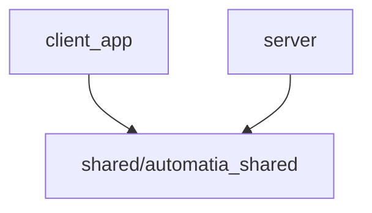

# Project Map and Diagnostics (MAP.md)

## Dependency Graph: Shared Usage

## Symbols Registry
### Client_app
#### `client_app\app\clients\brain_client.py`
- 📦 **LicenseInfo** (line 26): Información de licencia devuelta por el servidor.
- 📦 **BrainAPIClient** (line 44): Cliente HTTP para el servidor Brain (AIBrainService).
- ⚙️ **from_dict** (line 35): No docstring
- ⚙️ **__init__** (line 63): Inicializa el cliente con la URL del servidor Brain.
- ⚙️ **_get_headers** (line 74): Genera headers con autenticación para las peticiones.
- ⚙️ **post_generic** (line 93): Realiza una petición POST genérica al servidor Brain.
- ⚙️ **_log_telemetry** (line 116): Helper method to log telemetry asynchronously without blocking.
- ⚙️ **generate_script** (line 167): Genera un script de extracción via API.
- ⚙️ **validate_license** (line 228): Valida una licencia contra el servidor.
- ⚙️ **verify_partner_token** (line 259): Verifica un token de partner específico.
- ⚙️ **call_llm** (line 293): Llama al LLM para tareas genéricas (análisis, clarificación).
- ⚙️ **orchestrate_flow** (line 349): Invoca al orquestador de flujos (sys_flow_orchestrator).
- ⚙️ **generate_code** (line 377): Generic code generation. Delegates to generate_script with appropriate schema.
- ⚙️ **analyze_document_structure** (line 389): Fase 0: Descubrimiento de estructura de documentos.
- ⚙️ **extract_data** (line 430): Fase 1: Extracción de datos desde texto pre-procesado.
- ⚙️ **refine_extraction_data** (line 485): Fase 1.5: Refinamiento de extracción con feedback.
- ⚙️ **analyze_snippet** (line 519): Análisis de snippet. Redirige a extract_field_generic_guided.
- ⚙️ **extract_field_generic_guided** (line 536): Extracción guiada de un campo desde un snippet.
- ⚙️ **generate_extraction_script** (line 567): Fase 3: Genera script de extracción determinista.
- ⚙️ **refine_script_with_error_logs** (line 615): Refinamiento iterativo de script con logs de error.
- ⚙️ **generate_forensic_audit** (line 649): Genera reporte forense comparando resultado esperado vs obtenido.
- ⚙️ **analyze_recording** (line 679): Analiza logs de grabación para generar Playbook RPA.
- ⚙️ **refine_playbook** (line 715): Refina Playbook existente con feedback y logs de error.
- ⚙️ **get_element_coordinates** (line 749): Localiza coordenadas de un elemento visual en una imagen.
- ⚙️ **ask_copilot** (line 795): Envia una consulta al Copiloto del Brain con contexto local RAG.
- ⚙️ **ask_copilot_with_rag** (line 864): Metodo de conveniencia que integra automaticamente el RAG local.
- ⚙️ **get_effective_policy** (line 913): Obtiene la política de seguridad efectiva para el cliente actual.
- ⚙️ **run_agent_step** (line 952): Ejecuta un paso de agente autónomo usando el LLM del servidor.
- ⚙️ **generate_bridge_code** (line 1001): Solicita al Brain generar un script puente para conversion de tipos.
- ⚙️ **_get_library_headers** (line 1058): Genera headers para las peticiones a la biblioteca.
- ⚙️ **push_to_library** (line 1092): Publica una automatización en la biblioteca central del servidor.
- ⚙️ **download_from_library** (line 1173): Descarga una automatización de la biblioteca central.
- ⚙️ **get_library_manifest** (line 1246): Obtiene el manifiesto ligero de automatizaciones visibles.
- ⚙️ **escalate_support_request** (line 1290): Envía una solicitud de soporte técnico al Partner.
#### `client_app\app\clients\local_client.py`
- 📦 **LocalBrainClient** (line 18): Adaptador para utilizar el servicio AIBrainService local (state.brain)
- ⚙️ **__init__** (line 30): Inicializa el cliente local.
- ⚙️ **analyze_document_structure** (line 43): Analiza la estructura de documentos (Fase 0 - Discovery).
- ⚙️ **extract_data** (line 48): Extrae datos de un documento usando IA.
- ⚙️ **refine_extraction_data** (line 53): Refina los datos extraídos con feedback del usuario.
- ⚙️ **analyze_snippet** (line 58): Analiza un fragmento de texto.
- ⚙️ **extract_field_generic_guided** (line 63): Extracción guiada de campos individuales.
- ⚙️ **generate_extraction_script** (line 72): Genera script de extracción determinista (Fase 3).
- ⚙️ **refine_script_with_error_logs** (line 77): Refina un script de extracción con logs de error.
- ⚙️ **generate_forensic_audit** (line 82): Genera reporte forense comparando resultados.
- ⚙️ **analyze_recording** (line 91): Analiza logs de grabación para generar Playbook RPA.
- ⚙️ **refine_playbook** (line 96): Refina Playbook existente con feedback y logs de error.
- ⚙️ **get_element_coordinates** (line 101): Localiza coordenadas de un elemento visual en una imagen.
- ⚙️ **run_agent_step** (line 106): Ejecuta un paso del agente autónomo.
- ⚙️ **generate_code** (line 122): Genera código de transformación ETL.
- ⚙️ **ask_copilot** (line 131): Consulta al copiloto de IA.
- ⚙️ **generate_bridge_code** (line 138): Genera código puente para conversión de tipos.
- ⚙️ **call_llm** (line 149): Llamada genérica al LLM.
- ⚙️ **orchestrate_flow** (line 157): Orquestación de flujos basada en lenguaje natural.
- ⚙️ **get_effective_policy** (line 168): Obtiene la política de seguridad efectiva para el cliente.
- ⚙️ **validate_license** (line 226): Valida una licencia localmente.
#### `client_app\app\components\atom_configurator.py`
- ⚙️ **coerce_value** (line 5): Helper to convert UI inputs to Schema types.
- 📦 **AtomConfigurator** (line 22): No docstring
- ⚙️ **__init__** (line 23): No docstring
- ⚙️ **render_form** (line 38): Generates UI elements based on schema.
- ⚙️ **update_value** (line 67): No docstring
- ⚙️ **handle_back** (line 72): No docstring
- ⚙️ **handle_delete** (line 75): Elimina el paso actual del flujo.
#### `client_app\app\config\atom_catalog.py`
- 📦 **AtomMetadata** (line 18): Metadata completa de un tipo de átomo.
- 📦 **ConnectionMetadata** (line 53): Metadata específica para subtipos de conexión.
- ⚙️ **get_output_contract_template** (line 538): Obtener plantilla de output contract para un tipo de átomo.
- ⚙️ **get_atom_metadata** (line 551): Obtiene metadata de un tipo de átomo.
- ⚙️ **get_all_atoms** (line 567): Retorna lista de todos los átomos disponibles.
- ⚙️ **get_atoms_by_category** (line 572): Retorna átomos agrupados por categoría.
- ⚙️ **get_atom_icon** (line 585): Retorna icono para un tipo de átomo.
- ⚙️ **get_atom_color** (line 597): Retorna color para un tipo de átomo.
- ⚙️ **get_connection_metadata** (line 609): Obtener metadata de un subtipo de conexión.
- ⚙️ **get_all_connection_subtypes** (line 625): Retorna lista de todos los subtipos de conexión disponibles.
- ⚙️ **get_connection_config_schema** (line 630): Obtener JSON Schema de configuración para un subtipo de conexión.
- ⚙️ **__init__** (line 20): No docstring
- ⚙️ **to_dict** (line 38): Convierte a diccionario para uso en UI.
- ⚙️ **__init__** (line 55): No docstring
- ⚙️ **to_dict** (line 69): Convierte a diccionario para uso en UI.
#### `client_app\app\core\audit.py`
- ⚙️ **audit_operation** (line 11): Decorador para auditar automáticamente operaciones en los servicios.
- ⚙️ **decorator** (line 16): No docstring
- ⚙️ **wrapper** (line 18): No docstring
#### `client_app\app\core\exporters.py`
- ⚙️ **_humanizar_valor** (line 16): Convierte cualquier estructura (dict, list, primitivo) a una cadena limpia para Excel.
- ⚙️ **formatear_excel_dual** (line 61): Genera un Excel consolidado (una sola hoja).
- ⚙️ **_es_columna_valida** (line 81): No docstring
- ⚙️ **process_row_data** (line 118): No docstring
#### `client_app\app\core\hardware_fingerprint.py`
- ⚙️ **_generate_fingerprint** (line 17): Genera un identificador único basado en hardware del sistema.
- ⚙️ **get_machine_fingerprint** (line 50): Obtiene el identificador único de la máquina.
- ⚙️ **get_device_name** (line 77): Obtiene un nombre descriptivo para el dispositivo.
- ⚙️ **clear_fingerprint_cache** (line 90): Limpia el cache del fingerprint.
#### `client_app\app\core\rpa_executor.py`
- 📦 **PlaybookBrokenException** (line 135): No docstring
- 📦 **SessionExpiredException** (line 140): No docstring
- 📦 **AgentResult** (line 150): Resultado de la ejecución de un agente autónomo.
- 📦 **BrowserAgentWrapper** (line 158): Envoltorio para agentes autónomos vinculados a RPA.
- 📦 **RPAExecutor** (line 341): Ejecutor de automatización (Body) que delega la inteligencia al Brain.
- ⚙️ **__init__** (line 136): No docstring
- ⚙️ **__init__** (line 141): No docstring
- ⚙️ **__init__** (line 166): Inicializa el wrapper del agente.
- ⚙️ **_get_brain_client** (line 177): Obtiene el cliente Brain activo.
- ⚙️ **run_agent_task** (line 202): Ejecuta una misión autónoma sobre el contexto de navegación actual.
- ⚙️ **__init__** (line 346): No docstring
- ⚙️ **_get_active_license_key** (line 364): Retrieves active license key from local db.
- ⚙️ **_get_brain_client** (line 375): Returns (client, license_key).
- ⚙️ **set_execution_context** (line 404): Define o crea el contexto de ejecución actual (carpetas).
- ⚙️ **_log** (line 427): No docstring
- ⚙️ **_is_login_url** (line 431): Detecta si la URL actual parece una página de login.
- ⚙️ **list_stored_playbooks** (line 438): Lista playbooks desde la DB.
- ⚙️ **save_master_playbook** (line 455): Guarda playbook en DB.
- ⚙️ **load_master_playbook** (line 485): Carga desde DB.
- ⚙️ **analyze_recording** (line 510): Delegación al Brain Service.
- ⚙️ **refine_playbook** (line 522): Delegación al Brain Service para refinamiento.
- ⚙️ **_get_session_path** (line 547): No docstring
- ⚙️ **save_session_state** (line 557): No docstring
- ⚙️ **run_agent_interactive** (line 567): Delega una tarea al Agente Autónomo usando el contexto actual.
- ⚙️ **start_recording_session** (line 598): No docstring
- ⚙️ **stop_recording_and_get_logs** (line 641): No docstring
- ⚙️ **run_playbook_batch** (line 671): Ejecución por lotes.
- ⚙️ **execute_playbook** (line 793): Ejecuta un playbook unitario con soporte de "Sala de Emergencias".
- ⚙️ **_substitute** (line 1018): No docstring
- ⚙️ **extract_variables_from_playbook** (line 1025): No docstring
#### `client_app\app\core\state.py`
- 📦 **AppState** (line 12): No docstring
- ⚙️ **__init__** (line 13): No docstring
- ⚙️ **add_step_edit_watcher** (line 49): Registers a callback to be called when the editing step changes
- ⚙️ **remove_step_edit_watcher** (line 54): Removes a registered step edit watcher
- ⚙️ **set_role** (line 59): Cambia el rol del usuario y carga un perfil mock/real.
- ⚙️ **set_editing_step** (line 96): Sets the current step being edited and notifies watchers
- ⚙️ **toggle_focus_mode** (line 106): Activates or deactivates Focus Mode (Mini Sidebar + Expanded Right Drawer)
- ⚙️ **add_focus_watcher** (line 127): Registers a callback to be called when focus mode changes
- ⚙️ **remove_focus_watcher** (line 132): Removes a registered focus watcher
- ⚙️ **db_session** (line 138): Helper to get a client DB session context manager
#### `client_app\app\database\db.py`
- ⚙️ **get_db** (line 37): Returns an async database session.
- ⚙️ **init_client_db** (line 49): Initialize client database and create all tables.
- ⚙️ **run_migrations** (line 60): Run schema migrations for columns added after initial release.
- ⚙️ **seed_client_db** (line 79): Populates client DB with default configurations if needed.
- ⚙️ **seed_report_templates** (line 119): Crea las plantillas de reporte del sistema si no existen.
- ⚙️ **_migrate_customscript_origin_columns** (line 199): Migration: Add origin tracking columns to customscript table.
- ⚙️ **_migrate_rpaplaybook_origin_columns** (line 222): Migration: Add origin tracking columns to rpaplaybook table.
- ⚙️ **_migrate_cleanup_columns** (line 252): Migration: Add new columns to cleanup related tables.
- ⚙️ **_migrate_serverconnection_public_key** (line 275): Migration: Add partner_public_key column to serverconnection table.
- ⚙️ **_create_run_manifest_table_if_missing** (line 296): Ensure RunManifestLog table exists.
- ⚙️ **_migrate_report_template_columns** (line 329): Migration: Add new columns to report_templates table (Prompt 1 features).
- ⚙️ **_migrate_atom_registry_columns** (line 364): Migration: Add missing columns to atom_registry (subtype, contracts).
#### `client_app\app\database\migrations\add_atom_contracts.py`
- ⚙️ **get_db_path** (line 22): Obtener ruta de la base de datos local.
- ⚙️ **column_exists** (line 28): Verificar si una columna existe en una tabla.
- ⚙️ **upgrade** (line 35): Añadir campos de contratos a atom_registry.
- ⚙️ **downgrade** (line 94): Revertir cambios (SQLite no soporta DROP COLUMN directamente).
#### `client_app\app\database\migrations\add_report_template_fields.py`
- ⚙️ **upgrade** (line 7): Añadir campos nuevos a report_templates.
- ⚙️ **downgrade** (line 71): Rollback: SQLite no soporta DROP COLUMN fácilmente.
#### `client_app\app\database\models.py`
- 📦 **PackageType** (line 28): Tipos de contenido de un paquete de automatismos.
- 📦 **PackageStatus** (line 36): Estados del ciclo de vida de un paquete.
- ⚙️ **calculate_playbook_hash** (line 46): Calcula SHA256 del contenido del playbook.
- 📦 **ReportHistory** (line 59): History of generated PDF reports.
- 📦 **ReportTemplate** (line 76): Plantilla de informe reutilizable con soporte para:
- 📦 **LocalAutomation** (line 151): Local replica of Brain automations.
- 📦 **RpaPlaybook** (line 170): Stores RPA automation scripts (Playbooks).
- 📦 **UserExtractionConfig** (line 198): User-customized extraction configurations.
- 📦 **ExtractionLog** (line 231): Log of document extraction operations.
- 📦 **ConnectionLog** (line 250): Log de eventos de conexiones y watchers.
- 📦 **ProviderAPIKey** (line 276): API credentials per provider.
- 📦 **ServerConnection** (line 286): Configuration for connecting to the Brain server.
- 📦 **LocalCredentials** (line 309): Encrypted credentials for local services (IMAP, SMTP, external APIs).
- 📦 **DatabaseCredentialConfig** (line 321): Credentials for relational databases (MySQL, PostgreSQL, SQL Server, SQLite).
- 📦 **FlowRegistry** (line 368): Registry of user-defined workflows with versioning.
- 📦 **TaskLog** (line 387): Log of workflow task executions with metrics.
- 📦 **ValidationHistory** (line 413): History of user validations for extraction results.
- 📦 **SecurityPolicy** (line 429): Security policy for sandbox execution.
- 📦 **APIEndpointConfig** (line 456): Configuration for external API endpoints.
- 📦 **FavoriteFlow** (line 475): User favorite workflows for quick access on dashboard.
- 📦 **ETLJobHistory** (line 486): Historial de transformaciones ETL ejecutadas con IA.
- 📦 **MailWatcherState** (line 509): Estado persistente del MailWatcher para auto-start y monitorización.
- 📦 **WebWatcherConfig** (line 523): Configuration for web URL monitoring.
- 📦 **WebWatcherHistory** (line 553): History of detected web page changes.
- 📦 **CleanupSchedulerConfig** (line 568): Configuration for the file cleanup scheduler.
- 📦 **CleanupPolicy** (line 586): Cleanup policy per folder type.
- 📦 **CleanupLog** (line 602): Log of cleanup operations for audit.
- 📦 **CustomScript** (line 615): Scripts personalizados creados por usuarios mediante IA.
- 📦 **ScriptLibrary** (line 720): Biblioteca unificada de scripts generados por todos los módulos.
- 📦 **CustomScriptExecution** (line 789): Registro de ejecuciones de scripts personalizados.
- 📦 **FolderWatcherConfig** (line 815): Configuración de un monitor de carpetas.
- 📦 **FolderWatcherState** (line 858): Estado global del servicio FolderWatcher.
- 📦 **PendingScreenshotReview** (line 878): Capturas de pantalla pendientes de revisión por el usuario.
- 📦 **AtomRegistry** (line 907): Catálogo de átomos reutilizables para el editor de flujos.
- 📦 **FlowStep** (line 995): Relación entre flujos y átomos - representa un paso dentro de un flujo.
- 📦 **AutomatismPackage** (line 1047): Almacena información de paquetes exportados/importados de automatismos.
- 📦 **WizardDraft** (line 1114): Stores partial progress of wizard assistants (e.g. ScriptCreationWizard).
- 📦 **RunManifestLog** (line 1126): Registra métricas de ejecución de llamadas al Brain (IA).
- ⚙️ **parse_json_schema** (line 213): No docstring
- ⚙️ **serialize_schema** (line 222): No docstring
- ⚙️ **get_connection_string** (line 343): Generates an SQLAlchemy-compatible connection URL for async drivers.
- ⚙️ **validate_data_contract** (line 688): Valida que el contrato de datos cumpla con el esquema Pydantic unificado.
- ⚙️ **validate_ui_contract** (line 707): Valida que el contrato de UI cumpla con el esquema Pydantic unificado.
- ⚙️ **code** (line 746): No docstring
- ⚙️ **code** (line 753): No docstring
- ⚙️ **__repr__** (line 785): No docstring
#### `client_app\app\menu_config.py`
- ⚙️ **get_menu_structure** (line 4): No docstring
#### `client_app\app\modules\extraccion\.servicios_generados\custom_extractor08015_609ccf.py`
- ⚙️ **extraer_datos** (line 10): No docstring
#### `client_app\app\modules\extraccion\.servicios_generados\custom_extractor0801_1_cd7d18.py`
- ⚙️ **extraer_datos** (line 1): No docstring
#### `client_app\app\modules\extraccion\.servicios_generados\custom_extractor0801_4_65d8ae.py`
- ⚙️ **extraer_datos** (line 10): No docstring
#### `client_app\app\modules\extraccion\.servicios_generados\custom_extractor0901_b89652.py`
- ⚙️ **extraer_datos** (line 10): No docstring
#### `client_app\app\modules\extraccion\.servicios_generados\custom_extractor0901_v2_22ddaf.py`
- ⚙️ **extraer_datos** (line 9): No docstring
- ⚙️ **extraer_nombre_apellidos** (line 44): No docstring
#### `client_app\app\modules\extraccion\.servicios_generados\custom_extractor1001_35fb16.py`
- ⚙️ **extraer_datos** (line 10): Extrae campos específicos de un formulario de solicitud de proyectos
#### `client_app\app\modules\extraccion\.servicios_generados\custom_extractor1101_2f3130.py`
- ⚙️ **extraer_datos** (line 4): Extrae campos específicos de documentos de Proyectos de Generación de Conocimiento
#### `client_app\app\modules\extraccion\.servicios_generados\custom_extractor1101_v2_5c091c.py`
- ⚙️ **extraer_datos** (line 5): Extrae campos específicos de documentos de solicitud de Proyectos de Generación de Conocimiento
- ⚙️ **limpiar_valor** (line 27): No docstring
- ⚙️ **extraer_nombre_completo** (line 74): No docstring
#### `client_app\app\modules\extraccion\servicios\custom_prueba1_e3e31b.py`
- ⚙️ **extraer_datos** (line 10): No docstring
- ⚙️ **buscar** (line 20): No docstring
#### `client_app\app\modules\extraccion\servicios\custom_prueba1_fc34f2.py`
- ⚙️ **extraer_datos** (line 8): No docstring
#### `client_app\app\modules\extraction\pdf_text_detector.py`
- 📦 **PDFQualityReport** (line 7): Reporte de calidad de texto en PDF
- ⚙️ **analyze_pdf_quality** (line 15): Analiza la calidad del texto embebido en un PDF.
- ⚙️ **detect_pdf_text_content** (line 92): Función simple de detección (legacy compatibility).
#### `client_app\app\modules\factory\analysis_prompt_builder.py`
- 📦 **AnalysisPromptBuilder** (line 4): Builder for AI prompts related to data analysis and visualization suggestions.
- ⚙️ **build_business_questions_prompt** (line 9): Constructs a prompt to ask the AI for relevant business questions based on the data.
- ⚙️ **build_visualization_suggestions_prompt** (line 24): Constructs a prompt to ask for visualization suggestions for a specific question.
#### `client_app\app\modules\factory\etl_factory.py`
- 📦 **ETLScriptFactory** (line 18): Generates Python transformation scripts using AI.
- ⚙️ **__init__** (line 23): Args:
- ⚙️ **generate_transformation_script** (line 30): Genera script Python basándose en muestra origen y especificación destino.
- ⚙️ **_prepare_source_context** (line 132): Prepara contexto del archivo origen.
- ⚙️ **_prepare_target_context** (line 147): Prepara contexto de salida deseada.
- ⚙️ **_build_transformation_prompt** (line 172): Construye prompt para la IA.
- ⚙️ **_extract_script_from_response** (line 239): Extrae el código Python de la respuesta de la IA.
- ⚙️ **_extract_target_columns** (line 258): Extrae lista de columnas objetivo.
#### `client_app\app\modules\factory\graphics_factory.py`
- 📦 **GraphicsScript** (line 12): No docstring
- 📦 **GraphicsFactory** (line 16): No docstring
- ⚙️ **__init__** (line 17): No docstring
- ⚙️ **analyze_dataframe** (line 22): Extracts metadata from a DataFrame to assist AI generation.
- ⚙️ **generate_business_questions** (line 67): Generates a list of suggested business questions based on the dataframe metadata.
- ⚙️ **generate_visualization_suggestions** (line 89): Generates visualization suggestions for a given question.
- ⚙️ **generate_script** (line 109): Requests the AI Brain to generate a visualization script based on metadata and user prompt.
- ⚙️ **execute_script** (line 186): Executes the generated script securely and returns the image bytes.
#### `client_app\app\modules\factory\report_factory.py`
- 📦 **ReportFactory** (line 36): Factory for generating PDF reports using multiple backends:
- ⚙️ **__init__** (line 46): Initialize ReportFactory.
- ⚙️ **generate_pdf** (line 79): Generate PDF report from context data.
- ⚙️ **_generate_with_reportlab** (line 98): Generate PDF using ReportLab.
- ⚙️ **_generate_with_html** (line 220): Generate PDF from HTML template using Playwright.
- ⚙️ **_render_html_template** (line 258): Render Jinja2 HTML template with context data.
- ⚙️ **generate_odt** (line 284): Genera documento ODT editable.
- ⚙️ **generate_report** (line 305): Método unificado para generar reportes.
- ⚙️ **_generate_with_odfpy** (line 319): Genera documento ODT usando odfpy.
- ⚙️ **_dataframe_to_odt_table** (line 415): Convierte DataFrame a tabla ODF nativa.
- ⚙️ **_apply_style_from_config** (line 444): Aplica configuración de estilos al objeto Style.
- ⚙️ **export_html** (line 474): Export only HTML (no PDF conversion).
- ⚙️ **dataframe_to_html** (line 501): DEPRECATED: Legacy method for WeasyPrint compatibility.
#### `client_app\app\modules\output\email_sender.py`
- 📦 **EmailSender** (line 14): Servicio de envio de emails con credenciales cifradas.
- ⚙️ **__init__** (line 26): Args:
- ⚙️ **_get_smtp_password** (line 44): Descifra la contrasena SMTP
- ⚙️ **_build_message** (line 60): Construye el mensaje de email.
- ⚙️ **send** (line 117): Envia un email via SMTP.
- ⚙️ **send_with_file_attachments** (line 163): Envia email con archivos adjuntos desde rutas.
#### `client_app\app\modules\output\http_connector.py`
- 📦 **HttpConnectorService** (line 10): Conector HTTP robusto para envio de datos.
- ⚙️ **__init__** (line 22): Args:
- ⚙️ **_build_headers** (line 41): Construye headers con autenticacion
- ⚙️ **_log_to_task_log** (line 72): Registra la operacion en TaskLog
- ⚙️ **send_json** (line 109): Envia datos JSON via HTTP con reintentos.
- ⚙️ **send_form_data** (line 186): Envia form-data (application/x-www-form-urlencoded)
- ⚙️ **send_multipart** (line 225): Envia multipart/form-data con archivos.
#### `client_app\app\modules\privacy\anonymizer.py`
- 📦 **Entity** (line 27): Representa una entidad detectada en el texto.
- 📦 **AnonymizationContext** (line 35): Motor de anonimizacion hibrido con persistencia cifrada.
- ⚙️ **__init__** (line 62): Inicializa el contexto de anonimizacion.
- ⚙️ **_detect_with_regex** (line 81): Detecta entidades usando patrones regex.
- ⚙️ **_detect_with_ner** (line 94): Detecta entidades usando spaCy NER (ampliado).
- ⚙️ **_generate_fake** (line 125): Genera un valor falso consistente para un valor original.
- ⚙️ **_mask_generic** (line 202): Enmascara valores genericamente.
- ⚙️ **anonymize_document_id** (line 249): Anonimiza un documento de identidad (DNI, NIE, Pasaporte, etc).
- ⚙️ **anonymize_name** (line 395): Anonimiza un nombre de persona.
- ⚙️ **anonymize_dataframe** (line 419): Anonimiza un DataFrame segun la configuracion de columnas.
- ⚙️ **anonymize** (line 474): Anonimiza texto usando regex + NER. Soporta estructuras recursivas.
- ⚙️ **deanonymize** (line 505): Desanonimiza datos recursivamente.
- ⚙️ **save_state** (line 529): Persiste el mapa de forma CIFRADA.
- ⚙️ **load_state** (line 545): Carga el mapa cifrado.
- ⚙️ **get_stats** (line 573): Retorna las estadisticas de entidades anonimizadas en esta sesion.
- ⚙️ **_analyze_header** (line 577): Analiza el nombre de la columna para inferir tipos sensibles.
- ⚙️ **analyze_fields** (line 601): Analiza las columnas de un DataFrame para detectar PII y recomendar estrategias.
#### `client_app\app\modules\privacy\anonymizer_service.py`
- 📦 **AnonymizerPolicy** (line 22): Politica de anonimizacion aplicable a datasets.
- 📦 **AnonymizerService** (line 28): Servicio de alto nivel para anonimizacion de archivos estructurados.
- ⚙️ **__init__** (line 39): Inicializa el servicio.
- ⚙️ **apply** (line 48): Aplica politica de anonimizacion a un archivo.
- ⚙️ **deanonymize** (line 133): Desanonimiza un archivo usando el mapa guardado.
- ⚙️ **_to_initials** (line 170): Convierte nombres a iniciales usando contexto NER.
#### `client_app\app\modules\runtime\workflow_engine.py`
- ⚙️ **_get_workflow_brain_client** (line 26): Resuelve y retorna el cliente de cerebro (Brain) para el workflow engine.
- ⚙️ **is_interactive_session** (line 54): Determina si hay un usuario interactivo (UI abierta).
- ⚙️ **create_dashboard_notification** (line 66): Crea una notificación visible en el dashboard.
- ⚙️ **is_safe_path** (line 76): Valida que path esté dentro de base_dir.
- 📦 **StepRegistry** (line 85): Registry de ejecutores por tipo de step.
- ⚙️ **_resolve_variables** (line 101): Reemplaza expresiones {{variable}} por valores del contexto.
- 📦 **WorkflowEngine** (line 134): No docstring
- ⚙️ **execute_etl_transform** (line 360): Executes an ETL transformation script.
- ⚙️ **execute_custom_script** (line 454): Executes a Custom Script ID.
- ⚙️ **execute_email_send** (line 541): Ejecuta un paso de envío de email (EMAIL_SEND).
- ⚙️ **execute_rpa_step** (line 645): Executes an RPA Playbook.
- ⚙️ **execute_api_fetch** (line 729): Execute HTTP API request.
- ⚙️ **execute_webhook** (line 778): Send a Webhook (Fire-and-forget style or simple POST).
- ⚙️ **execute_report_generate** (line 807): Genera un informe PDF usando una plantilla.
- ⚙️ **register** (line 90): No docstring
- ⚙️ **get** (line 97): No docstring
- ⚙️ **replace** (line 111): No docstring
- ⚙️ **__init__** (line 135): No docstring
- ⚙️ **_handle_screenshot_for_healing** (line 139): Maneja el envío de captura para auto-healing.
- ⚙️ **_save_pending_screenshot_review** (line 220): Guarda la captura y crea registro de revisión pendiente.
- ⚙️ **execute_flow** (line 255): Executes a linear flow of tasks.
- ⚙️ **_execute_task** (line 336): Executes a single task using the registered executor.
- ⚙️ **decorator** (line 91): No docstring
#### `client_app\app\modules\sandbox\safety_sandbox.py`
- 📦 **SafetySandbox** (line 13): Executes generated Python scripts in a semi-isolated environment.
- ⚙️ **execute_script** (line 19): Executes the provided script with 'df' in local scope.
- ⚙️ **_run_sync** (line 46): No docstring
#### `client_app\app\modules\security\encryption_service.py`
- 📦 **EncryptionService** (line 13): Service for encrypting and decrypting sensitive data.
- ⚙️ **__init__** (line 27): Initialize encryption service with key from environment or generate new.
- ⚙️ **encrypt** (line 38): Encrypt a dictionary to a Fernet-encrypted string.
- ⚙️ **decrypt** (line 52): Decrypt a Fernet-encrypted string back to dictionary.
- ⚙️ **generate_key** (line 69): Generate a new Fernet encryption key.
#### `client_app\app\modules\security\policy_manager.py`
- 📦 **PartnerPolicyManager** (line 18): Gestiona políticas de seguridad con cascada: Partner > Cliente > Sistema.
- ⚙️ **__init__** (line 50): Inicializa el manager con políticas opcionales.
- ⚙️ **_get** (line 65): Obtiene valor con cascada: Partner > Cliente > Sistema.
- ⚙️ **apply_to_auditor** (line 85): Aplica restricciones adicionales al auditor de seguridad.
- ⚙️ **get_timeout** (line 99): Obtiene timeout máximo de ejecución en segundos.
- ⚙️ **get_memory_limit** (line 108): Obtiene límite de memoria en MB.
- ⚙️ **get_allowed_imports** (line 117): Obtiene imports permitidos (intersección con SAFE_IMPORTS base).
- ⚙️ **get_forbidden_imports** (line 132): Obtiene lista de imports explícitamente prohibidos.
- ⚙️ **get_effective_policy** (line 141): Devuelve la política efectiva (todos los valores resueltos).
- ⚙️ **from_db** (line 158): Carga política desde el modelo SecurityPolicy en base de datos.
- ⚙️ **from_db_with_cascade** (line 195): Carga políticas de cliente y partner desde BD con cascada.
- ⚙️ **__repr__** (line 241): No docstring
#### `client_app\app\modules\watchers\api_watcher.py`
- 📦 **APIWatcher** (line 8): Consumidor de APIs REST con soporte para:
- ⚙️ **__init__** (line 19): Args:
- ⚙️ **_build_headers** (line 39): Construye headers HTTP con autenticación.
- ⚙️ **_fetch_page** (line 80): Fetch de una página con reintentos automáticos.
- ⚙️ **_fetch_with_pagination** (line 106): Fetch con soporte de paginación automática.
- ⚙️ **fetch_data** (line 206): Ejecuta fetch de API y guarda resultado en archivo.
- ⚙️ **trigger_workflow** (line 253): Lanza workflow con datos fetched
#### `client_app\app\modules\watchers\email_watcher.py`
- 📦 **EmailWatcher** (line 14): Monitor de buzón IMAP con whitelist y trigger de workflows.
- ⚙️ **__init__** (line 26): Args:
- ⚙️ **is_sender_allowed** (line 61): Verifica si el remitente está en whitelist.
- ⚙️ **is_subject_allowed** (line 83): Verifica si el asunto coincide con el filtro configurado.
- ⚙️ **_sanitize_filename** (line 98): Sanitiza nombres de archivo para evitar path traversal.
- ⚙️ **connect** (line 113): Conectar al servidor IMAP
- ⚙️ **_connect_sync** (line 122): No docstring
- ⚙️ **disconnect** (line 127): Desconectar limpiamente
- ⚙️ **fetch_new_emails** (line 133): Busca emails no leídos y retorna info básica.
- ⚙️ **_fetch_sync** (line 146): No docstring
- ⚙️ **process_email** (line 183): Procesa un email: descarga adjuntos y lanza workflow.
- ⚙️ **trigger_workflow** (line 215): Lanza el workflow configurado usando el motor.
#### `client_app\app\modules\watchers\folder_watcher.py`
- 📦 **FolderWatcher** (line 14): Monitor de carpetas con integración a WorkflowEngine.
- ⚙️ **__init__** (line 26): Args:
- ⚙️ **_matches_pattern** (line 58): Verifica si el archivo coincide con algún pattern
- ⚙️ **_wait_for_stability** (line 68): Espera a que el archivo termine de escribirse.
- ⚙️ **_process_file** (line 97): Procesa un archivo: espera estabilización y lanza workflow.
- ⚙️ **_monitor_pending_files** (line 160): Tarea en background que procesa archivos pendientes.
- 📦 **_EventHandler** (line 185): Handler interno de watchdog
- ⚙️ **start_monitoring** (line 212): Inicia el monitoreo de la carpeta.
- ⚙️ **stop** (line 239): Detiene el monitoreo
- ⚙️ **__init__** (line 188): No docstring
- ⚙️ **on_created** (line 191): Callback cuando se crea un archivo
- ⚙️ **on_modified** (line 208): Callback cuando se modifica un archivo (fallback para Windows)
#### `client_app\app\modules\watchers\web_watcher.py`
- ⚙️ **check_url_changes** (line 15): Check if URL content has changed.
- ⚙️ **extract_content** (line 69): Extract content from page using selector.
- ⚙️ **calculate_hash** (line 113): Calculate SHA256 hash of content.
- ⚙️ **capture_screenshot** (line 126): Capture screenshot and return path.
- ⚙️ **validate_selector** (line 169): Validate that selector works on the given URL.
#### `client_app\app\prompts\clarification_prompts.py`
- ⚙️ **get_clarification_prompt** (line 311): Obtiene el prompt de clarificación para un módulo.
- ⚙️ **format_prompt_for_module** (line 324): Formatea el prompt con los datos del usuario.
- ⚙️ **_summarize_context** (line 360): Resume el contexto para incluir en el prompt.
- ⚙️ **register_clarification_prompt** (line 387): Registra un nuevo prompt de clarificación.
#### `client_app\app\scripts\fix_library_migration.py`
- ⚙️ **migrate_data** (line 15): No docstring
#### `client_app\app\services\api_connection_service.py`
- 📦 **APIConnectionService** (line 14): No docstring
- ⚙️ **list_configs** (line 15): List all API configurations.
- ⚙️ **get_config** (line 23): No docstring
- ⚙️ **save_config** (line 27): Create or update config.
- ⚙️ **delete_config** (line 56): No docstring
- ⚙️ **test_connection** (line 65): Test the connection.
#### `client_app\app\services\api_key_service.py`
- ⚙️ **get_api_key** (line 21): Get API key from database, fallback to .env if not found.
- ⚙️ **save_api_key** (line 32): Save or update API key in database.
- ⚙️ **migrate_api_keys_from_env** (line 45): Migrate API keys from .env to database if database is empty.
#### `client_app\app\services\asset_finishing_service.py`
- ⚙️ **get_template_contract** (line 85): Recupera el UIContract desde una plantilla de configuración de extracción (UserExtractionConfig).
- ⚙️ **_map_type_to_input_type** (line 132): Mapea una cadena de texto que representa un tipo de dato a un valor del enum InputType.
- ⚙️ **build_mail_watcher_contract** (line 158): Construye un UIContract completo para un MailWatcher, combinando los campos
- ⚙️ **generate_mail_watcher_readme** (line 218): Genera el contenido Markdown para el archivo README.md de un MailWatcher,
- 📦 **AssetFinishingService** (line 332): Servicio de Sellado Atomico.
- ⚙️ **__init__** (line 347): Inicializa el servicio.
- ⚙️ **seal_resource** (line 358): Sella un recurso (Script) asignándole un UIContract y generando su documentación técnica.
- ⚙️ **get_seal_metadata** (line 456): Obtiene metadatos estructurados sobre un recurso ya sellado para su visualización en la UI.
- ⚙️ **seal_mail_watcher** (line 487): Sella un recurso de tipo MailWatcher, construyendo un contrato heredado.
- ⚙️ **seal_connection_resource** (line 584): Sella una conexión (API, SQL, etc.) creando o actualizando su entrada en la biblioteca.
- ⚙️ **_get_or_create_connection_script** (line 641): Busca o crea una entrada en ScriptLibrary para una conexión.
- ⚙️ **_get_script_code** (line 694): Recupera el código fuente de un script, priorizando el contenido en base de datos
#### `client_app\app\services\atom_service.py`
- 📦 **AtomService** (line 19): Servicio para gestión de átomos reutilizables.
- ⚙️ **__new__** (line 27): Garantiza que solo exista una instancia de AtomService (Singleton).
- ⚙️ **_validate_json** (line 35): Valida que un string sea JSON válido.
- ⚙️ **create_atom** (line 42): Crea un nuevo átomo en el catálogo.
- ⚙️ **list_atoms** (line 112): Lista átomos con filtros opcionales.
- ⚙️ **get_atom** (line 150): Recupera un átomo específico del catálogo utilizando su identificador único.
- ⚙️ **update_atom** (line 163): Actualiza los campos de un átomo.
- ⚙️ **delete_atom** (line 203): Realiza un borrado lógico (soft delete) de un átomo, marcándolo como inactivo.
- ⚙️ **duplicate_atom** (line 225): Crea una copia de un átomo existente.
#### `client_app\app\services\automatism_export_service.py`
- 📦 **AutomatismExportService** (line 34): Servicio para exportar automatismos a paquetes .automatia.
- ⚙️ **__init__** (line 54): Inicializa el servicio con las dependencias necesarias.
- ⚙️ **export_package** (line 59): Exporta scripts y/o playbooks a un paquete .automatia.
- ⚙️ **_load_scripts** (line 145): Carga scripts de la base de datos por sus IDs.
- ⚙️ **_load_playbooks** (line 161): Carga playbooks de la base de datos por sus IDs.
- ⚙️ **_get_source_info** (line 177): Obtiene informacion del cliente para el manifiesto.
- ⚙️ **_derive_license_id** (line 220): Deriva un ID de licencia del license_key.
- ⚙️ **_extract_partner_id** (line 235): Extrae o deriva el ID de partner del license_key.
- ⚙️ **_get_or_create_machine_id** (line 252): Obtiene o genera un ID unico para esta maquina.
- ⚙️ **_create_script_metadata** (line 293): Crea el diccionario de metadatos para un script.
- ⚙️ **_create_playbook_metadata** (line 315): Crea el diccionario de metadatos para un playbook.
- ⚙️ **_get_playbook_actions_json** (line 338): Obtiene las acciones del playbook como JSON string.
- ⚙️ **export_workflow** (line 360): Exporta un workflow completo con sus dependencias.
- ⚙️ **_load_flow** (line 460): Carga un workflow de la base de datos por su ID.
- ⚙️ **_load_script** (line 476): Carga un script individual de la base de datos.
- ⚙️ **_load_playbook** (line 492): Carga un playbook individual de la base de datos.
- ⚙️ **_resolve_workflow_dependencies** (line 508): Analiza los pasos del workflow y extrae dependencias.
- ⚙️ **_flow_to_spec** (line 553): Convierte un FlowRegistry a diccionario exportable.
- ⚙️ **_add_dependencies_to_manifest** (line 588): Agrega la seccion de dependencias al manifiesto.
- ⚙️ **_create_zip** (line 612): Crea el archivo ZIP del paquete.
#### `client_app\app\services\automatism_import_service.py`
- 📦 **ConflictResolution** (line 38): Estrategias de resolucion de conflictos.
- 📦 **ImportResult** (line 46): Resultado de la importacion de un paquete.
- 📦 **AutomatismImportService** (line 61): Servicio para importar paquetes .automatia validados.
- ⚙️ **__init__** (line 73): Inicializa el servicio.
- ⚙️ **import_package** (line 77): Importa un paquete .automatia validado.
- ⚙️ **_validate_package** (line 210): Valida el paquete usando el servicio de validacion.
- ⚙️ **_extract_zip** (line 214): Extrae el contenido del ZIP.
- ⚙️ **_determine_import_status** (line 222): Determina el estado de los scripts importados.
- ⚙️ **_find_conflict** (line 235): Busca un conflicto por nombre y tipo.
- ⚙️ **_import_script** (line 247): Importa un script nuevo.
- ⚙️ **_import_script_rename** (line 291): Importa un script con nombre modificado.
- ⚙️ **_import_script_overwrite** (line 337): Sobrescribe un script existente.
- ⚙️ **_import_playbook** (line 378): Importa un playbook nuevo.
- ⚙️ **_import_playbook_rename** (line 415): Importa un playbook con nombre modificado.
- ⚙️ **_import_playbook_overwrite** (line 454): Sobrescribe un playbook existente.
- ⚙️ **_import_workflow** (line 493): Importa un workflow.
- ⚙️ **_generate_unique_name** (line 527): Genera un nombre unico agregando sufijo.
- ⚙️ **_script_exists** (line 546): Verifica si existe un script con ese nombre.
- ⚙️ **_playbook_exists** (line 557): Verifica si existe un playbook con ese nombre.
- ⚙️ **_save_script** (line 568): Guarda un script nuevo en la BD.
- ⚙️ **_update_script** (line 591): Actualiza un script existente.
- ⚙️ **_save_playbook** (line 611): Guarda un playbook nuevo en la BD.
- ⚙️ **_update_playbook** (line 633): Actualiza un playbook existente.
- ⚙️ **_save_workflow** (line 654): Guarda un workflow nuevo en la BD.
- ⚙️ **_record_import** (line 673): Registra el paquete importado en la BD.
- ⚙️ **_get_local_license_id** (line 728): Obtiene el ID de licencia local.
- ⚙️ **_verify_partner_token** (line 744): Verifica un token de aprobacion del partner.
#### `client_app\app\services\bridge_creator.py`
- 📦 **BridgeService** (line 6): Servicio encargado de inyectar 'pasos puente' (bridge tasks) en un workflow
- ⚙️ **__init__** (line 11): Inicializa el servicio con una especificación de flujo existente.
- ⚙️ **inject_bridge_task** (line 17): Inserta un nuevo paso de tipo CUSTOM_SCRIPT en una posición específica del flujo.
- ⚙️ **generate_bridge_code** (line 47): Genera el código REAL del puente utilizando IA.
- ⚙️ **generate_bridge_code_mock** (line 105): Fallback/Mock para generación de código de puente.
#### `client_app\app\services\bridge_generation_service.py`
- 📦 **BridgeGenerationService** (line 18): Servicio para la generación automática de código de transformación (Smart Bridges).
- ⚙️ **__new__** (line 27): No docstring
- ⚙️ **generate_bridge_code** (line 32): Genera el código Python para una función de transformación 'transform(input_data)'.
#### `client_app\app\services\clarification_service.py`
- 📦 **QuestionType** (line 20): Tipos de preguntas de clarificación.
- 📦 **ClarificationQuestion** (line 30): Representa una pregunta de clarificación.
- 📦 **ClarificationResponse** (line 42): Representa una respuesta del usuario a una pregunta.
- 📦 **ClarificationResult** (line 49): Resultado del análisis de clarificación.
- 📦 **ClarificationService** (line 73): Servicio central para gestionar clarificaciones previas a generación.
- ⚙️ **__init__** (line 86): Inicializa el servicio de clarificación con un registro vacío de plantillas de prompts.
- ⚙️ **get_supported_modules** (line 92): Retorna los módulos que soportan clarificación.
- ⚙️ **get_module_tier** (line 96): Retorna el tier de modelo para un módulo.
- ⚙️ **get_module_role** (line 100): Retorna el role_key para un módulo.
- ⚙️ **analyze_for_clarification** (line 105): Analiza si la IA necesita más información antes de proceder con la generación.
- ⚙️ **generate_with_clarifications** (line 142): Genera el artefacto final incorporando las respuestas de clarificación del usuario.
- ⚙️ **_get_analysis_prompt** (line 175): Construye el prompt de análisis final combinando la plantilla del módulo con los datos de entrada.
- ⚙️ **_get_generic_analysis_prompt** (line 206): Retorna una plantilla de prompt genérica para situaciones donde no hay un prompt específico de módulo.
- ⚙️ **_summarize_context** (line 236): Genera un resumen textual del contexto disponible (archivos, ejemplos, etc.)
- ⚙️ **_call_ai_for_analysis** (line 252): Inicia la llamada asíncrona a la BrainAPI para obtener el análisis de ambigüedad.
- ⚙️ **_parse_analysis_response** (line 290): Transforma la respuesta JSON de la IA en objetos ClarificationQuestion y ClarificationResult.
- ⚙️ **_enrich_input_with_clarifications** (line 322): Crea un 'enriched_input' combinando los datos originales con las clarificaciones.
- ⚙️ **_delegate_generation** (line 354): Delega el proceso final de generación al servicio de módulo correspondiente.
- ⚙️ **_delegate_rpa** (line 381): Delega la generación de RPA al ejecutor.
- ⚙️ **_delegate_custom_script** (line 429): Delegación especializada a ScriptGeneratorService.
- ⚙️ **_delegate_extraction** (line 460): Delegación especializada a ExtractionService.
- ⚙️ **_delegate_etl** (line 498): Delegación especializada a ETLService/Factory.
- ⚙️ **register_module_prompt** (line 559): Registra un prompt de análisis para un módulo.
#### `client_app\app\services\cleanup_service.py`
- 📦 **CleanupService** (line 67): Singleton service for managing file cleanup operations.
- ⚙️ **__new__** (line 77): No docstring
- ⚙️ **set_notification_callback** (line 82): Set callback for UI notifications.
- ⚙️ **_notify** (line 86): Send notification if callback is set.
- ⚙️ **_get_config** (line 94): Get or create cleanup scheduler config.
- ⚙️ **_get_policies** (line 105): Get all cleanup policies.
- ⚙️ **seed_default_policies** (line 111): Seed default cleanup policies if they don't exist.
- ⚙️ **should_run_cleanup** (line 129): Check if cleanup should run based on last run time.
- ⚙️ **_is_session_active** (line 147): Check if any script recording or flow execution is active.
- ⚙️ **_get_files_to_delete** (line 181): Get list of files older than retention period.
- ⚙️ **_delete_empty_dirs** (line 210): Delete empty subdirectories recursively.
- ⚙️ **_run_cleanup_for_policy** (line 225): Run cleanup for a single policy.
- ⚙️ **run_cleanup** (line 273): Run cleanup for all enabled policies.
- ⚙️ **schedule_startup_cleanup** (line 349): Schedule cleanup to run after startup delay.
- ⚙️ **_periodic_cleanup_loop** (line 381): Background loop for periodic cleanup (Prompt 14).
- ⚙️ **update_config** (line 400): Update cleanup scheduler configuration.
- ⚙️ **update_policy** (line 422): Update a specific cleanup policy.
- ⚙️ **get_status** (line 442): Get current cleanup service status including storage stats.
- ⚙️ **get_storage_stats** (line 487): Calculate storage usage statistics for key folders.
- ⚙️ **get_cleanup_logs** (line 555): Get recent cleanup logs.
- ⚙️ **delayed_cleanup** (line 375): No docstring
#### `client_app\app\services\coherence_service.py`
- 📦 **CoherenceService** (line 3): The 'Coherence Assistant' that guides the user to fix problems.
- ⚙️ **analyze_issues** (line 9): Analiza una lista de problemas (técnicos o de privacidad) y los traduce
#### `client_app\app\services\config_service.py`
- 📦 **ConfigService** (line 5): Servicio centralizado para la gestión de configuración y rutas.
- ⚙️ **__new__** (line 12): No docstring
- ⚙️ **_initialize** (line 18): No docstring
- ⚙️ **get** (line 36): No docstring
- ⚙️ **get_path** (line 39): No docstring
- ⚙️ **get_bool** (line 45): No docstring
#### `client_app\app\services\connection_contract_builders.py`
- ⚙️ **build_api_fetch_contract** (line 12): Construye el DataContract para un átomo de API Fetch.
- ⚙️ **build_sql_query_contract** (line 77): Construye el DataContract para un átomo de SQL Query.
- ⚙️ **build_email_watcher_contract** (line 135): Construye el DataContract para un Email Watcher.
- ⚙️ **build_folder_watcher_contract** (line 154): Construye el DataContract para un Folder Watcher.
- ⚙️ **build_webhook_contract** (line 197): Construye el DataContract para un Webhook Entrante.
#### `client_app\app\services\connection_logger_service.py`
- ⚙️ **log_connection_event** (line 10): Crea un registro de log para evento de conexión.
- ⚙️ **log_email_trigger** (line 50): Shortcut para loguear email recibido.
- ⚙️ **log_web_change** (line 61): Shortcut para loguear cambio web detectado.
- ⚙️ **log_connection_error** (line 72): Shortcut para loguear error de conexión.
#### `client_app\app\services\contract_validator_service.py`
- 📦 **ContractValidator** (line 12): Validador de compatibilidad entre contratos de datos.
- ⚙️ **validate_contract_compatibility** (line 181): Wrapper para validación rápida de compatibilidad.
- ⚙️ **get_missing_fields** (line 186): Wrapper para obtener campos faltantes.
- ⚙️ **get_compatibility_report** (line 191): Wrapper para obtener reporte completo de compatibilidad.
- ⚙️ **are_types_compatible** (line 16): Verificar si dos tipos son compatibles.
- ⚙️ **validate_contract_compatibility** (line 46): Validar que output_contract sea compatible con input_contract.
- ⚙️ **get_missing_fields** (line 105): Obtener lista de campos requeridos que faltan o son incompatibles.
- ⚙️ **get_compatibility_report** (line 138): Generar reporte detallado de compatibilidad.
#### `client_app\app\services\custom_script_service.py`
- 📦 **PromotionResult** (line 32): Result of script promotion attempt.
- 📦 **CustomScriptService** (line 39): Servicio encargado de la gestión integral de scripts personalizados (Custom Scripts).
- ⚙️ **__new__** (line 47): Garantiza una única instancia del servicio.
- ⚙️ **calculate_code_hash** (line 61): Calculates SHA256 code hash.
- ⚙️ **create_script** (line 65): Crea un nuevo script personalizado con persistencia híbrida y sincronización
- ⚙️ **get_script** (line 208): Recupera un script por su ID, cargando su código fuente desde el sistema de archivos.
- ⚙️ **get_all_scripts** (line 236): Recupera todos los scripts, aplicando filtros opcionales de estado y búsqueda por nombre.
- ⚙️ **update_script** (line 256): Actualiza los campos y archivos de un script existente.
- ⚙️ **delete_script** (line 360): Elimina un script tanto de la base de datos como del sistema de archivos.
- ⚙️ **toggle_favorite** (line 381): Alterna el estado de 'favorito' de un script.
- ⚙️ **duplicate_script** (line 395): Crea un duplicado de un script existente, incluyendo sus archivos físicos.
- ⚙️ **escalate_script** (line 430): Marca un script como escalado para revisión por el Partner.
- ⚙️ **log_execution_start** (line 460): Registra el inicio de la ejecución de un script en la tabla de auditoría.
- ⚙️ **log_execution_end** (line 481): Registra la finalización de un script y actualiza las métricas de rendimiento
- ⚙️ **get_execution_history** (line 527): Recupera el historial de ejecuciones reciente para un script específico.
- ⚙️ **promote_script** (line 544): Promociona un script a un nuevo estado (ej. 'validated' o 'published') realizande
#### `client_app\app\services\data_contract_service.py`
- 📦 **DataContractService** (line 11): Service for inferring data contracts from various source types.
- ⚙️ **suggest_contract** (line 17): Unified entry point for contract inference.
- ⚙️ **_infer_from_pdf** (line 49): Delegate to existing ExtractionService.
- ⚙️ **_infer_from_json** (line 61): Infer schema from JSON object or array.
- ⚙️ **_infer_from_csv** (line 93): Infer schema from CSV headers.
- ⚙️ **_extract_fields_from_dict** (line 121): Recursive/Flat extraction helper.
- ⚙️ **_sanitize_name** (line 137): Convert 'My Column' to 'my_column'.
- ⚙️ **_map_type_to_input_type** (line 141): Map string type to InputType enum.
- ⚙️ **generate_synthetic_data** (line 157): Genera datos sintéticos basados en un output schema.
- ⚙️ **generate_input_contract** (line 230): Genera Input Contract JSON desde metadata de ejecución.
- ⚙️ **generate_output_contract** (line 260): Genera Output Contract JSON desde metadata de ejecución.
#### `client_app\app\services\data_flow_analyzer.py`
- 📦 **VariableInfo** (line 21): Información completa de una variable disponible.
- 📦 **DataFlowAnalyzer** (line 151): Analizador de flujo de datos para el editor de flujos.
- ⚙️ **get_available_variables** (line 154): Retorna las variables disponibles para un paso dado.
- ⚙️ **get_trigger_variables** (line 191): Retorna las variables disponibles según el tipo de trigger.
- ⚙️ **_get_step_output_variables** (line 214): Obtiene las variables de output de un paso.
- ⚙️ **_get_primary_output_type** (line 253): Obtiene el tipo principal de output de un tipo de paso.
- ⚙️ **get_step_type_outputs** (line 281): Retorna la definición de outputs para un tipo de paso.
- ⚙️ **suggest_output_var_name** (line 293): Sugiere un nombre de variable de salida según el tipo de paso.
- ⚙️ **suggest_semantic_name** (line 318): Consulta al cerebro para obtener un nombre semántico basado en la config.
- ⚙️ **get_execution_history** (line 370): Recupera el historial de ejecuciones de un nodo específico.
- ⚙️ **get_variable_preview** (line 390): Obtiene un preview del último valor de una variable (si existe historial).
#### `client_app\app\services\dev_crypto_service.py`
- 📦 **DevCryptoService** (line 7): Servicio de gestión de llaves RSA de desarrollo locales.
- ⚙️ **__init__** (line 12): No docstring
- ⚙️ **_ensure_keys** (line 21): Asegura que las llaves existan, generándolas si es necesario.
- ⚙️ **get_private_key** (line 44): Retorna la llave privada en formato PEM.
- ⚙️ **get_public_key** (line 50): Retorna la llave pública en formato PEM.
#### `client_app\app\services\doc_generator_service.py`
- 📦 **ASTSecurityAnalyzer** (line 28): Analyzes Python code for security risks using AST.
- 📦 **DocumentationGeneratorService** (line 83): Service to generate standardized documentation for automations.
- ⚙️ **analyze_code** (line 32): Analyze Python code for security risks.
- ⚙️ **__new__** (line 97): No docstring
- ⚙️ **build_readme_content** (line 102): Genera el contenido del README basado en el DataContract unificado.
- ⚙️ **generate_readme** (line 128): Genera el contenido de un archivo README.md basado en el tipo de script y sus metadatos.
- ⚙️ **generate_readme_with_code_analysis** (line 165): Genera un README.md que incluye una sección de análisis de seguridad AST del código.
- ⚙️ **save_readme** (line 206): Genera el README y lo persiste físicamente en el disco.
- ⚙️ **generate_and_save** (line 248): Convenience method to generate and save README in one call.
- ⚙️ **_generate_security_section** (line 273): Generate security warnings section from AST analysis.
- ⚙️ **_generate_changelog_section** (line 298): Generate changelog section.
- ⚙️ **_generate_header** (line 315): No docstring
- ⚙️ **_generate_rpa_readme** (line 328): No docstring
- ⚙️ **_generate_extraction_readme** (line 345): No docstring
- ⚙️ **_generate_graphics_readme** (line 360): No docstring
- ⚙️ **_generate_etl_readme** (line 373): No docstring
- ⚙️ **_generate_generic_readme** (line 386): No docstring
#### `client_app\app\services\enterprise_audit_service.py`
- 📦 **EnterpriseAuditService** (line 17): Servicio para gestionar el registro y consulta de logs de auditoría enterprise.
- ⚙️ **log_event** (line 23): Registra un evento de auditoría detallado en la base de datos local del cliente.
- ⚙️ **log_pii_operation** (line 73): Registra específicamente operaciones que involucran datos sensibles (PII).
- ⚙️ **query_logs** (line 102): Consulta y filtra registros de auditoría aplicando múltiples criterios de búsqueda.
- ⚙️ **get_summary_stats** (line 151): Calcula estadísticas agregadas de auditoría para un periodo de tiempo determinado.
- ⚙️ **generate_excel_export** (line 175): Exporta una lista de logs y sus estadísticas de resumen a un archivo Excel (.xlsx).
- ⚙️ **generate_pdf_export** (line 204): Genera un informe PDF profesional con tablas formateadas y KPIs de seguridad.
#### `client_app\app\services\etl_service.py`
- 📦 **ETLService** (line 35): Orchestrates AI-powered ETL transformations.
- ⚙️ **__init__** (line 42): Inicializa el servicio ETL.
- ⚙️ **_get_active_license_key** (line 67): Retrieves active license key from local db.
- ⚙️ **_get_brain_client** (line 79): Resuelve y retorna el cliente de cerebro (Brain) a utilizar (Local o API)
- ⚙️ **run_etl_pipeline** (line 112): Ejecuta el pipeline completo de ETL: Lectura, Generación de Script, Validación,
- ⚙️ **_detect_format** (line 239): Detect file format from extension.
- ⚙️ **_read_source_file** (line 263): Read source file into DataFrame.
- ⚙️ **_write_output** (line 287): Write DataFrame to output file.
- ⚙️ **_execute_script_direct** (line 319): Ejecuta el script de transformación directamente en el proceso actual.
- ⚙️ **_save_job_history** (line 340): Persiste el resultado de la ejecución del Job ETL en la base de datos de historial.
#### `client_app\app\services\execution_session_service.py`
- 📦 **ExecutionSessionService** (line 13): Servicio para almacenar y recuperar metadata de ejecuciones.
- ⚙️ **__init__** (line 19): No docstring
- ⚙️ **_load_sessions** (line 25): Carga sesiones desde disco.
- ⚙️ **_save_sessions** (line 38): Guarda sesiones a disco.
- ⚙️ **_cleanup_old_sessions** (line 47): Elimina sesiones más antiguas de 7 días.
- ⚙️ **save_execution_session** (line 61): Guarda metadata de una ejecución.
- ⚙️ **get_execution_session** (line 96): Recupera la última sesión validada para un script.
- ⚙️ **mark_session_validated** (line 126): Marca una sesión como validada (HITL aprobado).
- ⚙️ **clear_script_sessions** (line 148): Elimina todas las sesiones de un script.
#### `client_app\app\services\external_script_audit_service.py`
- 📦 **FindingSeverity** (line 6): No docstring
- 📦 **AuditFinding** (line 13): No docstring
- 📦 **AuditResult** (line 20): No docstring
- 📦 **ExternalScriptAuditService** (line 32): Servicio de auditoría de seguridad para scripts Python externos.
- ⚙️ **audit_script** (line 39): Audita un script Python externo.
- ⚙️ **_check_imports** (line 84): Busca imports peligrosos.
- ⚙️ **_check_nodes** (line 124): Inspecciona los nodos del AST en busca de llamadas a funciones o accesos
- ⚙️ **_resolve_attribute_name** (line 155): Resuelve de forma recursiva el nombre completo de un atributo (ej. 'os.path.join').
- ⚙️ **_generate_summary** (line 170): Genera un resumen textual legible de los hallazgos de la auditoría.
#### `client_app\app\services\extraction_service.py`
- 📦 **FieldDef** (line 45): Definición de un campo para extracción.
- ⚙️ **_humanize_label** (line 90): Convert snake_case name to Human Readable Label.
- ⚙️ **_map_field_type** (line 95): Map user-specified type to InputType enum value.
- ⚙️ **generate_extraction_readme** (line 104): Genera un archivo README.md estandarizado para un robot de extracción.
- ⚙️ **_fuzzy_equal** (line 170): No docstring
- ⚙️ **validate_field_value** (line 173): Realiza una validación determinista y normalización de un valor extraído.
- ⚙️ **validate_execution_results** (line 223): Valida los resultados globales de una ejecución de extracción contra las
- ⚙️ **extract_snippet_by_page** (line 273): Extracts a text window around a hint or center of page.
- ⚙️ **_analyze_snippet_fallback** (line 297): Orchestrates the snippet extraction fallback.
- 📦 **ExtractionService** (line 316): Servicio unificado de Extracción de Datos desde Documentos.
- ⚙️ **__init__** (line 323): No docstring
- ⚙️ **build_extraction_contract** (line 342): Construye un DataContract unificado para un robot de extracción.
- ⚙️ **_get_active_license_key** (line 406): Retrieves active license key from local db.
- ⚙️ **_get_brain_client** (line 419): Returns (client, license_key).
- ⚙️ **extract_with_ai** (line 452): Realiza la extracción de campos mediante IA asegurando la anonimización de datos PII.
- ⚙️ **get_available_services** (line 522): Devuelve servicios de extracción disponibles desde la BD local del cliente.
- ⚙️ **get_all_user_configs** (line 546): Devuelve todas las configuraciones de usuario desde client_local.db
- ⚙️ **get_user_config** (line 554): No docstring
- ⚙️ **save_user_config** (line 560): No docstring
- ⚙️ **process_files** (line 577): Punto de entrada principal para procesar uno o varios archivos.
- ⚙️ **suggest_fields_from_doc1** (line 609): Analiza el primer documento (Doc1) para sugerir automáticamente campos a extraer.
- ⚙️ **build_kv_snippet_window** (line 668): Construye un fragmento de texto (snippet) enfocado en pares clave-valor (KV)
- ⚙️ **get_doc_meta** (line 705): Devuelve metadatos ligeros (num_pages).
- ⚙️ **_safe_page_count** (line 712): No docstring
- ⚙️ **_sample_texts** (line 719): Extrae muestras de texto de un documento extenso basándose en diferentes estrategias
- ⚙️ **process_files_generic** (line 758): Ejecuta el motor de extracción genérico guiado por LLM.
- ⚙️ **refine_with_llm** (line 837): Orquesta el refinamiento de la extracción basado en feedback humano.
- ⚙️ **process_batch_with_llm** (line 894): Procesa un lote de archivos utilizando el motor de IA directamente (sin script).
- ⚙️ **execute_in_sandbox** (line 1083): Ejecuta código generado en el Sandbox Seguro.
- ⚙️ **process_batch_with_script** (line 1091): Ejecuta el Script Generado en TODOS los archivos del lote.
- ⚙️ **_normalize_script_result** (line 1234): Convierte {campo: valor_primitivo|dict} a {campo: {valor, pagina?, source, confidence?}}
- ⚙️ **_derive_anchors_from_doc1** (line 1253): Locates the example values in Doc 1 to create 'Anchor Metadata' (Page, Context).
- ⚙️ **_apply_fallback_logic** (line 1286): Iterates over results, checks policies, and applies snippet fallback.
- ⚙️ **run_factory_pipeline** (line 1395): Orquesta la factoría de generación de scripts de extracción deterministas.
- ⚙️ **register_service** (line 1737): Registra una configuración de extracción personalizada en la base de datos local.
- ⚙️ **list_custom_services** (line 1846): Lists all custom services registered by the user.
- ⚙️ **run_batch_execution** (line 1860): Ejecuta un script de extracción sobre un lote de archivos con seguimiento granular.
- ⚙️ **resolve_pending_with_snippets** (line 2019): Post-processing step for 'Deferred' fallback mode.
- ⚙️ **auto_heal_current_script** (line 2119): Runs a targeted refinement iteration to fix specific validation errors.
- ⚙️ **_sanitize_for_audit** (line 2200): Limpia recursivamente el objeto de datos para la auditoría:
- ⚙️ **refine_factory_pipeline** (line 2249): Orchestrates the Refinement Loop (Human-in-the-Loop).
- ⚙️ **deploy_and_execute_batch** (line 2350): 1. Persist Script (Deploy).
- ⚙️ **deploy_script_to_production** (line 2468): Promociona un script de Sandbox a Producción (Services Dir + Client DB).
- ⚙️ **persist_script** (line 2607): No docstring
- ⚙️ **log_extraction** (line 2612): Registra la extracción en SQLite de forma segura.
- ⚙️ **_process_single_safe** (line 953): No docstring
- ⚙️ **_process_single_doc** (line 1902): No docstring
- ⚙️ **get_def** (line 2031): No docstring
- ⚙️ **_fuzzy** (line 676): No docstring
- ⚙️ **worker** (line 2416): No docstring
#### `client_app\app\services\field_import_service.py`
- ⚙️ **_sanitize_field_name** (line 101): Sanitize a field name to be a valid Python identifier.
- ⚙️ **_normalize_type** (line 145): Normalize a type string to InputType enum.
- ⚙️ **_find_column** (line 162): Find a column in DataFrame by checking multiple aliases.
- ⚙️ **_parse_boolean** (line 182): Parse various representations of boolean values.
- 📦 **FieldImportService** (line 212): Service for importing field definitions from Excel/CSV files.
- ⚙️ **__init__** (line 225): Initialize the service.
- ⚙️ **parse_file** (line 229): Parse a file and return field definitions.
- ⚙️ **parse_file_with_warnings** (line 251): Parse a file and return field definitions with any warnings.
- ⚙️ **_read_file** (line 285): Read file into a DataFrame.
- ⚙️ **_validate_columns** (line 315): Validate that required columns exist.
- ⚙️ **_parse_fields** (line 345): Parse DataFrame rows into field definitions.
- ⚙️ **_handle_duplicates** (line 417): Handle duplicate field names by appending suffix.
- ⚙️ **get_template_dataframe** (line 447): Get a template DataFrame that users can fill out.
- ⚙️ **save_template** (line 461): Save a template Excel file for users to fill out.
#### `client_app\app\services\flow_compatibility_service.py`
- 📦 **CompatibilityStatus** (line 16): Estado de compatibilidad entre campos/átomos.
- 📦 **FieldCompatibilityResult** (line 26): Resultado de compatibilidad para un campo específico.
- 📦 **LinkCompatibilityResult** (line 38): Resultado de compatibilidad para una conexión completa.
- 📦 **FlowCompatibilityService** (line 60): Servicio para validar compatibilidad de conexiones en el editor de flujos.
- ⚙️ **check_field_compatibility** (line 73): Valida compatibilidad entre un campo de salida y uno de entrada.
- ⚙️ **_check_constraints** (line 113): Verifica si los constraints del destino pueden cumplirse.
- ⚙️ **validate_atom_link** (line 132): Valida la conexión completa entre dos átomos.
- ⚙️ **_generate_bridge_prompt** (line 189): Genera prompt para que la IA cree un script bridge.
#### `client_app\app\services\flow_diagram_generator.py`
- 📦 **FlowDiagramGenerator** (line 3): No docstring
- ⚙️ **generate** (line 4): Genera código Mermaid para el flujo
#### `client_app\app\services\flow_migration_service.py`
- 📦 **MigrationStatus** (line 22): Estado de la migración de flujos.
- 📦 **FlowMigrationService** (line 41): Servicio para migración de flujos del formato legacy al nuevo sistema.
- ⚙️ **is_complete** (line 29): True si todos los flujos están migrados.
- ⚙️ **progress_percentage** (line 34): Porcentaje de progreso de la migración.
- ⚙️ **__new__** (line 49): Implementación del patrón Singleton.
- ⚙️ **_parse_steps_json** (line 55): Parsea el JSON de steps del formato legacy.
- ⚙️ **_step_type_from_string** (line 65): Convierte string de tipo a StepType enum.
- ⚙️ **_generate_config_schema** (line 77): Genera un JSON Schema básico para el tipo de paso.
- ⚙️ **_find_or_create_atom** (line 124): Busca un átomo existente del tipo especificado o crea uno nuevo.
- ⚙️ **_has_existing_flow_steps** (line 171): Verifica si un flujo ya tiene FlowSteps (ya migrado).
- ⚙️ **migrate_flow** (line 181): Migra un flujo individual del formato legacy (JSON de pasos embebido)
- ⚙️ **migrate_all_flows** (line 242): Orquesta la migración masiva de todos los flujos activos en el sistema.
- ⚙️ **check_migration_status** (line 266): Verifica el estado actual de la migración.
#### `client_app\app\services\flow_registry_service.py`
- 📦 **OptimisticLockError** (line 10): Excepción lanzada cuando falla el bloqueo optimista (discrepancia en row_version).
- 📦 **FlowRegistryService** (line 14): Servicio para la gestión del ciclo de vida de los flujos de automatización.
- ⚙️ **__init__** (line 20): No docstring
- ⚙️ **list_flows** (line 23): Lista los flujos con filtrado opcional.
- ⚙️ **get_flow** (line 55): Obtiene un flujo por su ID único.
- ⚙️ **create_flow** (line 67): Crea un nuevo flujo a partir de una especificación FlowSpec.
- ⚙️ **update_flow** (line 105): Actualiza un flujo existente utilizando bloqueo optimista.
- ⚙️ **delete_flow** (line 150): Realiza un borrado lógico de un flujo marcándolo como DEPRECATED.
- ⚙️ **create_etl_flow** (line 169): Crea un nuevo flujo a partir de la ejecución de un Job ETL existente.
- ⚙️ **_to_spec** (line 218): Helper para convertir un modelo de base de datos a un DTO FlowSpec.
#### `client_app\app\services\flow_validation_service.py`
- 📦 **StepValidationError** (line 8): Representa un error de validación en un campo específico de un paso.
- 📦 **FlowValidationService** (line 16): Servicio para validar reglas de negocio en flujos antes de guardar
- ⚙️ **validate_flow** (line 19): Valida el flujo completo. Retorna lista de errores.
- ⚙️ **validate_step** (line 38): Valida la configuración de un paso individual.
- ⚙️ **validate_step_detailed** (line 87): Valida un paso individual y retorna lista de errores detallados.
- ⚙️ **validate_all_steps** (line 191): Valida todos los pasos de un flujo y retorna un resumen de errores.
#### `client_app\app\services\folder_watcher_service.py`
- 📦 **FolderWatcherService** (line 30): Servicio para la gestión de instancias de FolderWatcher.
- ⚙️ **__init__** (line 37): No docstring
- ⚙️ **set_workflow_engine** (line 49): Inyecta la dependencia del motor de flujos de trabajo.
- ⚙️ **register_status_callback** (line 55): Registra un callback para notificaciones de cambio de estado (SSE).
- ⚙️ **unregister_status_callback** (line 60): Elimina el registro de un callback de estado.
- ⚙️ **_notify_status_change** (line 65): Notifica el cambio de estado global a todos los suscriptores SSE registrados.
- ⚙️ **create_config** (line 82): Crea una nueva configuración de FolderWatcher.
- ⚙️ **get_config** (line 113): Obtiene una configuración completa por su ID.
- ⚙️ **list_configs** (line 140): Lista todas las configuraciones de watchers registradas.
- ⚙️ **update_config** (line 165): Actualiza una configuración existente. No se permite actualizar mientras
- ⚙️ **delete_config** (line 195): Elimina una configuración. Detiene el watcher si está en ejecución.
- ⚙️ **start_watcher** (line 214): Inicia un FolderWatcher para la configuración dada.
- ⚙️ **stop_watcher** (line 280): Detiene un watcher en ejecución de forma segura.
- ⚙️ **stop_all** (line 324): Detiene todos los watchers que se encuentren activos en el sistema.
- ⚙️ **start_all_autostart** (line 334): Inicia automáticamente todos los watchers marcados con la opción 'auto_start'.
- ⚙️ **start_heartbeat** (line 354): Inicia la tarea periódica de 'latido' (heartbeat).
- ⚙️ **verify_connectivity** (line 382): Verifica la conectividad de todas las rutas monitorizadas (activas y pausadas).
- ⚙️ **check_all_paths_health** (line 416): Verifica la integridad física de las rutas monitorizadas que están activas.
- ⚙️ **stop_heartbeat** (line 546): Detiene de forma segura la tarea de fondo del heartbeat.
- ⚙️ **get_status** (line 557): Retorna un resumen del estado global del servicio de monitoreo.
- ⚙️ **_heartbeat_loop** (line 362): No docstring
#### `client_app\app\services\graphics_service.py`
- 📦 **GraphicsService** (line 8): High-level service for Headless Graphics Generation.
- ⚙️ **__init__** (line 14): No docstring
- ⚙️ **process_file** (line 17): Processes a file (CSV/Excel) and generates a chart based on the prompt.
- ⚙️ **process_dataframe** (line 44): Processes a loaded DataFrame and generates a chart bytes.
#### `client_app\app\services\health_service.py`
- 📦 **WorkflowHealthService** (line 4): Validates workflow steps to ensure data integrity.
- ⚙️ **check_step** (line 10): Analyzes a specific step to see if its requirements are met by previous steps.
#### `client_app\app\services\import_validation_service.py`
- 📦 **ImportPermission** (line 32): Permisos de importacion segun origen del paquete.
- 📦 **ValidationResult** (line 40): Resultado de la validacion de un paquete.
- 📦 **ImportValidationService** (line 51): Servicio para validar paquetes .automatia antes de importar.
- ⚙️ **__init__** (line 71): Inicializa el servicio con las dependencias necesarias.
- ⚙️ **validate_package** (line 75): Valida un paquete .automatia antes de importar.
- ⚙️ **_extract_zip** (line 186): Extrae el contenido del ZIP a un diccionario.
- ⚙️ **_check_required_fields** (line 221): Verifica que el manifest tenga todos los campos requeridos.
- ⚙️ **_verify_file_hashes** (line 237): Verifica que los hashes de archivos coincidan con el manifest.
- ⚙️ **_verify_signature** (line 270): Verifica la firma del manifiesto.
- ⚙️ **_calculate_package_age** (line 334): Calcula la antiguedad del paquete en dias.
- ⚙️ **_determine_permission** (line 358): Determina los permisos de importacion segun el origen.
- ⚙️ **_detect_conflicts** (line 393): Detecta conflictos con elementos existentes.
- ⚙️ **_get_local_credentials** (line 440): Obtiene las credenciales locales (license_key, machine_id).
- ⚙️ **_get_local_license_id** (line 464): Obtiene el ID de licencia local.
- ⚙️ **_get_local_partner_id** (line 478): Obtiene el ID de partner local.
- ⚙️ **_get_machine_id** (line 492): Obtiene el ID de maquina local.
- ⚙️ **_find_existing_script** (line 526): Busca un script existente por nombre.
- ⚙️ **_find_existing_playbook** (line 548): Busca un playbook existente por nombre.
#### `client_app\app\services\knowledge_orchestrator_service.py`
- 📦 **KnowledgeOrchestratorService** (line 14): Servicio ligero encargado de gestionar y exponer el inventario de recursos locales
- ⚙️ **__new__** (line 22): Implementación del patrón Singleton.
- ⚙️ **get_local_inventory** (line 28): Escanea y obtiene los recursos disponibles en la biblioteca local del cliente.
#### `client_app\app\services\launcher.py`
- 📦 **LauncherService** (line 7): Servicio encargado de disparar y gestionar la ejecución de automatizaciones sincronizadas.
- ⚙️ **__init__** (line 12): No docstring
- ⚙️ **launch** (line 15): Inicia la ejecución de una automatización por su ID.
#### `client_app\app\services\layout_manager.py`
- 📦 **LayoutManager** (line 4): Gestiona el estado del layout (diseño vs ejecución).
- ⚙️ **__new__** (line 11): No docstring
- ⚙️ **_initialize** (line 17): No docstring
- ⚙️ **add_watcher** (line 24): Registra un callback para cambios de estado.
- ⚙️ **remove_watcher** (line 29): Elimina un callback registrado.
- ⚙️ **_notify** (line 34): Notifica a todos los observadores de un cambio de estado.
- ⚙️ **enter_design_mode** (line 43): Activa modo diseño con drawer visible.
- ⚙️ **enter_gallery_mode** (line 55): Activa modo galería con drawer visible.
- ⚙️ **enter_execution_mode** (line 62): Activa modo ejecución sin drawer.
- ⚙️ **exit_focus_mode** (line 69): Vuelve a estado normal.
#### `client_app\app\services\library_bridge.py`
- ⚙️ **sync_atom_outputs** (line 4): Toma el resultado de 'Ejecutar' y actualiza el contrato del átomo.
#### `client_app\app\services\local_knowledge_service.py`
- ⚙️ **normalize_text** (line 36): Normaliza texto para busqueda: quita acentos, pasa a minusculas.
- ⚙️ **extract_keywords** (line 52): Extrae palabras clave de una consulta, eliminando stop words.
- ⚙️ **calculate_relevance_score** (line 78): Calcula puntuacion de relevancia de un documento para las keywords.
- 📦 **LocalKnowledgeService** (line 118): Servicio de RAG local para el Copiloto.
- ⚙️ **__init__** (line 132): Inicializa el servicio de conocimiento local.
- ⚙️ **get_context_for_query** (line 162): Busca documentacion relevante para la consulta.
- ⚙️ **_build_context** (line 238): Construye el string de contexto a partir de los archivos relevantes.
- ⚙️ **_extract_relevant_fragment** (line 282): Extrae las secciones mas relevantes del contenido.
- ⚙️ **_sanitize_paths** (line 334): Elimina rutas absolutas del texto por privacidad.
- ⚙️ **clear_cache** (line 359): Limpia las caches de consultas y archivos.
- ⚙️ **refresh_file_cache** (line 364): Recarga el cache de archivos desde disco.
- ⚙️ **get_all_atom_names** (line 369): Obtiene los nombres de todos los atomos documentados.
- ⚙️ **get_atom_readme** (line 381): Obtiene el README completo de un atomo especifico.
#### `client_app\app\services\mail_watcher_service.py`
- 📦 **MailWatcherService** (line 23): No docstring
- ⚙️ **start_watcher** (line 26): No docstring
- ⚙️ **stop_watcher** (line 31): No docstring
- ⚙️ **_poll_imap** (line 36): No docstring
- ⚙️ **__init__** (line 48): No docstring
- ⚙️ **register_status_callback** (line 59): Registra un callback para recibir notificaciones de cambio de estado vía SSE.
- ⚙️ **unregister_status_callback** (line 64): Elimina la suscripción de un callback de estado.
- ⚙️ **_notify_status_change** (line 69): Notifica el estado actualizado a todos los clientes SSE conectados.
- ⚙️ **save_config** (line 85): Persiste la configuración global del MailWatcher en la base de datos.
- ⚙️ **load_config** (line 118): Carga la configuración del MailWatcher desde la base de datos local.
- ⚙️ **save_credential** (line 132): Guarda credenciales de servidor de correo de forma cifrada en la base de datos.
- ⚙️ **get_credential** (line 184): Recupera y descifra los datos de una credencial por su ID.
- ⚙️ **list_credentials** (line 199): Lista las credenciales registradas, con posibilidad de filtrar por tipo de servicio.
- ⚙️ **update_credential** (line 221): Actualiza una credencial existente, re-cifrando los datos si es necesario.
- ⚙️ **delete_credential** (line 285): Elimina una credencial de la base de datos por su ID.
- ⚙️ **save_imap_credential** (line 297): Deprecated alias for save_credential(..., service_type='IMAP')
- ⚙️ **get_imap_credential** (line 301): Deprecated alias for get_credential
- ⚙️ **list_imap_credentials** (line 305): Deprecated alias for list_credentials(service_type='IMAP')
- ⚙️ **test_imap_connection** (line 309): Prueba la conexión IMAP con las credenciales indicadas.
- ⚙️ **test_smtp_connection** (line 342): Prueba la conexión SMTP (servidor de salida) con las credenciales indicadas.
- ⚙️ **test_connection** (line 381): Prueba la conexión basándose en el tipo de servicio de la credencial (IMAP o SMTP).
- ⚙️ **_update_state** (line 397): Actualiza el estado del monitor en la base de datos y notifica a los suscriptores SSE.
- ⚙️ **_heartbeat_updater** (line 414): Tarea de fondo que actualiza el 'latido' de actividad cada 30 segundos.
- ⚙️ **start_watcher** (line 424): Inicia la tarea de fondo del EmailWatcher.
- ⚙️ **_run_watcher_loop** (line 496): Bucle principal de ejecución del monitor con recuperación automática de errores.
- ⚙️ **stop_watcher** (line 548): Detiene de forma segura todas las tareas de fondo asociadas al monitor de email.
- ⚙️ **get_status** (line 589): Obtiene el estado actual del monitor consultando la base de datos.
- ⚙️ **get_execution_logs** (line 612): Recupera los logs recientes de ejecuciones disparadas por correo electrónico.
- ⚙️ **_test_sync** (line 330): No docstring
- ⚙️ **_test_sync** (line 364): No docstring
#### `client_app\app\services\manifest_generator.py`
- 📦 **ManifestGenerator** (line 18): Generador de manifiestos para paquetes de automatismos.
- ⚙️ **_get_export_date** (line 48): Obtiene fecha de exportación en formato ISO con Z.
- ⚙️ **generate** (line 59): Genera manifest.json para el paquete.
- ⚙️ **add_signature** (line 128): Añade la firma al manifiesto.
#### `client_app\app\services\manifest_signature_service.py`
- 📦 **ManifestSignatureService** (line 19): Servicio para firmar y verificar manifiestos de paquetes.
- ⚙️ **derive_client_key** (line 34): Deriva clave HMAC de credenciales del cliente.
- ⚙️ **_get_timestamp** (line 54): Obtiene timestamp actual en formato ISO.
- ⚙️ **sign_as_client** (line 65): Firma el manifiesto como cliente usando HMAC-SHA256.
- ⚙️ **verify_client_signature** (line 113): Verifica firma de cliente.
- ⚙️ **sign_as_partner** (line 153): Firma el manifiesto como partner usando RSA via Brain Server.
- ⚙️ **verify_partner_signature** (line 207): Verifica firma de partner consultando al servidor Brain.
#### `client_app\app\services\privacy_guardian.py`
- 📦 **PrivacyGuardian** (line 4): Security Barrier that intercepts text and redacts PII before it leaves the system.
- ⚙️ **__init__** (line 10): No docstring
- ⚙️ **anonymize** (line 18): Replaces sensitive info with placeholders.
- ⚙️ **deanonymize** (line 42): Restores original information from placeholders.
#### `client_app\app\services\promotion_service.py`
- 📦 **AssetPromotionService** (line 8): No docstring
- ⚙️ **promote** (line 9): Convierte una tarea de flujo en un Átomo de la biblioteca.
- ⚙️ **save_to_storage** (line 35): No docstring
- ⚙️ **get_from_library** (line 39): No docstring
#### `client_app\app\services\report_analyzer_service.py`
- 📦 **ReportAnalyzerService** (line 8): Servicio encargado de analizar datos de informes utilizando el cerebro (AI Brain).
- ⚙️ **__init__** (line 18): No docstring
- ⚙️ **_filter_context** (line 22): Filtra el contexto del informe para mantener solo las claves seleccionadas (ej. 'graficos', 'tablas').
- ⚙️ **analyze_data** (line 49): Analiza los datos de un informe mediante IA de forma segura y privada.
#### `client_app\app\services\report_factory.py`
- 📦 **ReportFactory** (line 14): Factoría de renderizado headless para informes.
- ⚙️ **get_report_factory** (line 208): Obtener instancia singleton de ReportFactory.
- ⚙️ **__init__** (line 22): No docstring
- ⚙️ **capture_with_playwright** (line 35): Capturar URL usando Playwright.
- ⚙️ **export_report** (line 106): Exportar informe por ID.
- ⚙️ **export_report_to_bytes** (line 153): Exportar informe y devolver bytes (útil para email).
#### `client_app\app\services\report_mapping_validator.py`
- 📦 **MappingValidationResult** (line 9): Resultado de validación de mapeo.
- ⚙️ **validate_mapping** (line 17): Validar que el mapeo cubra todos los campos requeridos del esquema.
- ⚙️ **_infer_variable_type** (line 67): Inferir tipo de una expresión de variable.
- ⚙️ **_types_compatible** (line 101): Verificar compatibilidad de tipos.
#### `client_app\app\services\report_service.py`
- 📦 **ReportGenerationError** (line 9): No docstring
- 📦 **ReportService** (line 12): Servicio de alto nivel para la generación de informes.
- ⚙️ **__init__** (line 19): No docstring
- ⚙️ **create_report_headless** (line 23): Genera un informe de forma programática.
#### `client_app\app\services\report_suggestion_service.py`
- 📦 **VisualizationSuggestion** (line 12): Sugerencia de visualización.
- 📦 **ReportSuggestionService** (line 23): Servicio de sugerencias Zero-Knowledge para diseño de informes.
- ⚙️ **suggest_visualizations** (line 161): Función de conveniencia para sugerencias.
- ⚙️ **generate_mock_data** (line 170): Generar datos mock que sigan el esquema.
- ⚙️ **__init__** (line 29): No docstring
- ⚙️ **suggest_visualizations** (line 32): Sugerir visualizaciones basándose SOLO en el esquema.
- ⚙️ **_extract_fields** (line 71): Extraer campos y sus tipos del JSON Schema.
- ⚙️ **_build_suggestion_prompt** (line 101): Construir prompt para sugerencias.
- ⚙️ **_get_system_prompt** (line 132): System prompt para sugerencias.
- ⚙️ **_parse_suggestions** (line 147): Parsear respuesta de IA.
#### `client_app\app\services\resource_listing_service.py`
- 📦 **ResourceListingService** (line 11): Servicio centralizado para listar todos los recursos configurables y automatismos
- ⚙️ **list_extraction_configs** (line 18): Lista las configuraciones de extracción de datos (robots de IA) del usuario.
- ⚙️ **list_rpa_playbooks** (line 39): Lista los playbooks de RPA (automatización web) disponibles en el sistema.
- ⚙️ **list_custom_scripts** (line 56): Lista los scripts personalizados (genéricos) registrados por el usuario.
- ⚙️ **list_etl_scripts** (line 77): Lista los scripts específicos destinados a tareas de transformación ETL.
- ⚙️ **list_report_templates** (line 100): Escanea el sistema de archivos en busca de plantillas de informes PDF (HTML).
- ⚙️ **list_credentials** (line 128): Lista credenciales por tipo de servicio.
- ⚙️ **list_api_endpoints** (line 148): Lista endpoints/conexiones API pre-configuradas.
#### `client_app\app\services\rpa_library_sync.py`
- 📦 **RPALibrarySyncService** (line 20): Service to synchronize RPA Playbooks into the unified ScriptLibrary.
- ⚙️ **__new__** (line 25): No docstring
- ⚙️ **sync_playbook_to_library** (line 30): Syncs an RpaPlaybook to ScriptLibrary.
- ⚙️ **_sync_impl** (line 40): No docstring
- ⚙️ **_generate_ui_contract** (line 107): Generates UI Contract for RPA execution.
- ⚙️ **_generate_data_contract** (line 132): Generates Data Contract for Workflow linkage.
- ⚙️ **_generate_readme** (line 154): Generates README.md for the playbook.
#### `client_app\app\services\sandbox_service.py`
- 📦 **IntegrityError** (line 24): Error de verificación de integridad (hash o firma).
- ⚙️ **neutralize_dangerous_functions** (line 29): Modifica temporalmente funciones peligrosas de Python (monkey-patching) 
- ⚙️ **_extract_execution_metadata** (line 134): Extrae metadata de entrada/salida para generación de contratos.
- ⚙️ **_infer_type** (line 189): Infiere tipo de dato desde un valor.
- ⚙️ **_run_jailed_process** (line 212): Función auxiliar que se ejecuta en un proceso separado (aislado).
- 📦 **SandboxExecutionService** (line 298): No docstring
- ⚙️ **blocked_open** (line 47): No docstring
- ⚙️ **custom_import** (line 96): No docstring
- ⚙️ **__init__** (line 299): No docstring
- ⚙️ **__del__** (line 305): Cleanup process pool on destruction
- ⚙️ **validate_safe_code** (line 312): Valida que el código no contenga llamadas o módulos prohibidos
- ⚙️ **validate_integrity** (line 323): Verifica integridad del código.
- ⚙️ **execute_in_sandbox** (line 361): Ejecuta el código proporcionado en un entorno aislado (jail).
- ⚙️ **execute_script_async** (line 438): Wrapper for single-file execution compatibility.
- ⚙️ **execute** (line 442): Simplified execution interface for workflow engine.
#### `client_app\app\services\screenshot_guard.py`
- 📦 **ScreenshotGuardAction** (line 22): Acción resultante de la evaluación de política.
- 📦 **ScreenshotGuard** (line 29): Servicio de seguridad encargado de validar las capturas de pantalla antes de su procesamiento.
- ⚙️ **check_policy** (line 38): Evalúa la política para una URL dada.
- ⚙️ **_get_active_policy** (line 73): Recupera la política de seguridad marcada como activa en la base de datos local.
- ⚙️ **_is_trusted_domain** (line 85): Verifica si el dominio de la URL proporcionada forma parte de la lista blanca de confianza.
- ⚙️ **_extract_domain** (line 108): Extrae y normaliza el dominio base de una URL (p.ej., 'google.com' de 'https://www.google.com/search').
- ⚙️ **_log_decision** (line 134): Registra la decisión tomada por el guardia en el log de auditoría.
#### `client_app\app\services\script_adaptation_service.py`
- 📦 **ScriptAnalysis** (line 10): Representa el análisis estructural de un script.
- 📦 **AdaptationResult** (line 18): Resultado del proceso de adaptación del script.
- 📦 **ScriptAdaptationService** (line 25): Servicio encargado de adaptar scripts externos para que cumplan con los
- ⚙️ **analyze_script** (line 46): Realiza un análisis estático del código fuente para identificar su estructura.
- ⚙️ **adapt_to_platform** (line 77): Adapta un script externo al formato estándar de la plataforma.
- ⚙️ **adapt_from_template** (line 99): Adapta el código utilizando plantillas estáticas y técnicas de wrapping (envoltorio).
- ⚙️ **_adapt_with_ai** (line 117): Utiliza el motor de IA (vía ScriptGeneratorService) para refactorizar el código.
#### `client_app\app\services\script_generator_service.py`
- ⚙️ **get_security_policy** (line 90): Helper to get the default security policy.
- 📦 **LocalBrainClient** (line 102): Adaptador para utilizar el servicio AIBrainService local (in-memory)
- 📦 **ScriptGeneratorService** (line 143): Servicio central encargado de orquestar la generación, refinamiento y
- ⚙️ **__init__** (line 108): No docstring
- ⚙️ **generate_script** (line 111): Delega la generación del script al motor de cerebro local.
- ⚙️ **__init__** (line 148): Inicializa el servicio y el estado del cliente de cerebro.
- ⚙️ **_ensure_initialized** (line 154): Garantiza que el cliente y la licencia estén cargados una sola vez.
- ⚙️ **_get_client_and_license** (line 160): Resuelve dinámicamente el cliente de cerebro a utilizar (Local o API)
- ⚙️ **generate_script** (line 203): Genera un nuevo script Python basado en la solicitud del usuario.
- ⚙️ **refine_script** (line 288): Refina un script existente basándose en comentarios del usuario o fallos de ejecución.
- ⚙️ **generate_custom_script** (line 361): Genera un script utilizando un prompt personalizado, ignorando las plantillas internas.
- ⚙️ **check_libraries** (line 405): Verifica las librerías solicitadas por la IA contra la política de seguridad.
- ⚙️ **_extract_json** (line 437): Extractor robusto de JSON embebido en bloques de código markdown.
#### `client_app\app\services\script_ingestion_service.py`
- 📦 **IngestionResult** (line 17): Representa el resultado de la ingesta de un script externo.
- 📦 **ScriptIngestionService** (line 26): Servicio encargado de la importación segura de scripts Python externos.
- ⚙️ **ingest_external_script** (line 33): Procesa e integra un script Python externo en el sistema local.
#### `client_app\app\services\script_library_service.py`
- 📦 **ScriptAuditResult** (line 46): Resultado de auditoría de un script para promoción.
- 📦 **ScriptLibraryService** (line 64): Centralized service for managing scripts from all automation modules.
- ⚙️ **to_dict** (line 54): No docstring
- ⚙️ **__new__** (line 72): No docstring
- ⚙️ **calculate_code_hash** (line 77): Calculate SHA256 hash of code.
- ⚙️ **add_script** (line 81): Add a script to the library.
- ⚙️ **get_script** (line 160): Get script by ID, loading code from disk.
- ⚙️ **promote_script** (line 174): Promote script to new status with AST validation.
- ⚙️ **update_script_from_source** (line 334): Update script library entry based on source ID.
- ⚙️ **_update_script_impl** (line 350): No docstring
- ⚙️ **search_scripts** (line 393): Search scripts in library.
- ⚙️ **cleanup_stale_drafts** (line 440): Clean up draft scripts created more than X hours ago.
- ⚙️ **get_atom_dependencies** (line 481): Check what flows and other resources depend on this atom.
- ⚙️ **delete_script** (line 545): Delete script from library and disk.
- ⚙️ **seal_script** (line 618): Sella un activo (script o playbook) con firma RSA local si el rol es Partner.
- ⚙️ **verify_asset_seal** (line 698): Verifica la integridad y el sello de un activo.
- ⚙️ **toggle_favorite** (line 764): Toggle favorite status for a script.
#### `client_app\app\services\sql_connector_service.py`
- 📦 **SQLConnectorService** (line 17): Servicio para gestionar conexiones y ejecutar consultas en bases de datos SQL externas.
- ⚙️ **__init__** (line 23): No docstring
- ⚙️ **get_engine** (line 27): Obtiene o crea un motor (engine) asíncrono de SQLAlchemy para la credencial dada.
- ⚙️ **_format_error_message** (line 74): Convierte errores técnicos en mensajes amigables para el usuario.
- ⚙️ **test_connection** (line 91): Prueba la conectividad con la base de datos utilizando las credenciales dadas.
- ⚙️ **_is_write_query** (line 111): Realiza una comprobación básica para detectar operaciones de escritura o destructivas.
- ⚙️ **execute_query** (line 119): Ejecuta una consulta SQL y devuelve los resultados como un DataFrame de pandas.
- ⚙️ **get_tables** (line 171): Obtiene la lista de nombres de tablas disponibles en el esquema de la base de datos.
- ⚙️ **get_table_schema** (line 197): Obtiene la estructura de una tabla específica (nombres de columna y tipos de datos).
- ⚙️ **_run** (line 147): No docstring
#### `client_app\app\services\step_tester_service.py`
- 📦 **StepTesterService** (line 8): No docstring
- ⚙️ **run_step** (line 9): Ejecuta un paso individual con input de prueba.
#### `client_app\app\services\support\support_packager.py`
- 📦 **SupportPackager** (line 10): Genera paquetes de soporte seguros para escalado.
- ⚙️ **__init__** (line 15): No docstring
- ⚙️ **create_support_bundle** (line 25): Crea ZIP con contexto de fallo.
- ⚙️ **_hash_file** (line 92): No docstring
- ⚙️ **_is_excluded** (line 95): No docstring
- ⚙️ **_get_app_version** (line 99): No docstring
- ⚙️ **_get_shared_version** (line 108): No docstring
#### `client_app\app\services\sync_manager.py`
- 📦 **SignatureVerificationError** (line 15): Excepción de seguridad lanzada cuando la verificación de firma falla.
- 📦 **SyncManager** (line 25): Gestor de sincronización local con verificación criptográfica.
- ⚙️ **__init__** (line 43): Inicializa el gestor de sincronización.
- ⚙️ **_get_partner_public_key** (line 56): Obtiene la clave pública del Partner desde la configuración.
- ⚙️ **_get_signable_data** (line 78): Extrae los campos firmables de un DTO para verificación.
- ⚙️ **verify_signature** (line 91): Verifica la firma criptográfica de un blueprint descargado.
- ⚙️ **calculate_hash** (line 172): Calcula el hash SHA256 del contenido para control de versiones local.
- ⚙️ **save_local** (line 176): Guarda o actualiza una automatización sincronizada en la base de datos local.
- ⚙️ **get_local_item** (line 240): Recupera una automatización local por su identificador único.
#### `client_app\app\services\sync_service.py`
- 📦 **SyncService** (line 17): Servicio de sincronización de telemetría y logs con el servidor.
- ⚙️ **__init__** (line 23): No docstring
- ⚙️ **brain_client** (line 27): Lazy loading del cliente Brain.
- ⚙️ **log_run_manifest** (line 37): Registra una ejecución de IA en la base de datos local.
- ⚙️ **sync_manifests_to_server** (line 92): Envía logs pendientes al servidor en lotes.
#### `client_app\app\services\type_coercion_service.py`
- 📦 **TypeCoercionService** (line 6): Servicio centralizado para la coerción de tipos de entrada.
- ⚙️ **coerce** (line 14): No docstring
#### `client_app\app\services\type_compatibility_service.py`
- 📦 **CoercionConfig** (line 34): Configuración para coerción de tipos.
- 📦 **BridgeSuggestion** (line 43): Sugerencia de puente para transformacion de datos.
- 📦 **TypeCompatibilityResult** (line 68): Resultado de validacion de compatibilidad de tipos.
- 📦 **TypeCompatibilityService** (line 84): Servicio para validar compatibilidad de tipos entre conexiones de flujo.
- ⚙️ **to_dict** (line 54): No docstring
- ⚙️ **to_dict** (line 75): No docstring
- ⚙️ **__init__** (line 125): Inicializa el servicio de compatibilidad de tipos.
- ⚙️ **brain_client** (line 130): Lazy loading del cliente Brain.
- ⚙️ **_normalize_type** (line 137): Normaliza un valor de tipo a InputType.
- ⚙️ **validate_connection** (line 179): Valida si dos campos son compatibles para conexion directa.
- ⚙️ **validate_connection_simple** (line 216): Version simplificada que retorna tupla (is_valid, error_msg).
- ⚙️ **_check_format_compatibility** (line 229): Verifica compatibilidad de formatos para tipos compatibles.
- ⚙️ **_check_file_extension_compatibility** (line 278): Verifica compatibilidad de extensiones de archivo.
- ⚙️ **_generate_incompatibility_result** (line 316): Genera resultado de incompatibilidad con sugerencia de puente.
- ⚙️ **request_bridge_script** (line 346): Solicita al Brain generar un script puente para la conversion.
- ⚙️ **_generate_fallback_bridge_code** (line 394): Genera codigo puente basico como fallback si Brain no disponible.
- ⚙️ **create_bridge_atom** (line 474): Crea un atomo puente en la biblioteca de scripts.
- ⚙️ **coerce_value** (line 543): Intenta convertir un valor al tipo de destino especificado.
- ⚙️ **calculate_name_similarity** (line 624): Calcula la similitud semantica entre dos nombres de campos.
- ⚙️ **_normalize_name** (line 670): Normaliza un nombre de campo para comparacion.
- ⚙️ **suggest_connections** (line 680): Sugiere conexiones automaticas basadas en nombres y tipos.
#### `client_app\app\services\validation_loop.py`
- 📦 **ValidationLoopManager** (line 9): Gestiona el ciclo de validación interactiva de tareas.
- ⚙️ **__init__** (line 15): Inicializa el gestor del ciclo de validación.
- ⚙️ **handle_feedback** (line 26): Procesa el feedback del usuario asignado a una tarea y determina el siguiente estado del flujo.
- ⚙️ **_trigger_escalation** (line 103): Invoca SupportPackager para crear ticket.
- ⚙️ **get_feedback_summary** (line 108): Obtiene un resumen histórico del feedback para proporcionar pistas (hints)
#### `client_app\app\services\web_watcher_service.py`
- 📦 **WebWatcherService** (line 23): Servicio encargado de orquestar el monitoreo de páginas web para detectar cambios visuales
- ⚙️ **_check_watcher** (line 31): No docstring
- ⚙️ **__init__** (line 58): Inicializa el servicio y el almacenamiento de tareas activas.
- ⚙️ **register_status_callback** (line 66): Registra un callback para notificar cambios de estado (vía SSE).
- ⚙️ **unregister_status_callback** (line 73): Elimina un callback de estado previamente registrado.
- ⚙️ **_notify_status_change** (line 80): Notifica a todos los callbacks registrados sobre el cambio de estado de un watcher.
- ⚙️ **save_config** (line 109): Guarda una nueva configuración de WebWatcher en la base de datos local.
- ⚙️ **update_config** (line 141): Actualiza una configuración existente.
- ⚙️ **load_config** (line 160): Carga los detalles de una configuración por su ID.
- ⚙️ **list_configs** (line 187): List all configurations.
- ⚙️ **delete_config** (line 211): Delete configuration (stops watcher if active).
- ⚙️ **start_watcher** (line 235): Inicia el monitoreo en segundo plano de una URL basada en su configuración.
- ⚙️ **stop_watcher** (line 275): Detiene la tarea de monitoreo en segundo plano.
- ⚙️ **manual_check** (line 309): Realiza una comprobación manual inmediata de cambios en la URL.
- ⚙️ **validate_config** (line 367): Valida una configuración de monitoreo (prueba el selector contra la URL real).
- ⚙️ **get_change_history** (line 389): Recupera el historial de cambios detectados para un observador específico.
- ⚙️ **_watcher_loop** (line 421): Background task for periodic checking.
- ⚙️ **_log_change** (line 444): Registra un cambio detectado en la base de datos de historial.
- ⚙️ **_send_email_notification** (line 471): Envía notificación por email cuando se detecta un cambio.
- ⚙️ **_trigger_workflow** (line 536): Dispara la ejecución de un flujo de trabajo cuando se detecta un cambio.
- ⚙️ **create_config** (line 585): Alias for save_config for UI compatibility.
- ⚙️ **set_active** (line 589): Establece el estado activo/inactivo de un observador y arranca/detiene la tarea.
#### `client_app\app\services\workflow_scheduler_service.py`
- 📦 **WorkflowScheduler** (line 20): Manages scheduled workflow tasks using APScheduler.
- ⚙️ **__new__** (line 27): No docstring
- ⚙️ **__init__** (line 32): No docstring
- ⚙️ **start** (line 36): Starts the scheduler if not already running.
- ⚙️ **stop** (line 43): Stops the scheduler.
- ⚙️ **sync_with_db** (line 49): Loads all active scheduled flows from the database and registers them.
- ⚙️ **schedule_flow** (line 67): Schedules a flow using its database object properties.
- ⚙️ **add_flow_job** (line 81): Adds or updates a flow job in the scheduler.
- ⚙️ **remove_flow_job** (line 117): Removes a flow job from the scheduler.
- ⚙️ **_run_workflow_wrapper** (line 124): Wrapper to launch the async execution from a thread/scheduler context.
- ⚙️ **_execute_workflow** (line 128): Actual execution logic: re-fetches flow and runs it via WorkflowEngine.
#### `client_app\app\ui\anonymizer_page.py`
- ⚙️ **anonymizer_page_content** (line 12): Controlador principal de la página de privacidad y anonimización (AEPD).
- ⚙️ **render_config** (line 178): Renderiza el panel de configuración de anonimización.
- ⚙️ **render_results** (line 257): Renderiza la vista previa de los datos una vez anonimizados.
- ⚙️ **run_anonymization** (line 294): Ejecuta el proceso de anonimización en el DataFrame cargado.
- ⚙️ **download_result** (line 330): Persiste el archivo anonimizado en el sistema de archivos local del usuario.
- ⚙️ **reset_anonymizer** (line 164): No docstring
- ⚙️ **handle_upload** (line 52): Procesa la subida de un archivo. Detecta el formato (CSV o Excel),
- ⚙️ **handle_field_change** (line 191): No docstring
- ⚙️ **run_wrapper** (line 247): No docstring
#### `client_app\app\ui\api_fetch_page.py`
- 📦 **APIFetchPageState** (line 19): No docstring
- 📦 **DesignState** (line 25): No docstring
- 📦 **ExecutionState** (line 39): No docstring
- ⚙️ **api_fetch_page** (line 49): No docstring
- ⚙️ **__init__** (line 20): No docstring
- ⚙️ **__init__** (line 26): No docstring
- ⚙️ **__init__** (line 40): No docstring
- ⚙️ **load_saved_configs** (line 57): No docstring
- ⚙️ **go_to_library** (line 64): No docstring
- ⚙️ **start_new_design** (line 69): No docstring
- ⚙️ **edit_config** (line 75): No docstring
- ⚙️ **run_execution** (line 92): No docstring
- ⚙️ **handle_test** (line 105): No docstring
- ⚙️ **handle_save** (line 144): No docstring
- ⚙️ **handle_execute** (line 175): No docstring
- ⚙️ **render_page** (line 199): No docstring
- ⚙️ **render_library** (line 205): No docstring
- ⚙️ **delete_config_confirm** (line 238): No docstring
- ⚙️ **render_design** (line 252): No docstring
- ⚙️ **render_execution** (line 313): No docstring
- ⚙️ **do_delete** (line 244): No docstring
#### `client_app\app\ui\atoms_page.py`
- 📦 **AtomsPageState** (line 35): Mantiene el estado reactivo de la página de administración de átomos.
- ⚙️ **load_atoms** (line 49): Carga los átomos con los filtros aplicados.
- ⚙️ **get_step_type_options** (line 75): Retorna opciones de StepType para select.
- ⚙️ **atoms_page_content** (line 96): Renderiza la interfaz principal para la gestión del catálogo de átomos.
- ⚙️ **show_atom_detail_dialog** (line 276): Muestra un cuadro de diálogo modal con la información técnica detallada de un átomo.
- ⚙️ **show_edit_atom_dialog** (line 324): Muestra modal para editar átomo.
- ⚙️ **show_duplicate_dialog** (line 399): Muestra diálogo para duplicar átomo.
- ⚙️ **show_delete_dialog** (line 434): Muestra diálogo de confirmación para eliminar.
- ⚙️ **show_atom_wizard** (line 468): Despliega el asistente (wizard) para la creación de un nuevo átomo.
- ⚙️ **__init__** (line 40): No docstring
- ⚙️ **refresh_atoms** (line 105): No docstring
- ⚙️ **render_atoms_list** (line 186): No docstring
- ⚙️ **render_atom_card** (line 205): Renderiza una card de átomo.
- ⚙️ **save_changes** (line 337): No docstring
- ⚙️ **do_duplicate** (line 404): No docstring
- ⚙️ **do_delete** (line 438): No docstring
- ⚙️ **create_atom** (line 492): No docstring
- ⚙️ **open_create_atom_gallery** (line 113): Opens the unified atom gallery for creating new atoms (Focus Mode).
- ⚙️ **render_wizard** (line 520): No docstring
- ⚙️ **handle_atom_selection_in_drawer** (line 117): No docstring
- ⚙️ **on_type_change** (line 140): No docstring
- ⚙️ **on_user_only_change** (line 152): No docstring
- ⚙️ **on_system_only_change** (line 165): No docstring
#### `client_app\app\ui\audit_page.py`
- 📦 **AuditPageState** (line 27): Mantiene el estado reactivo de la página de auditoría empresarial.
- ⚙️ **audit_page_content** (line 46): Controlador principal de la página de auditoría y cumplimiento (RGPD).
- ⚙️ **__init__** (line 33): No docstring
- ⚙️ **load_data** (line 78): Carga los datos de auditoría aplicando los filtros actuales.
- ⚙️ **show_log_details** (line 125): Muestra un diálogo detallado con toda la información de un registro de auditoría.
- ⚙️ **handle_export** (line 212): Gestiona la exportación de los logs actuales en formato Excel o PDF.
- ⚙️ **render_kpis** (line 257): Renderiza los indicadores clave de desempeño (KPIs) en la parte superior.
- ⚙️ **render_content** (line 317): Renderiza el contenido principal de la página, manejando estados de carga,
- ⚙️ **t_audit** (line 65): No docstring
#### `client_app\app\ui\client_admin_page.py`
- ⚙️ **_load_effective_policy_from_server** (line 12): Recupera la política de seguridad efectiva del servidor para el cliente actual.
- ⚙️ **client_admin_page_content** (line 71): Controlador de la página de administración del cliente.
- 📦 **ConfigState** (line 79): Mantiene el estado reactivo de la configuración del cliente.
- ⚙️ **load_config** (line 103): Carga la configuración completa del cliente: conexión, credenciales, 
- ⚙️ **save_general_config** (line 134): Guarda los ajustes generales de conexión (URL del Brain y Licencia) 
- ⚙️ **save_credential** (line 156): Cifra y guarda una credencial local.
- ⚙️ **delete_credential** (line 188): No docstring
- ⚙️ **render_content** (line 200): No docstring
- ⚙️ **render_cleanup_tab** (line 327): Renderiza la pestaña de mantenimiento y limpieza automática.
- ⚙️ **open_cred_dialog** (line 543): No docstring
- ⚙️ **__init__** (line 84): No docstring
- ⚙️ **save_policies** (line 523): No docstring
- ⚙️ **on_save** (line 555): No docstring
- ⚙️ **refresh_all** (line 383): No docstring
- ⚙️ **save_cleanup_config** (line 449): No docstring
- ⚙️ **run_cleanup_now** (line 459): No docstring
#### `client_app\app\ui\components\anonymizer_field_row.py`
- 📦 **AnonymizerFieldRow** (line 5): Componente de fila reactiva para la configuración de anonimización de un campo.
- ⚙️ **__init__** (line 17): Inicializa la fila del campo.
- ⚙️ **_build_ui** (line 51): Construye la interfaz de la fila.
- ⚙️ **_get_type_icon** (line 91): Retorna un icono representativo según el tipo detectado.
- ⚙️ **_handle_change** (line 101): Maneja cualquier cambio en los controles y emite el evento.
- ⚙️ **get_state** (line 119): Retorna el estado actual del componente.
#### `client_app\app\ui\components\atom_gallery.py`
- ⚙️ **render_connection_subtypes_section** (line 25): Renderiza la vista de subtipos de conexión.
- ⚙️ **render_atom_gallery** (line 88): Renderiza la galería unificada de átomos dentro de un contenedor dedicado.
- ⚙️ **show_atom_gallery** (line 244): Opens a unified atom selection gallery (Modal Dialog Version).
- ⚙️ **gallery_content** (line 118): No docstring
- ⚙️ **go_back** (line 43): No docstring
- ⚙️ **make_subtype_handler** (line 54): No docstring
- ⚙️ **handler** (line 55): No docstring
- ⚙️ **make_pb_handler** (line 148): No docstring
- ⚙️ **make_click_handler** (line 217): No docstring
- ⚙️ **handler** (line 149): No docstring
- ⚙️ **handler** (line 218): No docstring
#### `client_app\app\ui\components\atom_wizard.py`
- ⚙️ **render_atom_wizard** (line 27): Renders the atom creation wizard into the given container.
- ⚙️ **create_atom** (line 67): Crear átomo con contratos y dependencias.
- ⚙️ **render_steps** (line 196): No docstring
#### `client_app\app\ui\components\automation_selector.py`
- ⚙️ **render_automation_selector** (line 7): Renders a standardized selector for automations filtered by type.
#### `client_app\app\ui\components\clarification_dialog.py`
- 📦 **ClarificationDialog** (line 11): Dialog component to handle clarification questions from the AI.
- ⚙️ **show_clarification_dialog** (line 110): Helper function to show the clarification dialog.
- ⚙️ **__init__** (line 16): No docstring
- ⚙️ **show** (line 21): Shows the dialog with questions and awaits user responses.
- ⚙️ **_render_question** (line 46): Renders a single question based on its type.
- ⚙️ **_update_response** (line 80): No docstring
- ⚙️ **_update_multi_response** (line 83): No docstring
- ⚙️ **_submit** (line 93): No docstring
#### `client_app\app\ui\components\drawer_hub.py`
- 📦 **DrawerHub** (line 5): Panel de asistencia contextual con tres pestañas fijas:
- ⚙️ **__init__** (line 13): No docstring
- ⚙️ **render** (line 17): Renderiza el contenedor principal del drawer.
- ⚙️ **_render_stepper_panel** (line 49): Muestra el progreso del wizard.
- ⚙️ **_render_pills_panel** (line 57): Muestra variables (pills) disponibles basándose en el contexto actual del editor.
- ⚙️ **_render_copilot_panel** (line 97): Muestra sugerencias de IA.
- ⚙️ **refresh** (line 129): Actualiza el contenido del drawer.
- ⚙️ **_render_gallery_panel** (line 137): Renderiza la galería de átomos.
- ⚙️ **on_select_wrapper** (line 142): No docstring
- ⚙️ **handle_pill_click** (line 83): No docstring
- ⚙️ **load_gallery** (line 150): No docstring
#### `client_app\app\ui\components\dynamic_form.py`
- ⚙️ **evaluate_field_visibility** (line 11): Evalúa si un campo debe ser visible según sus dependencias.
- ⚙️ **validate_field_constraints** (line 45): Valida un valor contra los constraints del campo.
- 📦 **DynamicExecutorForm** (line 80): Componente que renderiza un formulario dinámico basado en un UIContract.
- ⚙️ **__init__** (line 90): No docstring
- ⚙️ **build_form** (line 107): No docstring
- ⚙️ **_render_input_container** (line 121): Renderiza un campo dentro de un contenedor controlable.
- ⚙️ **_render_input** (line 134): Renderiza el control específico según el tipo.
- ⚙️ **_on_field_change** (line 197): Callback cuando cualquier campo cambia.
- ⚙️ **_update_all_visibility** (line 210): Re-evalúa la visibilidad de todos los campos.
- ⚙️ **_validate_field** (line 219): Valida un campo y muestra/oculta errores.
- ⚙️ **_update_submit_state** (line 231): Deshabilita el botón si hay errores de validación.
- ⚙️ **_handle_upload** (line 238): Maneja subida de archivos.
- ⚙️ **handle_submit** (line 245): Procesa el envío del formulario.
- ⚙️ **get_values** (line 267): Retorna valores actuales del formulario.
#### `client_app\app\ui\components\escalation_dialog.py`
- ⚙️ **show_escalation_dialog** (line 5): Muestra un diálogo para escalar una solicitud de soporte al Partner.
- ⚙️ **send_request** (line 33): No docstring
#### `client_app\app\ui\components\extraction_wizard.py`
- ⚙️ **render_extraction_wizard** (line 13): Renderiza un asistente (wizard) de 4 pasos para configurar extracciones de documentos.
- ⚙️ **wizard_content** (line 73): No docstring
- ⚙️ **render_step_info** (line 104): Paso 1: Información básica de la configuración.
- ⚙️ **handle_doc_type_change** (line 163): No docstring
- ⚙️ **render_step_fields** (line 171): Paso 2: Definir campos a extraer.
- ⚙️ **update_field** (line 244): No docstring
- ⚙️ **add_field** (line 248): No docstring
- ⚙️ **remove_field** (line 256): No docstring
- ⚙️ **render_step_test** (line 261): Paso 3: Probar extracción con documento de ejemplo.
- ⚙️ **handle_file_upload** (line 361): Maneja la subida de archivo de ejemplo.
- ⚙️ **simulate_extraction_test** (line 368): Simula un test de extracción (placeholder).
- ⚙️ **render_step_save** (line 391): Paso 4: Revisar y guardar.
- ⚙️ **next_step** (line 149): No docstring
- ⚙️ **prev_step** (line 224): No docstring
- ⚙️ **next_step** (line 230): No docstring
- ⚙️ **prev_step** (line 323): No docstring
- ⚙️ **prev_step** (line 433): No docstring
- ⚙️ **run_test** (line 331): No docstring
- ⚙️ **next_step** (line 355): No docstring
- ⚙️ **save_config** (line 442): No docstring
#### `client_app\app\ui\components\form_factory.py`
- 📦 **VariableInfo** (line 8): Información básica de una variable disponible en el flujo.
- 📦 **FormContext** (line 16): Contexto para el renderizado de formularios de diseño.
- 📦 **AtomColorScheme** (line 23): Esquema de colores para tipos de átomos.
- 📦 **FormFactory** (line 104): Factoría de formularios para diseño de átomos.
- ⚙️ **get_colors** (line 100): Obtiene el esquema de colores para un tipo de átomo.
- ⚙️ **render_form** (line 108): Renderizador genérico que deriva al formulario específico.
- ⚙️ **render_extraction_form** (line 121): Formulario de extracción con identidad visual y bindings.
- ⚙️ **_render_output_var_field** (line 153): Renderiza el campo de variable de salida con botón de IA.
- ⚙️ **render_etl_form** (line 192): Formulario de ETL (Esqueleto para Prompt 4).
- ⚙️ **render_rpa_form** (line 203): Formulario de RPA (Esqueleto para Prompt 4).
- ⚙️ **update_output** (line 160): No docstring
- ⚙️ **get_suggestion** (line 163): No docstring
#### `client_app\app\ui\components\graphics_wizard.py`
- 📦 **GraphicsWizard** (line 13): Wizard UI for the Graphics Module.
- ⚙️ **__init__** (line 22): No docstring
- ⚙️ **_render_uploader** (line 34): No docstring
- ⚙️ **render** (line 56): No docstring
- ⚙️ **_handle_upload** (line 87): No docstring
- ⚙️ **_generate_suggestions** (line 163): No docstring
- ⚙️ **_handle_generation_request** (line 183): No docstring
- ⚙️ **_enrich_prompt** (line 221): No docstring
- ⚙️ **_show_result** (line 227): No docstring
- ⚙️ **_reset** (line 242): No docstring
#### `client_app\app\ui\components\markdown_viewer.py`
- 📦 **MarkdownViewer** (line 20): Componente reutilizable para visualizar documentación Markdown.
- ⚙️ **markdown_viewer** (line 237): Simple function for rendering markdown content.
- ⚙️ **create_doc_viewer** (line 255): Factory function to create a documentation viewer for a script.
- ⚙️ **__init__** (line 39): No docstring
- ⚙️ **_load_from_file** (line 73): Load content from file path.
- ⚙️ **_setup_styles** (line 85): Setup CSS classes based on mode.
- ⚙️ **content** (line 103): Get current content.
- ⚙️ **is_empty** (line 108): Check if content is empty.
- ⚙️ **show_generate_button** (line 113): Should show generate documentation button.
- ⚙️ **update_content** (line 121): Update content and refresh display.
- ⚙️ **reload** (line 128): Reload content from file.
- ⚙️ **render** (line 135): Render the MarkdownViewer component.
- ⚙️ **_render_empty_state** (line 163): Render empty/missing state.
- ⚙️ **_render_content** (line 184): Render markdown content.
- ⚙️ **_render_action_bar** (line 208): Render action buttons bar.
- ⚙️ **_handle_generate** (line 225): Handle generate documentation click.
- ⚙️ **_handle_view_source** (line 230): Handle view source code click.
- ⚙️ **viewer_content** (line 143): No docstring
#### `client_app\app\ui\components\privacy_indicator.py`
- ⚙️ **render_privacy_indicator** (line 4): Muestra indicador de privacidad compacto (Chip + Tooltip).
#### `client_app\app\ui\components\privacy_report.py`
- ⚙️ **render_privacy_report** (line 4): Dibuja una tarjeta estética con el resumen de datos protegidos.
#### `client_app\app\ui\components\report_block_editor.py`
- 📦 **ChartBlockConfig** (line 10): Configuración de bloque de gráfico.
- 📦 **ReportBlockEditor** (line 27): Editor visual de bloques para informes.
- ⚙️ **validate** (line 18): Validar configuración.
- ⚙️ **__init__** (line 33): No docstring
- ⚙️ **render** (line 44): Renderizar el editor de bloques.
- ⚙️ **_render_blocks** (line 51): Renderizar lista de bloques.
- ⚙️ **_render_add_button** (line 73): Renderizar botón de añadir bloque.
- ⚙️ **_get_block_icon** (line 81): Obtener icono para tipo de bloque.
- ⚙️ **_get_block_description** (line 92): Obtener descripción del bloque.
- ⚙️ **add_block** (line 112): Añadir nuevo bloque.
- ⚙️ **remove_block** (line 126): Eliminar bloque por índice.
- ⚙️ **move_block** (line 133): Mover bloque a nueva posición.
- ⚙️ **move_block_up** (line 152): Mover bloque una posición arriba.
- ⚙️ **move_block_down** (line 159): Mover bloque una posición abajo.
- ⚙️ **_open_config** (line 166): Abrir configuración del bloque.
- ⚙️ **_notify_change** (line 171): Notificar cambios.
- ⚙️ **_refresh** (line 176): Refrescar la vista.
#### `client_app\app\ui\components\report_template_selector.py`
- ⚙️ **get_available_templates** (line 12): Obtiene las plantillas de reporte disponibles desde la BD.
- ⚙️ **render_template_selector** (line 59): Renderiza un selector de plantillas de reporte.
- ⚙️ **_render_template_card** (line 123): Renderiza una card individual para una plantilla.
- ⚙️ **_render_template_preview** (line 162): Renderiza el preview de una plantilla seleccionada.
- ⚙️ **render_template_selector_dialog** (line 190): Muestra un dialogo modal para seleccionar plantilla.
- ⚙️ **load_templates** (line 76): No docstring
- ⚙️ **content_container** (line 87): No docstring
- ⚙️ **handle_select** (line 109): No docstring
- ⚙️ **handle_select** (line 205): No docstring
- ⚙️ **confirm** (line 209): No docstring
- ⚙️ **cancel** (line 214): No docstring
#### `client_app\app\ui\components\resource_card.py`
- ⚙️ **get_module_icon** (line 5): Returns icon name for a given source module
- ⚙️ **get_status_color** (line 17): Returns color for status badge
- ⚙️ **resource_card** (line 26): Renders a compact card for a ScriptLibrary resource.
#### `client_app\app\ui\components\screenshot_review.py`
- 📦 **ScreenshotReviewDialog** (line 17): Diálogo modal para revisar y aprobar capturas de pantalla.
- ⚙️ **request_screenshot_approval** (line 122): Función helper para solicitar aprobación de captura.
- ⚙️ **__init__** (line 27): Args:
- ⚙️ **_on_approve** (line 61): Handler para botón de aprobar.
- ⚙️ **_on_reject** (line 68): Handler para botón de rechazar.
- ⚙️ **wait_for_result** (line 75): Espera asíncronamente a que el usuario tome una decisión.
- ⚙️ **show** (line 85): Muestra el diálogo modal.
#### `client_app\app\ui\components\script_creation_wizard.py`
- ⚙️ **execute_test_logic** (line 21): Executes the generated script in sandbox.
- ⚙️ **refine_logic** (line 49): Refines script based on feedback.
- ⚙️ **escalate_logic** (line 80): Escalates the script to partner.
- 📦 **WizardState** (line 94): No docstring
- 📦 **ImportState** (line 147): No docstring
- 📦 **ScriptCreationWizard** (line 160): No docstring
- ⚙️ **__init__** (line 95): No docstring
- ⚙️ **can_generate** (line 125): No docstring
- ⚙️ **to_dict** (line 128): Serializes current state to dict for persistence.
- ⚙️ **from_dict** (line 141): Restores state from dict.
- ⚙️ **__init__** (line 148): No docstring
- ⚙️ **__init__** (line 161): No docstring
- ⚙️ **save_draft** (line 171): Persists current wizard state to DB.
- ⚙️ **load_draft** (line 199): Tries to recovery draft from DB.
- ⚙️ **clear_draft** (line 214): Deletes draft from DB after successful save.
- ⚙️ **render** (line 225): No docstring
- ⚙️ **render_ai_wizard** (line 253): No docstring
- ⚙️ **render_stepper** (line 264): No docstring
- ⚙️ **render_description_phase** (line 283): No docstring
- ⚙️ **render_generation_phase** (line 339): No docstring
- ⚙️ **render_testing_phase** (line 370): No docstring
- ⚙️ **render_import_wizard** (line 449): No docstring
- ⚙️ **render_import_details** (line 463): No docstring
- ⚙️ **handle_upload** (line 517): No docstring
- ⚙️ **generate_logic** (line 530): No docstring
- ⚙️ **retry_generation** (line 549): No docstring
- ⚙️ **go_to_testing** (line 552): No docstring
- ⚙️ **start_analysis** (line 298): No docstring
- ⚙️ **handle_save** (line 379): No docstring
- ⚙️ **do_import** (line 481): No docstring
- ⚙️ **on_submit** (line 314): No docstring
- ⚙️ **on_skip** (line 319): No docstring
#### `client_app\app\ui\components\script_wizard.py`
- ⚙️ **render_script_wizard** (line 14): Renderiza el wizard de creación de scripts.
- ⚙️ **wizard_content** (line 45): No docstring
- ⚙️ **render_step_info** (line 74): Paso 1: Información básica del script.
- ⚙️ **render_step_generate** (line 134): Paso 2: Generar código con IA.
- ⚙️ **render_sample_upload_section** (line 209): Prompt #3 BIS: Render file upload section for sample files.
- ⚙️ **render_step_review** (line 301): Paso 3: Revisar y guardar.
- ⚙️ **next_step** (line 125): No docstring
- ⚙️ **generate** (line 158): No docstring
- ⚙️ **prev_step** (line 202): No docstring
- ⚙️ **file_list** (line 228): No docstring
- ⚙️ **handle_upload** (line 254): Handle file upload to sandbox.
- ⚙️ **prev_step** (line 343): No docstring
- ⚙️ **save_script** (line 352): No docstring
- ⚙️ **remove_file** (line 236): No docstring
#### `client_app\app\ui\components\side_drawer.py`
- 📦 **SideDrawer** (line 14): Drawer lateral reutilizable para abrir wizards y formularios.
- ⚙️ **open_side_drawer** (line 138): Función de conveniencia para abrir un drawer rápidamente.
- 📦 **DrawerWizard** (line 164): Wizard multi-paso dentro de un drawer.
- 📦 **TabConfig** (line 313): Configuration for a drawer tab.
- 📦 **CopilotSuggestion** (line 322): A suggestion from the copilot.
- 📦 **TabbedSideDrawer** (line 329): Drawer con pestañas verticales para Settings, Variables y Copiloto.
- ⚙️ **__init__** (line 24): Inicializa el drawer.
- ⚙️ **on_close** (line 42): Registra un callback que se ejecutará cuando el drawer se cierre.
- ⚙️ **open** (line 55): Abre el drawer y renderiza el contenido usando el callback.
- ⚙️ **close** (line 104): Cierra el drawer y ejecuta los callbacks con el valor de retorno.
- ⚙️ **is_open** (line 128): Indica si el drawer está abierto.
- ⚙️ **return_value** (line 133): Retorna el último valor de retorno.
- ⚙️ **__init__** (line 178): Inicializa el wizard.
- ⚙️ **on_complete** (line 195): Registra un callback que se invocará cuando el usuario finalice el último paso.
- ⚙️ **open** (line 208): Inicializa el SideDrawer y comienza el flujo del asistente desde el primer paso.
- ⚙️ **_render_wizard** (line 215): Renderiza el contenido del wizard.
- ⚙️ **_update_data** (line 275): Actualiza los datos del wizard.
- ⚙️ **_next_step** (line 279): Avanza al siguiente paso.
- ⚙️ **_prev_step** (line 285): Retrocede al paso anterior.
- ⚙️ **_complete** (line 291): Completa el wizard.
- ⚙️ **_refresh** (line 302): Refresca el contenido del wizard.
- ⚙️ **__init__** (line 370): Inicializa el drawer con pestañas.
- ⚙️ **on_tab_change** (line 400): Registra un callback para detectar cambios entre las pestañas (Ajustes, Variables, Copiloto).
- ⚙️ **switch_to** (line 413): Cambia programáticamente a la pestaña especificada.
- ⚙️ **notify_suggestion_available** (line 439): Activate visual pulse on the Copilot tab.
- ⚙️ **clear_copilot_notification** (line 446): Clear the copilot notification state.
- ⚙️ **add_copilot_suggestion** (line 450): Add a suggestion to the copilot.
- ⚙️ **set_contract** (line 472): Set the contract data for the variables tab.
- ⚙️ **get_file_inputs** (line 481): Get all FILE or FILES type inputs from the contract.
- ⚙️ **get_state** (line 499): Get current drawer state for persistence.
- ⚙️ **restore_state** (line 511): Restore drawer state from saved state.
- ⚙️ **get_copilot_pulse_css** (line 524): Get CSS for the copilot pulse animation.
- ⚙️ **get_tab_styles_css** (line 566): Get CSS for vertical tabs styling.
- ⚙️ **render_tabs** (line 603): Renderiza la interfaz completa de pestañas verticales dentro del drawer.
- ⚙️ **_render_default_settings** (line 678): Render default settings tab content.
- ⚙️ **_render_default_variables** (line 683): Render default variables tab content (Data Pills).
- ⚙️ **_render_data_pill** (line 714): Render a single data pill (variable).
- ⚙️ **_render_default_copilot** (line 742): Render default copilot tab content.
#### `client_app\app\ui\components\smart_stepper.py`
- 📦 **WorkflowStepper** (line 4): No docstring
- ⚙️ **__init__** (line 5): No docstring
- ⚙️ **update_state** (line 32): Updates the stepper state and redraws.
- ⚙️ **expand_for_factory** (line 41): Helper to switch to Factory mode, usually called from step 2.
- ⚙️ **expand_for_batch** (line 46): Helper to switch to Batch mode.
- ⚙️ **_render** (line 50): No docstring
#### `client_app\app\ui\components\step_configurator.py`
- 📦 **StepConfigurator** (line 11): Gestor reactivo de configuración para pasos de un flujo de trabajo.
- ⚙️ **__init__** (line 17): No docstring
- ⚙️ **refresh_content** (line 36): Actualiza el paso que se está editando y fuerza un re-renderizado.
- ⚙️ **render** (line 49): No docstring
- ⚙️ **close_drawer** (line 101): No docstring
- ⚙️ **_render_data_flow_analysis** (line 106): Renders available variables and output suggestions
- ⚙️ **_render_specific_form** (line 177): Renders the appropriate form based on step type
- ⚙️ **_render_copilot_tab** (line 190): Renders the copilot / assistant tab content
- ⚙️ **_update_config** (line 234): No docstring
- ⚙️ **_on_disconnect** (line 239): Cleanup to avoid memory leaks and stale updates
- ⚙️ **on_change** (line 181): No docstring
#### `client_app\app\ui\components\step_forms\api_fetch_form.py`
- ⚙️ **render_api_fetch_form** (line 12): Renderiza el formulario de configuración para un paso API_FETCH.
- ⚙️ **update_config** (line 22): Actualiza un campo de la configuración y notifica el cambio.
- ⚙️ **update_header** (line 28): Actualiza los headers en la configuración.
- ⚙️ **headers_section** (line 89): No docstring
- ⚙️ **body_section** (line 161): No docstring
- ⚙️ **add_new_header** (line 118): No docstring
- ⚙️ **add_common** (line 144): No docstring
#### `client_app\app\ui\components\step_forms\custom_script_form.py`
- ⚙️ **render_custom_script_form** (line 18): Renderiza el formulario de configuración para un paso CUSTOM_SCRIPT.
- ⚙️ **update_config** (line 35): Actualiza un campo de la configuración y notifica el cambio.
- ⚙️ **open_script_wizard** (line 77): Abre el drawer con el wizard de creación de scripts.
- ⚙️ **on_script_created** (line 81): Callback cuando se crea un nuevo script.
- ⚙️ **on_cancel** (line 91): Callback cuando se cancela el wizard.
- ⚙️ **script_selector** (line 134): No docstring
- ⚙️ **script_info** (line 167): No docstring
- ⚙️ **on_input_change** (line 242): No docstring
- ⚙️ **on_script_change** (line 137): No docstring
#### `client_app\app\ui\components\step_forms\email_send_form.py`
- ⚙️ **render_email_send_form** (line 12): Renderiza el formulario de configuración para un paso EMAIL_SEND.
- ⚙️ **update_config** (line 29): Actualiza un campo de la configuración y notifica el cambio.
- ⚙️ **send_test_email** (line 248): No docstring
- ⚙️ **insert_var** (line 170): No docstring
#### `client_app\app\ui\components\step_forms\extraction_form.py`
- ⚙️ **render_extraction_form** (line 17): Renderiza el formulario de configuración para un paso EXTRACTION.
- ⚙️ **update_config** (line 34): Actualiza un campo de la configuración y notifica el cambio.
- ⚙️ **open_extraction_wizard** (line 70): Abre el drawer con el wizard de creación de configuraciones de extracción.
- ⚙️ **on_config_created** (line 74): Callback cuando se crea una nueva configuración.
- ⚙️ **on_cancel** (line 84): Callback cuando se cancela el wizard.
- ⚙️ **config_selector** (line 127): No docstring
- ⚙️ **config_preview** (line 159): No docstring
- ⚙️ **on_config_change** (line 130): No docstring
- ⚙️ **on_var_select** (line 230): No docstring
#### `client_app\app\ui\components\step_forms\generic_form.py`
- ⚙️ **render_generic_form** (line 14): Renderiza un formulario genérico para un paso.
- ⚙️ **_render_schema_fields** (line 44): Genera campos de formulario dinámicamente basados en un JSON Schema.
- ⚙️ **_render_field** (line 77): Renderiza un campo individual basado en su schema.
- ⚙️ **_render_fallback_editor** (line 213): Renderiza el editor de fallback cuando no hay schema disponible.
- ⚙️ **update_config** (line 29): Actualiza un campo de la configuración y notifica el cambio.
- ⚙️ **toggle_editor** (line 239): No docstring
- ⚙️ **render_editor** (line 244): No docstring
- ⚙️ **update_json** (line 250): No docstring
- ⚙️ **on_editor_change** (line 264): No docstring
- ⚙️ **update_object** (line 189): No docstring
#### `client_app\app\ui\components\step_forms\report_generate_form.py`
- 📦 **ReportGenerateForm** (line 14): Formulario para configurar un paso de generación de informe.
- ⚙️ **render_report_generate_form** (line 318): Wrapper function to render the form from StepConfigurator.
- ⚙️ **__init__** (line 20): No docstring
- ⚙️ **render** (line 42): Renderizar el formulario.
- ⚙️ **_load_templates** (line 142): Cargar plantillas disponibles.
- ⚙️ **_on_template_change** (line 150): Manejar cambio de plantilla.
- ⚙️ **_on_output_mode_change** (line 179): Manejar cambio de modo de salida.
- ⚙️ **_update_config** (line 185): Actualizar configuración genérica.
- ⚙️ **_render_mapping_fields** (line 190): Renderizar campos de mapeo de variables.
- ⚙️ **_get_type_icon** (line 234): Obtener icono para tipo de dato.
- ⚙️ **_on_mapping_change** (line 246): Manejar cambio en mapeo de variable.
- ⚙️ **_render_validation** (line 263): Renderizar estado de validación.
- ⚙️ **_notify_change** (line 303): Notificar cambio de configuración.
- ⚙️ **is_valid** (line 309): Verificar si la configuración es válida.
#### `client_app\app\ui\components\step_panels\copilot_panel.py`
- ⚙️ **render_copilot_panel** (line 9): Renderiza el panel del asistente de IA (Copiloto).
#### `client_app\app\ui\components\step_panels\settings_panel.py`
- ⚙️ **render_settings_panel** (line 16): Renderiza el panel de configuración del paso.
- ⚙️ **handle_playbook_change** (line 70): No docstring
#### `client_app\app\ui\components\step_panels\variables_panel.py`
- ⚙️ **render_variables_panel** (line 13): Renderiza variables disponibles y configuración de salida.
- ⚙️ **update_output_var** (line 76): No docstring
#### `client_app\app\ui\components\variable_selector.py`
- ⚙️ **get_icon_for_type** (line 45): Obtiene el icono apropiado para un tipo de variable.
- ⚙️ **get_color_for_type** (line 50): Obtiene el color apropiado para un tipo de variable.
- ⚙️ **format_variable_reference** (line 55): Formatea la referencia a una variable para usar en templates.
- ⚙️ **render_variable_selector** (line 73): Renderiza un selector visual de variables con chips clicables.
- ⚙️ **_render_grouped** (line 129): Renderiza variables agrupadas por origen.
- ⚙️ **_render_compact** (line 155): Renderiza variables en modo compacto sin agrupación.
- ⚙️ **_render_variable_chip** (line 167): Renderiza un chip individual para una variable.
- ⚙️ **render_variable_input** (line 205): Renderiza un input con selector de variables integrado.
- ⚙️ **render_file_variable_selector** (line 265): Renderiza un selector específico para variables de tipo archivo.
- ⚙️ **render_test_data_section** (line 294): Renderiza una sección con los datos de prueba guardados.
- 📦 **VariableSelector** (line 380): Selector de variables adaptador para formularios antiguos o nuevos.
- ⚙️ **handle_click** (line 188): No docstring
- ⚙️ **__init__** (line 382): No docstring
- ⚙️ **render** (line 387): No docstring
- ⚙️ **handle_select** (line 242): No docstring
- ⚙️ **use_data** (line 352): No docstring
- ⚙️ **show_preview** (line 362): No docstring
- ⚙️ **select_var** (line 413): No docstring
#### `client_app\app\ui\components\wizards\extraction_wizard.py`
- ⚙️ **render_extraction_wizard** (line 6): Wizard simplificado para crear config de extracción.
- ⚙️ **add_field** (line 22): No docstring
- ⚙️ **refresh_fields** (line 26): No docstring
- ⚙️ **save** (line 39): No docstring
#### `client_app\app\ui\components\wizards\script_wizard.py`
- ⚙️ **render_script_wizard** (line 8): Wizard simplificado para crear Script Personalizado.
- ⚙️ **generate_with_ai** (line 31): No docstring
- ⚙️ **save_and_redirect** (line 64): Prompt #7: Smart save with seal feedback and context-aware redirection.
- ⚙️ **show_seal_success** (line 110): Show seal success dialog with contract preview and smart redirection.
- ⚙️ **show_documentation_modal** (line 170): Show README.md in a modal dialog.
- ⚙️ **view_docs** (line 145): No docstring
- ⚙️ **on_continue** (line 153): No docstring
- ⚙️ **go_to_execution** (line 162): No docstring
#### `client_app\app\ui\connections_page.py`
- ⚙️ **connections_page_content** (line 4): No docstring
#### `client_app\app\ui\connections_page_legacy.py`
- ⚙️ **is_valid_windows_path** (line 13): Valida que la ruta tenga un formato válido de Windows.
- ⚙️ **email_load_config** (line 47): Carga configuración del monitor de email.
- ⚙️ **email_save_config** (line 51): Guarda configuración del monitor de email.
- ⚙️ **email_test_connection** (line 55): Prueba conexión (IMAP o SMTP).
- ⚙️ **email_toggle_watcher** (line 59): Inicia o detiene el monitor de email.
- ⚙️ **web_load_watchers** (line 70): Carga lista de monitores web.
- ⚙️ **web_create_watcher** (line 74): Crea nuevo monitor web.
- ⚙️ **web_delete_watcher** (line 78): Elimina monitor web.
- ⚙️ **web_toggle_watcher** (line 82): Activa o desactiva monitor web.
- ⚙️ **api_load_configs** (line 89): No docstring
- ⚙️ **api_save_config** (line 92): No docstring
- ⚙️ **api_delete_config** (line 95): No docstring
- ⚙️ **api_test_connection** (line 98): No docstring
- ⚙️ **render_folders_tab** (line 104): Renderiza la pestaña de gestión de monitores de carpetas locales.
- ⚙️ **render_api_tab** (line 410): Renderiza la pestaña de gestión de conexiones a servicios externos vía API/HTTP.
- ⚙️ **render_email_tab** (line 605): Renderiza tab de Monitor de Email (migrado de mail_watcher_page).
- ⚙️ **render_web_tab** (line 882): Renderiza tab de Monitor Web (migrado de web_watcher_page).
- ⚙️ **render_database_tab** (line 1146): Renderiza tab de Conexiones a Bases de Datos.
- ⚙️ **connections_page_content** (line 1332): Página unificada de gestión de conexiones.
- 📦 **FoldersTabState** (line 111): No docstring
- ⚙️ **load_all** (line 119): Cargar configuraciones y flujos.
- ⚙️ **render_folders_content** (line 134): No docstring
- ⚙️ **start_config** (line 215): Iniciar watcher.
- ⚙️ **stop_config** (line 228): Detener watcher.
- ⚙️ **confirm_delete** (line 234): Mostrar confirmación de eliminación.
- ⚙️ **open_config_dialog** (line 256): Abrir diálogo de crear/editar configuración.
- 📦 **ApiTabState** (line 416): No docstring
- ⚙️ **load_all** (line 422): No docstring
- ⚙️ **render_api_content** (line 427): No docstring
- ⚙️ **open_api_dialog** (line 516): No docstring
- 📦 **EmailTabState** (line 610): No docstring
- ⚙️ **load_all** (line 621): No docstring
- ⚙️ **render_email_content** (line 637): No docstring
- ⚙️ **open_credential_dialog** (line 788): No docstring
- 📦 **WebTabState** (line 886): No docstring
- ⚙️ **load_all** (line 894): No docstring
- ⚙️ **render_web_content** (line 906): No docstring
- ⚙️ **toggle_watcher** (line 960): Activar o desactivar un watcher.
- ⚙️ **confirm_delete** (line 969): Confirmar eliminación de watcher.
- ⚙️ **create_flow_for_watcher** (line 988): Redirige a /flows con parámetros del monitor para pre-configurar un FlowSpec.
- ⚙️ **open_web_dialog** (line 1000): Abre diálogo de crear/editar monitor web.
- 📦 **DbTabState** (line 1150): No docstring
- ⚙️ **load_all** (line 1156): No docstring
- ⚙️ **open_db_dialog** (line 1163): No docstring
- ⚙️ **render_db_content** (line 1265): No docstring
- ⚙️ **__init__** (line 112): No docstring
- ⚙️ **__init__** (line 417): No docstring
- ⚙️ **__init__** (line 611): No docstring
- ⚙️ **__init__** (line 887): No docstring
- ⚙️ **__init__** (line 1151): No docstring
- ⚙️ **validate_name** (line 268): No docstring
- ⚙️ **validate_path** (line 274): No docstring
- ⚙️ **is_form_valid** (line 342): No docstring
- ⚙️ **update_save_button** (line 348): No docstring
- ⚙️ **render_actions** (line 460): No docstring
- ⚙️ **on_type_change** (line 821): No docstring
- ⚙️ **save_cred** (line 840): No docstring
- ⚙️ **update_smtp_visibility** (line 1076): No docstring
- ⚙️ **save_web** (line 1102): No docstring
- ⚙️ **do_delete** (line 243): No docstring
- ⚙️ **select_folder** (line 296): No docstring
- ⚙️ **save** (line 360): No docstring
- ⚙️ **save** (line 568): No docstring
- ⚙️ **toggle** (line 770): No docstring
- ⚙️ **do_delete** (line 976): No docstring
- ⚙️ **update_fields_visibility** (line 1200): No docstring
- ⚙️ **save** (line 1215): No docstring
- ⚙️ **run_test** (line 463): No docstring
- ⚙️ **delete_api** (line 481): No docstring
- ⚙️ **test_db** (line 1300): No docstring
- ⚙️ **delete_db** (line 1307): No docstring
- ⚙️ **test_c** (line 677): No docstring
- ⚙️ **confirm_delete** (line 686): No docstring
- ⚙️ **do_delete** (line 687): No docstring
- ⚙️ **do_delete** (line 1312): No docstring
#### `client_app\app\ui\custom_script_page.py`
- 📦 **CustomScriptPageState** (line 31): No docstring
- 📦 **ImportState** (line 39): No docstring
- 📦 **DesignState** (line 49): No docstring
- 📦 **ExecutionState** (line 75): No docstring
- ⚙️ **custom_script_page_content** (line 87): No docstring
- ⚙️ **__init__** (line 32): No docstring
- ⚙️ **__init__** (line 40): No docstring
- ⚙️ **__init__** (line 50): No docstring
- ⚙️ **reset** (line 72): No docstring
- ⚙️ **__init__** (line 76): No docstring
- ⚙️ **load_saved_scripts** (line 95): No docstring
- ⚙️ **go_to_library** (line 103): No docstring
- ⚙️ **start_new_design** (line 108): No docstring
- ⚙️ **edit_script** (line 114): No docstring
- ⚙️ **run_script** (line 127): No docstring
- ⚙️ **load_execution_context** (line 134): No docstring
- ⚙️ **render_page** (line 146): No docstring
- ⚙️ **render_library** (line 152): No docstring
- ⚙️ **render_design** (line 182): No docstring
- ⚙️ **render_ai_design** (line 194): No docstring
- ⚙️ **render_import_design** (line 240): No docstring
- ⚙️ **render_execution** (line 259): No docstring
- ⚙️ **handle_analysis** (line 303): No docstring
- ⚙️ **handle_ai_generation** (line 314): No docstring
- ⚙️ **handle_design_test** (line 333): No docstring
- ⚙️ **handle_seal** (line 343): No docstring
- ⚙️ **handle_refine** (line 358): No docstring
- ⚙️ **handle_import_upload** (line 390): No docstring
- ⚙️ **handle_import_confirm** (line 405): No docstring
- ⚙️ **handle_execution_run** (line 417): No docstring
- ⚙️ **handle_sample_upload** (line 431): No docstring
- ⚙️ **delete_script** (line 447): No docstring
- ⚙️ **handle_design_escalation** (line 454): No docstring
#### `client_app\app\ui\custom_script_page_legacy.py`
- ⚙️ **custom_script_page_content** (line 21): Contenedor universal de ejecución de scripts personalizados.
- 📦 **ExecutionState** (line 30): Mantiene el estado reactivo de la ejecución de un script.
- ⚙️ **load_contract** (line 51): Carga un script de la base de datos y parsea su contrato de interfaz.
- ⚙️ **render_page** (line 81): Renderiza la página de ejecución de scripts.
- ⚙️ **execute_script** (line 281): Orquesta la lógica de ejecución del script.
- ⚙️ **__init__** (line 36): No docstring
- ⚙️ **on_script_select** (line 92): No docstring
- ⚙️ **on_submit** (line 120): No docstring
- ⚙️ **handle_promotion** (line 140): No docstring
- ⚙️ **handle_upload** (line 181): No docstring
- ⚙️ **handle_generate_doc** (line 221): Generate documentation for current script.
- ⚙️ **handle_escalation** (line 159): No docstring
- ⚙️ **delete_sample** (line 208): No docstring
#### `client_app\app\ui\dashboard_page.py`
- 📦 **DashboardFilterState** (line 131): Gestiona el estado reactivo de los filtros del Dashboard en la sesión.
- ⚙️ **build_activity_query** (line 142): Construye una consulta dinâmica para recuperar el feed de actividad reciente.
- ⚙️ **render_activity_filters** (line 195): Dibuja los controles de filtrado en la sección de actividad reciente.
- ⚙️ **dashboard_page_content** (line 241): Controlador principal del Dashboard (Centro de Mando).
- ⚙️ **__init__** (line 137): No docstring
- 📦 **DashboardState** (line 253): No docstring
- ⚙️ **load_data** (line 285): Punto de entrada para la carga y agregación de métricas de negocio.
- ⚙️ **handle_filter_change** (line 432): No docstring
- ⚙️ **open_manage_favorites** (line 445): Crea un diálogo modal para gestionar los flujos de trabajo marcados como favoritos.
- ⚙️ **render_task_card** (line 526): Card for Automation Catalog
- ⚙️ **render_connection_card** (line 561): Card for Connections
- ⚙️ **render_network_status_widget** (line 580): Renderiza el monitor de conectividad en tiempo real.
- ⚙️ **open_launcher** (line 960): No docstring
- ⚙️ **reset_filters** (line 231): No docstring
- ⚙️ **__init__** (line 254): No docstring
- ⚙️ **rescan_now** (line 601): No docstring
- ⚙️ **on_launch** (line 963): No docstring
- ⚙️ **render_stats_widgets** (line 675): No docstring
- ⚙️ **render_favorites** (line 720): No docstring
- ⚙️ **open_refine_dash** (line 762): No docstring
- ⚙️ **open_execute_dash** (line 773): No docstring
- ⚙️ **render_local_library** (line 780): No docstring
- ⚙️ **render_recent_reports_card** (line 904): No docstring
- ⚙️ **render_activity** (line 936): No docstring
- ⚙️ **toggle_handler** (line 496): No docstring
- ⚙️ **toggle_fav_dash** (line 844): No docstring
#### `client_app\app\ui\email_watcher_page.py`
- 📦 **EmailWatcherPageState** (line 17): No docstring
- 📦 **DesignState** (line 23): No docstring
- 📦 **ExecutionState** (line 36): No docstring
- ⚙️ **email_watcher_page** (line 43): No docstring
- ⚙️ **__init__** (line 18): No docstring
- ⚙️ **__init__** (line 24): No docstring
- ⚙️ **__init__** (line 37): No docstring
- ⚙️ **load_status** (line 51): No docstring
- ⚙️ **load_design_data** (line 58): No docstring
- ⚙️ **go_to_library** (line 76): No docstring
- ⚙️ **enter_design** (line 81): No docstring
- ⚙️ **enter_execution** (line 87): No docstring
- ⚙️ **handle_toggle** (line 96): No docstring
- ⚙️ **handle_save_config** (line 110): No docstring
- ⚙️ **render_page** (line 145): No docstring
- ⚙️ **render_library** (line 151): No docstring
- ⚙️ **render_design** (line 196): No docstring
- ⚙️ **render_execution** (line 229): No docstring
#### `client_app\app\ui\etl_page.py`
- 📦 **ETLState** (line 33): Estado global de la página de ETL.
- 📦 **ETLDesignState** (line 41): Estado reactivo del asistente de ETL (Diseño).
- 📦 **ETLExecutionState** (line 90): Estado específico para el modo ejecución de ETL.
- ⚙️ **etl_page_content** (line 102): Controlador refactorizado de la página de ETL.
- ⚙️ **__init__** (line 35): No docstring
- ⚙️ **__init__** (line 43): No docstring
- ⚙️ **reset** (line 87): No docstring
- ⚙️ **__init__** (line 92): No docstring
- ⚙️ **load_saved_etls** (line 120): Carga scripts de ETL desde la base de datos.
- ⚙️ **go_to_library** (line 129): No docstring
- ⚙️ **start_new_design** (line 134): No docstring
- ⚙️ **edit_etl** (line 140): No docstring
- ⚙️ **run_etl** (line 149): No docstring
- ⚙️ **delete_etl** (line 155): No docstring
- ⚙️ **detect_format** (line 164): No docstring
- ⚙️ **read_df** (line 169): No docstring
- ⚙️ **render_page** (line 180): No docstring
- ⚙️ **render_library** (line 189): No docstring
- ⚙️ **render_design** (line 229): No docstring
- ⚙️ **render_design_upload** (line 264): No docstring
- ⚙️ **render_design_spec** (line 280): No docstring
- ⚙️ **render_design_config** (line 318): No docstring
- ⚙️ **render_design_preview** (line 359): No docstring
- ⚙️ **render_execution** (line 395): No docstring
- ⚙️ **handle_etl_upload** (line 426): No docstring
- ⚙️ **handle_example_upload** (line 445): No docstring
- ⚙️ **run_clarification_analysis** (line 459): No docstring
- ⚙️ **generate_script** (line 473): No docstring
- ⚙️ **execute_preview** (line 522): Real execution on slice for preview.
- ⚙️ **show_feedback_dialog** (line 533): No docstring
- ⚙️ **save_as_flow_dialog** (line 545): No docstring
- ⚙️ **handle_etl_seal** (line 565): No docstring
- ⚙️ **handle_execution_upload** (line 584): No docstring
- ⚙️ **handle_execution_run** (line 596): No docstring
- ⚙️ **redo** (line 539): No docstring
- ⚙️ **save** (line 552): No docstring
- ⚙️ **on_json** (line 308): No docstring
- ⚙️ **add_rule** (line 345): No docstring
#### `client_app\app\ui\etl_page_legacy.py`
- ⚙️ **etl_page_content** (line 25): Controlador principal de la página de ETL (Extract, Transform, Load).
- 📦 **ETLWizardState** (line 35): Mantiene el estado reactivo del asistente de ETL.
- ⚙️ **detect_format** (line 84): Detecta el formato del archivo basado en su extensión.
- ⚙️ **read_source_file** (line 105): Carga el contenido de un archivo en un DataFrame de pandas.
- ⚙️ **go** (line 133): Cambia la fase actual del asistente y refresca la interfaz.
- ⚙️ **handle_source_upload** (line 145): Procesa la subida del archivo de origen.
- ⚙️ **handle_example_upload** (line 210): Handle example file upload for Mode B.
- ⚙️ **render_wizard** (line 265): Renderiza el contenedor principal del asistente.
- ⚙️ **render_upload_phase** (line 322): Renderiza la fase 1: Subida de archivos.
- ⚙️ **render_spec_phase** (line 386): Renderiza la fase 2: Especificación del destino.
- ⚙️ **run_clarification_analysis** (line 525): Analiza la descripción del usuario para detectar ambigüedades.
- ⚙️ **render_clarification_phase** (line 568): Renderiza la fase intermedia de clarificación.
- ⚙️ **generate_script** (line 609): Genera el script de transformación Python utilizando IA.
- ⚙️ **render_config_phase** (line 746): Renderiza la fase 3: Configuración avanzada.
- ⚙️ **execute_preview** (line 865): Execute script on first 5 rows for preview.
- ⚙️ **approve_and_execute** (line 886): Approve script and show results.
- ⚙️ **show_feedback_dialog** (line 892): Show dialog for user feedback.
- ⚙️ **escalate_to_support** (line 917): Escalate to support.
- ⚙️ **render_preview_phase** (line 921): Render Step 4: Preview.
- ⚙️ **download_result** (line 972): Download transformed result file.
- ⚙️ **reset_wizard** (line 980): Reset wizard to start new transformation.
- ⚙️ **render_results_phase** (line 985): Render Step 5: Results.
- ⚙️ **on_selection_change** (line 1084): No docstring
- ⚙️ **render_main_content** (line 1089): No docstring
- ⚙️ **__init__** (line 41): No docstring
- ⚙️ **save_as_flow** (line 988): No docstring
- ⚙️ **on_submit** (line 587): No docstring
- ⚙️ **on_skip** (line 592): No docstring
- ⚙️ **on_mode_change** (line 399): No docstring
- ⚙️ **regenerate** (line 905): No docstring
- ⚙️ **save** (line 994): No docstring
- ⚙️ **on_schema_change** (line 463): No docstring
- ⚙️ **add_rule** (line 828): No docstring
#### `client_app\app\ui\execution_container.py`
- ⚙️ **execution_container_content** (line 13): Universal execution page for sealed scripts.
- ⚙️ **load_script_metadata** (line 70): Load script metadata from database.
- ⚙️ **render_execution_panel** (line 96): Render the execution interface with input fields and run button.
- ⚙️ **render_contract_panel** (line 158): Render the contract visualization.
- ⚙️ **render_documentation_panel** (line 209): Render the README documentation.
- ⚙️ **show_documentation** (line 229): Show documentation in a modal dialog.
- ⚙️ **handle_file_upload** (line 249): Handle file upload for FILE-type inputs.
- ⚙️ **run_execution** (line 143): No docstring
#### `client_app\app\ui\extraction_page.py`
- 📦 **ExtractionState** (line 38): Estado global de la página de extracción.
- 📦 **DesignState** (line 47): Estado del wizard de diseño (preserva WizardState original).
- 📦 **ExecutionState** (line 94): Estado de ejecución de extractor.
- 📦 **EtaEstimator** (line 116): Estimador de tiempo restante (preservado del original).
- ⚙️ **extraction_page_content** (line 144): Controlador principal de la página de extracción.
- ⚙️ **__init__** (line 40): No docstring
- ⚙️ **__init__** (line 49): No docstring
- ⚙️ **mode** (line 84): No docstring
- ⚙️ **ensure_context** (line 87): Asegura que exista un contexto de ejecución único.
- ⚙️ **__init__** (line 96): No docstring
- ⚙️ **__init__** (line 118): No docstring
- ⚙️ **start** (line 125): No docstring
- ⚙️ **update** (line 129): No docstring
- 📦 **StateContainer** (line 158): No docstring
- ⚙️ **show_extraction_seal_success** (line 168): Show seal success dialog with contract preview and smart redirection.
- ⚙️ **show_documentation_modal** (line 222): Show README.md in a modal dialog.
- ⚙️ **load_deterministic_services** (line 241): Carga servicios deterministas del usuario.
- ⚙️ **go_to_library** (line 254): Vuelve a la vista de biblioteca.
- ⚙️ **create_new_extractor** (line 260): Crea un nuevo extractor.
- ⚙️ **edit_extractor** (line 270): Edita un extractor existente cargando su configuración.
- ⚙️ **execute_extractor** (line 299): Ejecuta un extractor.
- ⚙️ **delete_extractor_with_validation** (line 307): Elimina un extractor con validación de dependencias.
- ⚙️ **render_library** (line 345): Renderiza la vista de biblioteca de extractores.
- ⚙️ **render_design** (line 393): Renderiza el modo de diseño completo (wizard de creación/edición).
- ⚙️ **render_execution** (line 628): Renderiza el modo de ejecución (Batch Runner).
- ⚙️ **render_page** (line 681): Renderiza la página según el modo actual.
- ⚙️ **__init__** (line 159): No docstring
- ⚙️ **render_phase_runner** (line 405): No docstring
- ⚙️ **update_progress** (line 423): No docstring
- ⚙️ **confirm_delete** (line 315): No docstring
- ⚙️ **handle_design_upload** (line 486): No docstring
- ⚙️ **handle_exec_upload** (line 639): No docstring
- ⚙️ **view_docs** (line 203): No docstring
- ⚙️ **on_continue** (line 208): No docstring
- ⚙️ **go_to_execution** (line 215): No docstring
- ⚙️ **run_generic** (line 497): No docstring
- ⚙️ **run_calibration** (line 536): No docstring
- ⚙️ **start_batch** (line 650): No docstring
- ⚙️ **add_field** (line 470): No docstring
- ⚙️ **save_and_seal** (line 578): No docstring
- ⚙️ **confirm** (line 581): No docstring
#### `client_app\app\ui\extraction_page_legacy.py`
- ⚙️ **extraction_page_content** (line 16): Controlador principal de la página de extracción inteligente de documentos.
- 📦 **WizardState** (line 32): Mantiene el estado reactivo del asistente de extracción.
- ⚙️ **show_extraction_seal_success** (line 100): Show seal success dialog with contract preview and smart redirection.
- ⚙️ **show_documentation_modal** (line 164): Show README.md in a modal dialog.
- ⚙️ **go** (line 184): Realiza la transición entre las fases del asistente.
- ⚙️ **load_deterministic_services** (line 212): No docstring
- ⚙️ **build_service_options** (line 220): Construye el diccionario de opciones para el selector de servicios de extracción.
- 📦 **EtaEstimator** (line 232): Estimador de tiempo restante (ETA) para procesos de extracción por lote.
- ⚙️ **handle_upload_staged** (line 257): No docstring
- ⚙️ **reset_wizard** (line 290): No docstring
- ⚙️ **_on_cancel** (line 305): No docstring
- 📦 **StateContainer** (line 309): No docstring
- ⚙️ **render_wizard** (line 321): Renderiza la interfaz dinámica del asistente basada en la fase actual.
- ⚙️ **__init__** (line 38): No docstring
- ⚙️ **mode** (line 85): No docstring
- ⚙️ **ensure_context** (line 88): Asegura que exista un contexto de ejecución único para la sesión actual.
- ⚙️ **__init__** (line 237): No docstring
- ⚙️ **start** (line 243): No docstring
- ⚙️ **update** (line 246): No docstring
- ⚙️ **__init__** (line 310): No docstring
- ⚙️ **render_phase_runner** (line 329): No docstring
- ⚙️ **update_progress** (line 347): No docstring
- ⚙️ **on_sel_change** (line 380): No docstring
- ⚙️ **_label_for_phase_local** (line 425): No docstring
- ⚙️ **on_toggle** (line 407): No docstring
- ⚙️ **view_docs** (line 140): No docstring
- ⚙️ **on_continue** (line 147): No docstring
- ⚙️ **go_to_execution** (line 156): No docstring
- ⚙️ **_run_generic_trigger** (line 480): No docstring
- ⚙️ **run_det** (line 517): No docstring
- ⚙️ **on_approve_click** (line 567): No docstring
- ⚙️ **add_chips** (line 455): No docstring
- ⚙️ **confirm_deploy** (line 574): No docstring
- ⚙️ **check_and_run** (line 507): No docstring
- ⚙️ **deploy_progress** (line 601): No docstring
#### `client_app\app\ui\extraction_page_refactored.py`
- 📦 **ExtractionAtom** (line 10): No docstring
- ⚙️ **extraction_page_content** (line 18): Página de extracción refactorizada con tres modos:
- ⚙️ **__init__** (line 11): No docstring
- ⚙️ **render_extraction_library** (line 33): Biblioteca de extractores con identidad visual.
- ⚙️ **render_extraction_designer** (line 72): Diseñador de extractor con FormFactory.
- ⚙️ **render_extraction_executor** (line 94): Ejecutor minimalista de extractor.
- ⚙️ **create_new_extractor** (line 114): No docstring
- ⚙️ **edit_extractor** (line 122): No docstring
- ⚙️ **execute_extractor** (line 131): No docstring
- ⚙️ **delete_with_validation** (line 139): Borrado con validación de dependencias (mock).
- ⚙️ **save_extractor** (line 152): No docstring
- ⚙️ **cancel_design** (line 159): No docstring
- ⚙️ **back_to_library** (line 165): No docstring
- ⚙️ **run_extraction** (line 171): No docstring
- ⚙️ **render_page** (line 177): No docstring
#### `client_app\app\ui\factory_page.py`
- 📦 **FactoryState** (line 7): Gestiona el estado interno de la "Fábrica de Software" (Factory).
- ⚙️ **render_factory_page** (line 31): Renderiza la interfaz principal de la Fábrica de Software.
- ⚙️ **run_construction** (line 447): Orchestrates the factory pipeline via Backend.
- ⚙️ **__init__** (line 13): No docstring
- ⚙️ **update_status** (line 462): No docstring
- ⚙️ **render_field_list** (line 54): No docstring
- ⚙️ **start_building** (line 134): No docstring
- ⚙️ **handle_field_import** (line 79): Handle file upload for field import.
- ⚙️ **deploy_action** (line 288): No docstring
- ⚙️ **submit_refine** (line 213): No docstring
- ⚙️ **update_id_preview** (line 303): No docstring
- ⚙️ **confirm_deploy** (line 329): No docstring
- ⚙️ **open_excel_file** (line 421): No docstring
- ⚙️ **open_folder** (line 434): No docstring
- ⚙️ **on_deploy_progress** (line 351): No docstring
#### `client_app\app\ui\flows_page.py`
- ⚙️ **flows_page_content** (line 33): No docstring
- ⚙️ **execute_flow** (line 450): No docstring
- ⚙️ **delete_flow** (line 453): No docstring
- ⚙️ **toggle_favorite** (line 469): No docstring
- ⚙️ **save_current_flow** (line 472): No docstring
- ⚙️ **generate_ai_proposal** (line 475): No docstring
- 📦 **FlowsState** (line 36): No docstring
- ⚙️ **open_resource_wizard** (line 67): No docstring
- ⚙️ **load_flows** (line 105): No docstring
- ⚙️ **new_flow** (line 124): No docstring
- ⚙️ **edit_flow** (line 131): No docstring
- ⚙️ **handle_initial_load** (line 152): No docstring
- ⚙️ **start_up** (line 185): No docstring
- ⚙️ **set_mode** (line 192): No docstring
- ⚙️ **remove_step** (line 198): No docstring
- ⚙️ **add_step** (line 204): No docstring
- ⚙️ **open_config_drawer** (line 216): No docstring
- ⚙️ **on_config_change** (line 226): No docstring
- ⚙️ **open_scheduler_dialog** (line 233): No docstring
- ⚙️ **flow_list** (line 295): No docstring
- ⚙️ **flow_editor** (line 325): No docstring
- ⚙️ **render_tabbed_view** (line 358): No docstring
- ⚙️ **render_steps_to_container** (line 388): No docstring
- ⚙️ **render_single_step** (line 397): No docstring
- ⚙️ **render_diagram_to_container** (line 411): No docstring
- ⚙️ **open_atom_drawer** (line 417): No docstring
- ⚙️ **on_atom_selected** (line 423): No docstring
- ⚙️ **render_root** (line 436): No docstring
- ⚙️ **__init__** (line 37): No docstring
- ⚙️ **update_validation_state** (line 52): No docstring
- ⚙️ **header_buttons** (line 330): No docstring
- ⚙️ **render_config** (line 247): No docstring
- ⚙️ **save_schedule** (line 263): No docstring
- ⚙️ **do_delete** (line 458): No docstring
- ⚙️ **on_extraction_created** (line 82): No docstring
- ⚙️ **on_script_created** (line 91): No docstring
- ⚙️ **load_rpa_context** (line 100): No docstring
#### `client_app\app\ui\focus_manager.py`
- 📦 **FocusManager** (line 7): Orquestador del modo de enfoque (Focus Mode).
- ⚙️ **__new__** (line 15): No docstring
- ⚙️ **enable_focus** (line 29): Activa el modo de enfoque para un paso específico del flujo.
- ⚙️ **disable_focus** (line 58): Desactiva el modo de enfoque y restaura la visualización estándar de la aplicación.
- ⚙️ **check_health** (line 76): Ejecuta un análisis de salud del paso actual mediante WorkflowHealthService.
- ⚙️ **get_suggestions** (line 101): Obtiene sugerencias accionables basadas en los problemas de salud detectados.
- ⚙️ **apply_fix** (line 113): Ejecuta la acción correctiva propuesta por el asistente de coherencia.
- ⚙️ **refresh_suggestions** (line 175): Recalcula las sugerencias actuales y actualiza el contador global de la interfaz.
#### `client_app\app\ui\folder_watcher_page.py`
- 📦 **FolderWatcherPageState** (line 17): No docstring
- 📦 **DesignState** (line 23): No docstring
- 📦 **ExecutionState** (line 36): No docstring
- ⚙️ **folder_watcher_page** (line 43): No docstring
- ⚙️ **__init__** (line 18): No docstring
- ⚙️ **__init__** (line 24): No docstring
- ⚙️ **__init__** (line 37): No docstring
- ⚙️ **load_watchers** (line 51): No docstring
- ⚙️ **load_flows** (line 58): No docstring
- ⚙️ **go_to_library** (line 64): No docstring
- ⚙️ **start_new_design** (line 69): No docstring
- ⚙️ **edit_config** (line 76): No docstring
- ⚙️ **handle_toggle** (line 93): No docstring
- ⚙️ **handle_save** (line 102): No docstring
- ⚙️ **render_page** (line 150): No docstring
- ⚙️ **render_library** (line 155): No docstring
- ⚙️ **delete_config_confirm** (line 191): No docstring
- ⚙️ **render_design** (line 204): No docstring
- ⚙️ **do_delete** (line 196): No docstring
#### `client_app\app\ui\graphics_page.py`
- 📦 **GraphicsState** (line 25): Estado global de la página de gráficos.
- 📦 **DesignState** (line 33): Estado específico para el modo diseño (Wizard).
- 📦 **ExecutionState** (line 50): Estado específico para el modo ejecución.
- ⚙️ **graphics_page** (line 61): Controlador refactorizado de la página de Gráficos (G-Module).
- ⚙️ **__init__** (line 27): No docstring
- ⚙️ **__init__** (line 35): No docstring
- ⚙️ **reset** (line 47): No docstring
- ⚙️ **__init__** (line 52): No docstring
- ⚙️ **load_saved_charts** (line 79): Carga los gráficos guardados desde la base de datos.
- ⚙️ **go_to_library** (line 88): No docstring
- ⚙️ **start_new_design** (line 93): No docstring
- ⚙️ **edit_chart** (line 99): No docstring
- ⚙️ **run_chart** (line 108): No docstring
- ⚙️ **delete_chart** (line 114): No docstring
- ⚙️ **render_page** (line 126): No docstring
- ⚙️ **render_library** (line 135): No docstring
- ⚙️ **render_design** (line 176): No docstring
- ⚙️ **render_design_analysis** (line 205): No docstring
- ⚙️ **render_design_strategy** (line 225): No docstring
- ⚙️ **render_design_result** (line 249): No docstring
- ⚙️ **render_execution** (line 260): No docstring
- ⚙️ **handle_design_upload** (line 288): No docstring
- ⚙️ **handle_generation** (line 303): No docstring
- ⚙️ **handle_viz_suggestions** (line 344): No docstring
- ⚙️ **handle_seal** (line 362): No docstring
- ⚙️ **handle_execution_upload** (line 407): No docstring
- ⚙️ **handle_execution_run** (line 420): No docstring
- ⚙️ **load_suggs** (line 234): No docstring
#### `client_app\app\ui\graphics_page_legacy.py`
- ⚙️ **graphics_page** (line 5): Controlador de la página de automatización gráfica (G-Module).
- ⚙️ **on_selection_change** (line 15): No docstring
- ⚙️ **render_main_content** (line 20): Dibuja el contenido dinámico de la página.
#### `client_app\app\ui\import_export_page.py`
- 📦 **PackagesPageState** (line 36): Mantiene el estado reactivo de la página de Paquetes (Importación/Exportación).
- ⚙️ **packages_page_content** (line 98): Controlador principal de la interfaz unificada de Paquetes (.automatia).
- ⚙️ **__init__** (line 43): No docstring
- ⚙️ **total_selected** (line 77): No docstring
- ⚙️ **can_export** (line 84): No docstring
- ⚙️ **reset_import** (line 88): Reinicia el estado de importación para permitir procesar un nuevo archivo.
- ⚙️ **t** (line 105): No docstring
- ⚙️ **load_data** (line 115): Carga todos los activos exportables (scripts, playbooks, workflows) 
- ⚙️ **handle_upload** (line 148): Gestiona la subida de un archivo de paquete. 
- ⚙️ **do_import** (line 179): Ejecuta la importación definitiva del paquete.
- ⚙️ **toggle_script** (line 224): No docstring
- ⚙️ **toggle_playbook** (line 229): No docstring
- ⚙️ **toggle_workflow** (line 234): No docstring
- ⚙️ **do_export** (line 239): Inicia el proceso de empaquetado y exportación.
- ⚙️ **render_import_tab** (line 334): Renderiza la interfaz de importación.
- ⚙️ **render_export_tab** (line 491): Renderiza la interfaz de selección de activos para exportación.
- ⚙️ **render_export_options** (line 554): Opciones de exportación en formato grid.
#### `client_app\app\ui\layout_state.py`
- 📦 **LayoutState** (line 5): Gestiona el estado global de la interfaz de usuario (UI).
- ⚙️ **__new__** (line 14): No docstring
- ⚙️ **is_copilot_visible** (line 26): No docstring
- ⚙️ **is_copilot_visible** (line 31): No docstring
- ⚙️ **toggle_expert_mode** (line 36): Alterna el modo experto que desbloquea opciones avanzadas en la UI.
- ⚙️ **enter_focus_mode** (line 40): Activa el modo de enfoque (Focus), optimizado para asistentes y wizards.
- ⚙️ **exit_focus_mode** (line 44): Regresa al modo de visualización estándar de la aplicación.
- ⚙️ **toggle_copilot** (line 48): Muestra u oculta el panel lateral del asistente (Copilot).
- ⚙️ **update_suggestion_count** (line 57): Actualiza el contador de sugerencias de salud (Health Check).
- ⚙️ **main_container_classes** (line 76): Calcula las clases de CSS dinámicas para el contenedor principal.
#### `client_app\app\ui\logs_page.py`
- 📦 **LogsPageState** (line 39): Mantiene el estado reactivo de la página de logs.
- ⚙️ **build_unified_logs_query** (line 54): No docstring
- ⚙️ **render_view_selector** (line 64): Renderiza el selector de pestañas para cambiar entre tipos de logs.
- ⚙️ **logs_page_content** (line 84): Controlador principal de la página de logs del sistema.
- ⚙️ **__init__** (line 45): No docstring
- ⚙️ **handle_tab_change** (line 76): No docstring
- ⚙️ **load_data** (line 96): Consulta la base de datos para recuperar los logs correspondientes 
- ⚙️ **render_logs_table** (line 238): Dibuja la tabla de registros con codificación de colores según el estado.
- ⚙️ **show_details** (line 293): Muestra un diálogo con los detalles técnicos completos de un log.
- ⚙️ **handle_date_change** (line 201): No docstring
- ⚙️ **handle_status_change** (line 213): No docstring
- ⚙️ **on_search** (line 225): No docstring
#### `client_app\app\ui\main_layout.py`
- ⚙️ **main_layout** (line 8): Define el diseño (layout) principal de la aplicación utilizando una arquitectura de 3 capas.
- ⚙️ **_render_progress_stepper** (line 151): Renderiza un stepper de progreso en el menú lateral para guiar al usuario (soporte legado).
- ⚙️ **change_lang** (line 66): Cambia el idioma de la aplicación y recarga la página actual.
- ⚙️ **update_sidebar** (line 85): Actualiza el modo mini del drawer lateral respondiendo al LayoutManager.
- ⚙️ **update_right_drawer** (line 140): No docstring
- ⚙️ **render_sidebar_stepper** (line 160): Dibuja los pasos del stepper lateral basándose en el modo de extracción actual.
- ⚙️ **nav_button** (line 103): Crea un botón de navegación estandarizado para el menú lateral.
- ⚙️ **render_menu_items** (line 108): Renderiza el árbol de navegación basado en la configuración del menú.
#### `client_app\app\ui\pill_logic.py`
- 📦 **DataPill** (line 6): Representa una 'píldora de datos' o variable proveniente de un paso previo.
- 📦 **PillProvider** (line 24): Proveedor de variables disponibles (DataPills) para un punto específico del flujo.
- ⚙️ **reference** (line 16): Devuelve la referencia técnica formateada (ej: {{ID_PASO.variable}}).
- ⚙️ **get_display_text** (line 20): Devuelve una etiqueta descriptiva para mostrar en la interfaz (ej: [PASO] Variable).
- ⚙️ **__init__** (line 29): No docstring
- ⚙️ **get_available_pills** (line 32): Calcula qué variables están disponibles para ser usadas en un paso determinado.
#### `client_app\app\ui\playwright_wizard.py`
- ⚙️ **is_playwright_installed** (line 13): Check if the sentinel file exists.
- ⚙️ **mark_playwright_installed** (line 17): Create the sentinel file.
- ⚙️ **check_browser_status** (line 22): Try to launch chromium headless to verify if browsers are actually installed.
- ⚙️ **ensure_playwright_ready_on_startup** (line 37): Entry point to be called from main.py on startup.
- ⚙️ **show_playwright_wizard_dialog** (line 59): Display the installation wizard dialog.
- ⚙️ **run_playwright_install** (line 135): Executes the playwright install command in a subprocess, streaming output to the log widget.
- ⚙️ **t** (line 63): No docstring
- ⚙️ **start_install** (line 93): No docstring
- ⚙️ **skip_install** (line 125): No docstring
#### `client_app\app\ui\report_designer_page.py`
- 📦 **ReportDesignerPage** (line 18): Página de diseño de informes.
- ⚙️ **report_designer_page** (line 423): Ruta de la página del diseñador.
- ⚙️ **__init__** (line 21): No docstring
- ⚙️ **render** (line 27): Renderizar la página.
- ⚙️ **_render_left_panel** (line 55): Panel izquierdo: Selector y propiedades.
- ⚙️ **_render_editor_panel** (line 100): Panel central: Editor de bloques.
- ⚙️ **_render_preview_panel** (line 117): Panel derecho: Vista previa en tiempo real.
- ⚙️ **_load_templates** (line 138): Cargar plantillas disponibles.
- ⚙️ **_on_template_select** (line 146): Manejar selección de plantilla.
- ⚙️ **_on_blocks_change** (line 169): Manejar cambios en bloques.
- ⚙️ **_request_ai_suggestions** (line 178): Solicitar sugerencias de IA basadas en el esquema.
- ⚙️ **_show_suggestions_dialog** (line 198): Mostrar diálogo con sugerencias de IA.
- ⚙️ **_get_suggestion_icon** (line 220): Obtener icono para sugerencia.
- ⚙️ **_apply_suggestion** (line 228): Aplicar sugerencia al editor.
- ⚙️ **_refresh_preview** (line 243): Refrescar vista previa con datos mock.
- ⚙️ **_render_preview_block** (line 269): Renderizar un bloque en la vista previa.
- ⚙️ **_render_chart_preview** (line 287): Renderizar gráfico de vista previa.
- ⚙️ **_render_table_preview** (line 350): Renderizar tabla de vista previa.
- ⚙️ **_refresh_editor** (line 376): Refrescar editor de bloques.
- ⚙️ **_open_schema_editor** (line 383): Abrir editor de esquema de datos.
- ⚙️ **_save_template** (line 389): Guardar plantilla actual.
- ⚙️ **_export_template** (line 405): Exportar plantilla como JSON.
#### `client_app\app\ui\report_wizard_page.py`
- 📦 **ReportWizardPage** (line 7): Wizard UI for generating reports with AI analysis.
- ⚙️ **__init__** (line 17): No docstring
- ⚙️ **setup_ui** (line 34): No docstring
- ⚙️ **load_mock_data** (line 75): Helper to simulate loading data for the wizard
- ⚙️ **toggle_context** (line 92): No docstring
- ⚙️ **run_analysis** (line 100): Call AI service and update editor
- ⚙️ **generate_report** (line 130): Generate final PDF
#### `client_app\app\ui\rpa_page.py`
- 📦 **RPAState** (line 27): Estado global de la página RPA.
- 📦 **RPADesignState** (line 35): Estado del wizard de diseño (Design Mode).
- 📦 **RPAExecutionState** (line 72): Estado del modo ejecución.
- ⚙️ **rpa_page_content** (line 85): Controlador refactorizado de la página de RPA.
- ⚙️ **rpa_page_content** (line 561): No docstring
- ⚙️ **__init__** (line 29): No docstring
- ⚙️ **__init__** (line 37): No docstring
- ⚙️ **reset** (line 63): No docstring
- ⚙️ **ensure_context** (line 66): No docstring
- ⚙️ **__init__** (line 74): No docstring
- ⚙️ **load_saved_robots** (line 100): Carga robots RPA desde la base de datos.
- ⚙️ **go_to_library** (line 109): No docstring
- ⚙️ **start_new_design** (line 114): No docstring
- ⚙️ **edit_robot** (line 120): No docstring
- ⚙️ **run_robot** (line 133): No docstring
- ⚙️ **delete_robot** (line 144): No docstring
- ⚙️ **render_playbook_flow** (line 154): No docstring
- ⚙️ **resolve_intervention** (line 225): No docstring
- ⚙️ **handle_intervention** (line 229): No docstring
- ⚙️ **render_page** (line 265): No docstring
- ⚙️ **render_library** (line 271): No docstring
- ⚙️ **render_design** (line 302): No docstring
- ⚙️ **render_design_setup** (line 325): No docstring
- ⚙️ **update_manual_data** (line 359): No docstring
- ⚙️ **render_design_recording** (line 361): No docstring
- ⚙️ **render_design_review** (line 373): No docstring
- ⚙️ **render_execution** (line 392): No docstring
- ⚙️ **handle_start_recording** (line 423): No docstring
- ⚙️ **handle_stop_recording** (line 435): No docstring
- ⚙️ **handle_agent_delegation** (line 471): No docstring
- ⚙️ **handle_refine** (line 487): No docstring
- ⚙️ **handle_quick_test** (line 497): No docstring
- ⚙️ **handle_seal_robot** (line 505): No docstring
- ⚙️ **handle_excel_upload** (line 515): No docstring
- ⚙️ **handle_attachment_upload** (line 521): No docstring
- ⚙️ **handle_exec_upload** (line 531): No docstring
- ⚙️ **handle_execution_start** (line 537): No docstring
- ⚙️ **confirm_agent** (line 252): No docstring
- ⚙️ **trigger_ai_repair** (line 205): No docstring
#### `client_app\app\ui\rpa_page_legacy.py`
- ⚙️ **rpa_page_content** (line 11): Controlador principal de la página de automatización de procesos web (RPA).
- 📦 **RPAWizardState** (line 21): Mantiene el estado reactivo del asistente de RPA.
- ⚙️ **render_playbook_flow** (line 139): Genera el código Mermaid para visualizar el flujo del Playbook.
- ⚙️ **resolve_intervention** (line 190): No docstring
- ⚙️ **handle_intervention** (line 220): Gestiona la intervención humana necesaria durante la ejecución de un robot.
- ⚙️ **handle_excel_upload** (line 275): No docstring
- ⚙️ **handle_attachment_upload** (line 290): No docstring
- ⚙️ **start_recording** (line 305): Inicia una sesión de grabación de RPA.
- ⚙️ **stop_and_analyze** (line 353): Finaliza la grabación actual y procesa los eventos capturados.
- ⚙️ **reset_wizard** (line 427): No docstring
- ⚙️ **render_wizard** (line 441): Renderiza la interfaz del asistente de creación de robots.
- ⚙️ **on_selection_change** (line 708): No docstring
- ⚙️ **render_main_content** (line 713): No docstring
- ⚙️ **__init__** (line 27): No docstring
- ⚙️ **ensure_context** (line 50): Asegura que exista un contexto de ejecución activo para la sesión de RPA.
- ⚙️ **confirm_agent** (line 205): No docstring
- ⚙️ **trigger_ai_repair** (line 98): No docstring
- ⚙️ **delegate_task** (line 544): No docstring
- ⚙️ **update_data** (line 492): No docstring
- ⚙️ **save_lib** (line 632): No docstring
- ⚙️ **refine_act** (line 649): No docstring
- ⚙️ **quick_test** (line 682): No docstring
#### `client_app\app\ui\script_library_page.py`
- ⚙️ **script_library_page_content** (line 25): Controlador principal de la Biblioteca Unificada de Scripts y Recursos.
- ⚙️ **handle_drawer_change** (line 51): Toggle Focus Mode when drawer opens/closes to match Flows Page behavior.
- ⚙️ **load_resources** (line 154): Carga y filtra los recursos de la biblioteca basándose en el estado global
- ⚙️ **update_filters** (line 341): Actualiza el estado de los filtros y dispara una recarga de recursos.
- ⚙️ **open_details** (line 351): Abre el panel lateral de detalles para un recurso específico.
- ⚙️ **open_execution** (line 386): Navigate to execution UI based on atom source module.
- ⚙️ **open_refine** (line 412): Re-open wizard for draft refinement.
- ⚙️ **open_support** (line 428): Request support for draft.
- ⚙️ **handle_delete_request** (line 433): Handle delete request with dependency checking and confirmation.
- ⚙️ **render_details_panel** (line 487): Renderiza el contenido detallado de un recurso en el panel lateral.
- ⚙️ **render_category_group** (line 204): No docstring
- ⚙️ **open_creation_wizard** (line 78): Opens the global atom creation wizard in the drawer (Focus Mode).
- ⚙️ **handle_generate_doc** (line 516): Generate documentation using doc_generator service.
- ⚙️ **handle_view_source** (line 537): Switch to code tab.
- ⚙️ **on_type_selected** (line 84): No docstring
- ⚙️ **execute_delete** (line 464): No docstring
- ⚙️ **toggle_fav** (line 278): No docstring
#### `client_app\app\ui\smtp_page.py`
- 📦 **SMTPPageState** (line 12): No docstring
- 📦 **DesignState** (line 18): No docstring
- 📦 **ExecutionState** (line 30): No docstring
- ⚙️ **smtp_page** (line 42): No docstring
- ⚙️ **__init__** (line 13): No docstring
- ⚙️ **__init__** (line 19): No docstring
- ⚙️ **__init__** (line 31): No docstring
- ⚙️ **load_credentials** (line 48): No docstring
- ⚙️ **go_to_library** (line 55): No docstring
- ⚙️ **start_new_design** (line 60): No docstring
- ⚙️ **edit_credential** (line 66): No docstring
- ⚙️ **start_execution** (line 88): No docstring
- ⚙️ **handle_test_connection** (line 100): No docstring
- ⚙️ **handle_save** (line 140): No docstring
- ⚙️ **handle_send_test** (line 170): No docstring
- ⚙️ **render_page** (line 216): No docstring
- ⚙️ **render_library** (line 222): No docstring
- ⚙️ **delete_credential_confirm** (line 255): No docstring
- ⚙️ **render_design** (line 269): No docstring
- ⚙️ **render_execution** (line 312): No docstring
- ⚙️ **do_delete** (line 261): No docstring
#### `client_app\app\ui\sql_query_page.py`
- 📦 **SQLQueryPageState** (line 18): No docstring
- 📦 **DesignState** (line 24): No docstring
- 📦 **ExecutionState** (line 40): No docstring
- ⚙️ **sql_query_page** (line 51): No docstring
- ⚙️ **__init__** (line 19): No docstring
- ⚙️ **__init__** (line 25): No docstring
- ⚙️ **__init__** (line 41): No docstring
- ⚙️ **load_configs** (line 59): No docstring
- ⚙️ **go_to_library** (line 69): No docstring
- ⚙️ **start_new_design** (line 74): No docstring
- ⚙️ **edit_config** (line 80): No docstring
- ⚙️ **run_execution** (line 98): No docstring
- ⚙️ **handle_test** (line 116): No docstring
- ⚙️ **handle_save** (line 166): No docstring
- ⚙️ **handle_execute_query** (line 210): No docstring
- ⚙️ **render_page** (line 231): No docstring
- ⚙️ **render_library** (line 237): No docstring
- ⚙️ **render_design** (line 263): No docstring
- ⚙️ **render_execution** (line 307): No docstring
#### `client_app\app\ui\test_form_page.py`
- ⚙️ **test_form_page** (line 6): No docstring
- ⚙️ **on_submit** (line 20): No docstring
#### `client_app\app\ui\ui_utils.py`
- ⚙️ **ui_emit** (line 5): Emite un evento personalizado de JavaScript hacia el navegador.
#### `client_app\app\ui\webhook_page.py`
- 📦 **WebhookPageState** (line 16): No docstring
- 📦 **DesignState** (line 22): No docstring
- 📦 **ExecutionState** (line 31): No docstring
- ⚙️ **webhook_page** (line 39): No docstring
- ⚙️ **__init__** (line 17): No docstring
- ⚙️ **__init__** (line 23): No docstring
- ⚙️ **__init__** (line 32): No docstring
- ⚙️ **load_webhook_flows** (line 47): No docstring
- ⚙️ **go_to_library** (line 58): No docstring
- ⚙️ **start_new_design** (line 63): No docstring
- ⚙️ **edit_webhook** (line 70): No docstring
- ⚙️ **view_execution** (line 85): No docstring
- ⚙️ **handle_save** (line 111): No docstring
- ⚙️ **render_page** (line 172): No docstring
- ⚙️ **render_library** (line 178): No docstring
- ⚙️ **render_design** (line 206): No docstring
- ⚙️ **render_execution** (line 242): No docstring
#### `client_app\scripts\fix_client_db_schema.py`
- ⚙️ **fix_client_schema** (line 13): No docstring
#### `client_app\scripts\migrate_rpa_to_library.py`
- ⚙️ **migrate_existing_rpa_playbooks** (line 15): Migra playbooks RPA existentes a ScriptLibrary
#### `client_app\scripts\migrate_to_hybrid_storage.py`
- ⚙️ **migrate_to_hybrid** (line 18): No docstring
#### `client_app\scripts\migrate_webwatcher.py`
- ⚙️ **migrate** (line 5): No docstring
#### `client_app\scripts\verify_phase2_pages.py`
- ⚙️ **verify_pages** (line 23): No docstring
#### `client_app\tests\a11y\test_accessibility.py`
- 📦 **TestAccessibility** (line 6): Tests de accesibilidad WCAG 2.1 AA.
- 📦 **TestResponsive** (line 102): Tests de diseño responsive.
- ⚙️ **test_axe_no_critical_violations** (line 9): No hay violaciones críticas de accesibilidad.
- ⚙️ **test_all_images_have_alt_text** (line 33): Todas las imágenes tienen alt text.
- ⚙️ **test_form_inputs_have_labels** (line 51): Todos los inputs tienen labels.
- ⚙️ **test_keyboard_navigation_menu** (line 78): Navegación por teclado en menú.
- ⚙️ **test_mobile_viewport_375** (line 105): UI se adapta a móvil (375px).
- ⚙️ **test_tablet_viewport_768** (line 128): UI se adapta a tablet (768px).
- ⚙️ **test_desktop_viewport_1920** (line 145): UI aprovecha pantalla grande (1920px).
#### `client_app\tests\a11y\test_debug.py`
- ⚙️ **test_debug_user** (line 3): No docstring
#### `client_app\tests\conftest.py`
- ⚙️ **event_loop** (line 22): Loop de eventos para tests async
- ⚙️ **test_client_db** (line 29): BBDD local en memoria para tests
- ⚙️ **db_session** (line 59): No docstring
#### `client_app\tests\e2e\test_dashboard_reports.py`
- ⚙️ **test_report_history_model** (line 13): Verify ReportHistory model instantiation (R-05 requirements)
- ⚙️ **test_dashboard_import_sanity** (line 24): Verify dashboard_page imports without error (syntax check)
#### `client_app\tests\e2e\test_report_wizard_e2e.py`
- ⚙️ **mock_analyzer_service** (line 22): No docstring
- ⚙️ **mock_report_factory** (line 30): No docstring
- ⚙️ **test_wizard_step_initialization** (line 35): Verify wizard starts at step 1
- ⚙️ **test_wizard_run_analysis_append** (line 45): Verify that 'Append Analysis' adds text instead of replacing
- ⚙️ **test_wizard_run_analysis_replace** (line 68): Verify that 'Regenerate' replaces text
- ⚙️ **test_wizard_generate_pdf** (line 81): Verify PDF generation call
#### `client_app\tests\integration\test_anonymizer_ui_integration.py`
- ⚙️ **anon_ctx** (line 6): No docstring
- ⚙️ **test_anonymize_dataframe_integration** (line 9): Test integration of dataframe anonymization logic used in UI.
#### `client_app\tests\integration\test_api_to_erp_flow.py`
- ⚙️ **db_session** (line 21): Create in-memory database session for testing
- ⚙️ **test_api_to_erp_integration_real_workflow** (line 32): Test de integracion REAL:
- ⚙️ **test_api_fetch_handles_pagination_and_sends** (line 123): Test de paginacion + envio:
- ⚙️ **test_api_to_erp_with_authentication** (line 201): Test de flujo con autenticacion Bearer en ambos endpoints.
- ⚙️ **mock_get** (line 150): No docstring
#### `client_app\tests\integration\test_cleanup_logic.py`
- ⚙️ **test_cleanup_stale_drafts** (line 12): Test cleaning up old draft scripts.
- ⚙️ **test_cleanup_preserves_fresh_drafts** (line 51): Test that fresh drafts are not deleted.
#### `client_app\tests\integration\test_custom_script_sync.py`
- ⚙️ **test_custom_script_creation_syncs_to_library** (line 12): Test that creating a CustomScript also creates a ScriptLibrary entry.
- ⚙️ **test_custom_script_update_syncs_to_library** (line 47): Test that updating a CustomScript updates the ScriptLibrary entry.
- ⚙️ **test_custom_script_promotion_syncs_to_library** (line 87): Test that promoting CustomScript updates ScriptLibrary status.
#### `client_app\tests\integration\test_email_to_extraction_flow.py`
- ⚙️ **test_email_to_extraction_integration** (line 18): Test de integracion:
- ⚙️ **test_email_filters_by_whitelist** (line 55): Test que verifica que emails de remitentes no autorizados
- ⚙️ **test_email_sanitizes_filenames** (line 84): Test que verifica la sanitizacion correcta de nombres de archivo.
- ⚙️ **test_email_to_http_connector_flow** (line 116): Test de integracion completo:
- ⚙️ **test_email_process_with_attachments** (line 185): Test de procesamiento de email con adjuntos.
- ⚙️ **mock_execute_flow** (line 129): No docstring
#### `client_app\tests\integration\test_email_to_workflow.py`
- ⚙️ **test_email_to_extraction_flow_end_to_end** (line 7): Test de integración: Email → Download → Trigger Workflow
#### `client_app\tests\integration\test_etl_e2e.py`
- ⚙️ **mock_brain_service** (line 14): No docstring
- ⚙️ **mock_brain_service_excel** (line 43): No docstring
- ⚙️ **test_etl_csv_to_json_with_mapping** (line 60): Test completo: CSV → JSON con renombrado de columnas.
- ⚙️ **test_etl_excel_to_json** (line 126): Test completo: Excel → JSON.
- ⚙️ **test_etl_validation_loop_retry** (line 161): Test ciclo de validación con retry.
#### `client_app\tests\integration\test_etl_flow.py`
- ⚙️ **test_create_and_execute_etl_flow** (line 10): Test completo:
#### `client_app\tests\integration\test_etl_ui.py`
- ⚙️ **test_ui_wizard_state_transitions** (line 19): Test conceptual de transiciones de estado del wizard.
- ⚙️ **test_ui_integration_with_etl_service** (line 64): Test de integración simulando la llamada que hace la UI al servicio.
#### `client_app\tests\integration\test_flows_page_selectors.py`
- ⚙️ **test_extraction_step_shows_selector** (line 8): El diálogo de EXTRACTION debe usar ResourceListingService y mostrar selector
- ⚙️ **test_flows_page_imports_service** (line 58): Verify that flows_page.py imports resource_listing_service
- ⚙️ **test_rpa_step_logic_uses_listing_service** (line 64): RPA step should use listing service (Integration Logic Check)
- ⚙️ **test_custom_script_logic_uses_listing_service** (line 74): CUSTOM_SCRIPT step should use listing service via custom_script_form
- ⚙️ **test_extraction_form_uses_listing_service** (line 85): EXTRACTION step should use listing service via extraction_form
- ⚙️ **test_extraction_form_uses_side_drawer** (line 95): EXTRACTION form should use SideDrawer for creating new configs (Prompt 5.3)
#### `client_app\tests\integration\test_flows_ui_integration.py`
- ⚙️ **flow_registry** (line 8): No docstring
- ⚙️ **test_ui_can_list_saved_flows** (line 12): Test that the UI would be able to retrieve a list of flows.
- ⚙️ **test_ui_can_save_new_flow** (line 35): Test that the UI would be able to save a new flow constructed by the user.
- ⚙️ **test_ui_can_delete_flow** (line 65): Test flow deletion capability for the UI.
#### `client_app\tests\integration\test_folder_to_validation_flow.py`
- ⚙️ **db_session** (line 20): Create in-memory database session for testing
- ⚙️ **test_folder_to_workflow_with_validation_loop** (line 31): Test de integracion:
- ⚙️ **test_folder_watcher_successful_workflow** (line 77): Test de flujo exitoso:
- ⚙️ **test_folder_watcher_ignores_wrong_patterns** (line 125): Test que verifica que archivos que no coinciden con el patron
- ⚙️ **test_folder_watcher_multiple_patterns** (line 170): Test con multiples patrones de archivo.
- ⚙️ **test_validation_history_recorded_on_error** (line 210): Test que verifica que los errores se registran en ValidationHistory.
- ⚙️ **test_folder_to_http_connector_flow** (line 242): Test de flujo completo:
- ⚙️ **mock_execute_flow** (line 254): No docstring
#### `client_app\tests\integration\test_folder_to_workflow.py`
- ⚙️ **test_folder_to_workflow_integration** (line 12): Test de integración completo: FolderWatcher → WorkflowEngine
- ⚙️ **test_folder_watcher_ignores_wrong_patterns** (line 69): Verificar que ignora archivos que no coinciden con pattern.
- ⚙️ **test_folder_watcher_multiple_patterns** (line 106): Verificar que acepta múltiples patrones.
#### `client_app\tests\integration\test_folder_watcher_trigger.py`
- ⚙️ **test_folder_watcher_trigger_flow_spec** (line 7): Verify that FolderWatcher fetches the FlowSpec from DB and 
#### `client_app\tests\integration\test_full_workflow_lifecycle.py`
- ⚙️ **test_pdf** (line 13): Crea un PDF de prueba.
- ⚙️ **setup_executors** (line 20): Register executors for E2E tests.
- ⚙️ **test_end_to_end_execution** (line 52): No docstring
- ⚙️ **test_e2e_with_multiple_steps** (line 100): No docstring
- ⚙️ **test_e2e_cleanup_on_success** (line 158): Verificar que artifacts se limpian correctamente.
- ⚙️ **test_e2e_preserves_on_debug** (line 187): No docstring
- ⚙️ **execute_extraction** (line 31): No docstring
#### `client_app\tests\integration\test_hybrid_persistence.py`
- ⚙️ **test_hybrid_persistence** (line 12): Verifies that script is saved to disk and metadata to DB.
#### `client_app\tests\integration\test_mail_watcher_trigger.py`
- ⚙️ **test_email_watcher_trigger_flow_spec** (line 7): Verify that EmailWatcher fetches the FlowSpec from DB and 
#### `client_app\tests\integration\test_navigation.py`
- ⚙️ **user** (line 7): No docstring
- 📦 **TestMainNavigation** (line 10): Tests de navegación principal del menú.
- ⚙️ **test_dashboard_loads_with_filters** (line 13): Dashboard carga con componentes principales.
- ⚙️ **test_automatizations_submenu_navigation** (line 19): Navegar entre las 4 páginas de automatizaciones.
- ⚙️ **test_connections_tabs_switch** (line 33): Verificar carga de página de conexiones.
- ⚙️ **test_logs_page_shows_all_types** (line 38): Logs carga correctamente.
- ⚙️ **test_privacy_page_standalone** (line 49): Página de privacidad (anonymizer) carga correctamente.
- ⚙️ **test_config_pages_accessible** (line 57): Página de configuración carga correctamente.
#### `client_app\tests\integration\test_odt_compatibility.py`
- 📦 **TestODTCompatibility** (line 8): Integration checks for ODT file validity and compatibility.
- ⚙️ **factory** (line 12): No docstring
- ⚙️ **sample_context** (line 16): No docstring
- ⚙️ **test_odt_is_valid_zip** (line 37): ODT must be a valid ZIP file containing standard ODF structure.
- ⚙️ **test_odt_has_correct_mimetype** (line 52): Mimetype file must contain the correct ODT mimetype string.
- ⚙️ **test_odt_content_xml_is_valid** (line 61): content.xml must be parseable XML.
- ⚙️ **test_odt_with_special_characters** (line 75): Must handle special characters (accents, currency symbols) correctly.
- ⚙️ **test_odt_with_large_dataframe** (line 94): Must handle large DataFrames without error impacting integrity.
#### `client_app\tests\integration\test_persistence_with_contract.py`
- ⚙️ **test_create_and_retrieve_script_with_contract** (line 11): Verifies that ui_contract is correctly persisted in the DB.
#### `client_app\tests\integration\test_report_service_api.py`
- ⚙️ **mock_db_session** (line 18): No docstring
- ⚙️ **test_service_generate_report_headless** (line 30): Test full headless flow with AI analysis and persistence
#### `client_app\tests\integration\test_reports_e2e.py`
- 📦 **TestReportsE2E** (line 8): Tests End-to-End de Generación de Informes (ReportLab + HTML).
- ⚙️ **sample_data** (line 12): No docstring
- ⚙️ **sample_dataframe** (line 25): No docstring
- ⚙️ **chart_image** (line 33): Simula un gráfico generado por GraphicsFactory.
- ⚙️ **test_full_workflow_reportlab_backend** (line 41): Workflow completo: Datos + Gráfico -> PDF (ReportLab).
- ⚙️ **test_full_workflow_html_backend_dual_export** (line 71): Workflow completo: Datos + Tabla -> PDF + HTML Editable (HTML Backend).
- ⚙️ **test_legacy_api_compatibility** (line 106): Verifica que métodos legacy o alias se mantengan si es necesario, 
#### `client_app\tests\integration\test_rpa_library_sync.py`
- ⚙️ **test_rpa_sync_creates_library_entry** (line 17): Test that syncing a playbook creates a corresponding ScriptLibrary entry.
- ⚙️ **test_rpa_sync_updates_existing_entry** (line 58): Test that syncing updates existing library entry instead of creating new.
#### `client_app\tests\integration\test_rpa_screenshot_guard.py`
- 📦 **TestRPAScreenshotIntegration** (line 7): Tests de integración para screenshot guard en RPA.
- ⚙️ **mock_screenshot_bytes** (line 11): Imagen de prueba.
- ⚙️ **test_screenshot_blocked_raises_exception** (line 17): Cuando la política es BLOCK, debe lanzar excepción.
- ⚙️ **test_screenshot_review_approved_proceeds** (line 39): Cuando REVIEW y usuario aprueba, debe enviar al Brain.
- ⚙️ **test_screenshot_review_rejected_returns_none** (line 66): Cuando REVIEW y usuario rechaza, no debe enviar y retornar None.
- ⚙️ **test_trusted_domain_skips_review** (line 91): Cuando ALLOW (trusted), debe enviar sin pedir aprobación.
#### `client_app\tests\integration\test_script_library.py`
- ⚙️ **test_add_script_to_library** (line 10): Test adding script from different modules.
- ⚙️ **test_promote_script_with_validation** (line 38): Test script promotion with AST validation.
- ⚙️ **test_search_scripts_by_module** (line 74): Test searching scripts by source module.
- ⚙️ **test_search_scripts_by_tags** (line 106): Test searching scripts by tags.
- ⚙️ **test_get_script_loads_code_from_disk** (line 139): Test that get_script loads code from disk.
#### `client_app\tests\integration\test_script_promotion.py`
- ⚙️ **test_promote_safe_script** (line 11): Safe script should be promoted successfully.
- ⚙️ **test_promote_dangerous_script_fails** (line 48): Script with dangerous code should fail promotion.
- ⚙️ **test_invalid_transition_rejected** (line 87): Invalid status transitions should be rejected.
- ⚙️ **test_network_imports_configurable** (line 108): Network imports should be allowed with flag.
#### `client_app\tests\integration\test_signature_verification.py`
- 📦 **TestSignatureVerificationIntegration** (line 22): Tests de integración para verificación de firmas.
- 📦 **TestSignatureVerificationEdgeCases** (line 235): Tests para casos límite de verificación.
- ⚙️ **key_pair** (line 26): Par de claves RSA del Partner legítimo.
- ⚙️ **attacker_key_pair** (line 31): Par de claves RSA de un atacante.
- ⚙️ **sample_dto** (line 36): DTO de ejemplo para tests.
- ⚙️ **_sign_dto** (line 54): Firma un DTO con la clave privada proporcionada.
- ⚙️ **test_valid_signature_passes_verification** (line 74): Un manifiesto correctamente firmado pasa la verificación.
- ⚙️ **test_missing_signature_raises_error** (line 91): Un manifiesto sin firma lanza SignatureVerificationError.
- ⚙️ **test_corrupted_signature_raises_error** (line 105): Una firma corrupta lanza SignatureVerificationError.
- ⚙️ **test_tampered_content_detected** (line 124): ATAQUE: Contenido alterado después de firmar es detectado.
- ⚙️ **test_wrong_signer_detected** (line 153): ATAQUE: Firma con clave de atacante es rechazada.
- ⚙️ **test_save_local_blocks_invalid_signature** (line 175): save_local() bloquea la persistencia si la firma es inválida.
- ⚙️ **test_no_public_key_configured_raises_error** (line 199): Sin clave pública configurada, se lanza error de verificación.
- ⚙️ **test_skip_verification_allows_unsigned** (line 216): skip_verification=True permite guardar sin verificar (modo desarrollo).
- ⚙️ **key_pair** (line 239): No docstring
- ⚙️ **test_empty_code_content_verifies** (line 243): Un script con código vacío pero firmado correctamente se verifica.
- ⚙️ **test_unicode_content_verifies** (line 274): Contenido con caracteres Unicode se verifica correctamente.
- ⚙️ **test_malformed_base64_signature_raises_error** (line 305): Una firma con Base64 inválido lanza error.
#### `client_app\tests\integration\test_step_testing.py`
- ⚙️ **test_run_single_step_success** (line 9): Debe ejecutar un paso individual y retornar resultado
- ⚙️ **test_run_single_step_error** (line 48): Debe capturar errores y retornarlos formateados
#### `client_app\tests\integration\test_support_packaging.py`
- ⚙️ **test_package_creation_anonymizes_data** (line 10): No docstring
- ⚙️ **test_package_excludes_secrets** (line 51): No docstring
- ⚙️ **test_package_respects_size_limit** (line 93): No docstring
- ⚙️ **test_manifest_includes_versions** (line 115): No docstring
- ⚙️ **fake_apply** (line 13): No docstring
#### `client_app\tests\integration\test_validation_loop_ui.py`
- ⚙️ **test_approve_action_saves_results** (line 8): Verificar que al aprobar se guarda el resultado y se cierra la tarea.
- ⚙️ **test_retry_action_increments_counter** (line 23): Verificar que retry incrementa el contador y guarda feedback.
- ⚙️ **test_escalate_creates_support_bundle** (line 51): Verificar que escalar crea un bundle de soporte.
- ⚙️ **test_max_retries_triggers_escalation** (line 81): Verificar que exceder max_retries escala automáticamente.
- 📦 **MockAnonymizer** (line 54): No docstring
- ⚙️ **apply** (line 55): No docstring
#### `client_app\tests\integration\test_workflow_email.py`
- ⚙️ **test_workflow_executes_email_step** (line 9): Verifica que el paso email_send recupera credenciales y llama a EmailSender.
- ⚙️ **test_workflow_email_attaches_previous_output** (line 58): Verifica adjuntar archivo desde output anterior.
- ⚙️ **test_workflow_fails_unsafe_path** (line 99): Verifica que falla si el archivo está fuera del directorio seguro.
#### `client_app\tests\integration\test_workflow_http_steps.py`
- ⚙️ **test_api_fetch_step** (line 8): Test API Fetch step implementation
- ⚙️ **test_webhook_step** (line 60): Test Webhook step implementation
#### `client_app\tests\integration\test_workflow_rpa_step.py`
- ⚙️ **mock_session** (line 9): No docstring
- ⚙️ **test_rpa_step_execution** (line 18): Test that WorkflowEngine delegates validation and execution to RPAExecutor
- ⚙️ **test_rpa_step_failure_handling** (line 131): Test RPA step failing
#### `client_app\tests\security\conftest.py`
- ⚙️ **sandbox** (line 6): Sandbox configurado para tests de seguridad.
#### `client_app\tests\security\test_sandbox_graphics.py`
- ⚙️ **sandbox** (line 8): No docstring
- ⚙️ **test_sandbox_blocks_matplotlib_by_default** (line 11): Verifica que matplotlib está bloqueado si no está en la whitelist.
- ⚙️ **test_sandbox_allows_whitelisted_plotting** (line 19): Verifica que se puede importar matplotlib y generar un archivo.
- ⚙️ **test_sandbox_neutralizes_plt_show** (line 50): Verifica que plt.show() no bloquea ni abre ventanas.
#### `client_app\tests\security\test_sandbox_jailbreak.py`
- ⚙️ **test_block_fs_outside_jail** (line 10): No docstring
- ⚙️ **test_block_infinite_loop_timeout** (line 48): No docstring
- ⚙️ **test_block_memory_bomb** (line 67): No docstring
- ⚙️ **test_block_network_access** (line 83): No docstring
- ⚙️ **test_block_requests_import** (line 97): No docstring
- ⚙️ **test_block_dunders_and_builtins** (line 110): No docstring
- ⚙️ **test_block_os_system** (line 123): No docstring
- ⚙️ **test_block_dynamic_import** (line 135): No docstring
- ⚙️ **test_block_eval_exec** (line 147): No docstring
- ⚙️ **test_block_ctypes_windows** (line 158): No docstring
#### `client_app\tests\test_design_sandbox.py`
- 📦 **TestDesignSandboxService** (line 17): Tests for DesignSandboxService.
- 📦 **TestDesignSandboxServiceEdgeCases** (line 191): Edge case tests for DesignSandboxService.
- ⚙️ **temp_sandbox_dir** (line 21): Create a temporary sandbox directory for testing.
- ⚙️ **service** (line 31): Create a DesignSandboxService instance with temp directory.
- ⚙️ **test_sandbox_maps_file_path_to_variable** (line 35): Test that uploaded files are correctly mapped to contract variables.
- ⚙️ **test_cleanup_sandbox** (line 56): Test that sandbox cleanup removes all files for a script.
- ⚙️ **test_save_multiple_files** (line 69): Test saving multiple files for FILES type input.
- ⚙️ **test_get_sandbox_path** (line 94): Test that sandbox path is constructed correctly.
- ⚙️ **test_list_sandbox_files** (line 102): Test listing all files in a script's sandbox.
- ⚙️ **test_empty_sandbox_returns_empty_list** (line 118): Test that listing empty sandbox returns empty list.
- ⚙️ **test_sanitize_filename** (line 123): Test that dangerous filenames are sanitized.
- ⚙️ **test_prepare_environment_with_mixed_types** (line 135): Test preparing environment with mixed input types.
- ⚙️ **test_delete_single_file** (line 156): Test deleting a single file from sandbox.
- ⚙️ **test_get_file_for_input** (line 173): Test getting the file path for a specific input name.
- ⚙️ **service** (line 195): No docstring
- ⚙️ **test_empty_content_file** (line 198): Test saving file with empty content.
- ⚙️ **test_large_file_handling** (line 206): Test handling of larger files.
- ⚙️ **test_special_characters_in_script_id** (line 216): Test handling script IDs with special characters.
- ⚙️ **test_concurrent_sandbox_access** (line 223): Test that different scripts have isolated sandboxes.
#### `client_app\tests\test_extraction_sealing.py`
- 📦 **TestExtractionServiceSealing** (line 15): Tests for atomic sealing integration in ExtractionService.
- 📦 **TestBuildExtractionContract** (line 139): Tests for the contract building utility function.
- 📦 **TestExtractionReadmeGeneration** (line 223): Tests for extraction-specific README generation.
- ⚙️ **test_deploy_extraction_triggers_sealing** (line 19): Test that deploying an extraction script to production
- ⚙️ **test_deploy_extraction_generates_correct_contract** (line 62): Test that the generated contract includes:
- ⚙️ **test_register_service_with_sealing** (line 103): Test that register_service also triggers sealing when
- ⚙️ **test_build_contract_basic** (line 142): Test basic contract building with standard fields.
- ⚙️ **test_build_contract_type_mapping** (line 160): Test that field types are correctly mapped to InputType.
- ⚙️ **test_build_contract_with_engine_metadata** (line 186): Test contract includes extraction engine metadata.
- ⚙️ **test_build_contract_humanizes_labels** (line 202): Test that field names are humanized for labels.
- ⚙️ **test_readme_includes_output_schema** (line 226): Test that generated README includes output field schema.
#### `client_app\tests\test_field_import.py`
- 📦 **TestFieldImportService** (line 18): Tests for FieldImportService.
- 📦 **TestFieldImportServiceEdgeCases** (line 228): Edge case tests for FieldImportService.
- ⚙️ **service** (line 22): Create a FieldImportService instance.
- ⚙️ **test_import_fields_from_excel_success** (line 26): Test successful import from Excel file.
- ⚙️ **test_import_fields_from_csv_success** (line 50): Test successful import from CSV file.
- ⚙️ **test_import_fields_invalid_format** (line 69): Test that invalid format raises ValueError.
- ⚙️ **test_type_normalization** (line 77): Test that different type aliases are normalized correctly.
- ⚙️ **test_name_sanitization** (line 101): Test that field names are sanitized to valid identifiers.
- ⚙️ **test_unknown_type_defaults_to_str** (line 122): Test that unknown types default to STR with warning.
- ⚙️ **test_optional_description_column** (line 141): Test that description column is optional.
- ⚙️ **test_is_optional_column** (line 160): Test that is_optional column is processed correctly.
- ⚙️ **test_empty_file_raises_error** (line 178): Test that empty file raises appropriate error.
- ⚙️ **test_duplicate_names_handled** (line 189): Test that duplicate field names are made unique.
- ⚙️ **test_alternative_column_names** (line 207): Test that alternative column names are accepted.
- ⚙️ **service** (line 232): No docstring
- ⚙️ **test_whitespace_handling** (line 235): Test that whitespace is trimmed from values.
- ⚙️ **test_mixed_case_column_names** (line 252): Test that column names are case-insensitive.
- ⚙️ **test_special_characters_in_description** (line 270): Test that special characters in description are preserved.
- ⚙️ **test_numeric_type_variations** (line 288): Test various numeric type aliases.
- ⚙️ **test_boolean_type_variations** (line 308): Test various boolean type aliases.
#### `client_app\tests\test_imports.py`
- ⚙️ **test_database_models_import** (line 3): No docstring
- ⚙️ **test_services_import** (line 8): No docstring
#### `client_app\tests\test_local_rag.py`
- ⚙️ **temp_docs_dir** (line 14): Creates a temporary docs directory with sample README files.
- ⚙️ **test_retrieve_relevant_context_from_md** (line 88): Test que el servicio encuentra documentacion relevante por palabras clave.
- ⚙️ **test_retrieve_context_by_atom_name** (line 101): Test que encuentra documentacion cuando se menciona el nombre del atomo.
- ⚙️ **test_retrieve_context_for_mail_watcher** (line 112): Test que encuentra documentacion de MailWatchers.
- ⚙️ **test_empty_context_on_unknown_query** (line 124): Test que retorna vacio cuando no hay documentacion relevante.
- ⚙️ **test_context_format_includes_header** (line 136): Test que el contexto tiene formato correcto con header.
- ⚙️ **test_multiple_relevant_files** (line 147): Test que puede encontrar multiples documentos relevantes.
- ⚙️ **test_handles_empty_docs_directory** (line 159): Test que maneja correctamente una carpeta de docs vacia.
- ⚙️ **test_handles_nonexistent_directory** (line 170): Test que maneja correctamente una ruta que no existe.
- ⚙️ **test_privacy_no_absolute_paths_in_context** (line 180): Test que el contexto no incluye rutas absolutas por privacidad.
- ⚙️ **test_context_length_limit** (line 196): Test que el contexto respeta limite de caracteres.
- ⚙️ **test_caching_same_query** (line 207): Test que el cache funciona para consultas repetidas.
- ⚙️ **test_search_by_field_name** (line 222): Test que puede buscar por nombre de campo especifico.
- ⚙️ **test_normalize_query_accents** (line 233): Test que normaliza acentos en la busqueda.
#### `client_app\tests\test_mail_watcher_sealing.py`
- 📦 **TestMailWatcherContractInheritance** (line 16): Tests for MailWatcher contract inheritance from extraction templates.
- 📦 **TestMailWatcherReadmeGeneration** (line 162): Tests for MailWatcher-specific README generation.
- 📦 **TestGetTemplateContract** (line 235): Tests for retrieving template contracts.
- 📦 **TestMailWatcherSealing** (line 278): Integration tests for full MailWatcher sealing process.
- ⚙️ **test_mail_watcher_inherits_template_contract** (line 19): Test that a MailWatcher's contract includes fields from
- ⚙️ **test_mail_watcher_has_file_input** (line 59): Test that MailWatcher has attachments as FILES type.
- ⚙️ **test_mail_watcher_email_fields_types** (line 78): Test that email fields have correct types.
- ⚙️ **test_mail_watcher_without_template** (line 96): Test MailWatcher contract when no template is linked.
- ⚙️ **test_inherited_fields_marked_optional** (line 116): Test that inherited extraction fields are marked as optional.
- ⚙️ **test_mail_watcher_metadata** (line 143): Test that MailWatcher contract includes relevant metadata.
- ⚙️ **test_readme_includes_email_account** (line 165): Test that README mentions the monitored email account.
- ⚙️ **test_readme_lists_extracted_fields** (line 181): Test that README lists all fields that will be extracted.
- ⚙️ **test_readme_includes_filters** (line 197): Test that README documents activation filters.
- ⚙️ **test_readme_no_credentials_exposed** (line 215): Test that README never contains sensitive credentials.
- ⚙️ **test_get_template_contract_from_user_config** (line 238): Test retrieving contract from UserExtractionConfig.
- ⚙️ **test_get_template_contract_not_found** (line 263): Test behavior when template doesn't exist.
- ⚙️ **test_seal_mail_watcher_creates_combined_contract** (line 281): Test that sealing a MailWatcher produces combined contract.
#### `client_app\tests\test_type_compatibility.py`
- 📦 **TestTypeCompatibilityValidation** (line 19): Tests para validacion de compatibilidad de tipos.
- 📦 **TestBridgeSuggestions** (line 115): Tests para sugerencias de puentes.
- 📦 **TestFileBridges** (line 157): Tests para puentes de archivos.
- 📦 **TestDateFormatBridges** (line 203): Tests para puentes de formato de fecha.
- 📦 **TestBridgeGeneration** (line 227): Tests para generacion de codigo de puentes.
- 📦 **TestBridgeAtomCreation** (line 269): Tests para creacion de atomos puente.
- 📦 **TestSemanticSuggestions** (line 300): Tests para sugerencias semanticas (pre-validacion).
- 📦 **TestValidationWithDicts** (line 321): Tests usando diccionarios como en el prompt original.
- 📦 **TestEdgeCases** (line 349): Tests para casos limite.
- ⚙️ **test_detect_compatible_same_type** (line 22): Test que tipos identicos son compatibles.
- ⚙️ **test_detect_compatible_int_to_float** (line 34): Test que INT es compatible con FLOAT (widening).
- ⚙️ **test_detect_compatible_float_to_int** (line 45): Test que FLOAT es compatible con INT (narrowing permitido).
- ⚙️ **test_detect_compatible_date_to_datetime** (line 57): Test que DATE es compatible con DATETIME.
- ⚙️ **test_detect_incompatible_str_to_int** (line 68): Test que STR no es directamente compatible con INT.
- ⚙️ **test_detect_incompatible_bool_to_str** (line 80): Test que BOOL no es directamente compatible con STR.
- ⚙️ **test_detect_incompatible_file_to_str** (line 91): Test que FILE no es compatible con STR.
- ⚙️ **test_detect_incompatible_files_to_file** (line 102): Test que FILES no es directamente compatible con FILE.
- ⚙️ **test_suggest_bridge_for_str_to_int** (line 118): Test que sugiere puente para STR -> INT.
- ⚙️ **test_suggest_bridge_for_json_to_str** (line 132): Test que sugiere puente para JSON -> STR.
- ⚙️ **test_bridge_suggestion_includes_description** (line 144): Test que la sugerencia incluye descripcion util.
- ⚙️ **test_suggest_decompression_bridge_zip_to_pdf** (line 160): Test que sugiere puente de descompresion para .zip -> .pdf.
- ⚙️ **test_compatible_same_file_extension** (line 183): Test que archivos con misma extension son compatibles.
- ⚙️ **test_suggest_bridge_date_format_es_to_iso** (line 206): Test que sugiere puente para fecha formato ES -> ISO.
- ⚙️ **test_request_bridge_script_from_brain** (line 231): Test que solicita codigo de puente al Brain.
- ⚙️ **test_bridge_script_handles_currency** (line 250): Test que el puente maneja conversion de moneda.
- ⚙️ **test_create_bridge_atom_marked_as_bridge** (line 273): Test que el atomo puente se crea con is_bridge=True.
- ⚙️ **test_suggest_connection_similar_names** (line 303): Test que sugiere conexion para campos con nombres similares.
- ⚙️ **test_validate_connection_dict_format** (line 324): Test usando el formato de dict del prompt.
- ⚙️ **test_validate_connection_compatible_dict_format** (line 336): Test conexion compatible con formato dict.
- ⚙️ **test_handle_missing_type** (line 352): Test que maneja campos sin tipo definido.
- ⚙️ **test_handle_type_as_string** (line 364): Test que maneja tipos como strings.
- ⚙️ **test_handle_select_type** (line 375): Test manejo de tipo SELECT.
- ⚙️ **test_handle_secret_type** (line 387): Test manejo de tipo SECRET.
#### `client_app\tests\ui\test_copilot_drawer.py`
- 📦 **TestTabbedSideDrawerInitialization** (line 14): Tests for TabbedSideDrawer initialization.
- 📦 **TestCopilotNotificationLogic** (line 48): Tests for copilot notification system.
- 📦 **TestTabSwitching** (line 87): Tests for tab switching functionality.
- 📦 **TestVariablesTabDataPills** (line 129): Tests for the Variables tab data pills functionality.
- 📦 **TestCopilotConfiguration** (line 189): Tests for copilot configuration and placeholder.
- 📦 **TestStatePersistence** (line 227): Tests for drawer state persistence.
- 📦 **TestTabConfig** (line 257): Tests for TabConfig dataclass.
- 📦 **TestCSSStyles** (line 285): Tests for CSS style generation.
- ⚙️ **test_drawer_tabs_initialization** (line 17): Test that drawer initializes with required tabs.
- ⚙️ **test_drawer_default_tab_is_settings** (line 26): Test that default tab is settings.
- ⚙️ **test_drawer_tab_icons** (line 31): Test that tabs have correct icons.
- ⚙️ **test_drawer_tab_labels** (line 39): Test that tabs have correct labels.
- ⚙️ **test_initial_no_notification** (line 51): Test that copilot starts without notification.
- ⚙️ **test_notify_suggestion_available** (line 56): Test that notification can be activated.
- ⚙️ **test_clear_notification** (line 66): Test that notification can be cleared.
- ⚙️ **test_switching_to_copilot_clears_notification** (line 76): Test that switching to copilot tab clears notification.
- ⚙️ **test_switch_to_valid_tab** (line 90): Test switching to a valid tab.
- ⚙️ **test_switch_to_invalid_tab_ignored** (line 103): Test that switching to invalid tab is ignored.
- ⚙️ **test_tab_change_callback** (line 113): Test that tab change triggers callback.
- ⚙️ **test_set_contract_data** (line 132): Test setting contract data for variables display.
- ⚙️ **test_detect_file_inputs** (line 151): Test detection of FILE type inputs.
- ⚙️ **test_no_file_inputs** (line 171): Test when no FILE inputs exist.
- ⚙️ **test_copilot_placeholder_text** (line 192): Test that copilot has correct placeholder text.
- ⚙️ **test_copilot_suggestions_list** (line 199): Test managing copilot suggestions.
- ⚙️ **test_adding_suggestion_triggers_notification** (line 215): Test that adding suggestion triggers notification.
- ⚙️ **test_get_state** (line 230): Test getting drawer state.
- ⚙️ **test_restore_state** (line 241): Test restoring drawer state.
- ⚙️ **test_tab_config_creation** (line 260): Test creating a TabConfig.
- ⚙️ **test_tab_config_defaults** (line 274): Test TabConfig default values.
- ⚙️ **test_pulse_animation_css** (line 288): Test that pulse animation CSS is generated.
- ⚙️ **test_tab_styles_css** (line 297): Test that tab styles CSS is generated.
- ⚙️ **on_tab_change** (line 118): No docstring
#### `client_app\tests\ui\test_navigation_flow.py`
- 📦 **TestNavigationFlowLogic** (line 11): Tests for smart redirection logic using mocks.
- ⚙️ **test_save_script_logic_isolated_mode** (line 14): Verify that in isolated mode, it navigates to the execution page.
- ⚙️ **test_save_script_logic_flow_mode** (line 74): Verify that in flow mode, it emits an event.
#### `client_app\tests\unit\test_anonymizer.py`
- ⚙️ **test_anonymize_dni_and_email_roundtrip** (line 7): Verificar anonimizacion reversible de DNI y email
- ⚙️ **test_persistence_encrypted** (line 23): Verificar que el mapa se persiste cifrado
- ⚙️ **test_collision_handling** (line 48): Verificar que colisiones de fakes se manejan correctamente
#### `client_app\tests\unit\test_anonymizer_extended.py`
- 📦 **TestAnonymizerExtended** (line 5): Tests para extension de modos (Masking vs Faker).
- ⚙️ **setup_method** (line 8): No docstring
- ⚙️ **test_email_masking** (line 11): Verificar enmascaramiento de email.
- ⚙️ **test_phone_masking** (line 20): Verificar enmascaramiento de telefono.
- ⚙️ **test_name_masking** (line 29): Verificar enmascaramiento de nombre.
- ⚙️ **test_anonymize_dataframe_masking_mode** (line 37): Verificar que el DF respeta el modo MASK global.
- ⚙️ **test_anonymize_dataframe_faker_mode** (line 59): Verificar que el DF respeta el modo FAKER global.
#### `client_app\tests\unit\test_anonymizer_initials.py`
- 📦 **TestAnonymizerInitials** (line 5): No docstring
- ⚙️ **test_anonymize_name_initials** (line 6): Verificar que el modo INITIALS convierte nombres a iniciales.
- ⚙️ **test_anonymize_name_mask_default** (line 24): Verificar que el modo por defecto es MASK (asteriscos).
- ⚙️ **test_anonymize_name_explicit_mask** (line 40): Verificar que el modo MASK funciona explícitamente.
- ⚙️ **test_anonymize_dataframe_initials** (line 47): Verificar que anonymize_dataframe usa INITIALS correctamente.
#### `client_app\tests\unit\test_anonymizer_patterns.py`
- 📦 **TestExtendedPatterns** (line 6): Tests para patrones extendidos de detección.
- 📦 **TestFakerGenerators** (line 114): Tests para generadores Faker.
- ⚙️ **ctx** (line 10): No docstring
- ⚙️ **test_detect_nie_x** (line 14): Detecta NIE con prefijo X.
- ⚙️ **test_detect_nie_y** (line 20): Detecta NIE con prefijo Y.
- ⚙️ **test_detect_nie_z** (line 26): Detecta NIE con prefijo Z.
- ⚙️ **test_detect_credit_card_spaces** (line 33): Detecta tarjeta con espacios.
- ⚙️ **test_detect_credit_card_dashes** (line 39): Detecta tarjeta con guiones.
- ⚙️ **test_detect_credit_card_no_separator** (line 45): Detecta tarjeta sin separadores.
- ⚙️ **test_detect_nss** (line 52): Detecta NSS español (12 dígitos).
- ⚙️ **test_detect_nss_with_slashes** (line 58): Detecta NSS con formato separado.
- ⚙️ **test_detect_address_ner** (line 67): Detecta direcciones usando NER (LOC).
- ⚙️ **test_detect_date_dd_mm_yyyy** (line 79): Detecta fecha formato DD/MM/YYYY.
- ⚙️ **test_detect_date_dd_mm_yy** (line 85): Detecta fecha formato DD-MM-YY.
- ⚙️ **test_roundtrip_all_types** (line 92): Verificar que todos los tipos son reversibles.
- ⚙️ **ctx** (line 118): No docstring
- ⚙️ **test_generate_fake_credit_card** (line 121): Genera tarjeta de crédito válida.
- ⚙️ **test_generate_fake_nss** (line 128): Genera NSS válido.
- ⚙️ **test_generate_fake_date** (line 134): Genera fecha válida.
- ⚙️ **test_generate_fake_address** (line 140): Genera dirección sintética.
- ⚙️ **test_generate_fake_nie** (line 146): Genera NIE válido.
#### `client_app\tests\unit\test_anonymizer_row_ui.py`
- 📦 **TestAnonymizerFieldRow** (line 6): No docstring
- ⚙️ **test_person_field_options** (line 9): Verificar opciones para campo tipo PERSON.
- ⚙️ **test_email_field_options** (line 49): Verificar opciones para campo tipo EMAIL (no PERSON).
#### `client_app\tests\unit\test_anonymizer_service.py`
- ⚙️ **test_apply_policy_on_xlsx** (line 10): Verificar aplicacion de politica en Excel
- ⚙️ **test_deanonymize_preserves_structure** (line 51): Verificar que la desanonimizacion preserva estructura
- ⚙️ **test_handles_empty_cells** (line 80): Verificar manejo de celdas vacias sin crashear
- ⚙️ **test_csv_support** (line 101): Verificar soporte para archivos CSV
#### `client_app\tests\unit\test_anonymizer_upload.py`
- ⚙️ **test_handle_upload_async_csv** (line 20): Verify that handle_upload handles async content and CSV files correctly.
- ⚙️ **test_handle_upload_excel_engine** (line 60): Verify that handle_upload uses openpyxl engine for Excel files.
- ⚙️ **test_handle_upload_error_reporting** (line 86): Verify that error messages include type.
- ⚙️ **mock_refreshable** (line 26): No docstring
- ⚙️ **async_read** (line 52): No docstring
#### `client_app\tests\unit\test_api_watcher.py`
- ⚙️ **create_mock_response** (line 9): Helper para crear un mock de respuesta HTTP
- ⚙️ **create_mock_client** (line 18): Helper para crear un mock de httpx.AsyncClient
- ⚙️ **test_fetch_json_data** (line 31): Verificar fetch de API JSON simple
- ⚙️ **test_handles_pagination_offset** (line 59): Verificar paginación con offset
- ⚙️ **test_auth_bearer_token** (line 105): Verificar autenticación con Bearer token
- ⚙️ **test_retry_on_500_error** (line 137): Verificar reintentos en caso de error 500
- ⚙️ **mock_get** (line 69): No docstring
- ⚙️ **mock_get** (line 145): No docstring
#### `client_app\tests\unit\test_app_state.py`
- ⚙️ **test_initial_state_user_is_none** (line 7): AppState should start with no user.
- ⚙️ **test_set_role_admin_creates_profile** (line 13): Setting role to admin should create/mock an admin profile.
- ⚙️ **test_set_role_partner_creates_profile** (line 23): Setting role to partner should create/mock a partner profile.
- ⚙️ **test_set_role_client_creates_profile** (line 33): Setting role to client should create/mock a client profile.
- ⚙️ **test_switching_roles_updates_profile** (line 42): Switching roles should update both role and current_user.
- ⚙️ **test_clear_role_cleans_profile** (line 52): Setting role to None or empty should clear the profile.
- ⚙️ **test_unknown_role_raises_value_error** (line 62): Setting an unknown role should raise ValueError.
#### `client_app\tests\unit\test_asset_finishing_service.py`
- ⚙️ **test_seal_resource_updates_db_and_docs** (line 16): Test principal: verificar que seal_resource actualiza el contrato
- ⚙️ **test_seal_resource_with_empty_code** (line 68): Test de robustez: codigo vacio genera contrato vacio sin fallar.
- ⚙️ **test_seal_resource_idempotent** (line 103): Test de idempotencia: sellar dos veces actualiza el contrato existente.
- ⚙️ **test_seal_resource_script_not_found** (line 143): Test de error: script no encontrado lanza excepcion.
- ⚙️ **test_seal_resource_reads_code_from_file** (line 159): Test: si el script no tiene codigo en memoria, lo lee del archivo.
- ⚙️ **test_seal_resource_with_precalculated_contract** (line 200): Test: acepta contrato pre-calculado (para Factory/Extraction).
#### `client_app\tests\unit\test_asset_promotion.py`
- ⚙️ **test_promote_step_to_atom** (line 6): No docstring
#### `client_app\tests\unit\test_asset_verification.py`
- ⚙️ **mock_storage** (line 11): No docstring
- ⚙️ **signed_script** (line 22): No docstring
- ⚙️ **test_verify_asset_seal_no_manifest_returns_true** (line 39): No docstring
- ⚙️ **test_verify_asset_seal_valid_signature** (line 48): No docstring
- ⚙️ **test_verify_asset_seal_tampered_code** (line 56): No docstring
- ⚙️ **test_verify_asset_seal_invalid_signature** (line 65): No docstring
#### `client_app\tests\unit\test_async_fix.py`
- 📦 **TestAsyncCorrections** (line 14): Tests para verificar correcciones asíncronas.
- 📦 **TestMailWatcherServiceNullHandling** (line 47): Tests para verificar manejo de IDs nulos.
- 📦 **TestRpaExecutorNoEmojis** (line 75): Tests para verificar que no hay emojis en logs.
- ⚙️ **test_open_credential_dialog_is_coroutine** (line 17): Verifica que open_credential_dialog es una función async.
- ⚙️ **test_connections_page_imports_asyncio** (line 28): Verifica que connections_page importa asyncio.
- ⚙️ **test_no_asyncio_run_in_connections_page** (line 36): Verifica que no hay asyncio.run() en connections_page.
- ⚙️ **test_get_credential_with_none_id_returns_none** (line 51): get_credential debe retornar None si credential_id es None.
- ⚙️ **test_get_credential_with_none_id_no_db_query** (line 60): get_credential no debe hacer query a DB si ID es None.
- ⚙️ **test_no_emojis_in_rpa_executor** (line 78): Verifica que rpa_executor no tiene emojis que rompan Windows.
- ⚙️ **test_print_statements_are_ascii_safe** (line 95): Verifica que los prints pueden codificarse en ASCII/CP1252.
#### `client_app\tests\unit\test_atom_contracts.py`
- 📦 **TestAtomContractsSchema** (line 11): Tests para verificar que AtomRegistry soporta contratos.
- 📦 **TestAtomContractsNullability** (line 114): Tests para verificar que campos de contratos son opcionales.
- ⚙️ **session** (line 15): Crear sesión de prueba en memoria.
- ⚙️ **test_atom_has_subtype_field** (line 22): RED: Átomo debe tener campo 'subtype' para diferenciar
- ⚙️ **test_atom_has_input_contract_field** (line 43): RED: Átomo debe tener campo 'input_contract' (JSON).
- ⚙️ **test_atom_has_output_contract_field** (line 61): RED: Átomo debe tener campo 'output_contract' (JSON).
- ⚙️ **test_atom_has_dependencies_field** (line 79): RED: Átomo debe tener campo 'dependencies' (lista de IDs).
- ⚙️ **test_connection_type_exists_in_enum** (line 106): RED: StepType debe incluir CONNECTION.
- ⚙️ **session** (line 118): No docstring
- ⚙️ **test_subtype_is_optional** (line 124): Subtype solo es requerido para CONNECTION, opcional para otros.
- ⚙️ **test_contracts_default_to_none** (line 145): Contratos son opcionales (None por defecto).
#### `client_app\tests\unit\test_atom_deletion.py`
- ⚙️ **test_script** (line 19): Create a test script in the library.
- ⚙️ **test_flow_with_dependency** (line 58): Create a test flow that depends on the test script.
- ⚙️ **test_delete_atom_no_dependencies** (line 95): Test deleting an atom with no dependencies.
- ⚙️ **test_get_atom_dependencies_with_flows** (line 123): Test getting dependencies when a flow uses the atom.
- ⚙️ **test_delete_atom_with_dependencies_no_force** (line 137): Test that deleting an atom with dependencies fails without force.
- ⚙️ **test_delete_atom_force_with_dependencies** (line 152): Test force deleting an atom even with dependencies.
- ⚙️ **test_get_dependencies_nonexistent_script** (line 170): Test getting dependencies for a non-existent script.
- ⚙️ **test_delete_nonexistent_script** (line 178): Test deleting a non-existent script.
- ⚙️ **test_dependency_check_with_config_reference** (line 185): Test dependency detection when script_id is in config instead of top-level.
#### `client_app\tests\unit\test_atom_gallery_connections.py`
- 📦 **TestAtomGalleryConnectionState** (line 15): Tests para estado de wizard de conexiones.
- 📦 **TestConnectionMetadataInGallery** (line 59): Tests para metadata de conexiones usada en galería.
- ⚙️ **setup_method** (line 18): Reset state antes de cada test.
- ⚙️ **test_state_has_wizard_subtype_field** (line 24): State debe tener campo wizard_initial_subtype.
- ⚙️ **test_state_has_show_connection_subtypes_field** (line 28): State debe tener campo wizard_show_connection_subtypes.
- ⚙️ **test_state_has_wizard_flow_context_field** (line 32): State debe tener campo wizard_flow_context.
- ⚙️ **test_connection_type_exists_in_catalog** (line 36): CONNECTION debe existir en ATOM_CATALOG.
- ⚙️ **test_subtype_state_update** (line 40): Seleccionar EMAIL debe guardar subtype en state.
- ⚙️ **test_show_subtypes_toggle** (line 48): Toggle de wizard_show_connection_subtypes.
- ⚙️ **test_all_connection_subtypes_have_metadata** (line 62): Todos los subtipos deben tener metadata completa.
- ⚙️ **test_connection_metadata_has_ui_fields** (line 74): Metadata debe tener campos necesarios para UI.
- ⚙️ **test_email_connection_label** (line 83): EMAIL debe tener label correcto.
- ⚙️ **test_api_connection_label** (line 88): API debe tener label correcto.
- ⚙️ **test_database_connection_label** (line 93): DATABASE debe tener label correcto.
#### `client_app\tests\unit\test_atom_registry.py`
- ⚙️ **async_engine** (line 21): Crea un engine async en memoria para tests.
- ⚙️ **db_session** (line 34): Fixture para crear sesión async.
- 📦 **TestAtomRegistryModel** (line 43): Tests para el modelo AtomRegistry.
- ⚙️ **test_create_atom** (line 47): Crear un átomo con nombre, tipo y configuración básica.
- ⚙️ **test_atom_has_required_fields** (line 76): Validar que los campos obligatorios están presentes.
- ⚙️ **test_atom_config_schema_is_valid_json** (line 101): El config_schema debe ser JSON válido que se puede parsear.
- ⚙️ **test_list_atoms_by_type** (line 137): Filtrar átomos por tipo (extraction, email, api_fetch, etc.).
- ⚙️ **test_atom_versioning** (line 176): Un átomo puede tener múltiples versiones (mismo nombre, diferente version).
- ⚙️ **test_atom_system_vs_user** (line 229): Distinguir entre átomos del sistema y creados por usuario.
- ⚙️ **test_atom_timestamps** (line 268): Verificar que created_at y updated_at se establecen correctamente.
- ⚙️ **test_atom_description_optional** (line 293): La descripción es opcional.
#### `client_app\tests\unit\test_atom_service.py`
- 📦 **TestAtomService** (line 16): Tests para AtomService.
- 📦 **TestAtomServiceSingleton** (line 374): Tests para verificar el patrón singleton.
- ⚙️ **mock_session** (line 20): Mock de AsyncSession para tests unitarios.
- ⚙️ **atom_service** (line 32): Instancia de AtomService para tests.
- ⚙️ **test_create_atom_success** (line 38): Crear átomo con datos válidos.
- ⚙️ **test_create_atom_invalid_schema** (line 87): Rechazar si config_schema no es JSON válido.
- ⚙️ **test_list_atoms_all** (line 99): Listar todos los átomos activos.
- ⚙️ **test_list_atoms_by_type** (line 136): Filtrar átomos por atom_type.
- ⚙️ **test_list_atoms_user_only** (line 164): Filtrar solo átomos creados por usuario (is_system=False).
- ⚙️ **test_get_atom_by_id** (line 193): Obtener átomo por ID.
- ⚙️ **test_get_atom_not_found** (line 218): Obtener átomo que no existe retorna None.
- ⚙️ **test_update_atom** (line 233): Actualizar nombre y descripción de un átomo.
- ⚙️ **test_update_atom_not_found** (line 264): Actualizar átomo que no existe lanza error.
- ⚙️ **test_delete_atom_soft** (line 278): Eliminar átomo marca como inactivo (is_active=False).
- ⚙️ **test_delete_atom_not_found** (line 304): Eliminar átomo que no existe retorna False.
- ⚙️ **test_duplicate_atom** (line 319): Crear copia de un átomo existente.
- ⚙️ **test_duplicate_atom_not_found** (line 360): Duplicar átomo que no existe lanza error.
- ⚙️ **test_singleton_instance** (line 377): Verificar que atom_service es singleton.
- ⚙️ **test_singleton_export** (line 386): Verificar que existe la instancia exportada.
- ⚙️ **mock_refresh** (line 59): No docstring
- ⚙️ **mock_refresh** (line 335): No docstring
#### `client_app\tests\unit\test_atom_validation.py`
- ⚙️ **test_execution_updates_contract_outputs** (line 6): No docstring
- ⚙️ **test_sync_handles_non_dict_result** (line 22): No docstring
#### `client_app\tests\unit\test_atom_wizard_contracts.py`
- 📦 **TestAtomServiceWithContracts** (line 15): Tests para atom_service con soporte de contratos.
- 📦 **TestAtomWizardState** (line 55): Tests para estado del wizard con contratos.
- 📦 **TestConnectionConfigSchema** (line 77): Tests para prellenado de config_schema en conexiones.
- 📦 **TestContractValidation** (line 118): Tests para validación de JSON en contratos.
- 📦 **TestWizardFormData** (line 142): Tests para datos del formulario del wizard.
- ⚙️ **session** (line 19): Crear sesión de prueba en memoria.
- ⚙️ **test_create_atom_accepts_subtype** (line 26): create_atom debe aceptar parámetro subtype.
- ⚙️ **test_create_atom_accepts_input_contract** (line 33): create_atom debe aceptar parámetro input_contract.
- ⚙️ **test_create_atom_accepts_output_contract** (line 40): create_atom debe aceptar parámetro output_contract.
- ⚙️ **test_create_atom_accepts_dependencies** (line 47): create_atom debe aceptar parámetro dependencies.
- ⚙️ **setup_method** (line 58): Reset state antes de cada test.
- ⚙️ **test_wizard_subtype_preserved_for_connection** (line 64): Subtipo debe preservarse en state para CONNECTION.
- ⚙️ **test_wizard_flow_context_exists** (line 72): wizard_flow_context debe existir en state.
- ⚙️ **test_email_connection_has_config_schema** (line 80): Conexión EMAIL debe tener config_schema prellenado.
- ⚙️ **test_api_connection_has_config_schema** (line 90): Conexión API debe tener config_schema prellenado.
- ⚙️ **test_database_connection_has_config_schema** (line 99): Conexión DATABASE debe tener config_schema prellenado.
- ⚙️ **test_config_schema_is_serializable** (line 108): Config schema debe ser serializable a JSON.
- ⚙️ **test_valid_json_contract** (line 121): JSON válido debe ser aceptado.
- ⚙️ **test_invalid_json_raises_error** (line 128): JSON inválido debe lanzar error.
- ⚙️ **test_empty_contract_is_valid** (line 134): Contrato vacío (string vacío) es válido - significa None.
- ⚙️ **test_form_data_has_contract_fields** (line 145): form_data debe tener campos para contratos.
- ⚙️ **test_contracts_not_shown_for_connection** (line 170): Contratos NO deben mostrarse para tipo CONNECTION.
- ⚙️ **test_contracts_shown_for_extraction** (line 178): Contratos SÍ deben mostrarse para tipo EXTRACTION.
- ⚙️ **test_contracts_shown_for_email** (line 184): Contratos SÍ deben mostrarse para tipo EMAIL.
#### `client_app\tests\unit\test_audit_integration.py`
- ⚙️ **mock_brain** (line 9): No docstring
- ⚙️ **mock_audit_service** (line 16): Mocks enterprise_audit_service methods on the real singleton instance.
- ⚙️ **test_extraction_service_audit_integration** (line 30): Verifica que ExtractionService dispare eventos de auditoría.
- ⚙️ **test_workflow_engine_audit_integration** (line 70): Verifica que los ejecutores de workflow disparen eventos de auditoría.
- ⚙️ **mock_io_bound** (line 42): No docstring
#### `client_app\tests\unit\test_audit_log.py`
- ⚙️ **session_fixture** (line 12): No docstring
- ⚙️ **test_create_audit_entry** (line 18): Verifica la creación de una entrada de auditoría con todos los campos.
- ⚙️ **test_audit_entry_has_timestamp** (line 42): Asegura que se genere un timestamp automático.
- ⚙️ **test_audit_entry_records_user** (line 55): Verifica que se registre el usuario.
- ⚙️ **test_audit_entry_records_pii_metrics** (line 68): Verifica el almacenamiento de métricas PII.
- ⚙️ **test_audit_entry_is_immutable** (line 85): Verifica que no se permita la modificación de registros existentes (Inmutabilidad).
- ⚙️ **test_audit_entry_links_to_task** (line 114): Verifica la relación con TaskLog.
#### `client_app\tests\unit\test_audit_service.py`
- ⚙️ **audit_service** (line 9): No docstring
- ⚙️ **test_log_extraction_event** (line 13): Verifica el registro de un evento de extracción.
- ⚙️ **test_log_pii_operation** (line 34): Verifica el registro de una operación PII específica.
- ⚙️ **test_query_logs_by_date_range** (line 56): Verifica la consulta de logs por rango de fechas.
- ⚙️ **test_export_logs_to_dataframe** (line 78): Verifica que los logs se conviertan correctamente a DataFrame.
- ⚙️ **test_get_summary_stats** (line 93): Verifica la generación de estadísticas agregadas.
#### `client_app\tests\unit\test_autohealing_screenshot.py`
- 📦 **TestPendingScreenshotModel** (line 7): Tests para el modelo de capturas pendientes de revisión.
- 📦 **TestWorkflowEngineSuspend** (line 48): Tests para suspensión de workflow por revisión de captura.
- 📦 **TestDashboardNotification** (line 109): Tests para notificación en dashboard.
- ⚙️ **test_pending_screenshot_has_required_fields** (line 10): El modelo debe tener los campos necesarios.
- ⚙️ **test_pending_screenshot_status_values** (line 27): El status debe tener valores específicos.
- ⚙️ **test_suspends_on_review_required_in_background** (line 52): En ejecución background, debe suspender si requiere revisión.
- ⚙️ **test_proceeds_on_allow_in_background** (line 84): En background con ALLOW, debe proceder sin suspender.
- ⚙️ **test_creates_notification_on_suspend** (line 113): Al suspender, debe crear notificación en dashboard.
#### `client_app\tests\unit\test_automatism_package.py`
- ⚙️ **async_engine** (line 24): Crea un engine async en memoria para tests.
- ⚙️ **db_session** (line 37): Fixture para crear sesión async.
- 📦 **TestAutomatismPackageModel** (line 46): Tests para el modelo AutomatismPackage.
- ⚙️ **test_create_package_record** (line 50): Crear registro con campos requeridos.
- ⚙️ **test_package_has_unique_id** (line 82): package_id es UUID único.
- ⚙️ **test_package_tracks_source** (line 126): Registra license_id, client_id, partner_id de origen.
- ⚙️ **test_package_tracks_signature** (line 155): Almacena tipo de firma (CLIENT/PARTNER) y valor.
- ⚙️ **test_package_supports_workflow_type** (line 208): Soporta tipos SCRIPTS, PLAYBOOKS, WORKFLOW, MIXED.
- ⚙️ **test_package_status_transitions** (line 249): Estados válidos (CREATED -> EXPORTED -> IMPORTED).
- ⚙️ **test_package_content_counts** (line 300): El paquete registra conteo de scripts, playbooks y workflows.
- ⚙️ **test_package_dependencies_json** (line 329): Para tipo WORKFLOW, almacena dependencias en JSON.
- ⚙️ **test_package_audit_timestamps** (line 367): Verificar timestamps de auditoría.
- ⚙️ **test_package_hashes** (line 402): El paquete almacena hashes de manifiesto y ZIP.
#### `client_app\tests\unit\test_brain_client.py`
- 📦 **TestGenerateScript** (line 17): Tests para el método generate_script.
- 📦 **TestValidateLicense** (line 90): Tests para el método validate_license.
- 📦 **TestClientConfiguration** (line 131): Tests para configuración del cliente.
- 📦 **TestPushToLibrary** (line 150): Tests para el método push_to_library.
- 📦 **TestDownloadFromLibrary** (line 238): Tests para el método download_from_library.
- 📦 **TestGetLibraryManifest** (line 320): Tests para el método get_library_manifest.
- 📦 **TestLibraryHeaders** (line 358): Tests para generación de headers de biblioteca.
- ⚙️ **test_generate_script_sends_headers** (line 21): Verificar que generate_script envía la licencia en headers y el body correcto.
- ⚙️ **test_generate_script_returns_response** (line 51): Verificar que generate_script retorna la respuesta correctamente.
- ⚙️ **test_generate_script_invalid_license_raises_error** (line 72): Verificar que licencia inválida en generate_script lanza ValueError.
- ⚙️ **test_validate_license_success** (line 94): Verificar validación de licencia via headers.
- ⚙️ **test_validate_license_invalid_raises_error** (line 117): Verificar que licencia inválida lanza error.
- ⚙️ **test_client_strips_trailing_slash** (line 134): Verificar que el cliente elimina slash final de base_url.
- ⚙️ **test_client_default_timeout_configuration** (line 140): Verificar configuración de timeouts por defecto.
- ⚙️ **test_push_to_library_sends_correct_payload** (line 154): Verificar que push_to_library envía el payload correcto.
- ⚙️ **test_push_to_library_invalid_license_raises_error** (line 204): Verificar que licencia inválida lanza ValueError.
- ⚙️ **test_push_to_library_server_error_raises_exception** (line 220): Verificar que errores de servidor lanzan HTTPStatusError.
- ⚙️ **test_download_from_library_returns_manifest_with_signature** (line 242): Verificar que download_from_library retorna el manifiesto con firma.
- ⚙️ **test_download_from_library_not_found_raises_error** (line 286): Verificar que item no encontrado lanza HTTPStatusError 404.
- ⚙️ **test_download_from_library_access_denied_raises_error** (line 303): Verificar que acceso denegado lanza HTTPStatusError 403.
- ⚙️ **test_get_library_manifest_returns_list** (line 324): Verificar que get_library_manifest retorna lista de items.
- ⚙️ **test_library_headers_include_context** (line 361): Verificar que _get_library_headers incluye contexto de cliente.
- ⚙️ **test_library_headers_omits_none_values** (line 378): Verificar que _get_library_headers no incluye valores None.
#### `client_app\tests\unit\test_bridge_creator.py`
- ⚙️ **test_bridge_injection_logic** (line 6): No docstring
#### `client_app\tests\unit\test_bridge_generation.py`
- ⚙️ **test_bridge_generation_service_call** (line 9): Verify BridgeGenerationService calls ScriptGeneratorService correctly.
- ⚙️ **test_bridge_creator_integration** (line 38): Verify BridgeService uses BridgeGenerationService and wraps code.
#### `client_app\tests\unit\test_clarification_delegation.py`
- ⚙️ **clarification_service** (line 7): Returns a fresh ClarificationService instance for each test.
- ⚙️ **test_delegate_custom_script** (line 12): Verify delegation to ScriptGeneratorService for custom_script.
- ⚙️ **test_delegate_extraction** (line 46): Verify delegation to ExtractionService for extraction.
- ⚙️ **test_delegate_etl** (line 72): Verify delegation to ETLScriptFactory logic.
- ⚙️ **test_delegate_rpa_with_logs** (line 127): Verify RPA delegation calls analyze_recording when logs are present.
- ⚙️ **test_delegate_rpa_missing_logs** (line 156): Verify RPA delegation returns pending_input when logs are missing.
#### `client_app\tests\unit\test_clarification_dialog.py`
- 📦 **TestClarificationDialogLogic** (line 15): Tests para la lógica del diálogo de clarificación.
- ⚙️ **test_question_type_to_widget_mapping** (line 18): Verifica el mapeo de QuestionType a widget NiceGUI (conceptual).
- ⚙️ **test_validate_required_questions** (line 32): Verifica validación de preguntas requeridas logic.
- ⚙️ **validate** (line 47): No docstring
#### `client_app\tests\unit\test_clarification_prompts.py`
- 📦 **TestCustomScriptClarificationPrompt** (line 10): Tests para el prompt de clarificación de Custom Script.
- 📦 **TestClarificationPromptsRegistry** (line 78): Tests para el registro de prompts por módulo.
- ⚙️ **test_prompt_exists** (line 13): Verifica que el prompt está definido.
- ⚙️ **test_prompt_contains_required_sections** (line 18): Verifica que el prompt tiene las secciones necesarias.
- ⚙️ **test_prompt_has_json_output_format** (line 31): Verifica que el prompt especifica formato JSON de salida.
- ⚙️ **test_prompt_limits_max_questions** (line 38): Verifica que el prompt limita a 3 preguntas.
- ⚙️ **test_prompt_has_anti_obvio_rules** (line 43): Verifica que el prompt indica NO preguntar obviedades.
- ⚙️ **test_get_clarification_prompt_custom_script** (line 48): Verifica que get_clarification_prompt retorna el prompt correcto.
- ⚙️ **test_format_prompt_with_user_input** (line 53): Verifica que el prompt se formatea correctamente.
- ⚙️ **test_prompt_includes_example_questions** (line 71): Verifica que el prompt incluye ejemplos de buenas preguntas.
- ⚙️ **test_all_modules_have_prompts** (line 81): Verifica que todos los módulos tienen prompts definidos.
- ⚙️ **test_unknown_module_returns_none** (line 91): Verifica que un módulo desconocido retorna None.
#### `client_app\tests\unit\test_clarification_service.py`
- 📦 **TestClarificationModels** (line 12): Tests para los modelos de datos de clarificación.
- 📦 **TestClarificationService** (line 107): Tests para el servicio de clarificación.
- ⚙️ **test_question_type_enum_values** (line 15): Verifica que QuestionType tiene todos los tipos necesarios.
- ⚙️ **test_clarification_question_creation** (line 23): Verifica la creación de ClarificationQuestion.
- ⚙️ **test_clarification_question_minimal** (line 40): Verifica creación con campos mínimos.
- ⚙️ **test_clarification_response_single** (line 53): Verifica respuesta de tipo single.
- ⚙️ **test_clarification_response_multiple** (line 63): Verifica respuesta de tipo multiple.
- ⚙️ **test_clarification_result_needs_clarification** (line 73): Verifica ClarificationResult cuando necesita preguntas.
- ⚙️ **test_clarification_result_no_clarification** (line 93): Verifica ClarificationResult cuando NO necesita preguntas.
- ⚙️ **service** (line 111): No docstring
- ⚙️ **test_service_instantiation** (line 114): Verifica que el servicio se puede instanciar.
- ⚙️ **test_supported_modules** (line 118): Verifica que los módulos soportados están definidos.
- ⚙️ **test_module_tier_mapping** (line 127): Verifica el mapeo de módulo a tier de modelo.
- ⚙️ **test_analyze_requires_valid_module** (line 135): Verifica que analyze_for_clarification valida el módulo.
- ⚙️ **test_analyze_returns_result_structure** (line 145): Verifica que analyze devuelve ClarificationResult.
- ⚙️ **test_confidence_threshold** (line 179): Verifica el umbral de confianza para omitir clarificación.
- ⚙️ **test_max_questions** (line 184): Verifica el límite máximo de preguntas.
#### `client_app\tests\unit\test_client_config_ui.py`
- ⚙️ **test_save_server_connection** (line 9): Verificar guardado de configuracion de conexion al Brain.
- ⚙️ **test_save_local_credentials_encrypted** (line 37): Verificar que las credenciales locales se guardan cifradas.
- ⚙️ **test_get_effective_security_policy** (line 73): Verificar lectura de politicas de seguridad (mock de cascading).
#### `client_app\tests\unit\test_coherence_actions.py`
- ⚙️ **test_analyze_issues_generates_create_step_action** (line 4): No docstring
- ⚙️ **test_analyze_issues_handles_privacy_risk** (line 25): No docstring
#### `client_app\tests\unit\test_config_service.py`
- ⚙️ **test_config_service_singleton** (line 7): Verify that ConfigService is a singleton.
- ⚙️ **test_config_service_paths** (line 13): Verify that paths are correctly resolved.
- ⚙️ **test_config_service_env_override** (line 24): Verify that STORAGE_ROOT can be overridden via environment.
- ⚙️ **test_config_service_get_bool** (line 35): Verify boolean helper.
- ⚙️ **test_config_service_missing_key** (line 41): Verify behavior on missing keys.
#### `client_app\tests\unit\test_connection_catalog.py`
- 📦 **TestConnectionCatalog** (line 16): Tests para verificar metadata de conexiones.
- 📦 **TestConnectionCatalogIntegration** (line 115): Tests de integración del catálogo de conexiones.
- ⚙️ **test_connection_type_has_metadata** (line 19): StepType.CONNECTION debe tener metadata en el catálogo.
- ⚙️ **test_email_connection_subtype_metadata** (line 28): Subtipo EMAIL debe tener metadata específica.
- ⚙️ **test_api_connection_subtype_metadata** (line 37): Subtipo API debe tener metadata específica.
- ⚙️ **test_database_connection_subtype_metadata** (line 46): Subtipo DATABASE debe tener metadata específica.
- ⚙️ **test_ftp_connection_subtype_metadata** (line 55): Subtipo FTP debe tener metadata específica.
- ⚙️ **test_email_connection_has_config_schema** (line 64): Conexión EMAIL debe tener schema de configuración predefinido.
- ⚙️ **test_api_connection_has_config_schema** (line 78): Conexión API debe tener schema de configuración predefinido.
- ⚙️ **test_database_connection_has_config_schema** (line 90): Conexión DATABASE debe tener schema de configuración.
- ⚙️ **test_ftp_connection_has_config_schema** (line 102): Conexión FTP debe tener schema de configuración.
- ⚙️ **test_all_connection_subtypes_exist** (line 118): Verificar que todos los subtipos esperados existen.
- ⚙️ **test_connection_in_atom_catalog** (line 124): CONNECTION debe estar en el catálogo principal.
- ⚙️ **test_get_connection_metadata_invalid_subtype** (line 128): Debe lanzar KeyError para subtipos inválidos.
#### `client_app\tests\unit\test_connection_infrastructure.py`
- ⚙️ **test_connection_color_schemes** (line 6): Verifica que los nuevos tipos de conexión tengan colores asignados.
- ⚙️ **test_layout_manager_transitions_for_connections** (line 25): Verifica que el LayoutManager cambie de estado correctamente para conexiones.
#### `client_app\tests\unit\test_connections_folders_ui.py`
- 📦 **TestFoldersTabRendering** (line 4): Tests de renderizado de la tab folders.
- 📦 **TestFoldersTabTranslations** (line 24): Tests de traducciones.
- 📦 **TestFoldersTabFunctionality** (line 68): Tests de funcionalidad (con mocks).
- ⚙️ **test_folders_tab_exists** (line 7): Tab folders está en la lista de tabs.
- ⚙️ **test_folders_tab_not_placeholder** (line 16): Tab folders ya no es placeholder.
- ⚙️ **translations** (line 28): Cargar traducciones.
- ⚙️ **test_spanish_translations_exist** (line 34): Traducciones en español existen.
- ⚙️ **test_catalan_translations_exist** (line 60): Traducciones en catalán existen.
- ⚙️ **test_create_config_calls_service** (line 72): Crear config llama al servicio.
- ⚙️ **test_start_watcher_calls_service** (line 92): Iniciar watcher llama al servicio.
#### `client_app\tests\unit\test_connections_page.py`
- 📦 **TestConnectionsPageStructure** (line 15): Tests de estructura de la página.
- 📦 **TestFoldersTab** (line 72): Tests para el tab de Carpetas (placeholder).
- 📦 **TestEmailTab** (line 92): Tests para el tab de Email.
- 📦 **TestWebTab** (line 123): Tests para el tab de Web.
- 📦 **TestConnectionsPageI18n** (line 155): Tests de internacionalización.
- ⚙️ **test_connections_page_module_exists** (line 18): El módulo connections_page debe existir.
- ⚙️ **test_connections_page_content_function_exists** (line 26): Debe exportar connections_page_content().
- ⚙️ **test_tab_render_functions_exist** (line 34): Deben existir funciones para renderizar cada tab.
- ⚙️ **test_tab_configuration_exists** (line 48): Debe existir configuración de tabs exportable.
- ⚙️ **test_tab_configuration_has_required_fields** (line 60): Cada tab debe tener id, label_key, icon.
- ⚙️ **test_folders_tab_is_placeholder** (line 75): El tab de carpetas debe ser un placeholder.
- ⚙️ **test_folders_placeholder_message_exists** (line 83): Debe existir mensaje de placeholder.
- ⚙️ **test_email_tab_uses_mail_watcher_service** (line 95): El tab de email debe usar mail_watcher_service.
- ⚙️ **test_email_tab_has_crud_operations** (line 106): El tab de email debe tener operaciones CRUD.
- ⚙️ **test_web_tab_uses_web_watcher_service** (line 126): El tab de web debe usar web_watcher_service.
- ⚙️ **test_web_tab_has_crud_operations** (line 138): El tab de web debe tener operaciones CRUD.
- ⚙️ **test_connections_i18n_keys_exist** (line 158): Las claves i18n para connections deben existir.
#### `client_app\tests\unit\test_contract_auto_generation.py`
- ⚙️ **test_synthetic_data_generation** (line 13): Verifica que se generan datos sintéticos correctos basados en schema.
- ⚙️ **test_contract_generation_from_metadata** (line 40): Verifica la generación de contratos JSON desde metadata.
- ⚙️ **test_execution_session_lifecycle** (line 74): Verifica el ciclo de vida de una sesión de ejecución.
- ⚙️ **test_sandbox_metadata_extraction** (line 110): Verifica la lógica de extracción de metadata de resultados de sandbox.
#### `client_app\tests\unit\test_contract_validation.py`
- ⚙️ **test_build_extraction_contract_returns_model** (line 6): El servicio debe devolver una instancia de DataContract, no un dict.
- ⚙️ **test_invalid_contract_raises_error** (line 23): Debe fallar si los tipos de datos en el contrato son inválidos.
#### `client_app\tests\unit\test_contract_validator.py`
- 📦 **TestContractValidation** (line 14): Tests para validación básica de compatibilidad.
- 📦 **TestContractValidationAdvanced** (line 144): Tests para casos avanzados.
- 📦 **TestContractValidatorClass** (line 330): Tests para la clase ContractValidator directamente.
- ⚙️ **test_compatible_simple_types** (line 17): Contratos con tipos simples compatibles deben validar.
- ⚙️ **test_incompatible_missing_field** (line 37): Si falta un campo requerido, debe fallar.
- ⚙️ **test_compatible_with_extra_fields** (line 57): Output con campos extra debe ser compatible.
- ⚙️ **test_incompatible_type_mismatch** (line 78): Tipos incompatibles deben fallar.
- ⚙️ **test_get_missing_fields** (line 98): Debe retornar lista de campos faltantes.
- ⚙️ **test_get_missing_fields_type_mismatch** (line 121): Campos con tipos incompatibles también deben reportarse.
- ⚙️ **test_array_type_compatibility** (line 147): Arrays de tipos compatibles deben validar.
- ⚙️ **test_array_type_incompatibility** (line 173): Arrays con tipos de items diferentes deben fallar.
- ⚙️ **test_nested_object_compatibility** (line 199): Objetos anidados deben validar correctamente.
- ⚙️ **test_nested_object_missing_required** (line 231): Objetos anidados con campos requeridos faltantes deben fallar.
- ⚙️ **test_any_type_accepts_all** (line 262): Tipo 'any' debe aceptar cualquier tipo.
- ⚙️ **test_integer_to_number_coercion** (line 282): Integer debe ser compatible con number.
- ⚙️ **test_no_required_fields** (line 302): Si no hay campos requeridos, siempre es compatible.
- ⚙️ **test_empty_contracts** (line 320): Contratos vacíos deben ser compatibles.
- ⚙️ **test_are_types_compatible_same_type** (line 333): Tipos idénticos son compatibles.
- ⚙️ **test_are_types_compatible_any** (line 339): Tipo 'any' acepta todo.
- ⚙️ **test_are_types_compatible_integer_to_number** (line 345): Integer es compatible con number.
- ⚙️ **test_are_types_incompatible** (line 349): Tipos incompatibles retornan False.
#### `client_app\tests\unit\test_custom_script_anonymization.py`
- 📦 **TestCustomScriptAnonymization** (line 5): Tests de anonimización en Custom Scripts.
- ⚙️ **test_custom_script_page_shows_privacy_indicator** (line 8): La página Custom Script muestra indicador de privacidad.
- ⚙️ **test_logic_uses_anonymizer** (line 15): Verifica que la lógica usa el anonimizador.
#### `client_app\tests\unit\test_custom_script_clarification.py`
- 📦 **TestCustomScriptWizardClarification** (line 12): Tests para la integración de clarificación en Custom Script.
- 📦 **TestScriptGeneratorWithClarifications** (line 111): Tests para generación de scripts con clarificaciones.
- ⚙️ **test_wizard_phases_include_clarification** (line 15): Verifica que las fases del wizard incluyen clarification (conceptual).
- ⚙️ **test_wizard_state_has_clarification_fields** (line 21): Verifica que WizardState tiene los campos necesarios.
- ⚙️ **test_analyze_called_after_description** (line 40): Verifica que se llama a analyze_for_clarification después de descripción.
- ⚙️ **test_skip_clarification_goes_to_generation** (line 75): Verifica que omitir clarificación va directamente a generación.
- ⚙️ **test_submit_clarification_goes_to_generation** (line 91): Verifica que responder clarificación va a generación con respuestas.
- ⚙️ **test_generate_signature_accepts_clarifications** (line 115): Verifica que el método generate_script acepte clarificaciones.
- 📦 **MockWizardState** (line 25): No docstring
- 📦 **MockWizard** (line 77): No docstring
- 📦 **MockWizard** (line 97): No docstring
- ⚙️ **__init__** (line 26): No docstring
- ⚙️ **skip_to_generation** (line 81): No docstring
- ⚙️ **submit_clarifications** (line 101): No docstring
#### `client_app\tests\unit\test_custom_script_library.py`
- ⚙️ **library_state** (line 23): Returns a fresh LibraryState instance.
- ⚙️ **test_library_initial_state** (line 35): No docstring
- ⚙️ **test_filtering_logic** (line 42): Test that filter_scripts returns correct subset.
- ⚙️ **test_load_scripts_action** (line 76): Test loading scripts from service.
#### `client_app\tests\unit\test_custom_script_models.py`
- ⚙️ **test_custom_script_creation** (line 10): Verificar creación de CustomScript.
- ⚙️ **test_custom_script_execution_creation** (line 41): Verificar creación de CustomScriptExecution.
- ⚙️ **test_custom_script_relationships** (line 77): Verificar foreign key relationship (implícito por script_id).
#### `client_app\tests\unit\test_custom_script_page.py`
- ⚙️ **wizard_state** (line 11): No docstring
- ⚙️ **test_wizard_state_initialization** (line 18): No docstring
- ⚙️ **test_wizard_validation** (line 25): No docstring
- ⚙️ **test_wizard_transition** (line 33): No docstring
- ⚙️ **test_generation_flow** (line 39): No docstring
- ⚙️ **test_testing_phase_execution** (line 59): Test execution flow using sys.modules patching for unavailable dependencies.
- ⚙️ **test_refinement_loop** (line 92): Test refinement logic (imports script_generator_service from module, so normal patch works).
- ⚙️ **test_escalation_action** (line 112): Test escalation trigger.
#### `client_app\tests\unit\test_custom_script_page_modes.py`
- ⚙️ **test_custom_script_color_scheme** (line 6): Verifica que el esquema de colores para Custom Script sea Indigo/Código.
- ⚙️ **test_layout_manager_design_mode_for_custom_script** (line 13): Verifica que LayoutManager entra en modo diseño para Custom Scripts.
- ⚙️ **test_layout_manager_execution_mode_for_custom_script** (line 24): Verifica que LayoutManager entra en modo ejecución para Custom Scripts.
#### `client_app\tests\unit\test_custom_script_sealing.py`
- ⚙️ **test_finishing_service_attribute_exists** (line 14): Verify that CustomScriptService has the finishing_service attribute.
- ⚙️ **test_create_script_without_finishing_service** (line 25): Verify that scripts can be created when finishing_service is not set.
- ⚙️ **test_update_script_without_finishing_service** (line 48): Verify that scripts can be updated when finishing_service is not set.
- ⚙️ **test_sealing_code_path_exists_in_create** (line 80): Verify that the sealing code path exists in create_script.
- ⚙️ **test_sealing_code_path_exists_in_update** (line 109): Verify that the sealing code path exists in update_script.
- ⚙️ **test_code_change_detection** (line 154): Verify that code changes are detected correctly.
#### `client_app\tests\unit\test_custom_script_service.py`
- ⚙️ **test_calculate_code_hash** (line 20): No docstring
- ⚙️ **test_create_script** (line 28): Test creating a script with valid data.
- ⚙️ **test_get_script** (line 64): Test retrieving a script by ID.
- ⚙️ **test_log_execution** (line 91): Test logging execution start and end.
- ⚙️ **test_toggle_favorite** (line 138): Test toggling favorite status.
#### `client_app\tests\unit\test_dashboard.py`
- ⚙️ **test_dashboard_recent_activity** (line 7): Verificar que el dashboard recupera la actividad reciente correctamente.
- ⚙️ **test_dashboard_stats** (line 43): Verificar calculo de estadisticas simples.
#### `client_app\tests\unit\test_dashboard_filters.py`
- 📦 **TestDashboardFilters** (line 16): Tests para la lógica de filtros del dashboard.
- 📦 **TestDashboardFilterLogic** (line 67): Tests para la lógica de aplicación de filtros.
- 📦 **TestDashboardFilterPersistence** (line 89): Tests para persistencia de filtros en sesión.
- 📦 **TestDashboardFilterUI** (line 114): Tests para elementos UI de filtros.
- ⚙️ **test_filter_config_exists** (line 19): Debe existir configuración de filtros exportable.
- ⚙️ **test_date_filter_options** (line 33): El filtro de fecha debe tener opciones correctas.
- ⚙️ **test_type_filter_options** (line 45): El filtro de tipo debe incluir todos los tipos de ejecución.
- ⚙️ **test_status_filter_options** (line 56): El filtro de estado debe tener opciones correctas.
- ⚙️ **test_filter_by_date_today_logic_mock** (line 75): Filtro 'today' debe generar query correcta (Mock).
- ⚙️ **test_filter_state_class_exists** (line 92): Debe existir clase FilterState para persistencia.
- ⚙️ **test_filter_state_defaults** (line 103): FilterState debe tener valores por defecto sensatos.
- ⚙️ **test_render_filters_function_exists** (line 117): Debe existir función render_activity_filters().
- ⚙️ **test_filter_i18n_keys_exist** (line 125): Las claves i18n para filtros deben existir.
#### `client_app\tests\unit\test_data_contract_service.py`
- ⚙️ **test_infer_from_json_strategy** (line 10): Verify inference from JSON content.
- ⚙️ **test_infer_from_csv_strategy** (line 35): Verify inference from CSV content.
- ⚙️ **test_infer_from_pdf_delegation** (line 53): Verify PDF inference delegates to ExtractionService.
- ⚙️ **test_unsupported_format_raises_error** (line 69): Verify helpful error for unknown formats.
#### `client_app\tests\unit\test_data_flow_analyzer.py`
- ⚙️ **test_get_available_variables_first_step** (line 20): Primer paso solo tiene variables de contexto
- ⚙️ **test_get_available_variables_second_step** (line 36): Segundo paso tiene output del primero
- ⚙️ **test_suggest_output_var_name** (line 55): Debe sugerir nombres consistentes por tipo
- 📦 **TestTriggerVariables** (line 67): Tests para variables del trigger.
- 📦 **TestPreviousOutputs** (line 132): Tests para outputs de pasos anteriores.
- 📦 **TestVariableTypeInfo** (line 196): Tests para información de tipo de variables.
- 📦 **TestSuggestOutputName** (line 278): Tests para sugerencia de nombres de variables de salida.
- 📦 **TestStepOutputDefinitions** (line 334): Tests para definiciones de outputs por tipo de paso.
- 📦 **TestVariablePreview** (line 368): Tests para preview de valores de variables.
- ⚙️ **test_step_0_has_trigger_variables_manual** (line 70): El primer paso tiene variables del trigger manual.
- ⚙️ **test_step_0_has_trigger_variables_email** (line 87): El primer paso tiene variables específicas del trigger email.
- ⚙️ **test_step_0_has_trigger_variables_file** (line 105): El primer paso tiene variables del trigger file (folder watcher).
- ⚙️ **test_get_trigger_variables_returns_variable_info** (line 121): get_trigger_variables retorna lista de VariableInfo.
- ⚙️ **test_step_n_has_previous_outputs** (line 135): Paso N tiene outputs de pasos 0..N-1.
- ⚙️ **test_step_0_has_no_previous_outputs** (line 165): El primer paso no tiene outputs de pasos anteriores.
- ⚙️ **test_step_n_has_previous_output_alias** (line 180): Paso N > 0 tiene la variable especial previous_output.
- ⚙️ **test_variables_have_type_info** (line 199): Cada variable indica su tipo (string, file, json, etc.).
- ⚙️ **test_extraction_output_has_json_type** (line 216): El output de EXTRACTION tiene tipo json.
- ⚙️ **test_api_fetch_output_has_json_type** (line 236): El output de API_FETCH tiene tipo json.
- ⚙️ **test_variable_has_source_step_info** (line 256): Las variables de pasos anteriores indican el paso de origen.
- ⚙️ **test_suggest_output_name_is_unique** (line 281): Las sugerencias no colisionan con variables existentes.
- ⚙️ **test_suggest_output_name_by_step_type** (line 310): Cada tipo de paso tiene un patrón de nombre sugerido.
- ⚙️ **test_suggest_output_name_includes_index** (line 324): La sugerencia incluye el índice del paso para unicidad.
- ⚙️ **test_extraction_outputs** (line 337): EXTRACTION produce: extracted_data (json), source_file (file).
- ⚙️ **test_api_fetch_outputs** (line 344): API_FETCH produce: response_body (json), status_code (number).
- ⚙️ **test_email_outputs** (line 353): EMAIL produce: emails (json[]), attachments (file[]).
- ⚙️ **test_custom_script_outputs** (line 360): CUSTOM_SCRIPT produce: result (any).
- ⚙️ **test_get_variable_preview_returns_none_without_execution** (line 371): Sin ejecución previa, el preview es None.
- ⚙️ **test_variable_info_structure** (line 378): VariableInfo tiene todos los campos requeridos.
#### `client_app\tests\unit\test_data_pills.py`
- ⚙️ **test_pill_provider_extracts_variables** (line 6): No docstring
- ⚙️ **test_pill_formatting** (line 41): No docstring
#### `client_app\tests\unit\test_database_credentials.py`
- ⚙️ **test_create_database_credential** (line 9): test_create_database_credential: Crear credencial con host, puerto, usuario
- ⚙️ **test_credential_password_is_encrypted** (line 32): test_credential_password_is_encrypted: La contraseña se almacena cifrada.
- ⚙️ **test_credential_supports_mysql** (line 57): Verify MySQL type is supported.
- ⚙️ **test_credential_supports_postgresql** (line 63): Verify PostgreSQL type is supported.
- ⚙️ **test_credential_supports_sqlserver** (line 69): Verify SQL Server type is supported.
- ⚙️ **test_credential_connection_string_generated** (line 75): test_credential_connection_string_generated: Se genera string de conexión válido.
#### `client_app\tests\unit\test_dev_crypto.py`
- ⚙️ **temp_keys_dir** (line 9): No docstring
- ⚙️ **mock_config** (line 15): No docstring
- ⚙️ **test_dev_crypto_generates_keys_if_missing** (line 25): No docstring
- ⚙️ **test_dev_crypto_reuses_existing_keys** (line 38): No docstring
- ⚙️ **test_dev_crypto_returns_keys_correctly** (line 49): No docstring
- ⚙️ **test_dev_crypto_does_nothing_if_not_debug** (line 60): No docstring
#### `client_app\tests\unit\test_disconnection_alerts.py`
- ⚙️ **test_check_all_paths_health_detects_disconnection** (line 10): Test that health check detects a missing directory, stops the watcher,
#### `client_app\tests\unit\test_doc_generator_service.py`
- 📦 **TestDocumentationSections** (line 27): Tests para verificar que las secciones requeridas están presentes.
- 📦 **TestDocumentationPersistence** (line 93): Tests para persistencia física de documentación.
- 📦 **TestZeroKnowledge** (line 147): Tests para garantizar Zero-Knowledge (sin PII ni datos reales).
- 📦 **TestChangelogSection** (line 200): Tests para la sección de Changelog.
- 📦 **TestSecuritySection** (line 222): Tests para la sección de Seguridad/Riesgos AST.
- 📦 **TestIntegrationWithLifecycle** (line 260): Tests de integración con el ciclo de vida del script.
- 📦 **TestI18nSupport** (line 286): Tests para soporte de internacionalización.
- ⚙️ **test_readme_has_title_section** (line 30): README debe tener sección de título (#).
- ⚙️ **test_readme_has_proposito_section** (line 46): README debe tener sección ## Propósito o ## Descripción.
- ⚙️ **test_readme_has_inputs_section** (line 64): README debe documentar los requisitos de entrada.
- ⚙️ **test_save_readme_to_disk** (line 96): Debe guardar README en data/automations/docs/[id].md.
- ⚙️ **test_save_creates_directory_if_not_exists** (line 126): Debe crear el directorio docs/ si no existe.
- ⚙️ **test_readme_no_contains_pii_patterns** (line 150): README no debe contener patrones de PII.
- ⚙️ **test_readme_uses_synthetic_examples** (line 178): README debe usar ejemplos sintéticos, no datos reales.
- ⚙️ **test_readme_has_changelog_section** (line 203): README debe tener sección de Changelog.
- ⚙️ **test_readme_includes_security_warnings_for_risky_imports** (line 225): README debe advertir sobre imports potencialmente peligrosos.
- ⚙️ **test_generate_on_promotion** (line 264): Documentación debe generarse al promover script a biblioteca.
- ⚙️ **test_readme_supports_spanish** (line 289): README debe soportar español por defecto.
#### `client_app\tests\unit\test_documentation_integration.py`
- ⚙️ **test_build_readme_content_uses_data_contract** (line 7): Validates that build_readme_content accepts a DataContract and generates
- ⚙️ **test_build_readme_handles_empty_contract** (line 41): Validates behavior with empty contract.
#### `client_app\tests\unit\test_dto_consolidation.py`
- ⚙️ **test_system_consolidation_integrity** (line 8): Validates that:
#### `client_app\tests\unit\test_dynamic_form_reactivity.py`
- 📦 **TestDependencyEvaluation** (line 36): Tests para evaluación de dependencias.
- 📦 **TestConstraintsValidation** (line 101): Tests para validación de constraints en UI.
- ⚙️ **test_field_hidden_by_default_when_dependency_not_met** (line 39): Campo con dependencia debe estar oculto si la condición no se cumple.
- ⚙️ **test_field_shown_when_dependency_met** (line 71): Campo debe mostrarse cuando la condición se cumple.
- ⚙️ **test_regex_constraint_generates_validation_error** (line 104): Un constraint de regex debe generar error de validación.
- ⚙️ **test_min_max_constraint_on_number** (line 121): Constraints min/max deben validarse en números.
#### `client_app\tests\unit\test_email_sender.py`
- ⚙️ **test_build_message_minimal** (line 16): Verificar construccion de mensaje basico
- ⚙️ **test_build_message_with_html** (line 34): Verificar mensaje HTML
- ⚙️ **test_build_message_with_attachment** (line 50): Verificar adjunto de archivo
- ⚙️ **test_send_with_encrypted_credentials** (line 73): Verificar que usa EncryptionService para credenciales
- ⚙️ **test_handles_smtp_error** (line 114): Verificar manejo de errores SMTP
- ⚙️ **test_build_message_with_cc_and_bcc** (line 134): Verificar mensaje con CC y BCC
- ⚙️ **test_send_with_file_attachments** (line 152): Verificar envio con adjuntos desde rutas de archivo
- ⚙️ **test_fallback_to_plain_password** (line 182): Verificar fallback a password en texto plano (legacy)
#### `client_app\tests\unit\test_email_watcher.py`
- ⚙️ **test_filters_sender_by_whitelist** (line 6): Verificar filtrado por whitelist de remitentes
- ⚙️ **test_extracts_clean_filename** (line 21): Verificar sanitización de nombres de archivo
- ⚙️ **test_triggers_workflow_on_attachment** (line 41): Verificar que lanza workflow al recibir adjunto válido
- ⚙️ **test_subject_filter_allows_matching_subject** (line 71): Verificar que subject_filter permite asuntos que contienen el texto
- ⚙️ **test_subject_filter_blocks_non_matching_subject** (line 88): Verificar que subject_filter bloquea asuntos que no contienen el texto
- ⚙️ **test_subject_filter_allows_all_when_empty** (line 105): Verificar que sin filtro permite todos los asuntos
- ⚙️ **test_subject_filter_strips_whitespace** (line 122): Verificar que el filtro ignora espacios en blanco
#### `client_app\tests\unit\test_etl_anonymization.py`
- 📦 **TestETLAnonymization** (line 7): No docstring
- ⚙️ **test_run_etl_pipeline_with_anonymization** (line 10): No docstring
- ⚙️ **side_effect** (line 45): No docstring
#### `client_app\tests\unit\test_etl_brain_decoupling.py`
- ⚙️ **test_etl_get_brain_client_monolith_mode** (line 12): Verify that when state.brain is present, LocalBrainClient is returned.
- ⚙️ **test_etl_get_brain_client_split_mode** (line 41): Verify that when state.brain is missing, BrainAPIClient is returned.
- ⚙️ **test_etl_pipeline_uses_dynamic_client** (line 72): Verify that run_etl_pipeline resolves client and passes it to factory.
#### `client_app\tests\unit\test_etl_clarification.py`
- 📦 **TestETLCustomClarification** (line 11): Tests para la integración de clarificación en ETL Wizard.
- ⚙️ **test_etl_state_has_clarification_fields** (line 14): Verifica que EtlState/Wizard tiene los campos necesarios.
- ⚙️ **test_etl_analyze_flow** (line 31): Verifica que se llama a analyze_for_clarification con modulo 'etl'.
- ⚙️ **test_etl_clarification_submit_advances_phase** (line 57): Verifica que al enviar clarificaciones avanza de fase (conceptual).
- 📦 **MockEtlState** (line 17): No docstring
- 📦 **MockWizard** (line 59): No docstring
- ⚙️ **__init__** (line 18): No docstring
- ⚙️ **submit_clarifications** (line 63): No docstring
#### `client_app\tests\unit\test_etl_clarification_prompt.py`
- 📦 **TestETLClarificationPrompt** (line 10): Tests para el prompt de clarificación de ETL.
- ⚙️ **test_etl_prompt_exists** (line 13): Verifica que el prompt ETL está definido.
- ⚙️ **test_etl_prompt_contains_required_sections** (line 18): Verifica secciones necesarias.
- ⚙️ **test_etl_prompt_covers_common_ambiguities** (line 32): Verifica que cubre ambigüedades comunes de ETL.
- ⚙️ **test_get_clarification_prompt_etl** (line 45): Verifica que get_clarification_prompt retorna el prompt ETL.
- ⚙️ **test_etl_prompt_examples_include_data_scenarios** (line 50): Verifica ejemplos específicos de ETL.
#### `client_app\tests\unit\test_etl_factory.py`
- ⚙️ **mock_brain** (line 8): Mock AI Brain Service.
- ⚙️ **source_dataframe** (line 25): Sample source DataFrame.
- ⚙️ **test_generate_simple_transformation** (line 34): Test generación de script simple (renombrar columnas).
- ⚙️ **test_generate_with_dataframe_example** (line 56): Test generación con DataFrame de ejemplo como target.
- ⚙️ **test_generate_with_schema** (line 87): Test generación con esquema JSON.
- ⚙️ **test_generate_with_user_instructions** (line 107): Test que las instrucciones del usuario se incluyen en el prompt.
- ⚙️ **test_extract_script_from_markdown** (line 130): Test extracción de código cuando viene wrapped en markdown.
- ⚙️ **test_prepare_source_context** (line 156): Test preparación de contexto de origen.
- ⚙️ **test_prepare_target_context_description** (line 170): Test preparación de contexto objetivo (descripción).
- ⚙️ **test_prepare_target_context_example** (line 182): Test preparación de contexto objetivo (ejemplo DataFrame).
- ⚙️ **test_prepare_target_context_schema** (line 195): Test preparación de contexto objetivo (esquema dict).
- ⚙️ **test_generate_correction_uses_tier3** (line 208): Test que la corrección usa Tier 3 (Supervisor).
- ⚙️ **test_generate_initial_uses_tier2** (line 225): Test que la generación inicial usa Tier 2 (Generator).
#### `client_app\tests\unit\test_etl_models.py`
- ⚙️ **test_etl_job_creation** (line 7): Verificar creación de ETLJobHistory.
- ⚙️ **test_etl_job_update_status** (line 35): Verificar actualización de estado de job ETL.
- ⚙️ **test_etl_job_with_result_summary** (line 64): Verificar almacenamiento de resumen de resultados.
#### `client_app\tests\unit\test_etl_page_modes.py`
- ⚙️ **test_layout_manager_design_mode_for_etl** (line 5): Verifica que LayoutManager entra en modo diseño para ETL.
- ⚙️ **test_layout_manager_execution_mode_for_etl** (line 16): Verifica que LayoutManager entra en modo ejecución para ETL.
- ⚙️ **test_etl_color_scheme** (line 27): Verifica que el esquema de colores de ETL sea correcto (Verde).
#### `client_app\tests\unit\test_etl_service.py`
- ⚙️ **mock_brain** (line 14): Mock AI Brain Service.
- ⚙️ **mock_factory** (line 21): Mock ETL Script Factory.
- ⚙️ **mock_sandbox** (line 41): Mock Sandbox Service.
- ⚙️ **temp_csv_file** (line 51): Create temporary CSV file for testing.
- ⚙️ **temp_excel_file** (line 60): Create temporary Excel file for testing.
- ⚙️ **temp_json_file** (line 69): Create temporary JSON file for testing.
- ⚙️ **test_run_etl_pipeline_csv_to_json** (line 78): Test ETL pipeline: CSV → JSON transformation.
- ⚙️ **test_run_etl_pipeline_excel_to_csv** (line 115): Test ETL pipeline: Excel → CSV transformation.
- ⚙️ **test_run_etl_pipeline_json_to_excel** (line 146): Test ETL pipeline: JSON → Excel transformation.
- ⚙️ **test_detect_format_csv** (line 172): Test format detection for CSV files.
- ⚙️ **test_detect_format_excel** (line 186): Test format detection for Excel files.
- ⚙️ **test_detect_format_json** (line 200): Test format detection for JSON files.
- ⚙️ **test_security_validation_fails** (line 213): Test handling of security validation failure.
- ⚙️ **test_sandbox_execution_error** (line 256): Test handling of sandbox execution errors.
- ⚙️ **test_job_history_persistence** (line 292): Test that job history is correctly persisted.
- ⚙️ **test_run_etl_pipeline_csv_to_odt** (line 334): Test ETL pipeline: CSV → ODT transformation.
#### `client_app\tests\unit\test_etl_ui_fix.py`
- ⚙️ **test_etl_page_imports_and_asyncio** (line 13): Verify that etl_page_content can be executed without ImportError and asyncio is present.
- ⚙️ **test_no_get_async_session_reference** (line 33): Verify that get_async_session is no longer imported in the file.
- ⚙️ **mock_refreshable** (line 20): No docstring
#### `client_app\tests\unit\test_execution_context.py`
- 📦 **TestScriptContext** (line 5): No docstring
- 📦 **TestExtractionResult** (line 22): No docstring
- ⚙️ **test_context_has_unique_execution_id** (line 6): No docstring
- ⚙️ **test_license_key_is_masked** (line 11): No docstring
- ⚙️ **test_success_factory_creates_completed_result** (line 23): No docstring
- ⚙️ **test_failure_factory_creates_failed_result** (line 29): No docstring
- ⚙️ **test_failure_includes_traceback** (line 35): No docstring
#### `client_app\tests\unit\test_export_service.py`
- ⚙️ **mock_script** (line 29): Crea un mock de CustomScript con todos los atributos requeridos.
- ⚙️ **mock_script_2** (line 51): Crea un segundo mock de CustomScript.
- ⚙️ **mock_playbook** (line 76): Crea un mock de RpaPlaybook con todos los atributos requeridos.
- ⚙️ **mock_source_info** (line 93): Información de origen para el paquete.
- ⚙️ **export_service** (line 105): Crea instancia del servicio de exportación con mocks.
- ⚙️ **test_export_single_script** (line 114): Exportar un script genera ZIP válido.
- ⚙️ **test_export_multiple_scripts** (line 141): Exportar varios scripts los incluye a todos en el ZIP.
- ⚙️ **test_export_playbook** (line 167): Exportar playbook lo incluye en el ZIP.
- ⚙️ **test_export_mixed** (line 192): Exportar scripts + playbooks juntos los incluye a ambos.
- ⚙️ **test_exported_zip_has_manifest** (line 225): El ZIP contiene manifest.json.
- ⚙️ **test_exported_zip_has_correct_structure** (line 253): Estructura de carpetas correcta: scripts/, playbooks/, metadata/.
- ⚙️ **test_export_signs_manifest** (line 288): El manifest está firmado con los datos del cliente.
- ⚙️ **test_script_code_preserved** (line 327): El código del script se preserva intacto.
- ⚙️ **test_playbook_actions_preserved** (line 349): Las acciones del playbook se preservan intactas.
- ⚙️ **test_manifest_source_info** (line 373): El manifest incluye información de origen correcta.
- ⚙️ **test_script_metadata_complete** (line 402): Los metadatos del script incluyen toda la información necesaria.
- ⚙️ **test_export_to_file** (line 432): Exportar a archivo guarda el ZIP correctamente.
- ⚙️ **test_singleton_exists** (line 460): Verifica que existe el singleton del servicio.
#### `client_app\tests\unit\test_external_script_audit.py`
- ⚙️ **test_audit_safe_script_passes** (line 10): Script sin problemas pasa auditoría
- ⚙️ **test_audit_detects_os_system** (line 22): Detecta uso de os.system()
- ⚙️ **test_audit_detects_eval** (line 36): Detecta uso de eval()
- ⚙️ **test_audit_detects_exec** (line 42): Detecta uso de exec()
- ⚙️ **test_audit_detects_subprocess** (line 48): Detecta import subprocess
- ⚙️ **test_audit_detects_socket** (line 54): Detecta import socket
- ⚙️ **test_audit_detects_requests** (line 60): Detecta import requests (requiere revisión)
- ⚙️ **test_audit_returns_findings** (line 72): Retorna lista de hallazgos con severidad
- ⚙️ **test_syntax_error_returns_blocked** (line 88): Syntax error blocks the script
#### `client_app\tests\unit\test_extraction_anonymization.py`
- 📦 **TestExtractionAnonymization** (line 5): Tests de anonimización obligatoria en extracción.
- ⚙️ **test_extraction_always_anonymizes** (line 9): La extracción SIEMPRE anonimiza - no hay parámetro para desactivar.
- ⚙️ **test_text_is_anonymized_before_ai_call** (line 31): El texto se anonimiza ANTES de llamar a la IA.
- ⚙️ **test_result_is_rehydrated_after_ai_call** (line 65): El resultado se rehidrata con datos originales.
- ⚙️ **test_anonymization_integrated_flow** (line 105): Test flow using real Anonymizer context via side-effects or spies.
- ⚙️ **test_entity_count_logged** (line 140): Se registra en logs cuántas entidades se anonimizaron.
- ⚙️ **test_anonymization_map_cleared_after_request** (line 161): El mapa de anonimización se limpia después de cada request.
- ⚙️ **mock_ai_call** (line 41): No docstring
- ⚙️ **mock_ai_returning_fakes** (line 72): No docstring
#### `client_app\tests\unit\test_extraction_clarification_prompt.py`
- 📦 **TestExtractionClarificationPrompt** (line 9): Tests para el prompt de clarificación de Extracción.
- ⚙️ **test_extraction_prompt_exists** (line 12): Verifica que el prompt Extracción está definido.
- ⚙️ **test_extraction_prompt_contains_required_sections** (line 17): Verifica secciones necesarias.
- ⚙️ **test_extraction_prompt_covers_ambiguities** (line 27): Verifica que cubre ambigüedades comunes de extracción.
- ⚙️ **test_get_clarification_prompt_extraction** (line 40): Verifica que get_clarification_prompt retorna el prompt de extracción.
#### `client_app\tests\unit\test_extraction_page_i18n.py`
- ⚙️ **test_extraction_page_imports_and_keys** (line 11): Verify that extraction page imports correctly and i18n keys exist (basic check).
- ⚙️ **test_translation_keys_loaded** (line 19): Verify that new keys are present in i18n.
#### `client_app\tests\unit\test_extraction_page_modes.py`
- ⚙️ **test_extraction_atom_initialization** (line 6): Verifica que ExtractionAtom se inicializa correctamente.
- ⚙️ **test_extraction_atom_default_last_run** (line 15): Verifica que last_run tiene un valor por defecto.
- ⚙️ **test_layout_manager_design_mode_for_extraction** (line 20): Verifica que LayoutManager entra en modo diseño para extracción.
- ⚙️ **test_layout_manager_execution_mode_for_extraction** (line 31): Verifica que LayoutManager entra en modo ejecución para extracción.
#### `client_app\tests\unit\test_extraction_service_decoupling.py`
- ⚙️ **test_get_brain_client_monolith_mode** (line 8): Verify that when state.brain is present, LocalBrainClient is returned.
- ⚙️ **test_get_brain_client_split_mode** (line 37): Verify that when state.brain is missing, BrainAPIClient is returned.
- ⚙️ **test_local_brain_client_strips_license_key** (line 68): Verify that LocalBrainClient removes 'license_key' from kwargs before calling local service.
#### `client_app\tests\unit\test_favorites.py`
- ⚙️ **test_favorite_flows_lifecycle** (line 7): Verificar el ciclo de vida de los flujos favoritos (añadir, listar, eliminar).
#### `client_app\tests\unit\test_flow_atom_relation.py`
- ⚙️ **async_engine** (line 21): Crea un engine async en memoria para tests.
- ⚙️ **db_session** (line 34): Fixture para crear sesión async.
- ⚙️ **sample_flow** (line 44): Crea un flujo de ejemplo para los tests.
- ⚙️ **sample_atoms** (line 60): Crea átomos de ejemplo para los tests.
- 📦 **TestFlowAtomRelation** (line 108): Tests para el modelo FlowStep y la relación Flujo-Átomo.
- ⚙️ **test_flow_can_have_multiple_atoms** (line 112): Un flujo tiene varios átomos ordenados.
- ⚙️ **test_atom_can_belong_to_multiple_flows** (line 142): El mismo átomo puede usarse en varios flujos.
- ⚙️ **test_flow_step_has_order** (line 187): Los pasos tienen un orden (step_order) que determina la secuencia.
- ⚙️ **test_flow_step_has_custom_config** (line 223): Cada uso puede sobrescribir configuración del átomo base.
- ⚙️ **test_delete_atom_preserves_flow_steps** (line 261): Al eliminar átomo (soft delete), los pasos existentes se mantienen con referencia nullable.
- ⚙️ **test_flow_step_without_atom_legacy** (line 291): Pasos legacy pueden existir sin referencia a átomo (atom_id=None).
- ⚙️ **test_flow_step_output_var_name** (line 315): El nombre de variable de salida permite conectar pasos entre sí.
- ⚙️ **test_flow_step_created_at_timestamp** (line 355): El campo created_at se establece automáticamente.
#### `client_app\tests\unit\test_flow_compatibility.py`
- 📦 **TestFlowCompatibilityService** (line 11): No docstring
- ⚙️ **setup_method** (line 12): No docstring
- ⚙️ **test_compatible_types** (line 15): Should be compatible if types match.
- ⚙️ **test_coercible_types** (line 24): Int to Str should be coercible.
- ⚙️ **test_incompatible_types** (line 34): Str to Int is risky/incompatible (marked as False in matrix).
- ⚙️ **test_constraints_warning** (line 44): Warning if source max > target max.
- ⚙️ **test_link_validation_missing_field** (line 60): Link should be incompatible if required field missing.
- ⚙️ **test_bridge_prompt_generation** (line 71): Should generate prompt if incompatible.
#### `client_app\tests\unit\test_flow_designer_logic.py`
- ⚙️ **test_add_atom_updates_flow_steps** (line 12): Test that adding an atom creates a new TaskSpec in the flow.
- ⚙️ **test_flow_spec_serialization** (line 30): Test that FlowSpec can be serialized to/from dict.
#### `client_app\tests\unit\test_flow_diagram_generator.py`
- ⚙️ **test_generate_mermaid_empty_flow** (line 13): Test Mermaid generation for empty flow.
- ⚙️ **test_generate_mermaid_with_steps** (line 22): Test Mermaid generation includes all steps.
- ⚙️ **test_add_step_updates_mermaid** (line 43): Test that adding a step generates updated Mermaid code.
#### `client_app\tests\unit\test_flow_logic_standalone.py`
- ⚙️ **move_step_logic** (line 6): Logic standalone for moving steps.
- 📦 **TestFlowLogic** (line 17): No docstring
- ⚙️ **test_reorder_steps_logic** (line 18): Test logic for reordering steps in a FlowSpec.
#### `client_app\tests\unit\test_flow_migration.py`
- 📦 **TestFlowMigrationService** (line 16): Tests para FlowMigrationService.
- 📦 **TestMigrationStatus** (line 417): Tests para la clase MigrationStatus.
- 📦 **TestFlowMigrationServiceSingleton** (line 460): Tests para verificar el patrón singleton.
- ⚙️ **mock_session** (line 20): Mock de AsyncSession para tests unitarios.
- ⚙️ **migration_service** (line 31): Instancia de FlowMigrationService para tests.
- ⚙️ **_create_flow_registry** (line 36): Helper para crear FlowRegistry de prueba.
- ⚙️ **test_migrate_empty_flow** (line 59): Flujo sin pasos migra correctamente.
- ⚙️ **test_migrate_flow_preserves_steps** (line 88): Los pasos se convierten a FlowStep.
- ⚙️ **test_migrate_creates_atoms_if_needed** (line 136): Si no existe átomo, se crea uno.
- ⚙️ **test_migrate_reuses_existing_atoms** (line 184): Si existe átomo compatible, se reutiliza.
- ⚙️ **test_migration_is_idempotent** (line 252): Migrar dos veces no duplica datos.
- ⚙️ **test_migrate_flow_not_found** (line 306): Migrar flujo que no existe retorna False.
- ⚙️ **test_migrate_all_flows** (line 321): Migrar todos los flujos retorna diccionario de resultados.
- ⚙️ **test_check_migration_status** (line 354): Verificar estado de migración.
- ⚙️ **test_migration_preserves_backup** (line 386): La migración guarda backup del JSON original.
- ⚙️ **test_migration_status_complete** (line 420): MigrationStatus indica completado cuando todos están migrados.
- ⚙️ **test_migration_status_partial** (line 433): MigrationStatus calcula porcentaje correcto.
- ⚙️ **test_migration_status_empty** (line 446): MigrationStatus maneja cero flujos.
- ⚙️ **test_singleton_instance** (line 463): Verificar que FlowMigrationService es singleton.
- ⚙️ **test_singleton_export** (line 472): Verificar que existe la instancia exportada.
- ⚙️ **capture_add** (line 111): No docstring
- ⚙️ **capture_add** (line 158): No docstring
- ⚙️ **mock_execute** (line 210): No docstring
- ⚙️ **capture_add** (line 227): No docstring
- ⚙️ **capture_add** (line 281): No docstring
- ⚙️ **mock_get** (line 335): No docstring
#### `client_app\tests\unit\test_flow_registry.py`
- ⚙️ **db_session** (line 10): Fixture para crear sesión async a partir del engine de test
- ⚙️ **service** (line 19): No docstring
- ⚙️ **test_create_flow** (line 23): No docstring
- ⚙️ **test_get_flow** (line 38): No docstring
- ⚙️ **test_list_flows_filter** (line 47): No docstring
- ⚙️ **test_update_flow_success** (line 66): No docstring
- ⚙️ **test_update_flow_optimistic_locking** (line 84): No docstring
- ⚙️ **test_delete_flow_soft** (line 100): No docstring
#### `client_app\tests\unit\test_flow_validation.py`
- ⚙️ **test_validate_valid_flow** (line 6): Un flujo completo debe ser válido
- ⚙️ **test_validate_empty_flow** (line 18): Un flujo sin nombre o pasos debe fallar
- ⚙️ **test_validate_extraction_missing_config** (line 24): EXTRACTION requiere config_id
- ⚙️ **test_validate_rpa_missing_playbook** (line 31): RPA requiere playbook_id
- ⚙️ **test_validate_script_missing_id** (line 38): CUSTOM_SCRIPT requiere script_id
- ⚙️ **test_validate_email_imap_missing_creds** (line 45): EMAIL input requiere credential_id
- ⚙️ **test_validate_email_send_missing_fields** (line 52): EMAIL_SEND requiere to y credential_id
- ⚙️ **test_validate_etl_transform_missing_script** (line 66): ETL_TRANSFORM requiere script_id
- ⚙️ **test_validate_report_missing_template** (line 73): REPORT_GENERATE requiere template
- ⚙️ **test_validate_api_missing_url** (line 80): API_FETCH requiere url o endpoint_id
- 📦 **TestStepValidationDetailed** (line 92): Tests para la validación detallada de pasos con StepValidationError.
- ⚙️ **test_validate_step_api_fetch_requires_url** (line 95): API_FETCH sin URL es inválido - retorna StepValidationError.
- ⚙️ **test_validate_step_api_fetch_valid** (line 108): API_FETCH con URL válida no genera errores.
- ⚙️ **test_validate_step_email_send_requires_recipients** (line 119): EMAIL_SEND sin destinatarios es inválido.
- ⚙️ **test_validate_step_email_send_requires_subject** (line 135): EMAIL_SEND sin asunto es inválido.
- ⚙️ **test_validate_step_email_send_valid** (line 151): EMAIL_SEND con todos los campos es válido.
- ⚙️ **test_validate_step_extraction_requires_config** (line 166): EXTRACTION sin config_id es inválido.
- ⚙️ **test_validate_step_custom_script_requires_script** (line 178): CUSTOM_SCRIPT sin script_id es inválido.
- ⚙️ **test_validate_step_navigation_requires_playbook** (line 190): NAVIGATION sin playbook_id es inválido.
- ⚙️ **test_validate_step_returns_field_errors** (line 202): Los errores indican qué campo falta con estructura StepValidationError.
- ⚙️ **test_validate_all_steps_returns_summary** (line 224): validate_all_steps retorna Dict[int, List[StepValidationError]].
- ⚙️ **test_validate_all_steps_empty_flow** (line 277): validate_all_steps con flujo vacío retorna diccionario vacío.
- ⚙️ **test_step_validation_error_structure** (line 285): StepValidationError tiene los campos requeridos.
#### `client_app\tests\unit\test_flows_ui.py`
- ⚙️ **test_ai_flow_assistant_ui_components_existence** (line 4): Fase RED Checklist (Static Analysis):
- ⚙️ **test_ai_assistant_integration_logic** (line 22): Fase RED: Verify logic for Brain Client integration.
#### `client_app\tests\unit\test_focus_mode_logic.py`
- ⚙️ **test_focus_mode_state_consistency** (line 5): Validates that toggling focus mode updates state correctly.
- ⚙️ **test_focus_mode_persistence_reset** (line 30): Ensure persistence logic (mocked logic as per prompt requirement)
#### `client_app\tests\unit\test_folder_validation.py`
- ⚙️ **test_create_config_with_invalid_path** (line 8): Verify that creating a config with a non-existent path raises a ValueError.
- ⚙️ **test_start_watcher_with_deleted_path** (line 23): Verify that starting a watcher fails if the path was deleted after configuration.
#### `client_app\tests\unit\test_folder_watcher.py`
- ⚙️ **test_detects_new_file** (line 9): Verificar detección de archivo nuevo
- ⚙️ **test_ignores_non_matching_patterns** (line 50): Verificar que ignora archivos que no coinciden con pattern
- ⚙️ **test_waits_for_file_stability** (line 86): Verificar que espera a que el archivo termine de escribirse
#### `client_app\tests\unit\test_folder_watcher_models.py`
- 📦 **TestFolderWatcherConfig** (line 9): Tests para el modelo FolderWatcherConfig.
- 📦 **TestFolderWatcherState** (line 92): Tests para el modelo FolderWatcherState (singleton).
- ⚙️ **test_create_config** (line 13): Crear configuración básica de FolderWatcher.
- ⚙️ **test_config_defaults** (line 34): Verificar valores por defecto.
- ⚙️ **test_list_active_configs** (line 52): Listar solo configuraciones activas.
- ⚙️ **test_update_last_triggered** (line 72): Actualizar timestamp de último trigger.
- ⚙️ **test_singleton_state** (line 96): Estado es singleton (id=1).
- ⚙️ **test_update_active_watchers** (line 112): Actualizar contador de watchers activos.
#### `client_app\tests\unit\test_folder_watcher_service.py`
- ⚙️ **mock_workflow_engine** (line 16): Mock del WorkflowEngine.
- ⚙️ **persistent_db** (line 23): Persistent in-memory DB for service tests.
- ⚙️ **service** (line 39): Fixture para crear servicio limpio con DB mockeada.
- 📦 **TestFolderWatcherServiceCRUD** (line 55): Tests CRUD de configuraciones.
- 📦 **TestFolderWatcherServiceLifecycle** (line 161): Tests de ciclo de vida de watchers.
- 📦 **TestFolderWatcherServiceAutoStart** (line 269): Tests de auto-start.
- ⚙️ **test_create_config** (line 59): Crear nueva configuración de watcher.
- ⚙️ **test_get_config** (line 75): Obtener configuración por ID.
- ⚙️ **test_list_configs** (line 89): Listar todas las configuraciones.
- ⚙️ **test_update_config** (line 100): Actualizar configuración existente.
- ⚙️ **test_delete_config** (line 120): Eliminar configuración.
- ⚙️ **test_delete_active_config_stops_watcher** (line 136): Eliminar config activa debe detener el watcher primero.
- ⚙️ **test_start_watcher** (line 165): Iniciar un watcher.
- ⚙️ **test_start_nonexistent_config** (line 186): Iniciar watcher con config inexistente falla.
- ⚙️ **test_start_already_running** (line 194): Iniciar watcher ya corriendo falla.
- ⚙️ **test_stop_watcher** (line 215): Detener un watcher.
- ⚙️ **test_stop_not_running** (line 234): Detener watcher no corriendo falla.
- ⚙️ **test_get_status** (line 248): Obtener estado del servicio.
- ⚙️ **test_start_all_autostart** (line 273): Iniciar todos los watchers con auto_start=True.
- ⚙️ **test_stop_all** (line 310): Detener todos los watchers.
#### `client_app\tests\unit\test_folder_watcher_startup.py`
- 📦 **TestFolderWatcherStartup** (line 4): Tests de auto-start en startup.
- ⚙️ **test_autostart_called_on_startup** (line 8): start_all_autostart se llama en startup (simulación).
- ⚙️ **test_stop_all_called_on_shutdown** (line 29): stop_all se llama en shutdown (simulación).
- ⚙️ **test_workflow_engine_injected** (line 47): workflow_engine se inyecta en el servicio.
#### `client_app\tests\unit\test_form_factory.py`
- 📦 **MockStep** (line 7): No docstring
- ⚙️ **test_atom_color_scheme_mapping** (line 16): Verifica que los tipos de átomo clave tienen colores e iconos asignados.
- ⚙️ **test_form_context_defaults** (line 35): Verifica los valores por defecto del FormContext.
- ⚙️ **test_form_factory_render_extraction_classes** (line 42): Verifica que el renderizado de extracción aplica las clases de color correctas.
- ⚙️ **test_form_factory_fallback** (line 59): Verifica que tipos no implementados muestran un aviso.
- ⚙️ **__post_init__** (line 12): No docstring
#### `client_app\tests\unit\test_form_generator.py`
- ⚙️ **test_configurator_mapping** (line 4): Calculates if the configurator correctly maps UI string inputs to schema types.
#### `client_app\tests\unit\test_graphics_factory.py`
- ⚙️ **mock_generator** (line 9): No docstring
- ⚙️ **factory** (line 13): No docstring
- ⚙️ **test_analyze_dataframe_structure** (line 16): Verifica la extracción correcta de metadatos del DataFrame.
- ⚙️ **test_generate_script_calls_brain** (line 35): Verifica que generate_script invoca al BrainService correctamente.
- ⚙️ **test_analyze_dataframe_anonymizes_pii** (line 59): Verifica que los datos sensibles en la muestra sean anonimizados.
- ⚙️ **test_generate_business_questions** (line 99): Verifica la generación de preguntas de negocio.
- ⚙️ **test_generate_visualization_suggestions** (line 118): Verifica la generación de sugerencias de visualización.
#### `client_app\tests\unit\test_graphics_page_modes.py`
- ⚙️ **test_layout_manager_design_mode_for_graphics** (line 5): Verifica que LayoutManager entra en modo diseño para gráficos.
- ⚙️ **test_layout_manager_execution_mode_for_graphics** (line 16): Verifica que LayoutManager entra en modo ejecución para gráficos.
- ⚙️ **test_graphics_color_scheme** (line 27): Verifica que el esquema de colores de gráficos sea correcto (Rosa).
#### `client_app\tests\unit\test_graphics_service.py`
- 📦 **TestGraphicsService** (line 8): Tests for the Headless Graphics Service.
- ⚙️ **mock_factory** (line 12): No docstring
- ⚙️ **service** (line 16): No docstring
- ⚙️ **test_process_file_success** (line 23): Verifies full headless flow execution.
- ⚙️ **test_process_dataframe_success** (line 49): Verifies flow passing dataframe directly.
#### `client_app\tests\unit\test_graphics_upload_fix.py`
- ⚙️ **test_graphics_handle_upload_csv** (line 16): Test async CSV upload in GraphicsWizard.
- ⚙️ **test_graphics_handle_upload_xlsx** (line 51): Test async XLSX upload in GraphicsWizard with openpyxl engine.
#### `client_app\tests\unit\test_http_connector.py`
- ⚙️ **create_mock_response** (line 8): Helper para crear un mock de respuesta HTTP
- ⚙️ **test_send_json_simple** (line 18): Verificar envio JSON basico
- ⚙️ **test_retry_on_network_error** (line 40): Verificar reintentos en error de red
- ⚙️ **test_logs_to_task_log** (line 73): Verificar que registra en TaskLog
- ⚙️ **test_send_multipart_file** (line 122): Verificar envio multipart con archivo
- ⚙️ **mock_post** (line 48): No docstring
- ⚙️ **capture_add** (line 79): No docstring
- 📦 **MockTaskLog** (line 86): No docstring
- ⚙️ **__init__** (line 87): No docstring
#### `client_app\tests\unit\test_import_export_ui.py`
- ⚙️ **state** (line 7): No docstring
- ⚙️ **test_initial_state** (line 10): No docstring
- ⚙️ **test_export_validation** (line 20): No docstring
- ⚙️ **test_import_reset** (line 27): No docstring
#### `client_app\tests\unit\test_import_security_hardening.py`
- ⚙️ **test_validate_package_rejects_partner_hmac** (line 9): Verify that a package with signature type PARTNER but algorithm HMAC is rejected.
- ⚙️ **test_validate_package_allows_partner_rsa** (line 51): Verify that PARTNER signature with RSA (non-HMAC) is allowed to proceed to Brain verification.
#### `client_app\tests\unit\test_import_service.py`
- ⚙️ **valid_manifest** (line 31): Manifiesto valido de prueba.
- ⚙️ **script_code** (line 61): Codigo de script de prueba.
- ⚙️ **script_metadata** (line 73): Metadatos de script de prueba.
- ⚙️ **playbook_actions** (line 89): Acciones de playbook de prueba.
- ⚙️ **playbook_metadata** (line 98): Metadatos de playbook de prueba.
- ⚙️ **valid_package_bytes** (line 110): Crea un paquete .automatia valido en memoria.
- ⚙️ **mock_validation_result** (line 137): ValidationResult mock para tests.
- ⚙️ **service** (line 151): Instancia del servicio.
- ⚙️ **test_import_script_creates_record** (line 159): Script importado se guarda en BD.
- ⚙️ **test_import_script_preserves_code** (line 179): El codigo se importa intacto.
- ⚙️ **test_import_script_tracks_origin** (line 205): Guarda origin_license_id y origin_package_id.
- ⚙️ **test_import_playbook_creates_record** (line 235): Playbook importado se guarda.
- ⚙️ **test_import_workflow_creates_flow** (line 257): Workflow se importa como FlowRegistry.
- ⚙️ **test_import_handles_rename_conflict** (line 303): Renombra si hay conflicto con resolucion RENAME.
- ⚙️ **test_import_handles_overwrite_conflict** (line 340): Sobrescribe si se indica con resolucion OVERWRITE.
- ⚙️ **test_import_handles_skip_conflict** (line 368): Omite si se indica con resolucion SKIP.
- ⚙️ **test_imported_draft_stays_draft** (line 398): Script DRAFT importado queda como DRAFT.
- ⚙️ **test_imported_from_partner_is_published** (line 424): Con firma partner, script puede ser PUBLISHED.
- ⚙️ **test_import_denied_raises_error** (line 455): Importacion denegada lanza error.
- ⚙️ **test_import_requires_partner_without_token_raises** (line 467): Importacion que requiere partner sin token lanza error.
- ⚙️ **test_import_requires_partner_with_token_succeeds** (line 479): Importacion que requiere partner con token valido funciona.
- ⚙️ **test_import_invalid_package_raises** (line 507): Paquete invalido lanza error.
- ⚙️ **test_import_result_structure** (line 531): ImportResult tiene la estructura correcta.
- ⚙️ **test_singleton_exists** (line 554): El singleton del servicio existe.
- ⚙️ **capture_script** (line 183): No docstring
- ⚙️ **capture_script** (line 209): No docstring
- ⚙️ **capture_script** (line 312): No docstring
- ⚙️ **capture_script** (line 402): No docstring
- ⚙️ **capture_script** (line 431): No docstring
#### `client_app\tests\unit\test_import_validation.py`
- ⚙️ **signature_service_mock** (line 27): Mock del servicio de firma.
- ⚙️ **valid_manifest** (line 36): Manifiesto valido de prueba.
- ⚙️ **valid_package_bytes** (line 71): Crea un paquete .automatia valido en memoria.
- ⚙️ **service** (line 96): Instancia del servicio con mocks.
- ⚙️ **test_validate_package_structure** (line 106): ZIP tiene estructura correcta.
- ⚙️ **test_validate_invalid_zip** (line 116): ZIP invalido retorna error.
- ⚙️ **test_validate_manifest_exists** (line 128): manifest.json debe estar presente.
- ⚙️ **test_validate_manifest_invalid_json** (line 142): manifest.json debe ser JSON valido.
- ⚙️ **test_validate_manifest_signature** (line 157): Firma del manifiesto es valida.
- ⚙️ **test_validate_manifest_signature_invalid** (line 169): Firma invalida retorna error.
- ⚙️ **test_validate_file_hashes** (line 183): Hashes de archivos coinciden con manifest.
- ⚙️ **test_validate_file_hashes_mismatch** (line 208): Hash incorrecto retorna error.
- ⚙️ **test_detect_same_license** (line 229): Detecta si origen es misma licencia.
- ⚙️ **test_detect_same_partner** (line 246): Detecta si origen es mismo partner pero diferente licencia.
- ⚙️ **test_detect_different_partner** (line 262): Detecta si origen es partner diferente.
- ⚙️ **test_detect_conflicts** (line 280): Detecta scripts/playbooks con mismo nombre.
- ⚙️ **test_no_conflicts_when_empty** (line 296): Sin conflictos cuando no hay elementos existentes.
- ⚙️ **test_package_age_validation_recent** (line 314): Paquete reciente (< 30 dias) no genera warning.
- ⚙️ **test_package_age_validation_old** (line 329): Paquete antiguo (> 30 dias) genera warning.
- ⚙️ **test_validation_result_structure** (line 348): ValidationResult tiene la estructura correcta.
- ⚙️ **test_singleton_exists** (line 363): El singleton del servicio existe.
- ⚙️ **test_path_traversal_attack** (line 372): Detecta intentos de path traversal en el ZIP.
- ⚙️ **test_missing_required_manifest_fields** (line 390): Detecta campos requeridos faltantes en manifest.
#### `client_app\tests\unit\test_input_focus.py`
- ⚙️ **test_atom_configurator_uses_binding** (line 10): Verify AtomConfigurator uses bind_value instead of on_change.
- ⚙️ **test_input_value_binding_updates_model** (line 26): Simula entrada de 'Factura' carácter por carácter.
- ⚙️ **test_binding_does_not_trigger_on_change_callback** (line 43): Verify that binding updates don't trigger on_change callback
- ⚙️ **test_generic_form_config_binding** (line 62): Verify generic_form uses binding for step.config.
- ⚙️ **test_focus_maintained_during_typing** (line 81): Browser-level test: verify document.activeElement stays the same.
#### `client_app\tests\unit\test_layout_manager.py`
- ⚙️ **test_layout_manager_singleton** (line 5): Verificar que LayoutManager es un singleton.
- ⚙️ **test_initial_state** (line 11): Verificar el estado inicial de LayoutManager.
- ⚙️ **test_enter_design_mode** (line 19): Verificar que el modo diseño activa las banderas correctas.
- ⚙️ **test_enter_execution_mode** (line 30): Verificar que el modo ejecución desactiva el drawer.
- ⚙️ **test_exit_focus_mode** (line 41): Verificar el reset total de banderas al salir de focus.
- ⚙️ **test_watcher_notification** (line 52): Verificar que los observadores son notificados de los cambios.
- ⚙️ **callback** (line 58): No docstring
#### `client_app\tests\unit\test_logs_page.py`
- ⚙️ **test_list_extraction_logs** (line 7): Verificar que podemos listar logs de extraccion.
- ⚙️ **test_filter_logs_by_date** (line 36): Verificar filtrado por rango de fechas.
#### `client_app\tests\unit\test_mail_paths.py`
- ⚙️ **mock_path_manager** (line 7): No docstring
- ⚙️ **mock_workflow_engine** (line 16): No docstring
- ⚙️ **email_watcher** (line 20): No docstring
- ⚙️ **test_process_email_creates_isolated_path** (line 30): No docstring
#### `client_app\tests\unit\test_main_layout.py`
- ⚙️ **test_layout_initial_mode** (line 4): No docstring
- ⚙️ **test_layout_expert_toggle** (line 17): No docstring
- ⚙️ **test_focus_mode_overlay_state** (line 25): No docstring
- ⚙️ **test_exit_focus_mode** (line 34): No docstring
#### `client_app\tests\unit\test_manifest_generator.py`
- ⚙️ **generator** (line 23): Instancia del generador de manifiesto.
- ⚙️ **sample_source_info** (line 29): Información de origen de ejemplo.
- ⚙️ **sample_files** (line 40): Archivos de ejemplo para el paquete.
- 📦 **TestGenerateManifestBasic** (line 50): Tests para generación básica de manifiesto.
- 📦 **TestManifestFileHashes** (line 104): Tests para hashes de archivos en el manifiesto.
- 📦 **TestManifestSourceInfo** (line 162): Tests para información de origen en el manifiesto.
- 📦 **TestManifestContents** (line 200): Tests para listado de contenidos en el manifiesto.
- 📦 **TestManifestDeterminism** (line 252): Tests para determinismo del manifiesto.
- 📦 **TestManifestJsonValid** (line 292): Tests para validez del JSON generado.
- 📦 **TestAddSignature** (line 330): Tests para añadir firma al manifiesto.
- 📦 **TestSingleton** (line 399): Tests para el singleton del generador.
- ⚙️ **test_generate_manifest_basic** (line 53): Genera manifest con campos requeridos.
- ⚙️ **test_generate_manifest_without_description** (line 74): Genera manifest sin descripción (opcional).
- ⚙️ **test_generate_manifest_export_date_format** (line 86): El export_date tiene formato ISO con Z.
- ⚙️ **test_manifest_includes_file_hashes** (line 107): Cada archivo tiene su hash SHA256.
- ⚙️ **test_file_hashes_are_sha256** (line 126): Los hashes son SHA256 (64 caracteres hex).
- ⚙️ **test_empty_files_have_valid_hash** (line 145): Archivos vacíos también tienen hash válido.
- ⚙️ **test_manifest_includes_source_info** (line 165): Incluye license_id, client_id, partner_id.
- ⚙️ **test_manifest_source_without_machine_id** (line 181): machine_id es opcional en source_info.
- ⚙️ **test_manifest_lists_contents** (line 203): Lista scripts, playbooks, workflows correctamente.
- ⚙️ **test_manifest_empty_contents** (line 232): Maneja paquetes sin ciertos tipos de contenido.
- ⚙️ **test_manifest_is_deterministic** (line 255): Mismo contenido = mismo manifest (excepto timestamp).
- ⚙️ **test_manifest_keys_are_sorted** (line 275): Las claves del JSON están ordenadas para determinismo.
- ⚙️ **test_manifest_json_is_valid** (line 295): El JSON generado es parseable.
- ⚙️ **test_manifest_is_formatted** (line 307): El JSON está formateado con indentación.
- ⚙️ **test_manifest_signature_initially_null** (line 318): La firma es null antes de firmar.
- ⚙️ **test_add_signature_to_manifest** (line 333): Añade firma al manifiesto correctamente.
- ⚙️ **test_add_signature_includes_package_hash** (line 353): Al firmar se añade hash del manifiesto original.
- ⚙️ **test_add_signature_maintains_valid_json** (line 375): El manifiesto firmado sigue siendo JSON válido.
- ⚙️ **test_singleton_exists** (line 402): El singleton manifest_generator existe.
- ⚙️ **test_singleton_is_functional** (line 407): El singleton es funcional.
#### `client_app\tests\unit\test_manifest_signature.py`
- ⚙️ **signature_service** (line 26): Instancia del servicio de firma.
- ⚙️ **sample_manifest** (line 32): Manifiesto de ejemplo para tests.
- ⚙️ **client_credentials** (line 55): Credenciales de cliente de ejemplo.
- 📦 **TestDeriveClientKey** (line 63): Tests para derivación de clave HMAC del cliente.
- 📦 **TestSignManifestClient** (line 106): Tests para firma de manifiesto como cliente (HMAC).
- 📦 **TestVerifyClientSignature** (line 193): Tests para verificación de firma de cliente.
- 📦 **TestSignManifestPartner** (line 303): Tests para firma de manifiesto como partner (RSA).
- 📦 **TestSingleton** (line 332): Tests para el singleton del servicio.
- ⚙️ **test_derive_client_key** (line 66): Clave derivada de license_key + machine_id es determinista.
- ⚙️ **test_derive_client_key_different_credentials** (line 83): Credenciales diferentes producen claves diferentes.
- ⚙️ **test_derive_client_key_format** (line 93): La clave se deriva usando SHA256 de 'license_key:machine_id'.
- ⚙️ **test_sign_manifest_client_hmac** (line 109): Firma con HMAC usando credenciales cliente.
- ⚙️ **test_signature_includes_timestamp** (line 128): La firma incluye timestamp ISO.
- ⚙️ **test_sign_manifest_is_deterministic_with_same_timestamp** (line 144): La firma es determinista si el timestamp es el mismo.
- ⚙️ **test_sign_manifest_different_content_different_signature** (line 167): Contenido diferente produce firma diferente.
- ⚙️ **test_verify_signature_valid** (line 196): Verificación exitosa de firma válida.
- ⚙️ **test_verify_signature_tampered** (line 215): Detecta manifest modificado.
- ⚙️ **test_verify_signature_wrong_credentials** (line 237): Firma no válida con credenciales incorrectas.
- ⚙️ **test_verify_signature_tampered_signature_value** (line 258): Detecta firma manipulada.
- ⚙️ **test_verify_signature_tampered_timestamp** (line 280): Detecta timestamp manipulado.
- ⚙️ **test_sign_manifest_partner_rsa_not_implemented** (line 307): Firma RSA de partner requiere servidor Brain.
- ⚙️ **test_verify_partner_signature_not_implemented** (line 315): Verificación RSA de partner requiere servidor Brain.
- ⚙️ **test_singleton_exists** (line 335): El singleton manifest_signature_service existe.
- ⚙️ **test_singleton_is_functional** (line 340): El singleton es funcional.
#### `client_app\tests\unit\test_markdown_viewer.py`
- 📦 **TestMarkdownViewerBasic** (line 22): Tests básicos de renderizado.
- 📦 **TestMarkdownViewerModes** (line 62): Tests para modos de visualización.
- 📦 **TestMarkdownViewerScrolling** (line 87): Tests para comportamiento de scroll.
- 📦 **TestMarkdownViewerActions** (line 111): Tests para botones de acción.
- 📦 **TestMarkdownViewerIntegration** (line 147): Tests de integración con otros servicios.
- 📦 **TestMarkdownViewerNoDialog** (line 193): Tests para verificar que no se usan diálogos.
- 📦 **TestMarkdownViewerEmptyState** (line 205): Tests para estados vacíos.
- 📦 **TestMarkdownViewerRefresh** (line 227): Tests para actualización de contenido.
- ⚙️ **test_viewer_accepts_content_string** (line 25): Debe aceptar contenido Markdown como string.
- ⚙️ **test_viewer_accepts_file_path** (line 33): Debe aceptar ruta a archivo .md.
- ⚙️ **test_viewer_handles_missing_file** (line 45): Si el archivo no existe, debe mostrar estado vacío.
- ⚙️ **test_viewer_prioritizes_content_over_file** (line 52): Si se pasa content y file_path, prioriza content.
- ⚙️ **test_drawer_mode_sets_narrow_width** (line 65): Modo drawer debe configurar ancho estrecho.
- ⚙️ **test_full_mode_sets_wide_width** (line 72): Modo full debe configurar ancho amplio.
- ⚙️ **test_drawer_mode_smaller_font** (line 79): Modo drawer debe usar fuente más pequeña.
- ⚙️ **test_has_scroll_container** (line 90): Debe tener contenedor con scroll independiente.
- ⚙️ **test_code_blocks_have_horizontal_scroll** (line 96): Bloques de código deben tener scroll horizontal propio.
- ⚙️ **test_show_source_button_when_script_provided** (line 114): Debe mostrar botón "Ver Código" si se proporciona script_id.
- ⚙️ **test_generate_doc_button_when_file_missing** (line 125): Debe mostrar botón "Generar Documentación" si archivo no existe.
- ⚙️ **test_no_generate_button_without_script_id** (line 136): No debe mostrar botón generar si no hay script_id.
- ⚙️ **test_on_generate_calls_doc_generator** (line 150): Callback on_generate debe estar disponible.
- ⚙️ **test_on_view_source_callback** (line 171): Callback on_view_source debe estar disponible.
- ⚙️ **test_no_dialog_usage** (line 196): El componente no debe usar ui.dialog.
- ⚙️ **test_empty_content_shows_placeholder** (line 208): Contenido vacío debe mostrar placeholder.
- ⚙️ **test_none_content_shows_placeholder** (line 214): Contenido None debe mostrar placeholder.
- ⚙️ **test_whitespace_only_shows_placeholder** (line 220): Solo espacios debe mostrar placeholder.
- ⚙️ **test_can_update_content** (line 230): Debe poder actualizar contenido dinámicamente.
- ⚙️ **test_can_reload_from_file** (line 238): Debe poder recargar desde archivo.
- ⚙️ **on_generate** (line 154): No docstring
- ⚙️ **on_view_source** (line 175): No docstring
#### `client_app\tests\unit\test_menu_structure.py`
- 📦 **TestMenuStructure** (line 5): No docstring
- ⚙️ **test_utilities_section** (line 6): Verificar que la sección 'Utilidades' existe y contiene los items correctos.
- ⚙️ **test_anonymizer_moved_from_automations** (line 24): Verificar que 'Anonimización' ya no está en 'Automatizaciones'.
#### `client_app\tests\unit\test_models_fase3.py`
- ⚙️ **test_flowregistry_new_fields** (line 7): FlowRegistry includes version, status, row_version fields.
- ⚙️ **test_flowregistry_defaults** (line 15): FlowRegistry has correct defaults for new fields.
- ⚙️ **test_flowregistry_owner_scope** (line 24): FlowRegistry accepts owner_scope field.
- ⚙️ **test_tasklog_duration_field** (line 30): TaskLog includes duration_ms metric field.
- ⚙️ **test_tasklog_policy_id_field** (line 36): TaskLog includes policy_id reference field.
- ⚙️ **test_tasklog_peak_memory_field** (line 42): TaskLog includes peak_memory_mb metric field.
- ⚙️ **test_tasklog_new_fields_defaults** (line 48): TaskLog new fields default to None.
- ⚙️ **test_validationhistory_retries_field** (line 56): ValidationHistory includes retries counter field.
- ⚙️ **test_validationhistory_fields_affected** (line 63): ValidationHistory includes fields_affected JSON field.
- ⚙️ **test_validationhistory_defaults** (line 73): ValidationHistory new fields have correct defaults.
#### `client_app\tests\unit\test_ner_anonymizer.py`
- ⚙️ **test_ner_detects_person_names** (line 5): Verificar deteccion NER de nombres propios
- ⚙️ **test_ner_fallback_without_model** (line 18): Verificar que funciona sin modelo spaCy (degradacion elegante)
#### `client_app\tests\unit\test_ner_upgrade.py`
- 📦 **TestNerUpgrade** (line 6): No docstring
- ⚙️ **test_model_loading** (line 7): Verificar que se carga el modelo medium y no el small.
- ⚙️ **test_small_model_removed** (line 14): Verificar que el modelo small ha sido eliminado del sistema.
- ⚙️ **test_ner_detection_quality** (line 19): Verificar la detección de entidades en textos complejos con el modelo medium.
#### `client_app\tests\unit\test_network_status.py`
- ⚙️ **test_render_network_status_widget_with_configs** (line 13): Prueba que el widget de estado de red se renderice correctamente cuando hay configuraciones disponibles.
- ⚙️ **test_render_network_status_widget_without_configs** (line 42): Prueba que el widget de estado de red se renderice correctamente cuando no hay configuraciones.
#### `client_app\tests\unit\test_nocode_contracts.py`
- ⚙️ **mock_ui** (line 12): Mock the NiceGUI ui module used in the wizard.
- ⚙️ **test_handle_example_upload_calls_contract_service** (line 18): Verify upload handler calls data contract service.
- ⚙️ **test_generate_data_contract_creates_valid_structure** (line 65): Verify contract generation creates correct JSON structure.
- ⚙️ **test_contract_generation_requires_selection** (line 113): Verify contract generation validates at least one field is selected.
#### `client_app\tests\unit\test_odt_generation.py`
- 📦 **TestODTGeneration** (line 12): Test ODT generation functionality in ReportFactory.
- ⚙️ **factory** (line 16): No docstring
- ⚙️ **sample_context** (line 20): No docstring
- ⚙️ **test_generate_odt_creates_file** (line 42): Test that _generate_with_odfpy creates a file at the specified path.
- ⚙️ **test_odt_has_valid_structure** (line 55): Test that the generated ODT file can be parsed (basic validity check).
- ⚙️ **test_dataframe_to_odt_table** (line 74): Test the helper method _dataframe_to_odt_table.
- ⚙️ **test_odt_styles_applied** (line 92): Test that styles from context are processed.
- ⚙️ **test_generate_report_dispatches_odt** (line 105): Test that generate_report calls generate_odt when format is 'odt'.
#### `client_app\tests\unit\test_odt_styles.py`
- 📦 **TestODTStyles** (line 8): No docstring
- ⚙️ **factory** (line 11): No docstring
- ⚙️ **test_apply_style_from_config** (line 14): Test the helper method _apply_style_from_config.
- ⚙️ **test_dynamic_styles_in_generation** (line 56): Test that context['styles'] influences the generated ODT.
#### `client_app\tests\unit\test_origin_tracking.py`
- ⚙️ **async_engine** (line 25): Crea un engine async en memoria para tests.
- ⚙️ **db_session** (line 38): Fixture para crear sesión async.
- 📦 **TestOriginTracking** (line 47): Tests para campos de trazabilidad de origen.
- 📦 **TestCalculatePlaybookHash** (line 226): Tests para la función helper calculate_playbook_hash.
- ⚙️ **test_script_tracks_origin_package** (line 51): Script importado tiene origin_package_id.
- ⚙️ **test_script_origin_fields_optional** (line 75): Los campos de origen son opcionales (scripts creados localmente).
- ⚙️ **test_playbook_has_content_hash** (line 96): Playbook tiene hash de su contenido JSON.
- ⚙️ **test_playbook_tracks_origin** (line 122): Playbook importado tiene origin_license_id.
- ⚙️ **test_playbook_origin_fields_optional** (line 143): Los campos de origen son opcionales en playbooks.
- ⚙️ **test_original_status_preserved** (line 162): Se guarda el estado original del script importado.
- ⚙️ **test_filter_imported_scripts** (line 184): Poder filtrar scripts importados vs locales.
- ⚙️ **test_calculate_hash_basic** (line 229): Calcula hash SHA256 de JSON de acciones.
- ⚙️ **test_calculate_hash_is_deterministic** (line 239): El mismo contenido siempre produce el mismo hash.
- ⚙️ **test_calculate_hash_different_content** (line 248): Contenido diferente produce hash diferente.
- ⚙️ **test_calculate_hash_empty_string** (line 258): Hash de string vacío es válido.
- ⚙️ **test_calculate_hash_complex_json** (line 267): Hash funciona con JSON complejo.
#### `client_app\tests\unit\test_partner_support_escalation.py`
- ⚙️ **test_escalate_support_request_payload** (line 6): Verifica que el payload enviado al servidor de soporte sea correcto.
- ⚙️ **test_escalate_support_request_unauthorized** (line 38): Verifica el manejo de error 401.
#### `client_app\tests\unit\test_pdf_text_detector.py`
- ⚙️ **test_detects_low_density_pdf** (line 9): Detectar PDF con muy poco texto (marca de agua o error)
- ⚙️ **test_accepts_good_pdf** (line 26): Aceptar PDF con texto suficiente
- ⚙️ **test_handles_nonexistent_file** (line 46): Manejar archivo inexistente sin crashear
#### `client_app\tests\unit\test_policy_manager.py`
- ⚙️ **db_session** (line 20): Create in-memory database session for testing
- ⚙️ **test_apply_policy_overrides** (line 30): Test que las políticas se aplican correctamente al auditor.
- ⚙️ **test_policy_cascade_partner_over_client** (line 47): Partner policy overrides client policy.
- ⚙️ **test_policy_cascade_client_over_system** (line 59): Client policy overrides system defaults.
- ⚙️ **test_get_allowed_imports_intersection** (line 67): Allowed imports = intersection of policy and base whitelist.
- ⚙️ **test_load_policy_from_db** (line 77): Load policy from SecurityPolicy model.
- ⚙️ **test_load_nonexistent_policy_from_db** (line 94): Cargar política inexistente devuelve manager con defaults.
- ⚙️ **test_system_defaults_when_no_policy** (line 102): Sin políticas, se usan defaults del sistema.
- ⚙️ **test_forbidden_imports_added_to_auditor** (line 111): Los imports prohibidos se añaden al auditor.
- ⚙️ **test_policy_merge_allowed_imports** (line 123): Los allowed_imports son intersección con SAFE_IMPORTS.
- ⚙️ **test_cascade_all_levels** (line 135): Cascada completa: Partner > Cliente > Sistema.
- ⚙️ **test_empty_policy_uses_defaults** (line 156): Política vacía usa defaults del sistema.
- ⚙️ **test_get_effective_policy** (line 164): get_effective_policy devuelve toda la configuración efectiva.
#### `client_app\tests\unit\test_privacy_audit.py`
- ⚙️ **test_privacy_audit_interceptor_capture** (line 12): Test that BrainAPIClient intercepts and logs the payload when DEBUG_IA_TRAFFIC is true.
- ⚙️ **test_etl_factory_anonymizes_sample_data** (line 41): Test that ETLScriptFactory anonymizes sample data before building the prompt.
- ⚙️ **test_privacy_audit_e2e_no_pii_in_logs** (line 83): End-to-End simulation: ETL Factory + Brain Client with Debug Mode.
- ⚙️ **mock_gen_code** (line 103): No docstring
#### `client_app\tests\unit\test_privacy_components.py`
- ⚙️ **test_privacy_indicator_calls_ui_methods** (line 9): Verifica que render_privacy_indicator llama a métodos UI esperados.
- 📦 **TestScreenshotReviewDialog** (line 26): Tests para el diálogo de revisión de screenshots.
- ⚙️ **test_init_sets_attributes** (line 29): Inicialización correcta de atributos.
- ⚙️ **test_approve_sets_true** (line 39): Aprobar establece result=True y cierra diálogo.
- ⚙️ **test_reject_sets_false** (line 52): Rechazar establece result=False.
- ⚙️ **test_wait_for_result_returns_decision** (line 63): Testear flujo de espera.
- ⚙️ **simulate_user** (line 68): No docstring
#### `client_app\tests\unit\test_privacy_consent.py`
- ⚙️ **test_allow_execution_with_user_consent** (line 6): No docstring
#### `client_app\tests\unit\test_privacy_guardian.py`
- ⚙️ **test_anonymize_email** (line 4): No docstring
- ⚙️ **test_anonymize_phone** (line 13): No docstring
- ⚙️ **test_deanonymize** (line 23): No docstring
#### `client_app\tests\unit\test_privacy_indicator.py`
- 📦 **TestPrivacyIndicator** (line 5): Tests para el indicador de privacidad en la UI.
- ⚙️ **test_privacy_badge_translation_exists** (line 8): Verificar que las traducciones del badge existen.
- ⚙️ **test_toggle_absence_in_ui** (line 26): Verificar (por inspección estática o lógica) que NO hay toggle de desactivación.
#### `client_app\tests\unit\test_privacy_report.py`
- ⚙️ **test_privacy_stats_increments** (line 4): No docstring
- ⚙️ **test_privacy_stats_no_leakage** (line 18): No docstring
- ⚙️ **test_privacy_stats_multiple_calls** (line 30): No docstring
#### `client_app\tests\unit\test_proactive_copilot.py`
- ⚙️ **test_layout_state_has_suggestions_list** (line 11): Verify LayoutState initializes with suggestions list.
- ⚙️ **test_check_flow_compatibility_with_empty_flow** (line 20): Verify compatibility check handles empty flows gracefully.
- ⚙️ **test_check_flow_compatibility_with_single_step** (line 46): Verify compatibility check skips flows with only one step.
- ⚙️ **test_compatibility_service_detects_type_mismatch** (line 73): Verify FlowCompatibilityService detects incompatible types.
- ⚙️ **test_compatibility_service_generates_bridge_prompt** (line 95): Verify bridge prompt is generated for incompatible connections.
- ⚙️ **test_copilot_panel_displays_suggestions** (line 118): Verify copilot panel renders suggestions from LayoutState.
- 📦 **MockFlowsState** (line 25): No docstring
- 📦 **MockFlowsState** (line 50): No docstring
- ⚙️ **__init__** (line 26): No docstring
- ⚙️ **check_flow_compatibility** (line 29): No docstring
- ⚙️ **__init__** (line 51): No docstring
- ⚙️ **check_flow_compatibility** (line 57): No docstring
#### `client_app\tests\unit\test_prompt10_extraction.py`
- ⚙️ **mock_refreshable** (line 16): No docstring
- ⚙️ **test_extraction_page_state_logic** (line 38): No docstring
- ⚙️ **wrapper** (line 17): No docstring
- ⚙️ **fake_render** (line 47): No docstring
#### `client_app\tests\unit\test_prompt11_custom_scripts.py`
- 📦 **TestCustomScriptPage** (line 11): No docstring
- ⚙️ **setUp** (line 13): No docstring
- ⚙️ **tearDown** (line 48): No docstring
- ⚙️ **test_page_initial_render** (line 51): No docstring
- ⚙️ **test_creation_mode_toggle** (line 64): Test that toggle exists and has correct options.
- ⚙️ **test_import_mode_logic** (line 78): Test import specific UI elements appear when mode is Import (simulated).
- ⚙️ **test_import_execution** (line 87): Test that ingestion service is called.
- ⚙️ **side_effect** (line 30): No docstring
#### `client_app\tests\unit\test_prompt3_sync.py`
- ⚙️ **session_fixture** (line 16): No docstring
- ⚙️ **test_local_automation_persistence** (line 31): Test persistence of LocalAutomation model.
- ⚙️ **test_sync_verification_logic** (line 50): Test SyncManager signature validation.
- ⚙️ **test_sync_item_logic** (line 65): Test merging logic in SyncManager.
#### `client_app\tests\unit\test_prompt6_launcher.py`
- ⚙️ **test_launcher_execution** (line 7): No docstring
- ⚙️ **test_launcher_not_found** (line 33): No docstring
#### `client_app\tests\unit\test_prompt8_selector.py`
- ⚙️ **test_automation_selector_fetches_and_renders** (line 15): No docstring
#### `client_app\tests\unit\test_prompt_5_5_integrity.py`
- ⚙️ **test_task_spec_strict_contract** (line 7): Validates that TaskSpec adheres to the strict contract of Prompt 5.5
- ⚙️ **test_migration_logic_inference** (line 25): Tests the extraction logic intended for the migration script.
- ⚙️ **test_system_integrity_post_migration** (line 43): Simulates a post-migration scenario where a Flow has fully populated contracts.
#### `client_app\tests\unit\test_report_designer.py`
- 📦 **TestReportSuggestionService** (line 18): Tests para sugerencias IA Zero-Knowledge.
- 📦 **TestReportBlockEditor** (line 109): Tests para el editor de bloques.
- ⚙️ **test_suggest_visualizations_from_schema** (line 22): RED: IA debe sugerir visualizaciones basándose solo en el esquema.
- ⚙️ **test_generate_mock_data_from_schema** (line 63): RED: Debe generar datos mock que sigan el esquema.
- ⚙️ **test_zero_knowledge_no_real_data** (line 94): RED: El servicio NUNCA debe recibir datos reales.
- ⚙️ **test_block_reorder** (line 112): RED: Los bloques deben poder reordenarse.
- ⚙️ **test_chart_block_column_mapping** (line 132): RED: Bloques de gráfico deben permitir mapear columnas del esquema.
#### `client_app\tests\unit\test_report_factory_html.py`
- 📦 **TestReportFactoryHTML** (line 8): Tests para backend HTML de ReportFactory.
- ⚙️ **factory_html** (line 12): Factory con backend HTML.
- ⚙️ **sample_data** (line 17): No docstring
- ⚙️ **sample_dataframe** (line 26): No docstring
- ⚙️ **test_export_html_only** (line 33): Exporta solo HTML sin generar PDF.
- ⚙️ **test_generate_pdf_with_html_export** (line 48): Genera PDF y también exporta HTML.
- ⚙️ **test_html_template_with_custom_styles** (line 76): Template HTML respeta estilos personalizados.
- ⚙️ **test_html_with_sections** (line 96): HTML incluye secciones correctamente.
- ⚙️ **test_html_editable_after_export** (line 115): HTML exportado es editable y se puede abrir en navegador.
#### `client_app\tests\unit\test_report_factory_playwright.py`
- 📦 **TestReportFactoryPlaywright** (line 12): Tests para el servicio de renderizado con Playwright.
- ⚙️ **test_playwright_pdf_generation** (line 16): RED: ReportFactory debe usar Playwright para capturar un PDF.
- ⚙️ **test_waits_for_echarts_render** (line 57): RED: Debe esperar a que ECharts termine de renderizar.
- ⚙️ **test_handles_render_timeout** (line 99): RED: Debe manejar timeout si el renderizado tarda demasiado.
- ⚙️ **test_export_report_to_bytes** (line 141): RED: Debe exportar a bytes y limpiar archivo temporal.
- ⚙️ **mock_export** (line 150): No docstring
#### `client_app\tests\unit\test_report_factory_reportlab.py`
- 📦 **TestReportFactoryReportLab** (line 9): Tests TDD para ReportFactory con backend ReportLab.
- ⚙️ **factory** (line 13): Factory con backend ReportLab.
- ⚙️ **sample_data** (line 18): No docstring
- ⚙️ **sample_dataframe** (line 27): No docstring
- ⚙️ **test_generate_simple_pdf** (line 35): Genera PDF básico con título y texto.
- ⚙️ **test_generate_pdf_with_dataframe** (line 56): Genera PDF con tabla de Pandas DataFrame.
- ⚙️ **test_generate_multipage_pdf** (line 75): Genera PDF con múltiples secciones/páginas.
- ⚙️ **test_generate_with_custom_styles** (line 101): Genera PDF con estilos personalizados.
- ⚙️ **test_generate_with_embedded_image** (line 122): Genera PDF con imagen embebida.
- ⚙️ **test_generate_handles_missing_output_dir** (line 143): Crea directorios padre si no existen.
- ⚙️ **test_generate_with_empty_dataframe** (line 162): Maneja DataFrame vacío sin errores.
#### `client_app\tests\unit\test_report_template_model.py`
- ⚙️ **session_fixture** (line 14): No docstring
- 📦 **TestReportTemplateModel** (line 20): Tests para el modelo ReportTemplate.
- ⚙️ **test_create_report_template_with_structure** (line 23): RED: Crear plantilla con estructura de bloques.
- ⚙️ **test_input_schema_validation** (line 50): RED: El input_schema debe definir las variables esperadas.
- ⚙️ **test_style_config_with_render_options** (line 82): RED: style_config debe incluir opciones de renderizado dual.
- ⚙️ **test_preview_data_for_mock_rendering** (line 109): RED: preview_data debe contener datos mock para diseño.
- ⚙️ **test_chart_block_echarts_config** (line 132): RED: Bloques de gráfico deben almacenar config ECharts/Plotly.
#### `client_app\tests\unit\test_report_workflow_integration.py`
- 📦 **TestReportWorkflowIntegration** (line 24): Tests para pasos de informe en workflows.
- ⚙️ **test_report_step_validates_with_compatible_data** (line 28): RED: Paso de informe debe validar si recibe datos compatibles.
- ⚙️ **test_report_step_config_stores_mapping** (line 117): RED: La configuración del paso debe guardar el mapeo de variables.
- ⚙️ **test_variable_mapping_validates_against_schema** (line 152): RED: El mapeo debe validar que todas las variables requeridas estén mapeadas.
#### `client_app\tests\unit\test_resource_listing_service.py`
- ⚙️ **mock_external_services** (line 12): No docstring
- ⚙️ **test_list_extraction_configs** (line 22): Debe listar configuraciones de extracción
- ⚙️ **test_list_rpa_playbooks** (line 47): Debe listar playbooks RPA
- ⚙️ **test_list_custom_scripts** (line 64): Debe listar scripts validados
- ⚙️ **test_list_etl_scripts** (line 88): Debe listar scripts ETL filtrando por categoría
- ⚙️ **test_list_report_templates** (line 113): Debe listar templates HTML de reports
- ⚙️ **test_list_credentials** (line 140): Debe delegar a mail_watcher_service
- ⚙️ **test_list_api_endpoints** (line 157): Placeholder para API endpoints
- ⚙️ **test_all_list_methods_exist** (line 164): Verificar que todos los métodos de listado existen
- 📦 **MockScript** (line 68): No docstring
- 📦 **MockScript** (line 92): No docstring
- ⚙️ **__init__** (line 69): No docstring
- ⚙️ **__init__** (line 93): No docstring
#### `client_app\tests\unit\test_rpa_anonymization.py`
- 📦 **TestRPAAnonymization** (line 5): Tests de anonimización en RPA Web.
- ⚙️ **test_rpa_page_shows_privacy_indicator** (line 8): La página RPA muestra indicador de privacidad.
- ⚙️ **test_recording_logs_are_anonymized_concept** (line 17): Si aplicamos anonimización a logs, se eliminan datos sensibles.
- ⚙️ **test_rpa_page_implements_anonymization** (line 49): Verifica estáticamente que rpa_page.py implementa la lógica.
#### `client_app\tests\unit\test_rpa_brain_decoupling.py`
- ⚙️ **test_rpa_get_brain_client_monolith_mode** (line 12): Verify that when state.brain is present, LocalBrainClient is returned.
- ⚙️ **test_rpa_get_brain_client_split_mode** (line 40): Verify that when state.brain is missing, BrainAPIClient is returned.
- ⚙️ **test_rpa_local_adapter_methods** (line 66): Verify LocalBrainClient adapter methods delegating correctly.
#### `client_app\tests\unit\test_rpa_clarification_prompt.py`
- 📦 **TestRPAClarificationPrompt** (line 9): Tests para el prompt de clarificación de RPA.
- ⚙️ **test_rpa_prompt_exists** (line 12): Verifica que el prompt RPA está definido.
- ⚙️ **test_rpa_prompt_contains_required_sections** (line 17): Verifica secciones necesarias.
- ⚙️ **test_rpa_prompt_covers_critical_topics** (line 37): Verifica que cubre temas críticos de RPA.
- ⚙️ **test_get_clarification_prompt_rpa** (line 50): Verifica que get_clarification_prompt retorna el prompt RPA.
- ⚙️ **test_rpa_prompt_structure_json** (line 55): Verifica que pide JSON estricto.
#### `client_app\tests\unit\test_rpa_page_modes.py`
- ⚙️ **test_layout_manager_design_mode_for_rpa** (line 6): No docstring
- ⚙️ **test_rpa_color_scheme** (line 13): No docstring
- ⚙️ **test_rpa_page_initial_load** (line 21): No docstring
#### `client_app\tests\unit\test_safety_sandbox.py`
- 📦 **TestSafetySandbox** (line 7): Verification of SafetySandbox execution logic.
- ⚙️ **sandbox** (line 11): No docstring
- ⚙️ **sample_df** (line 15): No docstring
- ⚙️ **test_execute_valid_plotting_script** (line 18): Verifies that a valid matplotlib script returns image bytes.
- ⚙️ **test_execute_script_with_forbidden_import** (line 31): Verifies that imports outside the whitelist are blocked (if implemented) or handle errors.
- ⚙️ **test_script_error_handling** (line 39): Verifies that syntax errors or runtime errors raise exceptions.
- ⚙️ **test_df_availability** (line 45): Verifies that the passed dataframe is available as 'df'.
#### `client_app\tests\unit\test_sandbox_integrity.py`
- ⚙️ **test_execution_blocked_on_hash_mismatch** (line 13): No docstring
- ⚙️ **test_execution_allowed_on_hash_match** (line 21): No docstring
- ⚙️ **test_hash_optional_when_not_provided** (line 28): Si no se proporciona hash, no se valida (modo desarrollo).
- ⚙️ **test_signature_verification_success** (line 37): No docstring
- ⚙️ **test_signature_verification_fails_on_tampered_code** (line 55): No docstring
- ⚙️ **test_signature_required_when_public_key_configured** (line 74): Si hay public_key configurada, la firma es obligatoria.
#### `client_app\tests\unit\test_sandbox_isolation.py`
- ⚙️ **mock_path_manager** (line 8): No docstring
- ⚙️ **test_sandbox_blocks_open** (line 20): Verifica que open() está bloqueado dentro del proceso.
- ⚙️ **test_sandbox_blocks_dangerous_imports** (line 50): Verifica que import os está bloqueado.
- ⚙️ **test_sandbox_allows_allowed_imports** (line 72): Verifica que json y re están permitidos.
- ⚙️ **get_path** (line 10): No docstring
#### `client_app\tests\unit\test_screenshot_guard.py`
- 📦 **TestScreenshotGuardAction** (line 8): Tests para el enum de acciones del guard.
- 📦 **TestScreenshotGuard** (line 19): Tests para el servicio ScreenshotGuard.
- 📦 **TestScreenshotGuardLogging** (line 133): Tests para auditoría de decisiones.
- ⚙️ **test_action_enum_values** (line 11): No docstring
- ⚙️ **mock_policy_block** (line 23): Mock de SecurityPolicy con BLOCK.
- ⚙️ **mock_policy_review** (line 31): Mock de SecurityPolicy con REVIEW.
- ⚙️ **mock_policy_trusted** (line 39): Mock de SecurityPolicy con TRUSTED y dominios.
- ⚙️ **test_block_policy_returns_block_action** (line 47): Política BLOCK siempre retorna BLOCK, independiente del dominio.
- ⚙️ **test_review_policy_returns_require_review** (line 57): Política REVIEW siempre retorna REQUIRE_REVIEW.
- ⚙️ **test_trusted_policy_allows_whitelisted_domain** (line 67): Política TRUSTED permite dominios en whitelist.
- ⚙️ **test_trusted_policy_requires_review_for_unknown_domain** (line 77): Política TRUSTED requiere revisión para dominios no whitelisted.
- ⚙️ **test_trusted_matches_subdomain** (line 87): El matching de dominios incluye subdominios.
- ⚙️ **test_extracts_domain_correctly** (line 98): Extrae correctamente el dominio de URLs complejas.
- ⚙️ **test_handles_malformed_url_gracefully** (line 109): URLs malformadas no causan excepción, retornan REQUIRE_REVIEW.
- ⚙️ **test_no_active_policy_defaults_to_review** (line 123): Sin política activa, se usa REVIEW como default seguro.
- ⚙️ **test_logs_decision_to_connection_log** (line 137): Cada decisión debe registrarse en ConnectionLog.
#### `client_app\tests\unit\test_screenshot_policy_models.py`
- ⚙️ **memory_db** (line 9): Base de datos en memoria para tests.
- 📦 **TestScreenshotPolicyEnum** (line 16): Tests para el enum de políticas de captura.
- 📦 **TestSecurityPolicyScreenshotFields** (line 34): Tests para los nuevos campos en SecurityPolicy.
- ⚙️ **test_enum_has_three_values** (line 19): El enum debe tener exactamente 3 valores.
- ⚙️ **test_enum_values_are_strings** (line 23): Los valores deben ser strings serializables.
- ⚙️ **test_enum_is_string_subclass** (line 29): El enum debe heredar de str para serialización JSON.
- ⚙️ **test_default_screenshot_policy_is_review** (line 37): Por defecto, la política debe ser REVIEW (la más segura usable).
- ⚙️ **test_can_set_screenshot_policy_block** (line 47): Debe poder configurarse como BLOCK.
- ⚙️ **test_trusted_domains_defaults_to_empty_list** (line 60): La lista de dominios trusted debe estar vacía por defecto.
- ⚙️ **test_can_store_trusted_domains_as_json** (line 72): Debe poder almacenar lista de dominios como JSON.
- ⚙️ **test_policy_persists_across_sessions** (line 90): Los valores deben persistir correctamente.
#### `client_app\tests\unit\test_screenshot_review_ui.py`
- 📦 **TestScreenshotReviewDialog** (line 8): Tests para el componente de revisión de capturas.
- 📦 **TestScreenshotReviewDialogAsync** (line 92): Tests para el flujo asíncrono del diálogo.
- ⚙️ **sample_image_bytes** (line 12): Imagen PNG mínima válida (1x1 pixel transparente).
- ⚙️ **sample_image_base64** (line 19): Imagen en formato base64 string.
- ⚙️ **test_dialog_accepts_bytes_input** (line 23): El diálogo debe aceptar imagen como bytes.
- ⚙️ **test_dialog_accepts_base64_input** (line 31): El diálogo debe aceptar imagen como base64 string.
- ⚙️ **test_dialog_has_required_properties** (line 38): El diálogo debe exponer las propiedades necesarias.
- ⚙️ **test_dialog_result_starts_as_none** (line 52): El resultado debe ser None hasta que el usuario actúe.
- ⚙️ **test_approve_sets_result_true** (line 59): Aprobar debe establecer result=True.
- ⚙️ **test_reject_sets_result_false** (line 67): Rechazar debe establecer result=False.
- ⚙️ **test_dialog_includes_warning_text** (line 75): El diálogo debe incluir texto de advertencia.
- ⚙️ **sample_image_bytes** (line 96): No docstring
- ⚙️ **test_wait_for_result_returns_on_approve** (line 101): wait_for_result debe retornar True cuando se aprueba.
- ⚙️ **test_wait_for_result_returns_on_reject** (line 117): wait_for_result debe retornar False cuando se rechaza.
- ⚙️ **approve_later** (line 108): No docstring
- ⚙️ **reject_later** (line 123): No docstring
#### `client_app\tests\unit\test_script_adaptation.py`
- ⚙️ **test_detect_main_function** (line 11): Detecta función principal del script
- ⚙️ **test_wrap_script_with_transform** (line 18): Envuelve script en función transform usando templates
- ⚙️ **test_adapt_with_ai_calls_generator** (line 29): Llama al servicio de generación para adaptar con IA
- ⚙️ **test_generate_docstring** (line 61): Genera documentación (docstring) basada en la descripción de la IA
- ⚙️ **test_adapt_fails_gracefully** (line 89): Maneja fallos en la IA
#### `client_app\tests\unit\test_script_generator_decoupling.py`
- ⚙️ **test_sg_get_client_monolith_mode** (line 8): Verify that when state.brain is present, LocalBrainClient is returned.
- ⚙️ **test_sg_get_client_split_mode** (line 43): Verify that when state.brain is missing, BrainAPIClient is returned.
- ⚙️ **test_local_brain_client_adapter** (line 69): Verify LocalBrainClient adapter maps calls correctly (legacy method support).
#### `client_app\tests\unit\test_script_generator_init.py`
- ⚙️ **test_script_generator_initialization_once** (line 6): Verify that _get_client_and_license is only called once during multiple generation calls.
- ⚙️ **test_ensure_initialized_sets_state** (line 31): Verify that _ensure_initialized correctly sets the internal state.
#### `client_app\tests\unit\test_script_generator_service.py`
- ⚙️ **mock_brain_client** (line 8): No docstring
- ⚙️ **test_generate_script_success** (line 13): Test generating a script successfully.
- ⚙️ **test_generate_script_refusal** (line 52): Test handling of LLM refusal or bad JSON.
- ⚙️ **test_check_libraries** (line 67): Test library validation against policy.
#### `client_app\tests\unit\test_script_ingestion.py`
- ⚙️ **test_ingest_safe_script** (line 25): Script seguro se registra correctamente
- ⚙️ **test_ingest_blocks_dangerous** (line 57): Script peligroso es rechazado
- ⚙️ **test_ingest_with_warnings_requires_review** (line 82): Script con warnings queda pendiente de revisión
- ⚙️ **test_ingest_with_adaptation** (line 112): Script adaptado por IA se registra
- ⚙️ **test_ingested_script_has_hash** (line 140): Script registrado tiene code_hash calculado
#### `client_app\tests\unit\test_script_signing.py`
- ⚙️ **mock_keys** (line 11): No docstring
- ⚙️ **mock_state** (line 21): No docstring
- ⚙️ **mock_storage** (line 27): No docstring
- ⚙️ **test_seal_script_requires_partner_role** (line 38): No docstring
- ⚙️ **test_seal_script_generates_signed_manifest** (line 49): No docstring
- ⚙️ **test_seal_script_updates_status** (line 69): No docstring
#### `client_app\tests\unit\test_smtp_credentials.py`
- ⚙️ **test_save_smtp_credential** (line 9): Verificar que se puede guardar una credencial SMTP.
- ⚙️ **test_list_smtp_credentials** (line 34): Verificar filtrado por tipo.
#### `client_app\tests\unit\test_sql_connector_service.py`
- ⚙️ **sql_service** (line 8): No docstring
- ⚙️ **test_connect_sqlite_success** (line 12): test_connect_sqlite_success: Conexión a SQLite funciona
- ⚙️ **test_execute_select_returns_dataframe** (line 31): test_execute_select_returns_dataframe: SELECT devuelve pd.DataFrame
- ⚙️ **test_execute_insert_blocked_by_default** (line 55): test_execute_insert_blocked_by_default: INSERT rechazado sin autorización
- ⚙️ **test_query_with_parameters** (line 74): test_query_with_parameters: Queries parametrizadas funcionan
- ⚙️ **test_get_tables** (line 95): test_get_tables: Lista tablas disponibles
#### `client_app\tests\unit\test_sql_ui.py`
- 📦 **TestSQLTabRendering** (line 5): Tests de renderizado de la tab de bases de datos.
- 📦 **TestSQLTabTranslations** (line 16): Tests de traducciones para SQL.
- 📦 **TestSQLUIFunctionality** (line 44): Tests de integración básica de la UI con servicios SQL.
- ⚙️ **test_sql_tab_exists** (line 8): Tab de base de datos está en la lista de tabs.
- ⚙️ **translations** (line 20): Cargar traducciones.
- ⚙️ **test_sql_translations_exist** (line 26): Traducciones SQL en español existen.
- ⚙️ **test_test_connection_calls_sql_service** (line 48): Probar conexión llama al SQLConnectorService.
#### `client_app\tests\unit\test_step_panels.py`
- ⚙️ **test_settings_panel_renders_independently** (line 12): Verifica que render_settings_panel funciona sin drawer.
- ⚙️ **test_variables_panel_renders_independently** (line 37): Verifica que render_variables_panel funciona sin drawer.
- ⚙️ **test_copilot_panel_renders_independently** (line 57): Verifica que render_copilot_panel funciona sin drawer.
- ⚙️ **test_step_configurator_uses_panels** (line 77): Verify StepConfigurator delegates to panel functions.
#### `client_app\tests\unit\test_telemetry.py`
- ⚙️ **test_log_run_manifest_mocked** (line 11): Verify logging logic using mocks without real DB engine.
- ⚙️ **test_sync_manifests_to_server_mocked** (line 47): Verify syncing logic with mocks.
- ⚙️ **test_brain_client_instrumentation_mocked** (line 104): Verify BrainAPIClient calls log_telemetry using mocks.
- 📦 **MockDbContext** (line 22): No docstring
- 📦 **MockDbContext** (line 79): No docstring
- ⚙️ **__aenter__** (line 23): No docstring
- ⚙️ **__aexit__** (line 25): No docstring
- ⚙️ **__aenter__** (line 80): No docstring
- ⚙️ **__aexit__** (line 82): No docstring
#### `client_app\tests\unit\test_type_coercion.py`
- ⚙️ **test_coerce_integer** (line 6): No docstring
- ⚙️ **test_coerce_float** (line 12): No docstring
- ⚙️ **test_coerce_boolean** (line 18): No docstring
- ⚙️ **test_coerce_list** (line 27): No docstring
- ⚙️ **test_coerce_dict** (line 41): No docstring
- ⚙️ **test_coerce_string** (line 52): No docstring
- ⚙️ **test_coerce_complex_nested** (line 57): Test coercion of complex structures (list of dicts) if supported or just basic recursive types.
- ⚙️ **test_unknown_type_returns_value** (line 62): If type is not specified or unknown, return original value.
#### `client_app\tests\unit\test_type_compatibility_bridge.py`
- ⚙️ **test_request_bridge_script_delegation** (line 7): Verify TypeCompatibilityService delegates to BridgeGenerationService.
#### `client_app\tests\unit\test_ui_focus_manager.py`
- ⚙️ **test_focus_mode_toggle** (line 6): No docstring
- ⚙️ **test_copilot_sidebar_visibility** (line 35): No docstring
- ⚙️ **test_disable_focus** (line 57): No docstring
#### `client_app\tests\unit\test_ui_uploads.py`
- ⚙️ **mock_path_manager** (line 8): No docstring
- ⚙️ **sandbox_dir** (line 15): No docstring
- ⚙️ **test_get_sandbox_dir_creates_path** (line 18): No docstring
- ⚙️ **test_sanitize_filename_prevents_traversal** (line 24): No docstring
- ⚙️ **test_handle_upload_persists_file** (line 31): No docstring
- ⚙️ **test_delete_sample_removes_from_disk** (line 45): No docstring
#### `client_app\tests\unit\test_unified_logs.py`
- 📦 **TestConnectionLogModel** (line 16): Tests para el modelo ConnectionLog.
- 📦 **TestUnifiedLogsPage** (line 102): Tests para la página de logs unificada.
- 📦 **TestUnifiedLogsQuery** (line 135): Tests para consultas unificadas de logs.
- 📦 **TestConnectionLogService** (line 176): Tests para servicio de logging de conexiones.
- 📦 **TestWatcherServiceIntegration** (line 214): Tests para integración con servicios de watcher.
- ⚙️ **test_connection_log_model_exists** (line 19): Debe existir el modelo ConnectionLog.
- ⚙️ **test_connection_log_has_required_fields** (line 27): ConnectionLog debe tener campos requeridos.
- ⚙️ **test_connection_log_connection_type_values** (line 44): connection_type debe aceptar valores válidos.
- ⚙️ **test_connection_log_event_types** (line 63): event_type debe aceptar valores válidos.
- ⚙️ **test_connection_log_status_values** (line 82): status debe aceptar valores válidos.
- ⚙️ **test_logs_page_exports_view_modes** (line 105): logs_page debe exportar modos de vista.
- ⚙️ **test_logs_page_exports_filter_config** (line 116): logs_page debe exportar configuración de filtros.
- ⚙️ **test_build_unified_query_function_exists** (line 126): Debe existir función build_unified_logs_query.
- ⚙️ **mock_session** (line 139): Fixture de sesión de BD mock.
- ⚙️ **test_query_all_returns_both_types** (line 149): view_mode='all' debe retornar logs de tareas y conexiones.
- ⚙️ **test_query_tasks_only** (line 166): No docstring
- ⚙️ **test_query_connections_only** (line 171): No docstring
- ⚙️ **test_connection_logger_function_exists** (line 179): Debe existir función para loguear eventos de conexión.
- ⚙️ **test_log_email_event** (line 188): Debe poder loguear evento de email.
- ⚙️ **test_mail_watcher_logs_events** (line 217): mail_watcher_service debe loguear eventos.
- ⚙️ **test_web_watcher_logs_events** (line 229): web_watcher_service debe loguear eventos.
#### `client_app\tests\unit\test_validation_loop.py`
- ⚙️ **loop_manager** (line 8): No docstring
- ⚙️ **test_retry_logic_increments_counter** (line 12): No docstring
- ⚙️ **test_approve_closes_task** (line 24): No docstring
- ⚙️ **test_escalation_after_max_retries** (line 35): No docstring
- ⚙️ **test_structured_feedback_fields** (line 53): No docstring
- ⚙️ **test_history_persisted** (line 65): No docstring
- ⚙️ **test_reject_closes_task** (line 83): No docstring
- ⚙️ **test_manual_escalation_request** (line 94): Test manual escalation button trigger
#### `client_app\tests\unit\test_watcher_migration.py`
- 📦 **TestLegacyFilesRemoved** (line 15): Tests para verificar que archivos legacy fueron eliminados.
- 📦 **TestLegacyImportsRemoved** (line 29): Tests para verificar que imports legacy fueron eliminados.
- 📦 **TestLegacyRoutesRedirect** (line 49): Tests para verificar que rutas legacy redirigen correctamente.
- 📦 **TestConnectionsPageComplete** (line 76): Tests para verificar que connections_page tiene toda la funcionalidad.
- ⚙️ **test_mail_watcher_page_removed** (line 18): mail_watcher_page.py debe estar eliminado.
- ⚙️ **test_web_watcher_page_removed** (line 23): web_watcher_page.py debe estar eliminado.
- ⚙️ **test_main_no_mail_watcher_import** (line 32): main.py no debe importar mail_watcher_page.
- ⚙️ **test_main_no_web_watcher_import** (line 40): main.py no debe importar web_watcher_page.
- ⚙️ **test_mail_watcher_route_redirects** (line 52): La ruta /mail-watcher debe redirigir a /connections.
- ⚙️ **test_web_watcher_route_redirects** (line 65): La ruta /web-watcher debe redirigir a /connections.
- ⚙️ **test_email_tab_has_credential_management** (line 79): Tab Email debe tener gestión de credenciales.
- ⚙️ **test_email_tab_has_whitelist** (line 88): Tab Email debe tener configuración de whitelist.
- ⚙️ **test_email_tab_has_logs** (line 97): Tab Email debe mostrar logs de ejecución.
- ⚙️ **test_web_tab_has_history** (line 106): Tab Web debe mostrar historial de cambios.
#### `client_app\tests\unit\test_watcher_safety.py`
- ⚙️ **test_folder_watcher_start_validation** (line 10): Verify that start_watcher validates path and flow_id.
- ⚙️ **test_custom_script_ui_unfreezes_on_error** (line 52): Verify that execute_test_logic resets is_executing even on failure.
#### `client_app\tests\unit\test_web_watcher_updates.py`
- 📦 **TestIntervalConversion** (line 18): Tests for interval unit conversion (hours to minutes).
- 📦 **TestWebWatcherEmailNotification** (line 91): Tests for email notification when change is detected.
- 📦 **TestLogChangeEmailIntegration** (line 250): Tests for _log_change calling email notification.
- 📦 **TestWebWatcherConfigModel** (line 302): Tests for WebWatcherConfig model fields.
- ⚙️ **test_convert_hours_to_minutes** (line 21): Verify that hours are correctly converted to minutes.
- ⚙️ **test_convert_minutes_stays_as_minutes** (line 34): Verify that minutes remain unchanged.
- ⚙️ **test_one_hour_equals_60_minutes** (line 46): Verify 1 hour = 60 minutes.
- ⚙️ **test_fractional_hours_not_supported_uses_integers** (line 55): Verify that integer hours work correctly.
- ⚙️ **test_display_interval_in_hours_when_divisible** (line 63): Verify display logic: show hours when interval is divisible by 60.
- ⚙️ **mock_smtp_credentials** (line 95): Mock SMTP credentials data.
- ⚙️ **mock_config_with_email** (line 105): Mock watcher config with email notification enabled.
- ⚙️ **mock_config_without_email** (line 119): Mock watcher config with email notification disabled.
- ⚙️ **test_send_email_when_change_detected_and_enabled** (line 133): Verify email is sent when change is detected and notification is enabled.
- ⚙️ **test_no_email_when_notification_disabled** (line 166): Verify no email is sent when notification is disabled.
- ⚙️ **test_no_email_when_smtp_credential_missing** (line 180): Verify no email is sent when SMTP credential is not found.
- ⚙️ **test_no_email_when_notification_email_missing** (line 197): Verify no email is sent when notification_email is not set.
- ⚙️ **test_email_contains_url_and_selector** (line 216): Verify email body contains URL and selector information.
- ⚙️ **test_log_change_triggers_email_when_enabled** (line 254): Verify _log_change calls _send_email_notification when enabled.
- ⚙️ **test_model_has_smtp_fields** (line 305): Verify WebWatcherConfig has SMTP notification fields.
- ⚙️ **test_model_default_values** (line 316): Verify default values for SMTP fields.
- ⚙️ **test_model_with_smtp_enabled** (line 326): Verify model accepts SMTP configuration.
#### `client_app\tests\unit\test_wizard_flow_integration.py`
- 📦 **TestWizardFlowContext** (line 11): Tests para contexto de flujo en wizard.
- 📦 **TestTaskSpecCreation** (line 63): Tests para creación de TaskSpec desde átomo.
- 📦 **TestFlowStepAddition** (line 107): Tests para añadir pasos a flujos.
- 📦 **TestWizardCallbackSignature** (line 144): Tests para verificar firma del callback.
- 📦 **TestWizardIntegrationFlow** (line 174): Tests de integración del flujo completo.
- ⚙️ **setup_method** (line 14): Reset state antes de cada test.
- ⚙️ **test_wizard_flow_context_can_store_flow** (line 20): wizard_flow_context debe poder almacenar referencia a flujo.
- ⚙️ **test_wizard_flow_context_can_store_callback** (line 34): wizard_flow_context debe poder almacenar callback de refresh.
- ⚙️ **test_wizard_context_cleared_after_use** (line 53): Contexto debe limpiarse tras usar.
- ⚙️ **test_taskspec_can_be_created** (line 66): TaskSpec debe poder crearse con datos básicos.
- ⚙️ **test_taskspec_accepts_atom_id_in_metadata** (line 78): TaskSpec debe aceptar atom_id en metadata.
- ⚙️ **test_taskspec_with_connection_type** (line 95): TaskSpec debe funcionar con tipo CONNECTION.
- ⚙️ **test_step_added_to_flow_steps_list** (line 110): Paso debe añadirse a la lista de steps del flujo.
- ⚙️ **test_multiple_steps_can_be_added** (line 128): Múltiples pasos deben poder añadirse.
- ⚙️ **test_callback_accepts_step_type_only** (line 147): Callback debe funcionar con solo step_type.
- ⚙️ **test_callback_accepts_step_type_and_subtype** (line 160): Callback debe funcionar con step_type y subtype.
- ⚙️ **setup_method** (line 177): Reset state.
- ⚙️ **test_full_flow_from_selection_to_context** (line 183): Flujo completo: selección -> contexto guardado.
- ⚙️ **test_full_flow_connection_with_subtype** (line 200): Flujo completo con conexión y subtipo.
- ⚙️ **test_context_none_when_no_flow** (line 215): Sin flujo activo, contexto debe ser None.
- ⚙️ **mock_refresh** (line 38): No docstring
- ⚙️ **callback** (line 151): No docstring
- ⚙️ **callback** (line 164): No docstring
#### `client_app\tests\unit\test_wizard_integration_standalone.py`
- 📦 **TestWizardIntegration** (line 6): No docstring
- ⚙️ **test_extraction_wizard_drawer_interaction** (line 7): Prompt 2.2 RED Phase (Static Analysis):
- ⚙️ **test_wizard_callback_logic** (line 24): Test the logic for linking the new resource ID to the step config.
- ⚙️ **on_wizard_complete** (line 33): No docstring
#### `client_app\tests\unit\test_wizard_persistence.py`
- ⚙️ **setup_db** (line 11): No docstring
- ⚙️ **test_wizard_state_to_dict_serialization** (line 18): No docstring
- ⚙️ **test_wizard_state_from_dict_restoration** (line 28): No docstring
- ⚙️ **test_wizard_save_draft_persists_to_db** (line 41): No docstring
- ⚙️ **test_wizard_clear_draft_removes_from_db** (line 57): No docstring
#### `client_app\tests\unit\test_workflow_engine.py`
- ⚙️ **db_session** (line 11): Fixture para crear sesión async a partir del engine de test
- ⚙️ **engine** (line 20): No docstring
- ⚙️ **test_linear_execution_flow** (line 24): No docstring
- ⚙️ **test_tasklog_created_for_each_step** (line 45): No docstring
- ⚙️ **test_stop_on_error_halts_execution** (line 68): No docstring
- ⚙️ **test_retry_on_failure** (line 85): No docstring
- ⚙️ **test_output_passed_as_input_to_next_step** (line 105): No docstring
- ⚙️ **mock_execute** (line 114): No docstring
#### `client_app\tests\unit\test_workflow_engine_custom_script.py`
- ⚙️ **mock_engine_module** (line 9): No docstring
- ⚙️ **test_execute_custom_script_step** (line 32): No docstring
#### `client_app\tests\unit\test_workflow_export.py`
- ⚙️ **mock_flow** (line 29): Crea un mock de FlowRegistry con pasos que referencian scripts y playbooks.
- ⚙️ **mock_flow_multiple_scripts** (line 66): Crea un mock de FlowRegistry con multiples scripts.
- ⚙️ **mock_flow_no_deps** (line 102): Crea un mock de FlowRegistry sin dependencias de scripts/playbooks.
- ⚙️ **mock_script** (line 128): Crea un mock de CustomScript.
- ⚙️ **mock_script_2** (line 150): Segundo script mock.
- ⚙️ **mock_script_3** (line 172): Tercer script mock.
- ⚙️ **mock_playbook** (line 194): Crea un mock de RpaPlaybook.
- ⚙️ **mock_source_info** (line 210): Informacion de origen para el paquete.
- ⚙️ **export_service** (line 222): Crea instancia del servicio de exportacion.
- ⚙️ **test_export_workflow_includes_definition** (line 230): El JSON del workflow se incluye en el paquete.
- ⚙️ **test_export_workflow_includes_script_dependencies** (line 258): Scripts referenciados en los pasos se incluyen automaticamente.
- ⚙️ **test_export_workflow_includes_playbook_dependencies** (line 285): Playbooks referenciados en los pasos se incluyen automaticamente.
- ⚙️ **test_export_workflow_multiple_scripts** (line 312): Multiples scripts referenciados se incluyen todos.
- ⚙️ **test_export_workflow_without_dependencies** (line 346): Exportar workflow sin incluir dependencias solo exporta la definicion.
- ⚙️ **test_workflow_manifest_has_dependencies** (line 374): El manifest lista las dependencias del workflow.
- ⚙️ **test_workflow_definition_preserved** (line 407): La definicion del workflow se preserva correctamente.
- ⚙️ **test_workflow_uses_default_name** (line 435): Si no se especifica nombre, usa el nombre del workflow.
- ⚙️ **test_workflow_no_deps_exports_correctly** (line 459): Workflow sin scripts/playbooks se exporta correctamente.
- ⚙️ **test_export_workflow_to_file** (line 484): Exportar workflow a archivo funciona correctamente.
- ⚙️ **load_script_by_id** (line 319): No docstring
#### `client_app\tests\unit\test_workflow_health.py`
- ⚙️ **test_health_check_detects_missing_variable** (line 6): No docstring
- ⚙️ **test_health_check_passes_valid_flow** (line 18): No docstring
#### `client_app\tests\unit\test_workflow_scheduler.py`
- ⚙️ **scheduler_service** (line 8): No docstring
- ⚙️ **test_add_interval_job** (line 15): Verify that adding an interval job calls APScheduler correctly.
- ⚙️ **test_remove_job** (line 30): Verify that removing a job calls APScheduler correctly.
- ⚙️ **test_sync_with_db** (line 38): Verify that sync_with_db loads active scheduled flows.

### Server
#### `server\app\api\deps.py`
- ⚙️ **get_session** (line 11): Dependency for obtaining a database session.
- ⚙️ **get_current_active_user** (line 16): Resuelve el usuario activo basado en la cabecera de contexto de rol.
#### `server\app\api\v1\brain.py`
- 📦 **GenerateScriptRequest** (line 28): Solicitud para generar un script de automatización mediante un prompt.
- 📦 **AnalyzeDocumentRequest** (line 37): Solicitud para analizar la estructura de documentos (Fase 0).
- 📦 **ExtractDataRequest** (line 45): Solicitud para extraer datos de un documento (Fase 1).
- 📦 **RefineExtractionRequest** (line 55): Solicitud para refinar una extracción con feedback (Fase 1.5).
- 📦 **GuidedFieldRequest** (line 64): Solicitud para extraer un campo específico mediante un snippet de texto.
- 📦 **GenerateExtractionScriptRequest** (line 72): Solicitud para generar un script de extracción determinista (Fase 3).
- 📦 **RefineScriptRequest** (line 82): Solicitud para refinar un script de extracción tras un error.
- 📦 **ForensicAuditRequest** (line 91): Solicitud para auditar un script comparando sus resultados con la IA.
- 📦 **AnalyzeRecordingRequest** (line 98): Solicitud para analizar una grabación de usuario y generar un playbook RPA.
- 📦 **RefinePlaybookRequest** (line 104): Solicitud para refinar un playbook RPA existente.
- 📦 **VisualLocateRequest** (line 113): Solicitud para localizar un elemento visualmente en una captura de pantalla.
- 📦 **CallLLMRequest** (line 121): Solicitud genérica de llamada al LLM.
- 📦 **CopilotAskRequest** (line 132): Solicitud de consulta al asistente Copilot.
- 📦 **GenerateBridgeRequest** (line 143): Solicitud para generar código de conversión entre tipos (Bridge).
- 📦 **AgentStepRequest** (line 154): Solicitud para ejecutar un paso del agente autónomo.
- ⚙️ **get_effective_policy** (line 164): Obtiene la política de seguridad efectiva para el cliente actual.
- ⚙️ **validate_license** (line 229): Valida una licencia y retorna información de cuota.
- 📦 **OrchestrateRequest** (line 252): Solicitud para la orquestación central de un flujo basado en lenguaje natural.
- ⚙️ **orchestrate** (line 260): Orquestador central de flujos basado en lenguaje natural.
- ⚙️ **generate_script** (line 361): Genera un script de extracción basado en un prompt y un esquema de salida.
- ⚙️ **call_llm** (line 430): Realiza una llamada genérica al LLM para tareas auxiliares.
- ⚙️ **analyze_document_structure** (line 489): Fase 0: Descubrimiento de estructura de documentos.
- ⚙️ **extract_data** (line 520): Fase 1: Extracción de datos desde texto pre-procesado.
- ⚙️ **refine_extraction** (line 562): Fase 1.5: Refinamiento de extracción con feedback del usuario.
- ⚙️ **extract_guided_field** (line 593): Extracción guiada de un campo específico desde un snippet.
- ⚙️ **generate_extraction_script** (line 627): Fase 3: Genera script de extracción determinista.
- ⚙️ **refine_script** (line 661): Refinamiento iterativo de script con logs de error.
- ⚙️ **forensic_audit** (line 693): Genera reporte forense comparando resultado esperado vs obtenido.
- ⚙️ **analyze_recording** (line 725): Analiza logs de grabación para generar Playbook RPA.
- ⚙️ **refine_playbook** (line 754): Refina Playbook existente con feedback y logs de error.
- ⚙️ **visual_locate_element** (line 785): Localiza coordenadas de un elemento visual en una imagen.
- ⚙️ **ask_copilot** (line 835): Copiloto RAG para consultas sobre átomos y flujos.
- ⚙️ **generate_bridge_code** (line 935): Genera código puente para conversión entre tipos incompatibles.
- ⚙️ **agent_step** (line 1006): Ejecuta un paso del agente autónomo.
#### `server\app\auth\session_store.py`
- 📦 **SessionStore** (line 9): No docstring
- ⚙️ **__init__** (line 10): No docstring
- ⚙️ **authenticate** (line 13): Stub de autenticacion.
- ⚙️ **validate_session** (line 23): No docstring
#### `server\app\core\security.py`
- ⚙️ **hash_password** (line 4): Hashea una contraseña usando bcrypt.
- ⚙️ **verify_password** (line 14): Verifica una contraseña contra un hash de bcrypt.
#### `server\app\database\db.py`
- ⚙️ **init_server_db** (line 38): Initialize server database and create all tables.
- ⚙️ **seed_server_db** (line 50): Populates server DB with default configurations.
#### `server\app\database\models.py`
- 📦 **AIConfig** (line 22): Persiste la configuración de proveedor/modelo por rol.
- 📦 **TokenLog** (line 37): Registro unificado de consumo de tokens para fines de facturación.
- 📦 **ExtractionServiceConfig** (line 54): Configuración para servicios de extracción, incluyendo los system prompts.
- 📦 **ModelPricing** (line 96): Datos de precios de modelos por cada millón de tokens.
- 📦 **ModelCache** (line 108): Caché de modelos disponibles por proveedor.
- 📦 **AutomationLibrary** (line 119): Repositorio central de automatizaciones (scripts y flujos).
- 📦 **AdminAccount** (line 152): Cuenta de Administrador del Sistema (SuperAdmin).
- 📦 **PartnerAccount** (line 182): Cuenta de Partner (Distribuidor) para el esquema multi-tenencia.
- 📦 **ClientAccount** (line 196): Cuenta de cliente vinculada a un Partner.
- 📦 **License** (line 212): Información de licencia para un cliente.
- 📦 **LicenseActivation** (line 243): Registro de activaciones de licencia por dispositivo.
- 📦 **BillingRecord** (line 256): Registro de facturación por consumo de tokens.
- 📦 **TrustedScript** (line 273): Scripts firmados y confiables para ejecución segura.
- 📦 **LicenseAuditLog** (line 289): Audit log de cambios en licencias.
- 📦 **ScriptEscalation** (line 301): Scripts escalados de Cliente a Partner para su revisión o corrección.
- 📦 **ServerSecurityPolicy** (line 319): Política de seguridad con cascada: SYSTEM < PARTNER < CLIENT.
- 📦 **SchedulerConfig** (line 381): Configuración para el programador de tareas en segundo plano.
- 📦 **SystemPrompt** (line 395): Prompts del Sistema para el AI Brain.
- 📦 **ClientTelemetryLog** (line 431): Log de telemetría sincronizado desde el cliente.
- ⚙️ **parse_json_schema** (line 78): No docstring
- ⚙️ **serialize_schema** (line 87): No docstring
- ⚙️ **normalize_email** (line 169): No docstring
- ⚙️ **validate_name** (line 176): No docstring
- ⚙️ **remaining_tokens** (line 228): Calculate remaining tokens in quota.
- ⚙️ **is_valid** (line 232): Check if license is currently valid.
#### `server\app\database\seeds.py`
- ⚙️ **seed_multitenancy_defaults** (line 24): Crea los datos de multitenancy para desarrollo.
- ⚙️ **_seed_dev_partner** (line 50): Crea el Partner de desarrollo si no existe.
- ⚙️ **_seed_dev_client** (line 71): Crea el Cliente de desarrollo si no existe.
- ⚙️ **_seed_dev_license** (line 95): Crea la Licencia de desarrollo si no existe.
- ⚙️ **seed_prompt_tiers** (line 117): Asigna tiers iniciales a los prompts del sistema conocidos.
- ⚙️ **seed_all** (line 153): Ejecuta todos los seeds del servidor.
#### `server\app\database\seeds_prompts.py`
- ⚙️ **seed_system_prompts** (line 322): Puebla la base de datos con los prompts del sistema definidos arriba.
- ⚙️ **seed_v12_system_prompts** (line 464): Puebla la nueva tabla SystemPrompt en el servidor con los prompts del Prompt 12.
#### `server\app\modules\brain\billing_engine.py`
- 📦 **LicenseError** (line 14): Error relacionado con la validez de la licencia.
- 📦 **PartnerCreditError** (line 18): Error relacionado con los créditos del Partner.
- 📦 **BillingEngine** (line 22): Motor de facturación centralizado de AutomatIA.
- ⚙️ **__init__** (line 32): No docstring
- ⚙️ **__aenter__** (line 35): Permite usar el motor como context manager para transacciones largas.
- ⚙️ **__aexit__** (line 40): Cierra la transacción y la sesión al salir del contexto.
- ⚙️ **validate_access** (line 50): Valida si una ejecución está permitida antes de consumir recursos.
- ⚙️ **record_consumption** (line 96): Registra el consumo de tokens y actualiza balances de forma atómica.
- ⚙️ **deduct_partner_credits** (line 136): Descuenta créditos del balance del Partner.
#### `server\app\modules\brain\cortex.py`
- ⚙️ **_clean_json_markdown** (line 22): Limpia el markdown de la respuesta JSON.
- ⚙️ **analyze_recording_with_ai** (line 34): Analiza una secuencia de acciones grabadas y las generaliza en un Playbook.
- ⚙️ **refine_playbook_with_ai** (line 130): Refina un playbook existente utilizando logs de error y feedback humano.
- ⚙️ **locate_visual_element** (line 219): Identifica las coordenadas (x, y) de un elemento visual mediante IA Multimodal.
- ⚙️ **_call_vision** (line 261): No docstring
#### `server\app\modules\brain\extraction_strategies.py`
- ⚙️ **analyze_document_structure** (line 17): Fase 0: Descubrimiento inteligente de campos potenciales.
- ⚙️ **_safe_json_parse** (line 71): Parsea JSON permitiendo casos con ruido minimo.
- ⚙️ **extraer_datos_precision** (line 108): Fase 1 y 2: Extracción de datos de alta precisión mediante LLM.
- ⚙️ **refinar_extraccion_con_feedback** (line 179): Fase 1 (Refinamiento): Re-extraccion inteligente guiada por correcciones del usuario (Prompt Inyectado).
- ⚙️ **generar_script_determinista** (line 206): Fase 3: Genera código Python para la extracción autónoma (Determinista).
- ⚙️ **supervisar_codigo** (line 318): Auditoria estatica basica (no usa LLM salvo si quisieramos, aqui es python puro).
- ⚙️ **generar_reporte_forense** (line 358): Fase Audición: Genera un informe comparativo entre LLM y Script.
- ⚙️ **regenerar_script_iterativo** (line 395): Regenera script con feedback.
- ⚙️ **_limpiar_y_extraer_codigo_python** (line 444): Helper interno para limpiar codigo.
- ⚙️ **filtrar_datos_irrelevantes** (line 454): Filtro de Ruido: Clasifica datos en 'relevantes' y 'otros_datos' segun la intencion del usuario.
- ⚙️ **extraer_dato_desde_snippet** (line 494): Extraccion focalizada de un solo dato desde un snippet (Fallback).
- ⚙️ **extract_field_from_snippet** (line 532): No docstring
#### `server\app\modules\brain\infrastructure\llm_gateway.py`
- ⚙️ **registrar_log_tokens** (line 21): Registra el uso de tokens en base de datos (wrapper async).
- ⚙️ **limpiar_respuesta_json** (line 45): Centraliza la limpieza y el parseo de JSON.
- ⚙️ **ejecutar_tarea** (line 83): Ejecuta una tarea usando el LLM configurado (Async).
- ⚙️ **_google_call** (line 121): No docstring
#### `server\app\routers\auth_router.py`
- 📦 **VerifyPartnerTokenRequest** (line 10): No docstring
- ⚙️ **verify_partner_token** (line 14): Verifica un token de socio (Partner).
#### `server\app\routers\library_router.py`
- ⚙️ **get_session** (line 22): No docstring
- ⚙️ **get_service** (line 26): No docstring
- ⚙️ **get_manifest** (line 30): No docstring
- ⚙️ **download_automation** (line 61): No docstring
- ⚙️ **push_automation** (line 106): Publica una automatización en la biblioteca central.
- 📦 **SignManifestRequest** (line 160): No docstring
- ⚙️ **sign_manifest** (line 165): Firma un manifiesto usando la clave privada del partner/sistema.
#### `server\app\routers\telemetry_router.py`
- 📦 **TelemetryLogDTO** (line 18): No docstring
- 📦 **TelemetrySyncRequest** (line 30): No docstring
- ⚙️ **get_session** (line 33): No docstring
- ⚙️ **sync_telemetry** (line 38): Recibe un lote de logs de ejecución desde el cliente y los persiste.
#### `server\app\services\agent_service.py`
- 📦 **AgentResult** (line 35): No docstring
- 📦 **BrowserAgentWrapper** (line 41): Envoltorio para agentes autónomos (browser-use) vinculados a RPA.
- ⚙️ **_get_supervision_llm** (line 50): Configura el modelo de lenguaje de Supervisión (Tier 3-4) para el agente.
- ⚙️ **run_agent_task** (line 93): Ejecuta una misión autónoma sobre el contexto de navegación actual.
#### `server\app\services\ai_brain.py`
- 📦 **AIBrainService** (line 44): Fachada segura del servidor para operaciones de Inteligencia Artificial.
- ⚙️ **_resolve_server_config** (line 58): Resuelve internamente la configuración (Prompt + Modelo) adecuada.
- ⚙️ **get_system_prompts** (line 129): Obtiene la lista de prompts de sistema disponibles en el servidor.
- ⚙️ **get_service_config** (line 152): Obtiene la configuración completa de un servicio de extracción por su ID.
- ⚙️ **save_service_config** (line 159): Guarda o actualiza la configuración de un servicio de extracción en la BD.
- ⚙️ **analyze_recording** (line 171): Analiza logs de navegación para generar un playbook automatizado.
- ⚙️ **refine_playbook** (line 203): Solicita el refinamiento de un playbook RPA basado en errores detectados o feedback del usuario.
- ⚙️ **get_element_coordinates** (line 232): Solicita coordenadas de un elemento visual.
- ⚙️ **analyze_document_structure** (line 254): Fase 0: Descubrimiento de estructura documental con escalado automático.
- ⚙️ **extract_data** (line 291): Orquesta la extracción de datos de precisión para un documento.
- ⚙️ **refine_extraction_data** (line 340): Fase 1.5: Refinamiento de datos de extracción basado en feedback.
- ⚙️ **generate_extraction_script** (line 374): Fase 3: Generación de scripts de extracción deterministas (Factory).
- ⚙️ **clean_data_noise** (line 428): Filtro de Ruido (Utility).
- ⚙️ **audit_script** (line 458): Auditoria de codigo (Local Logic).
- ⚙️ **refine_script_with_error_logs** (line 463): Refinamiento iterativo de script.
- ⚙️ **generate_forensic_audit** (line 480): Generacion de reporte forense (Audit).
- ⚙️ **_sanitize** (line 493): Sanitiza estructuras de datos de forma recursiva.
- ⚙️ **generate_script_anchor_based** (line 519): Generates an extraction script using the 'Anchor-Based' strategy.
- ⚙️ **analyze_snippet** (line 559): Extrae un único campo de un fragmento de texto (snippet) usando IA.
- ⚙️ **extract_field_generic_guided** (line 617): Usa un prompt corto y robusto para extraer SOLO el campo indicado desde el snippet KV.
- ⚙️ **_get_license_id_from_key** (line 654): Obtiene el UUID de la licencia a partir de su clave pública.
- ⚙️ **_validate_license** (line 671): Valida licencia y retorna objeto License si es válida.
- ⚙️ **generate_text** (line 721): Genera texto validando licencia primero.
- ⚙️ **call_llm** (line 749): Llama al LLM (Tiered) con soporte para templates de prompt.
- ⚙️ **_call_llm** (line 799): Llama al LLM para generar texto (Legacy helper).
- ⚙️ **_update_token_consumption** (line 805): Actualiza consumo de tokens en la licencia.
- ⚙️ **_count_tokens** (line 823): Estima cantidad de tokens (simplificado).
- ⚙️ **verify_device_access** (line 843): Verifica y registra el acceso de un dispositivo bajo una licencia.
- 📦 **ExecutorAdapter** (line 625): No docstring
- ⚙️ **__init__** (line 626): No docstring
- ⚙️ **run** (line 627): No docstring
#### `server\app\services\api_key_service.py`
- ⚙️ **get_api_key** (line 12): Recupera una clave de API desde las variables de entorno del servidor.
- ⚙️ **get_api_key_sync** (line 33): Synchronous version of get_api_key for use in non-async contexts.
#### `server\app\services\consumption_query_service.py`
- 📦 **ConsumptionQueryService** (line 18): Servicio de consultas de consumo para paneles de administración y portales de partner.
- ⚙️ **__init__** (line 27): No docstring
- ⚙️ **_get_date_range** (line 30): Calcula el rango de fechas (inicio y fin) para un mes determinado.
- ⚙️ **get_partner_summary** (line 48): Calcula el resumen de consumo mensual para un Partner.
- ⚙️ **get_client_summary** (line 98): Calcula el resumen de consumo mensual para un Cliente específico.
- ⚙️ **get_license_summary** (line 145): Obtiene el estado de consumo actual de una Licencia de software.
- ⚙️ **get_recent_operations** (line 196): Obtiene las últimas operaciones de billing.
- ⚙️ **_get_by_client** (line 228): Desglose de consumo por cliente.
- ⚙️ **_get_by_model** (line 257): Desglose de consumo por modelo.
- ⚙️ **get_all_partners_summary** (line 294): Resumen de consumo de todos los partners (para superadmin).
#### `server\app\services\knowledge_orchestrator_service.py`
- 📦 **ResourceLevel** (line 20): No docstring
- 📦 **KnowledgeOrchestratorService** (line 27): Orquestador de prompts y contexto híbrido de AutomatIA.
- ⚙️ **__new__** (line 38): No docstring
- ⚙️ **search_remote_inventory** (line 43): Busca en el catálogo remoto (ORG, PARTNER, GLOBAL) recursos compatibles.
- ⚙️ **format_inventory_block** (line 115): Genera el bloque de texto estructurado para el System Prompt.
- ⚙️ **_format_item** (line 144): No docstring
- ⚙️ **get_system_prompt** (line 157): Recupera el contenido del system prompt de la BD.
- ⚙️ **build_hybrid_system_prompt** (line 165): Construye el prompt final inyectando el inventario combinado de 4 niveles.
#### `server\app\services\library_service.py`
- 📦 **LibraryService** (line 6): Servicio de gestión para el catálogo central de automatizaciones (AutomationLibrary).
- ⚙️ **__init__** (line 14): No docstring
- ⚙️ **get_visible_automations** (line 17): Recupera las automatizaciones visibles para el solicitante según su contexto.
- ⚙️ **get_by_id** (line 84): No docstring
- ⚙️ **save_master** (line 87): Saves a master automation (Partner/System) with signature.
- ⚙️ **delete_automation** (line 110): Deletes an automation.
#### `server\app\services\manifest_signature_service.py`
- 📦 **SignatureConfigError** (line 20): Error de configuración del servicio de firmas (clave no disponible, etc.).
- 📦 **ManifestSignatureService** (line 25): Servicio para firmar manifiestos de automatizaciones con RSA.
- ⚙️ **__init__** (line 41): Inicializa el servicio cargando la clave privada del entorno.
- ⚙️ **_load_signing_key** (line 47): Carga la clave privada desde la variable de entorno.
- ⚙️ **is_configured** (line 68): Indica si el servicio tiene una clave de firma configurada.
- ⚙️ **sign_manifest** (line 72): Firma un diccionario de manifiesto y retorna la firma Base64.
- ⚙️ **_log_signature_event** (line 142): Registra un evento de firma en el log de auditoría.
- ⚙️ **get_signable_fields** (line 181): Extrae los campos relevantes para la firma de un diccionario completo.
#### `server\app\services\model_fetcher.py`
- ⚙️ **fetch_google_models** (line 17): Consulta los modelos disponibles en la API de Google AI (Gemini).
- ⚙️ **fetch_openrouter_models** (line 72): Fetch available models from OpenRouter API.
- ⚙️ **refresh_model_cache** (line 117): Actualiza la caché de modelos de todos los proveedores soportados.
- ⚙️ **get_models_for_provider** (line 150): Get models for a provider, using cache if fresh, otherwise fetch.
#### `server\app\services\partner_billing_service.py`
- 📦 **PartnerBillingService** (line 10): Servicio de facturación diseñado para el portal de Partners.
- ⚙️ **__init__** (line 19): No docstring
- ⚙️ **get_monthly_summary** (line 23): Obtiene el resumen consolidado de consumo mensual para el Partner.
- ⚙️ **get_consumption_by_client** (line 70): Calcula el desglose de consumo individual para cada cliente del Partner.
- ⚙️ **get_consumption_by_model** (line 113): Desglose por modelo de IA.
- ⚙️ **get_consumption_trend** (line 143): Calcula la tendencia de consumo retroactiva del Partner.
- ⚙️ **export_to_csv** (line 171): Genera un informe detallado de consumo en formato CSV.
- ⚙️ **get_high_consumption_alerts** (line 198): Detecta anomalías de consumo en los clientes del Partner.
#### `server\app\services\partner_client_service.py`
- 📦 **PartnerClientService** (line 17): Controlador de operaciones para clientes finales de un Partner.
- ⚙️ **__init__** (line 26): No docstring
- ⚙️ **list_clients** (line 30): Lista todos los clientes vinculados al Partner actual.
- ⚙️ **get_client** (line 50): Obtener cliente por ID (solo si pertenece al partner).
- ⚙️ **create_client** (line 59): Crea un nuevo cliente asignándolo explícitamente al Partner del servicio.
- ⚙️ **_extract_partner_number** (line 91): Extrae o genera un numero de 3 digitos para el partner.
- ⚙️ **create_client_with_license** (line 114): Orquesta la creación de una cuenta de cliente junto con su licencia inicial.
- ⚙️ **update_client** (line 180): Actualizar cliente (solo si pertenece al partner).
- ⚙️ **deactivate_client** (line 199): Desactiva un cliente y suspende automáticamente todas sus licencias activas.
- ⚙️ **reactivate_client** (line 230): Reactivar cliente.
- ⚙️ **search_clients** (line 241): Buscar clientes por nombre.
- ⚙️ **regenerate_license_key** (line 250): Regenerar license key para un cliente.
- ⚙️ **get_client_stats** (line 266): Obtener estadisticas basicas de un cliente.
#### `server\app\services\partner_license_service.py`
- 📦 **PartnerLicenseService** (line 16): Administrador de licencias vinculadas a los clientes de un Partner.
- ⚙️ **__init__** (line 24): No docstring
- ⚙️ **_get_license_if_owned** (line 28): Obtener licencia solo si pertenece a un cliente del partner.
- ⚙️ **list_licenses** (line 39): Listar todas las licencias de clientes del partner.
- ⚙️ **adjust_quota** (line 49): Incrementa o ajusta la cuota de tokens disponibles en una licencia.
- ⚙️ **extend_validity** (line 80): Extender fecha de validez.
- ⚙️ **suspend_license** (line 99): Interrumpe el servicio de una licencia cambiando su estado a 'SUSPENDED'.
- ⚙️ **reactivate_license** (line 125): Reactivar licencia suspendida.
- ⚙️ **get_expiring_soon** (line 144): Obtener licencias que expiran pronto.
- ⚙️ **get_low_quota** (line 158): Obtener licencias con quota baja.
- ⚙️ **_log_action** (line 171): Registra de forma persistente una acción administrativa sobre la licencia.
- ⚙️ **get_license_audit** (line 189): Obtener historial de cambios de una licencia.
#### `server\app\services\partner_scripts_service.py`
- 📦 **PartnerScriptsService** (line 8): Servicio para el desarrollo y validación de scripts delegados por clientes.
- ⚙️ **__init__** (line 15): No docstring
- ⚙️ **get_pending_escalations** (line 19): Obtiene todas las solicitudes de desarrollo pendientes para este Partner.
- ⚙️ **publish_script** (line 34): Finaliza un escalado publicando el código desarrollado por el Partner.
- ⚙️ **reject_escalation** (line 65): Reject escalation.
#### `server\app\services\partner_service.py`
- 📦 **PartnerService** (line 14): Servicio para la administración de cuentas de Partner en el sistema.
- ⚙️ **__init__** (line 21): No docstring
- ⚙️ **_generate_next_partner_id** (line 24): Calcula el siguiente identificador disponible en formato 'ID_P_XXX'.
- ⚙️ **create_partner** (line 59): Registra un nuevo Partner en la plataforma.
- ⚙️ **get_partner** (line 92): No docstring
- ⚙️ **list_partners** (line 95): No docstring
#### `server\app\services\pricing_service.py`
- ⚙️ **update_prices_from_openrouter** (line 11): Sincroniza los precios más recientes de los modelos desde OpenRouter hacia la BD local.
- ⚙️ **calculate_cost** (line 69): Calcula el coste real de una solicitud de IA en dólares.
#### `server\app\services\scheduler_service.py`
- 📦 **ModelRefreshScheduler** (line 21): Planificador de tareas (Singleton) para el mantenimiento del servidor.
- ⚙️ **__new__** (line 33): No docstring
- ⚙️ **__init__** (line 38): No docstring
- ⚙️ **_get_config** (line 42): Recupera o inicializa la configuración del planificador en la base de datos.
- ⚙️ **_update_last_run** (line 58): Update last run timestamp in DB.
- ⚙️ **_refresh_task** (line 67): Tarea principal de mantenimiento que se ejecuta según el cron.
- ⚙️ **_add_job** (line 94): Add or replace the refresh job with given schedule.
- ⚙️ **_run_refresh_task** (line 111): Wrapper to run async task from sync scheduler callback.
- ⚙️ **start** (line 115): Inicia el motor del planificador si está habilitado en la configuración.
- ⚙️ **stop** (line 137): Stop the scheduler.
- ⚙️ **update_schedule** (line 143): Update scheduler configuration and reschedule if needed.
- ⚙️ **run_now** (line 170): Manually trigger a refresh immediately.
- ⚙️ **is_running** (line 175): Check if scheduler is currently running.
- ⚙️ **get_status** (line 179): Get current scheduler status.
#### `server\app\services\security_policy_service.py`
- 📦 **SecurityPolicyService** (line 16): Gestor de políticas de seguridad y cumplimiento normativo.
- ⚙️ **__init__** (line 36): No docstring
- ⚙️ **get_system_policy** (line 39): Obtiene la política global del sistema (SYSTEM).
- ⚙️ **get_partner_policy** (line 75): Obtiene la política específica de un partner (si existe).
- ⚙️ **get_client_policy** (line 87): Obtiene la política específica de un cliente (si existe).
- ⚙️ **get_effective_policy** (line 99): Calcula la política de seguridad efectiva aplicando la jerarquía de cascada.
- ⚙️ **get_effective_policy_for_partner** (line 128): Obtiene la política efectiva para un partner (sin cliente específico).
- ⚙️ **_policy_to_dict** (line 140): Convierte una política a diccionario con metadatos.
- ⚙️ **_parse_json** (line 160): Parse JSON string to list safely.
- ⚙️ **save_system_policy** (line 167): Actualiza los parámetros globales de seguridad del sistema.
- ⚙️ **save_partner_policy** (line 199): Crea o actualiza la política de un partner.
- ⚙️ **save_client_policy** (line 237): Crea o actualiza la política de un cliente.
- ⚙️ **delete_policy** (line 276): Elimina una política (soft delete via is_active=False).
- ⚙️ **get_all_partner_policies** (line 294): Obtiene todas las políticas de partners activas.
- ⚙️ **get_partner_client_policies** (line 315): Obtiene todas las políticas de clientes de un partner.
- ⚙️ **get_clients_with_policy_status** (line 336): Obtiene todos los clientes de un partner con info de su política.
#### `server\app\services\token_service.py`
- ⚙️ **log_token_usage** (line 22): Registra el uso de tokens en la base de datos calculando su coste real.
- ⚙️ **migrate_csv_logs** (line 66): Importa registros históricos desde archivos CSV hacia la base de datos SQL.
- ⚙️ **get_token_stats** (line 151): Calcula estadísticas agregadas de consumo para un periodo y filtros dados.
#### `server\app\ui\admin_ai.py`
- ⚙️ **get_roles** (line 26): No docstring
- ⚙️ **admin_ai_content** (line 33): No docstring
- ⚙️ **render_scheduler_section** (line 171): Render the provider update scheduler section.
- ⚙️ **load_scheduler_status** (line 180): No docstring
- ⚙️ **render_scheduler_ui** (line 185): No docstring
- ⚙️ **on_provider_change** (line 52): No docstring
- ⚙️ **load_current** (line 90): No docstring
- ⚙️ **save_role_config** (line 120): No docstring
- ⚙️ **test_api_connection** (line 133): Probar la conexión con la API del proveedor seleccionado.
- ⚙️ **save_scheduler_config** (line 237): No docstring
- ⚙️ **run_manual_refresh** (line 246): No docstring
#### `server\app\ui\admin_analytics.py`
- ⚙️ **admin_analytics_content** (line 17): No docstring
- ⚙️ **get_global_stats** (line 20): No docstring
- ⚙️ **get_telemetry_logs** (line 42): No docstring
- ⚙️ **render_dashboard** (line 67): No docstring
- ⚙️ **render_global_tab** (line 87): No docstring
- ⚙️ **render_telemetry_tab** (line 135): No docstring
- ⚙️ **kpi_card** (line 92): No docstring
- ⚙️ **update_telemetry_table** (line 151): No docstring
- ⚙️ **refresh_click** (line 143): No docstring
#### `server\app\ui\admin_clients.py`
- ⚙️ **get_status_color** (line 22): No docstring
- ⚙️ **get_status_label** (line 32): No docstring
- ⚙️ **admin_clients_content** (line 44): No docstring
- ⚙️ **load_partner_filter_options** (line 85): No docstring
- ⚙️ **show_client_detail** (line 385): No docstring
- ⚙️ **refresh_clients** (line 417): No docstring
- ⚙️ **apply_filters** (line 74): No docstring
- ⚙️ **render_detail_content** (line 310): No docstring
- ⚙️ **load_partners** (line 133): No docstring
- ⚙️ **generate_license_key** (line 162): No docstring
- ⚙️ **copy_key** (line 172): No docstring
- ⚙️ **save_client_and_license** (line 212): No docstring
#### `server\app\ui\admin_dashboard.py`
- ⚙️ **admin_dashboard_content** (line 18): Renderiza la interfaz del Dashboard de Administración.
- 📦 **DashState** (line 27): No docstring
- ⚙️ **load_kpis** (line 36): No docstring
- ⚙️ **render_card** (line 112): No docstring
- ⚙️ **kpi_container** (line 136): No docstring
#### `server\app\ui\admin_layout.py`
- 📦 **AdminContext** (line 16): Contexto de ejecución y estado para el SuperAdmin.
- ⚙️ **get_admin_sidebar_items** (line 38): Items del menu lateral de Admin.
- ⚙️ **generate_breadcrumb** (line 53): Generar breadcrumb desde la ruta.
- ⚙️ **admin_layout** (line 82): Envoltorio visual que aplica el diseño de administración a una función de contenido.
- ⚙️ **from_dev_mode** (line 28): MODO DESARROLLO: Autenticacion simulada como SuperAdmin.
- ⚙️ **get_header_text** (line 34): No docstring
#### `server\app\ui\admin_library.py`
- ⚙️ **admin_library_content** (line 17): No docstring
- 📦 **State** (line 19): No docstring
- ⚙️ **load_items** (line 32): No docstring
- ⚙️ **select_item** (line 44): No docstring
- ⚙️ **create_new** (line 52): No docstring
- ⚙️ **save_item** (line 60): No docstring
- ⚙️ **delete_item** (line 86): No docstring
- ⚙️ **list_container** (line 107): No docstring
- ⚙️ **detail_container** (line 126): No docstring
#### `server\app\ui\admin_licenses.py`
- ⚙️ **get_status_color** (line 18): No docstring
- ⚙️ **get_status_label** (line 27): No docstring
- ⚙️ **admin_licenses_content** (line 36): No docstring
- ⚙️ **show_details** (line 149): No docstring
- ⚙️ **refresh_licenses** (line 178): No docstring
- ⚙️ **render_detail_content** (line 63): No docstring
#### `server\app\ui\admin_partners.py`
- ⚙️ **admin_partners_content** (line 16): No docstring
- ⚙️ **load_consumption_data** (line 251): No docstring
- ⚙️ **open_consumption** (line 261): No docstring
- ⚙️ **open_edit** (line 273): No docstring
- ⚙️ **open_credits** (line 280): No docstring
- ⚙️ **delete_partner** (line 287): No docstring
- ⚙️ **refresh_partners** (line 341): No docstring
- ⚙️ **save_new_partner** (line 51): No docstring
- ⚙️ **save_edit_partner** (line 98): No docstring
- ⚙️ **save_credits** (line 138): No docstring
- ⚙️ **render_consumption_content** (line 173): No docstring
- ⚙️ **reload_consumption** (line 194): No docstring
#### `server\app\ui\admin_prompts.py`
- ⚙️ **admin_prompts_content** (line 30): No docstring
- ⚙️ **load_prompt_editor** (line 110): No docstring
- ⚙️ **render_results** (line 220): No docstring
- ⚙️ **fetch_prompts** (line 270): No docstring
- ⚙️ **update_tier_info** (line 173): No docstring
- ⚙️ **update_vars** (line 192): No docstring
- ⚙️ **save_prompt** (line 202): No docstring
- ⚙️ **sort_key** (line 277): No docstring
#### `server\app\ui\admin_scheduler.py`
- ⚙️ **admin_scheduler_content** (line 14): Content for the scheduler configuration page.
- ⚙️ **refresh_status** (line 86): Refresh the status display.
- ⚙️ **save_config** (line 59): No docstring
- ⚙️ **run_manual_refresh** (line 68): No docstring
#### `server\app\ui\admin_security.py`
- ⚙️ **admin_security_content** (line 17): Renderiza la interfaz de gestión de seguridad avanzada.
- ⚙️ **refresh_system_policy** (line 470): No docstring
- ⚙️ **refresh_partners_table** (line 477): No docstring
- ⚙️ **refresh_clients_table** (line 504): No docstring
- ⚙️ **on_partner_filter_change** (line 552): No docstring
- ⚙️ **open_system_policy_dialog** (line 556): No docstring
- ⚙️ **open_partner_policy_dialog** (line 581): No docstring
- ⚙️ **open_client_policy_dialog** (line 625): No docstring
- ⚙️ **delete_partner_policy** (line 670): No docstring
- ⚙️ **delete_client_policy** (line 681): No docstring
- ⚙️ **save_system_policy** (line 113): No docstring
- ⚙️ **save_partner_policy** (line 207): No docstring
- ⚙️ **save_client_policy** (line 302): No docstring
- ⚙️ **render_system_policy** (line 346): No docstring
#### `server\app\ui\partner_billing.py`
- ⚙️ **partner_billing_content** (line 17): No docstring
- 📦 **BillingState** (line 20): No docstring
- ⚙️ **load_data** (line 29): No docstring
- ⚙️ **export_csv** (line 38): No docstring
- ⚙️ **render_dashboard** (line 46): No docstring
#### `server\app\ui\partner_clients.py`
- ⚙️ **partner_clients_content** (line 22): Contenido de la pagina de gestion de clientes.
- 📦 **ClientsState** (line 27): No docstring
- ⚙️ **load_clients** (line 56): No docstring
- ⚙️ **save_client** (line 70): No docstring
- ⚙️ **update_dialog_ui** (line 158): Actualiza la UI del dialogo segun el estado.
- ⚙️ **save_client_handler** (line 183): No docstring
- ⚙️ **update_stats_ui** (line 202): No docstring
- ⚙️ **open_details_dialog** (line 230): No docstring
- ⚙️ **open_create_dialog** (line 278): No docstring
- ⚙️ **open_edit_dialog** (line 290): No docstring
- ⚙️ **show_stats_wrapper** (line 299): No docstring
- ⚙️ **regenerate_key_wrapper** (line 309): No docstring
- ⚙️ **deactivate_client** (line 323): No docstring
- ⚙️ **reactivate_client** (line 330): No docstring
- ⚙️ **clients_table** (line 354): No docstring
- ⚙️ **toggle_date** (line 144): No docstring
#### `server\app\ui\partner_dashboard.py`
- ⚙️ **partner_dashboard_content** (line 27): Renderiza el contenido del Dashboard para el Partner identificado.
- 📦 **DashState** (line 36): No docstring
- ⚙️ **load_kpis** (line 45): No docstring
- ⚙️ **render_card** (line 118): No docstring
- ⚙️ **kpi_container** (line 142): No docstring
#### `server\app\ui\partner_layout.py`
- 📦 **PartnerContext** (line 21): Contexto de datos del Partner para el Dashboard.
- ⚙️ **get_sidebar_items** (line 92): Items del menu lateral.
- ⚙️ **generate_breadcrumb** (line 106): Generar breadcrumb desde la ruta.
- ⚙️ **partner_layout** (line 138): Layout wrapper para paginas del Partner.
- ⚙️ **from_dev_mode** (line 35): MODO DESARROLLO: Carga partner directamente de BD sin autenticacion.
- ⚙️ **from_session** (line 67): MODO PRODUCCION (P27): Valida sesion y carga partner.
- ⚙️ **get_header_text** (line 87): Texto para el header.
#### `server\app\ui\partner_library.py`
- ⚙️ **partner_library_content** (line 16): No docstring
- 📦 **State** (line 18): No docstring
- ⚙️ **load_items** (line 31): No docstring
- ⚙️ **select_item** (line 42): No docstring
- ⚙️ **create_new** (line 49): No docstring
- ⚙️ **save_item** (line 56): No docstring
- ⚙️ **delete_item** (line 80): No docstring
- ⚙️ **list_container** (line 100): No docstring
- ⚙️ **detail_container** (line 116): No docstring
#### `server\app\ui\partner_licenses.py`
- ⚙️ **partner_licenses_content** (line 20): Contenido de la pagina de licencias.
- 📦 **LicenseState** (line 23): No docstring
- ⚙️ **load_data** (line 46): No docstring
- ⚙️ **adjust_quota** (line 85): No docstring
- ⚙️ **extend_validity** (line 97): No docstring
- ⚙️ **toggle_status** (line 109): No docstring
- ⚙️ **load_audit** (line 124): No docstring
- ⚙️ **load_consumption** (line 131): No docstring
- ⚙️ **open_quota_dialog** (line 144): No docstring
- ⚙️ **open_validity_dialog** (line 149): No docstring
- ⚙️ **alerts_section** (line 165): No docstring
- ⚙️ **license_table** (line 188): No docstring
- ⚙️ **quota_dialog** (line 248): No docstring
- ⚙️ **validity_dialog** (line 263): No docstring
- ⚙️ **audit_dialog** (line 278): No docstring
- ⚙️ **consumption_dialog** (line 300): No docstring
#### `server\app\ui\partner_login.py`
- ⚙️ **partner_login_content** (line 27): Contenido de la pagina de login.
- ⚙️ **partner_logout** (line 88): Lógica de logout para partners.
- 📦 **LoginState** (line 30): No docstring
- ⚙️ **do_login** (line 38): No docstring
- 📦 **SessionStore** (line 20): No docstring
- ⚙️ **__init__** (line 21): No docstring
- ⚙️ **authenticate** (line 22): No docstring
#### `server\app\ui\partner_scripts.py`
- ⚙️ **partner_scripts_content** (line 15): No docstring
- ⚙️ **partner_scripts_page** (line 142): No docstring
- 📦 **State** (line 17): No docstring
- ⚙️ **load_escalations** (line 27): No docstring
- ⚙️ **select_escalation** (line 33): No docstring
- ⚙️ **publish_script** (line 38): No docstring
- ⚙️ **reject_escalation** (line 51): No docstring
- ⚙️ **list_container** (line 69): No docstring
- ⚙️ **detail_container** (line 89): No docstring
#### `server\app\ui\partner_security.py`
- ⚙️ **partner_security_content** (line 18): Renderiza la interfaz de seguridad para el Partner actual.
- ⚙️ **refresh_partner_policy** (line 319): No docstring
- ⚙️ **refresh_clients_table** (line 335): No docstring
- ⚙️ **open_partner_policy_dialog** (line 374): No docstring
- ⚙️ **open_client_policy_dialog** (line 414): No docstring
- ⚙️ **delete_client_policy** (line 458): No docstring
- ⚙️ **save_partner_policy** (line 100): No docstring
- ⚙️ **save_client_policy** (line 195): No docstring
- ⚙️ **render_partner_policy** (line 239): No docstring
#### `server\scripts\fix_db_schema.py`
- ⚙️ **add_column_if_missing** (line 13): No docstring
- ⚙️ **fix_schema** (line 26): No docstring
#### `server\scripts\migrations\migrate_task_spec.py`
- ⚙️ **extract_inputs_from_code** (line 13): Intenta extraer los parámetros de una función Python.
- ⚙️ **extract_outputs_from_code** (line 30): Intenta extraer las claves del diccionario retornado.
- ⚙️ **migrate_up** (line 50): Actualiza el esquema y los datos.
- ⚙️ **migrate_down** (line 94): Revert data changes (Clear fields).
#### `server\scripts\run_seeds.py`
- ⚙️ **main** (line 14): No docstring
#### `server\tests\api\test_brain_billing.py`
- ⚙️ **test_generate_script_records_consumption** (line 10): Verifica que al llamar a /generate_script se invoca al BillingEngine.
#### `server\tests\api\test_role_context.py`
- ⚙️ **protected_route** (line 17): No docstring
- ⚙️ **session_fixture** (line 21): No docstring
- ⚙️ **test_admin_context_success** (line 36): No docstring
- ⚙️ **test_partner_context_success** (line 61): No docstring
- ⚙️ **test_missing_header_fail** (line 83): No docstring
- ⚙️ **test_invalid_role_fail** (line 90): No docstring
#### `server\tests\conftest.py`
- ⚙️ **event_loop** (line 16): Loop de eventos para tests async
#### `server\tests\e2e\test_multitenancy_flow.py`
- ⚙️ **test_full_consumption_cycle** (line 13): No docstring
#### `server\tests\integration\test_tier_e2e.py`
- 📦 **TestTierConfigurationE2E** (line 6): Tests de integración end-to-end para configuración de tier por prompt.
- ⚙️ **test_save_tier_and_resolve** (line 10): E2E: Guardar tier en UI → Leer en resolución → Usar modelo correcto.
- ⚙️ **test_tier_update_propagates** (line 67): Cuando se actualiza el modelo de un tier en AIConfig,
- ⚙️ **test_ui_saves_tier_correctly** (line 96): Simula el flujo de UI: cargar prompt → cambiar tier → guardar.
- ⚙️ **test_priority_order** (line 119): Verifica el orden de prioridad documentado.
- ⚙️ **test_invalid_tier_fallback** (line 141): Verifica que un tier inválido usa el fallback.
#### `server\tests\reproduce_client_id.py`
- ⚙️ **reproduce** (line 20): No docstring
#### `server\tests\test_imports.py`
- ⚙️ **test_database_models_import** (line 5): Verifica que los modelos de base de datos se importan correctamente.
- ⚙️ **test_database_db_import** (line 14): Verifica que el motor de base de datos se importa correctamente.
- ⚙️ **test_services_pricing_import** (line 21): Verifica que pricing_service se importa correctamente.
- ⚙️ **test_services_token_import** (line 28): Verifica que token_service se importa correctamente.
- ⚙️ **test_services_model_fetcher_import** (line 35): Verifica que model_fetcher se importa correctamente.
- ⚙️ **test_services_api_key_import** (line 42): Verifica que api_key_service se importa correctamente.
- ⚙️ **test_brain_llm_gateway_import** (line 48): Verifica que llm_gateway se importa correctamente.
- ⚙️ **test_brain_extraction_strategies_import** (line 55): Verifica que extraction_strategies se importa correctamente.
- ⚙️ **test_brain_cortex_import** (line 69): Verifica que cortex se importa correctamente.
- ⚙️ **test_ai_brain_service_import** (line 81): Verifica que AIBrainService se importa correctamente.
- ⚙️ **test_agent_service_import** (line 87): Verifica que agent_service se importa correctamente.
#### `server\tests\test_prompts.py`
- ⚙️ **test_sys_flow_orchestrator_registration** (line 10): Test RED-GREEN-REFACTOR for sys_flow_orchestrator registration.
#### `server\tests\ui\test_partner_session.py`
- ⚙️ **test_from_session_returns_dev_id_when_no_session** (line 7): Debe devolver un ID de desarrollo si no hay sesión activa y estamos en modo dev.
- ⚙️ **test_from_session_uses_real_id_if_present** (line 45): Si hay partner_id en storage user (simulando cookie), debe usar ese.
#### `server\tests\unit\test_admin_clients_ui.py`
- ⚙️ **test_license_key_generation_format** (line 5): Verifica formato de license key generada
- ⚙️ **test_license_key_hashing** (line 15): Verifica que el hash es diferente a la key original
- ⚙️ **test_client_license_structure** (line 29): Verifica estructura de datos para creación de cliente + licencia
#### `server\tests\unit\test_admin_models.py`
- ⚙️ **session_fixture** (line 15): No docstring
- ⚙️ **test_create_admin_account_success** (line 31): Test creating a valid admin account.
- ⚙️ **test_email_uniqueness** (line 50): Test that email must be unique.
- ⚙️ **test_email_normalization** (line 73): Test that email is normalized to lowercase (logic should be in service or model).
- ⚙️ **test_password_hashing_integration** (line 88): Test utility of hashing separately or inside the model if implemented there.
#### `server\tests\unit\test_admin_page.py`
- ⚙️ **test_admin_page_importable** (line 27): Verify the module and main function are importable.
- ⚙️ **test_get_status_color_active** (line 31): Active license with plenty of time/quota should be green.
- ⚙️ **test_get_status_color_expired_date** (line 42): Expired by date should be red.
- ⚙️ **test_get_status_color_quota_exceeded** (line 53): Quota exceeded should be red.
- ⚙️ **test_get_status_color_expiring_soon** (line 64): Expiring in < 15 days should be orange.
- ⚙️ **test_get_status_color_inactive** (line 75): Inactive license should be red (or whatever logic implies).
#### `server\tests\unit\test_admin_partners_ui.py`
- ⚙️ **test_partner_creation_structure** (line 4): Verifica que el modelo Partner acepta los datos del formulario UI
- ⚙️ **test_partner_credit_adjustment** (line 18): Verifica lógica de ajuste de créditos
#### `server\tests\unit\test_admin_prompts_badges.py`
- 📦 **TestTierBadges** (line 3): Tests para los badges de tier en la lista de prompts.
- ⚙️ **test_get_tier_badge_function** (line 6): Verifica la función que devuelve el badge correcto.
- ⚙️ **test_tier_label_text** (line 24): Verifica el texto del label de tier.
- ⚙️ **get_tier_badge** (line 8): Returns (emoji, color_class) for the tier.
- ⚙️ **get_tier_label** (line 26): No docstring
#### `server\tests\unit\test_admin_prompts_ui.py`
- 📦 **TestAdminPromptsUI** (line 4): Tests para el selector de tier en el editor de prompts.
- ⚙️ **test_tier_options_exist** (line 7): Verifica que existen las 4 opciones de tier.
- ⚙️ **test_tier_to_role_mapping** (line 33): Verifica el mapeo de tier a role_key.
- ⚙️ **test_save_prompt_with_tier_override** (line 48): Verifica que guardar el prompt incluye tier_override.
- ⚙️ **test_tier_badge_display** (line 61): Verifica los badges por tier.
- ⚙️ **get_tier_badge** (line 63): No docstring
#### `server\tests\unit\test_auth_context.py`
- ⚙️ **test_get_current_user_injects_partner_id** (line 9): Verifica que get_current_active_user auto-aprovisiona un partner en modo DEV
- ⚙️ **test_get_current_user_fails_if_not_dev_and_no_user** (line 61): Verifica que si NO estamos en modo DEV, y el usuario no existe, se lanza 403.
#### `server\tests\unit\test_billing_context_manager.py`
- ⚙️ **test_billing_engine_context_manager_commit** (line 6): Verify that the context manager commits and closes on success.
- ⚙️ **test_billing_engine_context_manager_rollback** (line 24): Verify that the context manager rolls back and closes on exception.
- ⚙️ **test_billing_engine_session_is_none_after_exit** (line 43): Verify that the session reference is cleared.
#### `server\tests\unit\test_billing_engine.py`
- 📦 **FakeResult** (line 8): No docstring
- 📦 **FakeAsyncSession** (line 14): No docstring
- ⚙️ **test_billing_engine_records_consumption** (line 44): Verificar registro de consumo de tokens
- ⚙️ **test_billing_engine_updates_partner_balance** (line 95): Verificar que se descuentan créditos del Partner
- ⚙️ **__init__** (line 9): No docstring
- ⚙️ **scalar_one** (line 11): No docstring
- ⚙️ **__init__** (line 15): No docstring
- ⚙️ **execute** (line 22): No docstring
- ⚙️ **add** (line 25): No docstring
- ⚙️ **commit** (line 28): No docstring
- ⚙️ **get** (line 31): Simulate session.get(Model, pk) behavior
- ⚙️ **__aenter__** (line 35): No docstring
- ⚙️ **__aexit__** (line 38): No docstring
#### `server\tests\unit\test_billing_fix.py`
- ⚙️ **test_record_consumption_fix_no_greenlet_error** (line 7): Test que verifica que record_consumption se ejecuta sin errores de Greenlet
- ⚙️ **test_record_consumption_log_cleanliness** (line 68): Verifica que el log impreso no contenga caracteres problemáticos.
#### `server\tests\unit\test_billing_validation.py`
- ⚙️ **test_validate_access_success** (line 7): Test standard success path.
- ⚙️ **test_validate_access_no_license** (line 39): Test failure when license does not exist.
- ⚙️ **test_validate_access_license_invalid** (line 51): Test failure when license is expired/consumed.
- ⚙️ **test_validate_access_partner_credit_limit** (line 68): Test failure when partner has insufficient credits.
- ⚙️ **get_side_effect** (line 26): No docstring
- ⚙️ **get_side_effect** (line 81): No docstring
#### `server\tests\unit\test_brain_config.py`
- ⚙️ **test_system_prompt_tier_injection** (line 7): Verifica que el servicio devuelve la configuración correcta para el Tier 3 (Supervisión)
#### `server\tests\unit\test_client_id_generation.py`
- ⚙️ **test_client_id_generation_standard** (line 10): Test generating ID for standard partner_XXX format
- ⚙️ **test_client_id_generation_future_format** (line 39): Test generating ID for future ID_P_XXX format
- ⚙️ **test_client_id_generation_numeric** (line 56): Test generating ID for purely numeric partner ID
- ⚙️ **test_client_id_generation_fallback** (line 75): Test generating ID for non-standard partner ID (fallback)
- ⚙️ **test_client_id_generation_sequence** (line 100): Test sequential ID generation
- ⚙️ **get_client_side_effect** (line 106): No docstring
#### `server\tests\unit\test_manifest_signature_service.py`
- 📦 **TestManifestSignatureService** (line 19): Suite de tests para ManifestSignatureService.
- 📦 **TestSignatureWithNewlineHandling** (line 175): Tests para manejo de saltos de línea en la clave.
- 📦 **TestSingletonInstance** (line 194): Tests para la instancia singleton.
- 📦 **TestAuditLogging** (line 203): Tests para verificar que se generan logs de auditoría.
- ⚙️ **key_pair** (line 23): Genera un par de claves RSA para los tests.
- ⚙️ **sample_manifest** (line 28): Manifiesto de ejemplo para tests.
- ⚙️ **test_service_without_key_returns_none** (line 42): Sin clave configurada, sign_manifest retorna None.
- ⚙️ **test_service_with_valid_key_signs_manifest** (line 53): Con clave válida, sign_manifest retorna firma Base64.
- ⚙️ **test_signature_is_verifiable** (line 67): La firma generada puede ser verificada con la clave pública.
- ⚙️ **test_signature_detects_tampering** (line 83): La firma detecta modificaciones en el manifiesto.
- ⚙️ **test_sign_empty_manifest_raises_error** (line 103): Firmar manifiesto vacío lanza ValueError.
- ⚙️ **test_sign_with_invalid_key_raises_error** (line 113): Firmar con clave inválida lanza SignatureConfigError.
- ⚙️ **test_all_signatures_are_valid** (line 124): Todas las firmas generadas son válidas y verificables.
- ⚙️ **test_get_signable_fields_extracts_correct_keys** (line 148): get_signable_fields extrae solo los campos relevantes.
- ⚙️ **test_handles_escaped_newlines** (line 178): Maneja correctamente saltos de línea escapados (\n literal).
- ⚙️ **test_singleton_exists** (line 197): La instancia singleton está disponible.
- ⚙️ **test_successful_signature_logs_info** (line 206): Una firma exitosa genera log INFO.
- ⚙️ **test_failed_signature_logs_error** (line 225): Un error de firma genera log ERROR.
#### `server\tests\unit\test_model_fetcher_fix.py`
- ⚙️ **test_fetch_google_models_fallback** (line 6): Verify that fallback models are returned when no API key is present or API fails.
- ⚙️ **test_fetch_google_models_api_integration_simulation** (line 22): Verify that if API key is present, it tries to call the API.
- ⚙️ **test_get_models_for_provider_integration** (line 50): Verify the high-level service function works.
#### `server\tests\unit\test_new_endpoints.py`
- ⚙️ **test_verify_partner_token_success** (line 10): No docstring
- ⚙️ **test_verify_partner_token_failure** (line 23): No docstring
- ⚙️ **test_sign_manifest_success** (line 36): No docstring
- ⚙️ **test_sign_manifest_invalid_json** (line 56): No docstring
- ⚙️ **test_sign_manifest_missing_id** (line 67): No docstring
#### `server\tests\unit\test_partner_id_generation.py`
- ⚙️ **test_partner_id_generation** (line 9): Test generating sequential ID_P_XXX for partners
- ⚙️ **test_partner_id_generation_empty** (line 35): Test generating first ID when no partners exist
#### `server\tests\unit\test_partner_scripts.py`
- ⚙️ **test_partner_service_get_pending** (line 10): No docstring
- ⚙️ **test_partner_service_publish** (line 28): No docstring
- ⚙️ **test_partner_service_reject** (line 47): No docstring
- ⚙️ **test_ui_module_loads** (line 65): No docstring
#### `server\tests\unit\test_prompt2_db_api.py`
- ⚙️ **session_fixture** (line 16): No docstring
- ⚙️ **test_access_group_privacy** (line 31): Test RED: Verify filtering by access_groups.
- ⚙️ **test_automation_integrity_on_retrieval** (line 62): Test GREEN: Verify signature and workflow flag integrity.
- ⚙️ **test_superadmin_cross_partner_visibility** (line 83): Test superadmin visibility.
- ⚙️ **test_system_template_visibility** (line 97): Test system template propagation.
- ⚙️ **test_delete_automation_logic** (line 115): Test deletion logic.
- ⚙️ **test_admin_deletion_logic** (line 140): Test Superadmin deletion capabilities.
#### `server\tests\unit\test_telemetry_endpoint.py`
- ⚙️ **test_sync_telemetry_success** (line 9): No docstring
- ⚙️ **test_sync_telemetry_auth_fail** (line 70): No docstring
- ⚙️ **test_sync_telemetry_server_error** (line 90): No docstring
- ⚙️ **override_get_session** (line 17): No docstring
#### `server\tests\unit\test_tier_override_model.py`
- 📦 **TestExtractionServiceConfigTierOverride** (line 4): Tests para el campo tier_override en ExtractionServiceConfig.
- ⚙️ **test_tier_override_field_exists** (line 7): Verifica que el campo tier_override existe en el modelo.
- ⚙️ **test_tier_override_default_is_none** (line 12): Verifica que el default de tier_override es None.
- ⚙️ **test_tier_override_accepts_valid_tiers** (line 21): Verifica que acepta valores 1, 2, 3.
- ⚙️ **test_tier_override_coexists_with_suggested_model** (line 32): Verifica que tier_override y suggested_model pueden coexistir.
- ⚙️ **test_tier_override_serializes_correctly** (line 44): Verifica que tier_override se serializa correctamente a JSON.
#### `server\tests\unit\test_tier_resolution.py`
- 📦 **TestTierResolution** (line 5): Tests para la resolución de tier en _resolve_server_config().
- ⚙️ **brain_service** (line 16): No docstring
- ⚙️ **test_tier_override_takes_precedence** (line 20): Cuando tier_override está definido, debe usar el modelo del tier correspondiente.
- ⚙️ **test_suggested_model_fallback** (line 75): Cuando tier_override es None pero suggested_model está definido,
- ⚙️ **test_default_role_fallback** (line 108): Cuando tier_override y suggested_model son None,
- ⚙️ **test_tier_to_role_mapping_correctness** (line 140): Verifica que el mapeo TIER_TO_ROLE es correcto.
#### `server\tests\verify_id_logic_standalone.py`
- 📦 **MockClientAccount** (line 8): No docstring
- 📦 **MockService** (line 13): No docstring
- ⚙️ **run_verification** (line 50): No docstring
- ⚙️ **__init__** (line 9): No docstring
- ⚙️ **__init__** (line 14): No docstring
- ⚙️ **_extract_partner_number** (line 19): Extrae o genera un numero de 3 digitos para el partner.
- ⚙️ **create_client_with_license** (line 39): No docstring
- ⚙️ **verify** (line 54): No docstring

### Shared
#### `shared\automatia_shared\contracts\ui_contract.py`
- 📦 **InputType** (line 10): Tipos de datos soportados para entradas de scripts y workflows.
- 📦 **Constraints** (line 29): Restricciones de validación para un campo de entrada (mínimo, máximo, regex, etc.).
- 📦 **DependencyOperator** (line 40): Operadores lógicos para evaluar dependencias entre campos.
- 📦 **DependencyCondition** (line 51): Condición que debe cumplirse para activar una acción de dependencia.
- 📦 **DependencyAction** (line 59): Acción a ejecutar (cambiar visibilidad, obligatoriedad, etc.) cuando se cumple una condición.
- 📦 **Dependency** (line 68): Representa una relación de dependencia completa: Si [condición] entonces [acción].
- 📦 **PythonType** (line 76): Tipos de datos nativos de Python para la coerción final tras la validación de UI.
- 📦 **CoercionConfig** (line 90): Configuración opcional para forzar la conversión de un dato a un tipo específico de Python.
- 📦 **InputDefinition** (line 99): Definición de un campo de entrada para la UI.
- 📦 **UIContract** (line 139): Contrato que define las entradas esperadas por un script o automatismo.
- 📦 **OutputField** (line 374): Definición de un campo de salida producido por un átomo.
- 📦 **OutputSchema** (line 392): Contrato de salida de un átomo o script.
- 📦 **DataContract** (line 443): Contrato completo de un átomo: entradas + salidas.
- ⚙️ **validate_name** (line 122): Valida que el nombre de la variable sea un identificador válido de Python.
- ⚙️ **validate_options** (line 131): Valida que si el tipo es SELECT, se hayan definido opciones.
- ⚙️ **_evaluate_dependency** (line 146): Evalua si una dependencia se cumple
- ⚙️ **validate_inputs** (line 169): Valida un diccionario de entradas contra el contrato.
- ⚙️ **to_schema** (line 318): Genera un JSON Schema enriquecido con constraints.
- ⚙️ **to_json_schema** (line 404): Genera JSON Schema para validación de salidas.
#### `shared\automatia_shared\core\audit_models.py`
- 📦 **ActionType** (line 7): Tipos de acciones auditables.
- 📦 **RiskLevel** (line 26): Niveles de riesgo para auditoría.
- 📦 **EnterpriseAuditLog** (line 33): Registro inmutable de auditoría para trazabilidad de operaciones
- ⚙️ **register_immutability_listener** (line 68): Registra listeners de SQLAlchemy para prevenir la modificación de registros de auditoría.
- ⚙️ **receive_before_update** (line 73): Callback de SQLAlchemy que lanza un error si se intenta actualizar un log de auditoría.
#### `shared\automatia_shared\core\consolidator.py`
- 📦 **DataConsolidator** (line 4): Módulo puro para la limpieza, filtrado y consolidación de datos de extracción.
- ⚙️ **filter_by_schema** (line 12): Filtra un diccionario de datos crudos (raw_data), manteniendo solo
- ⚙️ **validate_against_schema** (line 38): Valida y limpia los datos contra un OutputSchema.
- ⚙️ **consolidate_result** (line 96): Empaqueta los datos limpios en una estructura estandarizada para consumo de UI/API.
- ⚙️ **merge_multiple_sources** (line 142): Prepara la estructura para unificar resultados de múltiples motores.
- ⚙️ **merge_discovery_fields** (line 167): Extrae lista estructurada de campos desde Fase 0.
#### `shared\automatia_shared\core\execution_manager.py`
- 📦 **ExecutionLock** (line 37): Cross-platform file lock.
- 📦 **RunManifest** (line 152): Wrapper para gestionar el archivo run_manifest.json de una ejecución.
- 📦 **ExecutionPathManager** (line 296): Gestor de rutas y ciclo de vida de ejecuciones.
- 📦 **MissingDataDependency** (line 719): Excepción lanzada cuando un paso de workflow requiere un dato de entrada
- 📦 **WorkflowContext** (line 726): Gestor de estado para el flujo de ejecución de un workflow.
- 📦 **ExecutionManager** (line 784): Orquestador central que ejecuta pasos de workflow basados en contratos (TaskSpec).
- ⚙️ **__init__** (line 48): Inicializa el lock en base a un archivo.
- ⚙️ **acquire** (line 59): Acquire lock with timeout.
- ⚙️ **release** (line 112): Release the lock
- ⚙️ **__enter__** (line 139): Context manager entry: acquires the lock.
- ⚙️ **__exit__** (line 146): Context manager exit: releases the lock.
- ⚙️ **__init__** (line 156): Inicializa el manifiesto indicando su ubicación.
- ⚙️ **load** (line 177): Carga el contenido del manifiesto desde el sistema de archivos si este existe.
- ⚙️ **save** (line 185): Guarda el manifiesto de forma atómica usando un archivo temporal y reemplazo posterior.
- ⚙️ **update** (line 210): Actualiza los datos del manifiesto y los guarda atómicamente.
- ⚙️ **add_script_version** (line 220): Añade una nueva versión de script al historial del manifiesto.
- ⚙️ **update_security_status** (line 249): Actualiza el estado de seguridad y los logs para una versión específica del script identificada por su hash.
- ⚙️ **authorize_script** (line 266): Autoriza manualmente un script que tenía estado WARNING.
- ⚙️ **add_batch_run** (line 283): Registra una ejecución por lotes (batch) en el manifiesto.
- ⚙️ **__init__** (line 312): No docstring
- ⚙️ **ensure_dirs** (line 334): Crea de forma idempotente toda la estructura de directorios necesaria para la aplicación.
- ⚙️ **get_automations_dir** (line 343): Retorna la ruta absoluta al directorio donde se guardan las automatizaciones (blueprints).
- ⚙️ **get_scripts_dir** (line 349): Retorna la ruta absoluta al directorio donde se guardan los scripts Python.
- ⚙️ **get_docs_dir** (line 355): Retorna la ruta absoluta al directorio de documentación generada.
- ⚙️ **get_uploads_dir** (line 361): Retorna la ruta absoluta al directorio donde se almacenan los archivos subidos por el usuario.
- ⚙️ **get_temp_dir** (line 367): Retorna la ruta absoluta al directorio temporal de trabajo.
- ⚙️ **get_sandbox_dir** (line 373): Retorna la ruta al sandbox específico de un script.
- ⚙️ **_sanitize_id** (line 381): Sanitiza execution_id para evitar path traversal.
- ⚙️ **lock** (line 398): Context manager para lock de ejecucion.
- ⚙️ **cleanup_old_executions** (line 422): Elimina ejecuciones mas antiguas que max_age_days.
- ⚙️ **create_run** (line 462): Crea un nuevo RUN con su estructura completa de directorios y su archivo de manifiesto inicial.
- ⚙️ **get_run_dir** (line 529): Retorna la ruta de una ejecución específica.
- ⚙️ **get_execution_dir** (line 539): Alias para get_execution_path.
- ⚙️ **get_execution_path** (line 546): Adaptador legado/genérico que intenta localizar la ruta de un RUN basado solo en su ID.
- ⚙️ **get_input_dir** (line 581): Retorna el directorio de entradas de una ejecución.
- ⚙️ **get_output_dir** (line 588): Retorna el directorio de salidas de una ejecución.
- ⚙️ **save_script_version** (line 594): Guarda una versión inmutable del script (basada en el hash de su contenido) y actualiza
- ⚙️ **get_lock** (line 645): Retorna un objeto de bloqueo (ExecutionLock) para la ejecución especificada.
- ⚙️ **open_output_folder** (line 653): Abre el directorio de resultados (outputs) de una ejecución en el explorador de archivos
- ⚙️ **get_pending_approvals** (line 666): Escanea las ejecuciones recientes en busca de scripts cuyo estado sea 'WARNING'
- ⚙️ **create_execution_context** (line 705): Método legado para crear un contexto de ejecución.
- ⚙️ **__init__** (line 731): Inicializa el contexto con un ID de ejecución.
- ⚙️ **set_output** (line 738): Registra el resultado de un paso en el almacén de datos del contexto.
- ⚙️ **get_output** (line 748): Recupera el resultado de un paso previo almacenado en el contexto.
- ⚙️ **resolve_value** (line 754): Resuelve una plantilla de variable (ej: {{mi_dato}}) contra el almacén del contexto.
- ⚙️ **has_data** (line 777): Verifica si existe un dato almacenado bajo la clave especificada.
- ⚙️ **__init__** (line 788): Inicializa el gestor con un registro vacío de ejecutores.
- ⚙️ **register_executor** (line 792): Registra una función o corrutina encargada de procesar un tipo de paso específico.
- ⚙️ **resolve_inputs** (line 804): Mapea los requisitos de entrada definidos en un TaskSpec a los valores reales
- ⚙️ **execute_step** (line 829): Orquesta la ejecución de un único paso del workflow.
#### `shared\automatia_shared\core\i18n.py`
- 📦 **I18nManager** (line 11): Gestor central de internacionalización (i18n).
- ⚙️ **t** (line 127): Convenience function for translation.
- ⚙️ **__init__** (line 18): Inicializa el gestor, establece el idioma por defecto (es) y carga todas
- ⚙️ **_deep_update** (line 27): Realiza una actualización profunda (recursiva) de un diccionario.
- ⚙️ **_load_translations** (line 39): Recursive load of translations.json.
- ⚙️ **set_locale** (line 75): Set the current locale.
- ⚙️ **t** (line 79): Translate a key with optional format arguments. Supports dot notation (e.g. 'admin.title').
- ⚙️ **get_nested** (line 87): Resuelve una clave usando notación de puntos (ej: 'auth.login.title')
#### `shared\automatia_shared\core\pdf_reader.py`
- 📦 **PdfReaderDual** (line 10): Reader de PDFs basado en PyMuPDF (FitZ) que expone:
- ⚙️ **_extract_dict** (line 169): Vista C: estructura 'dict' con bloques, líneas y spans (texto + bbox).
- ⚙️ **_lines_from_dict** (line 173): Aplana el dict a líneas con texto concatenado y bbox promedio.
- ⚙️ **_detect_kv_pairs** (line 196): Detecta parejas clave-valor en líneas contiguas o separadas por ':'.
- ⚙️ **_is_plausible_key** (line 224): Heurística para determinar si una cadena de texto es probablemente un campo (Key)
- ⚙️ **_is_plausible_value** (line 232): Heurística para determinar si una cadena de texto contiene un valor válido
- ⚙️ **__init__** (line 19): Inicializa el lector de PDF con límites de extracción para evitar saturar los modelos de lenguaje.
- ⚙️ **read_dual** (line 40): Devuelve (text_lineal, text_layout, meta).
- ⚙️ **read_page_dual** (line 47): Devuelve (text_lineal, text_layout) para una página 1-based.
- ⚙️ **get_pages_and_count** (line 53): Devuelve ([1..N], N)
- ⚙️ **read_page_kv** (line 59): Devuelve lista de pares clave-valor en una página (bbox + texto).
- ⚙️ **_read_page_kv_sync** (line 67): Versión síncrona de extracción de pares clave-valor (KV) mediante heurísticas de proximidad.
- ⚙️ **_get_pages_and_count_sync** (line 82): Extrae el número total de páginas y genera una lista secuencial.
- ⚙️ **_read_dual_sync** (line 90): Concatena texto lineal y layout de todas las páginas.
- ⚙️ **_read_page_dual_sync** (line 113): Extrae texto lineal y layout de una página específica (1-based).
- ⚙️ **_extract_lineal** (line 130): Vista A: texto lineal (“text”), útil para prompts que no dependen de coordenadas.
- ⚙️ **_extract_layout** (line 137): Vista B: texto layout-aware. Toma bloques con coordenadas y reconstruye en orden de lectura.
- ⚙️ **_truncate** (line 157): Recorta una cadena si excede el número máximo de caracteres permitidos.
#### `shared\automatia_shared\core\reader.py`
- ⚙️ **extraer_texto_pyMuPDF** (line 6): Extrae texto usando PyMuPDF (fitz) añadiendo contexto visual de tablas.
- ⚙️ **extraer_texto_pdfplumber** (line 32): Extrae texto y tablas detalladas usando pdfplumber con formato limpio.
- ⚙️ **extraer_texto_dual** (line 56): Ejecuta ambos motores de extracción de forma concurrente.
- ⚙️ **obtener_texto_completo** (line 77): Compatibilidad: devuelve PyMuPDF por defecto.
- ⚙️ **extraer_texto_pymupdf_por_pag** (line 82): Extrae el texto de un PDF página por página usando PyMuPDF (fitz).
- ⚙️ **safe_pymupdf** (line 60): No docstring
- ⚙️ **safe_pdfplumber** (line 64): No docstring
#### `shared\automatia_shared\core\security.py`
- 📦 **SecurityException** (line 5): Excepción lanzada cuando el código viola las políticas de seguridad.
- 📦 **SecurityAuditor** (line 61): Analizador estático de AST endurecido.
- ⚙️ **audit_code** (line 173): Audita el código Python generado y devuelve clasificación de riesgo.
- ⚙️ **validate_code_ast** (line 223): Función de compatibilidad que lanza SecurityException si el código no es seguro.
- ⚙️ **__init__** (line 66): Inicializa el auditor y prepara las estructuras para acumular hallazgos.
- ⚙️ **_add_error** (line 74): Registra una violación de seguridad detectada en el AST.
- ⚙️ **visit_Import** (line 97): Audita sentencias 'import module'.
- ⚙️ **visit_ImportFrom** (line 110): Audita sentencias 'from module import name'.
- ⚙️ **visit_Attribute** (line 118): Audita el acceso a atributos y métodos (detección de dunders peligrosos).
- ⚙️ **visit_Call** (line 125): Audita llamadas a funciones y métodos contra la lista negra.
#### `shared\automatia_shared\crypto_utils.py`
- 📦 **SignatureVerificationError** (line 21): Excepción lanzada cuando la verificación de firma falla.
- 📦 **InvalidKeyError** (line 26): Excepción lanzada cuando una clave RSA es inválida o está corrupta.
- 📦 **RSASigner** (line 31): Clase para firma y verificación RSA de payloads.
- ⚙️ **sign_payload** (line 52): Firma un payload string con una clave privada RSA.
- ⚙️ **verify_signature** (line 91): Verifica la firma de un payload usando una clave pública RSA.
- ⚙️ **canonicalize_json** (line 140): Serializa un diccionario o lista a JSON de forma canónica (determinista).
- ⚙️ **generate_key_pair** (line 162): Genera un nuevo par de claves RSA.
#### `shared\automatia_shared\dtos\__init__.py`
- 📦 **TaskSpec** (line 21): Specification for a single workflow task/step.
- 📦 **FlowSpec** (line 35): Specification for a complete workflow.
- 📦 **ScriptContext** (line 51): Contexto de ejecución para trazabilidad y auditoría.
- 📦 **ExtractionResult** (line 88): Resultado estandarizado de extracción/ejecución de scripts.
- 📦 **ScriptAuditResult** (line 131): Result from script security audit.
- 📦 **LicenseInfo** (line 138): License information for a client.
- 📦 **BillingRecord** (line 161): Record of token consumption for billing.
- 📦 **AutomationBlueprintDTO** (line 172): Objeto de transferencia para la sincronización de automatizaciones (Blueprints).
- ⚙️ **success** (line 117): Factory para resultado exitoso.
- ⚙️ **failure** (line 122): Factory para resultado fallido.
- ⚙️ **remaining_tokens** (line 149): Calcula el número de tokens restantes en la licencia.
- ⚙️ **usage_percentage** (line 154): Calcula el porcentaje de uso de tokens.
- ⚙️ **get_content_hash** (line 196): Genera un hash MD5 del contenido del script/workflow para comparaciones rápidas.
- ⚙️ **parse_datetime** (line 204): Validador para asegurar que las fechas se procesen correctamente si vienen como string ISO.
#### `shared\automatia_shared\dtos\accounts.py`
- 📦 **AdminProfileDTO** (line 6): Perfil de Administrador del Sistema.
- 📦 **PartnerProfileDTO** (line 14): Perfil de Partner.
- 📦 **ClientProfileDTO** (line 23): Perfil de Cliente.
#### `shared\automatia_shared\enums\__init__.py`
- 📦 **TaskStatus** (line 9): Status states for workflow tasks.
- 📦 **LicenseStatus** (line 22): Status states for client licenses.
- 📦 **ScriptStatus** (line 30): Status states for trusted scripts.
- 📦 **ExtractionPhase** (line 38): Phases in the document extraction pipeline.
- 📦 **TriggerType** (line 48): Types of workflow triggers.
- 📦 **StepType** (line 58): Types of workflow steps.
- 📦 **AutomationType** (line 78): Types of automations available in the library.
- 📦 **ScreenshotPolicyEnum** (line 101): Política de envío de capturas de pantalla al Brain.
- 📦 **InputType** (line 114): Tipos de datos soportados para entradas de tareas.
#### `shared\automatia_shared\security\ast_validator.py`
- 📦 **RiskLevel** (line 11): No docstring
- 📦 **SecurityViolation** (line 18): No docstring
- 📦 **ValidationResult** (line 25): No docstring
- 📦 **ASTSecurityValidator** (line 30): Validates Python code using AST analysis to detect security issues.
- ⚙️ **__init__** (line 59): Initialize validator with configuration.
- ⚙️ **validate** (line 71): Validate Python code for security issues.
- ⚙️ **_check_imports** (line 124): Check for forbidden imports.
- ⚙️ **_check_module** (line 136): Check if a module is forbidden.
- ⚙️ **_check_calls** (line 154): Check for dangerous function calls.
- ⚙️ **_check_attributes** (line 181): Check for access to sensitive attributes.
#### `shared\automatia_shared\utils\__init__.py`
- ⚙️ **generate_code_hash** (line 13): Generates a SHA256 hash of code for integrity verification.
- ⚙️ **normalize_whitespace** (line 26): Normalizes whitespace in text (replaces multiple spaces/newlines with single space).
- ⚙️ **safe_json_loads** (line 39): Safely parse JSON string, returning default on failure.
- ⚙️ **safe_json_dumps** (line 56): Safely serialize object to JSON string.
- ⚙️ **truncate_text** (line 73): Truncates text to max_length, adding suffix if truncated.
- ⚙️ **extract_json_from_text** (line 90): Extrae un objeto JSON de un texto que puede contener bloques de código markdown.
- ⚙️ **flatten_dict** (line 122): Aplana un diccionario anidado.
- ⚙️ **estimate_tokens** (line 147): Estimates the number of tokens in text.
- ⚙️ **format_currency** (line 161): Formats a number as currency string.
- ⚙️ **parse_iso_datetime** (line 182): Parses ISO format datetime string.
#### `shared\automatia_shared\utils\inference.py`
- ⚙️ **_humanize_label** (line 17): Convierte un nombre snake_case a una etiqueta legible.
- ⚙️ **infer_contract_from_source** (line 25): Analiza el código fuente de un script para detectar variables y generar un contrato UI.
- ⚙️ **_humanize_label_with_dots** (line 88): Convierte un nombre con snake_case y dot notation a etiqueta legible.
- ⚙️ **_infer_type_from_value** (line 98): Infiere el InputType apropiado basandose en el valor Python.
- ⚙️ **infer_contract_from_json** (line 136): Analiza un objeto JSON y genera un UIContract que representa su estructura.
#### `shared\automatia_shared\validators\__init__.py`
- ⚙️ **validate_license_key_format** (line 11): Validates the format of a license key.
- ⚙️ **hash_license_key** (line 33): Creates a SHA256 hash of a license key for secure storage.
- ⚙️ **validate_dni_format** (line 46): Validates Spanish DNI/NIE format.
- ⚙️ **validate_iban_format** (line 76): Basic IBAN format validation.
- ⚙️ **validate_email_format** (line 99): Basic email format validation.
- ⚙️ **sanitize_filename** (line 119): Sanitizes a filename by removing potentially dangerous characters.
- ⚙️ **validate_script_imports** (line 140): Validates that script imports are within the allowed whitelist.
#### `shared\tests\conftest.py`
- ⚙️ **sample_flow_data** (line 16): Sample flow data for testing.
- ⚙️ **sample_license_data** (line 33): Sample license data for testing.
#### `shared\tests\test_ast_validator.py`
- ⚙️ **test_safe_code_passes_validation** (line 6): Safe code with pandas and json should pass.
- ⚙️ **test_dangerous_import_detected** (line 24): Code with os import should be flagged.
- ⚙️ **test_eval_call_detected** (line 43): Code using eval() should be flagged.
- ⚙️ **test_exec_call_detected** (line 58): Code using exec() should be flagged.
- ⚙️ **test_builtins_access_detected** (line 71): Access to __builtins__ should be flagged.
- ⚙️ **test_multiple_violations** (line 85): Code with multiple issues should report all.
- ⚙️ **test_syntax_error_handling** (line 104): Invalid Python syntax should be handled gracefully.
- ⚙️ **test_network_imports_configurable** (line 115): Network libraries like requests can be allowed/blocked via config.
#### `shared\tests\test_consolidator.py`
- ⚙️ **test_filter_and_validate_schema_removes_extras** (line 6): Validates that fields not in the schema are removed.
- ⚙️ **test_validate_schema_coerces_types** (line 23): Validates type coercion.
- ⚙️ **test_consolidate_result_with_schema_integration** (line 42): Validates correct integration of validate_against_schema inside consolidate_result.
- ⚙️ **test_consolidate_result_without_schema_passthrough** (line 60): Validates legacy/ad-hoc behavior (Pass-through).
#### `shared\tests\test_contract_inference.py`
- ⚙️ **test_infer_contract_basic_script** (line 11): Test basico: detectar variables {{var}} en codigo fuente.
- ⚙️ **test_infer_contract_empty_source** (line 39): Test con codigo sin variables: debe devolver contrato vacio.
- ⚙️ **test_infer_contract_deduplication** (line 45): Test de deduplicacion: variables repetidas solo aparecen una vez.
- ⚙️ **test_infer_contract_preserves_order** (line 57): Test de orden: los inputs deben aparecer en orden de aparicion.
- ⚙️ **test_infer_contract_label_humanization** (line 69): Test de humanizacion: snake_case se convierte a Title Case.
- ⚙️ **test_infer_contract_ignores_invalid_names** (line 76): Test de validacion: ignora patrones que no son identificadores validos.
- ⚙️ **test_infer_contract_handles_none** (line 90): Test de robustez: manejar None sin excepcion.
- ⚙️ **test_infer_contract_handles_empty_string** (line 97): Test de robustez: manejar string vacio sin excepcion.
- ⚙️ **test_infer_contract_whitespace_in_braces** (line 104): Test de limpieza: espacios dentro de las llaves se ignoran.
- ⚙️ **test_infer_contract_from_simple_json** (line 120): Test basico: inferir contrato desde JSON simple.
- ⚙️ **test_infer_contract_from_nested_json** (line 152): Test de aplanamiento: JSON anidado genera llaves con guion bajo (identifier valido).
- ⚙️ **test_infer_contract_from_json_string** (line 169): Test: aceptar string JSON y parsearlo.
- ⚙️ **test_infer_contract_from_json_list** (line 179): Test: lista de objetos toma el primer elemento para inferir esquema.
- ⚙️ **test_infer_contract_from_json_empty** (line 194): Test: JSON vacio devuelve contrato vacio.
- ⚙️ **test_infer_contract_from_json_none** (line 200): Test de robustez: None devuelve contrato vacio.
- ⚙️ **test_infer_contract_from_json_with_null_values** (line 207): Test: valores None se mapean a STR por defecto.
- ⚙️ **test_infer_contract_from_json_label_humanization** (line 217): Test: labels se humanizan desde snake_case y dot notation.
- ⚙️ **test_infer_contract_from_json_date_detection** (line 225): Test: strings con formato fecha se detectan como DATE.
- ⚙️ **test_infer_contract_from_json_datetime_detection** (line 240): Test: strings con formato datetime se detectan como DATETIME.
#### `shared\tests\test_contracts.py`
- 📦 **TestEnumsContract** (line 11): Tests for enum contracts.
- 📦 **TestDTOsContract** (line 59): Tests for DTO contracts.
- 📦 **TestValidatorsContract** (line 138): Tests for validator contracts.
- 📦 **TestUtilsContract** (line 196): Tests for utility function contracts.
- 📦 **TestImportability** (line 253): Tests that all public APIs are importable.
- ⚙️ **test_task_status_enum_values** (line 14): Verify TaskStatus enum has all required states.
- ⚙️ **test_license_status_enum_values** (line 29): Verify LicenseStatus enum has all required states.
- ⚙️ **test_script_status_enum_values** (line 39): Verify ScriptStatus enum has all required states.
- ⚙️ **test_enums_are_string_enums** (line 49): Verify enums inherit from str for JSON serialization.
- ⚙️ **test_task_spec_serialization** (line 62): Verify TaskSpec can be created and serialized.
- ⚙️ **test_flow_spec_serialization** (line 81): Verify FlowSpec can be created with steps.
- ⚙️ **test_field_definition_contract** (line 103): Verify FieldDefinition structure.
- ⚙️ **test_license_info_computed_properties** (line 120): Verify LicenseInfo computed properties work.
- ⚙️ **test_license_key_format_validation** (line 141): Verify license key format validation.
- ⚙️ **test_hash_license_key** (line 155): Verify license key hashing is deterministic.
- ⚙️ **test_dni_format_validation** (line 166): Verify Spanish DNI validation.
- ⚙️ **test_sanitize_filename** (line 182): Verify filename sanitization.
- ⚙️ **test_generate_code_hash** (line 199): Verify code hashing is deterministic.
- ⚙️ **test_safe_json_loads** (line 210): Verify safe JSON parsing.
- ⚙️ **test_extract_json_from_text** (line 222): Verify JSON extraction from markdown.
- ⚙️ **test_estimate_tokens** (line 236): Verify token estimation.
- ⚙️ **test_format_currency_spanish** (line 244): Verify Spanish currency formatting.
- ⚙️ **test_import_from_root** (line 256): Verify main exports from package root.
- ⚙️ **test_import_enums_module** (line 269): Verify all enums are importable.
- ⚙️ **test_import_dtos_module** (line 285): Verify all DTOs are importable.
- ⚙️ **test_import_validators_module** (line 302): Verify all validators are importable.
- ⚙️ **test_import_utils_module** (line 321): Verify all utils are importable.
#### `shared\tests\test_core.py`
- 📦 **TestSecurityModule** (line 11): Tests for security.py
- 📦 **TestExecutionManager** (line 67): Tests for execution_manager.py
- 📦 **TestI18nModule** (line 119): Tests for i18n.py
- 📦 **TestDataConsolidator** (line 146): Tests for consolidator.py
- 📦 **TestCoreImports** (line 199): Verify all core modules are importable.
- ⚙️ **test_security_auditor_safe_code** (line 14): Verify safe code passes audit.
- ⚙️ **test_security_auditor_detects_unsafe_imports** (line 30): Verify unsafe imports are detected.
- ⚙️ **test_security_auditor_detects_absolute_paths** (line 46): Verify absolute paths are detected.
- ⚙️ **test_validate_code_ast_raises_on_critical** (line 58): Verify validate_code_ast raises SecurityException.
- ⚙️ **test_run_manifest_save_load** (line 70): Verify RunManifest can save and load.
- ⚙️ **test_execution_path_manager_create_run** (line 87): Verify ExecutionPathManager creates run directories.
- ⚙️ **test_save_script_version** (line 104): Verify script versioning works.
- ⚙️ **test_i18n_manager_default_locale** (line 122): Verify default locale is Spanish.
- ⚙️ **test_i18n_fallback_to_key** (line 129): Verify missing keys return the key itself.
- ⚙️ **test_i18n_set_locale** (line 136): Verify locale can be changed.
- ⚙️ **test_filter_by_schema** (line 149): Verify schema filtering works.
- ⚙️ **test_consolidate_result_structure** (line 167): Verify consolidation returns proper structure.
- ⚙️ **test_merge_multiple_sources** (line 183): Verify source merging works.
- ⚙️ **test_import_reader** (line 202): Verify reader functions import.
- ⚙️ **test_import_pdf_reader** (line 211): Verify PdfReaderDual imports.
- ⚙️ **test_import_security** (line 216): Verify security module imports.
- ⚙️ **test_import_execution_manager** (line 226): Verify execution manager imports.
- ⚙️ **test_import_i18n** (line 235): Verify i18n imports.
- ⚙️ **test_import_consolidator** (line 240): Verify consolidator imports.
#### `shared\tests\test_crypto.py`
- 📦 **TestRSASigner** (line 18): Suite de tests para la clase RSASigner.
- 📦 **TestCanonicalizeJson** (line 142): Tests para la serialización JSON canónica.
- 📦 **TestGenerateKeyPair** (line 192): Tests para la generación de pares de claves.
- 📦 **TestSingletonInstance** (line 223): Tests para la instancia singleton rsa_signer.
- 📦 **TestIntegrationScenario** (line 240): Test de integración: escenario completo de firma de manifiesto.
- ⚙️ **key_pair** (line 22): Genera un par de claves RSA para los tests.
- ⚙️ **signer** (line 27): Instancia de RSASigner para tests.
- ⚙️ **test_sign_and_verify_simple_payload** (line 31): Firma y verifica un payload simple exitosamente.
- ⚙️ **test_sign_and_verify_json_manifest** (line 42): Firma y verifica un manifiesto JSON completo.
- ⚙️ **test_verify_detects_tampered_payload** (line 64): La verificación falla si el payload ha sido modificado.
- ⚙️ **test_verify_detects_corrupted_signature** (line 76): La verificación falla si la firma está corrupta.
- ⚙️ **test_verify_fails_with_wrong_public_key** (line 93): La verificación falla si se usa una clave pública diferente.
- ⚙️ **test_sign_empty_payload_raises_error** (line 106): Firmar un payload vacío lanza ValueError.
- ⚙️ **test_sign_invalid_private_key_raises_error** (line 113): Firmar con clave privada inválida lanza InvalidKeyError.
- ⚙️ **test_verify_invalid_public_key_raises_error** (line 120): Verificar con clave pública inválida lanza InvalidKeyError.
- ⚙️ **test_verify_invalid_base64_signature_raises_error** (line 127): Verificar con firma base64 inválida lanza ValueError.
- ⚙️ **test_verify_empty_inputs_returns_false** (line 134): Verificar con inputs vacíos retorna False sin lanzar excepción.
- ⚙️ **test_canonicalize_sorts_keys** (line 145): Las claves se ordenan alfabéticamente.
- ⚙️ **test_canonicalize_nested_objects** (line 152): Los objetos anidados también se ordenan.
- ⚙️ **test_canonicalize_no_extra_whitespace** (line 167): No hay espacios extra en la salida.
- ⚙️ **test_canonicalize_deterministic** (line 175): La misma entrada siempre produce la misma salida.
- ⚙️ **test_canonicalize_handles_unicode** (line 183): Maneja correctamente caracteres Unicode.
- ⚙️ **test_generate_returns_valid_pem_format** (line 195): Las claves generadas están en formato PEM válido.
- ⚙️ **test_generate_different_sizes** (line 204): Se pueden generar claves de diferentes tamaños.
- ⚙️ **test_generated_keys_work_together** (line 212): Las claves generadas funcionan correctamente para firma/verificación.
- ⚙️ **test_singleton_is_rsa_signer_instance** (line 226): La instancia singleton es del tipo correcto.
- ⚙️ **test_singleton_works_correctly** (line 230): La instancia singleton funciona correctamente.
- ⚙️ **test_full_manifest_signing_workflow** (line 243): Escenario completo: Partner firma un manifiesto, Cliente lo verifica.
#### `shared\tests\test_execution_manager.py`
- ⚙️ **test_builds_deterministic_paths** (line 18): Verificar que genera rutas deterministas
- ⚙️ **test_sanitizes_execution_ids** (line 38): Verificar sanitizacion de IDs peligrosos
- ⚙️ **test_lock_prevents_concurrent_access** (line 54): Verificar que locks previenen acceso concurrente
- ⚙️ **test_lock_releases_on_exception** (line 89): Verificar que lock se libera incluso con excepcion
- ⚙️ **test_cleans_old_executions** (line 113): Verificar limpieza de ejecuciones antiguas
- ⚙️ **test_sanitize_id_empty_becomes_default** (line 138): Verificar que ID vacio se convierte en 'default'
- ⚙️ **test_sanitize_id_removes_special_chars** (line 148): Verificar que caracteres especiales se eliminan
- ⚙️ **worker** (line 66): No docstring
#### `shared\tests\test_orchestrator.py`
- ⚙️ **test_workflow_context_persistence** (line 7): Verifica que el contexto almacena y recupera resultados.
- ⚙️ **test_input_resolution** (line 16): Verifica que los inputs del TaskSpec se resuelven desde el contexto.
- ⚙️ **test_missing_dependency_error** (line 37): Verifica que lanza error si falta un dato requerido.
- ⚙️ **test_step_execution_delegation** (line 53): Verifica que el Manager delega al ejecutor correcto.
#### `shared\tests\test_output_schema.py`
- 📦 **TestOutputSchema** (line 7): No docstring
- 📦 **TestDataContract** (line 52): No docstring
- ⚙️ **test_output_schema_serialization** (line 8): Test basic serialization of OutputSchema.
- ⚙️ **test_to_json_schema** (line 31): Test generation of JSON Schema from OutputSchema.
- ⚙️ **test_data_contract_structure** (line 53): Test full DataContract structure.
#### `shared\tests\test_path_manager_ext.py`
- ⚙️ **mock_env_storage** (line 9): Mock STORAGE_ROOT environment variable.
- ⚙️ **test_initialization_with_env_var** (line 15): Test that manager respects STORAGE_ROOT env var.
- ⚙️ **test_directory_creation** (line 23): Test that directories are automatically created.
- ⚙️ **test_default_path_fallback** (line 34): Test fallback to default if STORAGE_ROOT is not set.
- ⚙️ **test_path_accessors** (line 47): Test public accessor methods.
#### `shared\tests\test_prompt1_dto_v2.py`
- ⚙️ **test_automation_dto_invalid_type** (line 6): Test RED: Validate that invalid types raise ValueError/ValidationError.
- ⚙️ **test_automation_dto_extended_features** (line 17): Test GREEN: Validate new fields (signature, access_groups, is_workflow).
#### `shared\tests\test_security_unification.py`
- ⚙️ **test_fitz_and_pdfplumber_are_safe** (line 6): Validar que un código con import fitz y import pdfplumber sea marcado como SAFE.
- ⚙️ **test_pymupdf_is_not_in_any_whitelist** (line 21): Verificar que el nombre 'PyMuPDF' ya no existe en ninguna de las listas blancas.
- ⚙️ **test_openpyxl_is_allowed_for_pandas** (line 41): Confirmar que pandas y openpyxl están permitidos.
- ⚙️ **test_sandbox_allowed_imports_contains_fitz_and_pdfplumber** (line 48): Verificar que sandbox_service tiene los nuevos imports permitidos.
#### `shared\tests\test_ui_contract.py`
- ⚙️ **test_input_definition_validation** (line 5): Test valid definition of inputs
- ⚙️ **test_contract_validation_success** (line 19): Test validation of valid data
- ⚙️ **test_contract_validation_required** (line 40): Test missing required fields
- ⚙️ **test_contract_to_schema** (line 50): Test JSON Schema generation
#### `shared\tests\test_ui_contract_advanced.py`
- ⚙️ **test_constraints_validation** (line 10): Test min, max, regex constraints
- ⚙️ **test_dependency_required** (line 36): Test dynamic required status
- ⚙️ **test_coercion** (line 63): Test Python type coercion
- ⚙️ **test_dependency_visibility** (line 83): Test that invisible fields are ignored/omitted
#### `shared\tests\unit\test_dtos_fase3.py`
- ⚙️ **test_flowspec_version_semver_valid** (line 8): FlowSpec accepts valid semver version strings.
- ⚙️ **test_flowspec_version_semver_invalid** (line 14): FlowSpec rejects invalid version strings.
- ⚙️ **test_flowspec_status_enum_values** (line 20): FlowSpec accepts valid status values.
- ⚙️ **test_flowspec_row_version_default** (line 27): FlowSpec has row_version defaulting to 0.
- ⚙️ **test_flowspec_owner_scope_optional** (line 33): FlowSpec allows optional owner_scope.
- ⚙️ **test_flowspec_version_default** (line 42): FlowSpec defaults version to 0.1.0.
- ⚙️ **test_flowspec_status_default** (line 48): FlowSpec defaults status to DRAFT.
- ⚙️ **test_flowspec_version_various_valid_formats** (line 54): FlowSpec accepts various valid semver formats.
#### `shared\tests\unit\test_security_hardened.py`
- ⚙️ **test_block_dangerous_imports** (line 6): No docstring
- ⚙️ **test_block_open_write_outside_jail** (line 12): No docstring
- ⚙️ **test_allow_safe_imports** (line 17): No docstring
- ⚙️ **test_allow_extended_safe_imports** (line 22): Verificar whitelist extendida.
- ⚙️ **test_block_dunder_mro_chain** (line 40): No docstring
- ⚙️ **test_block_builtins_open_via_getattr** (line 45): No docstring
- ⚙️ **test_block_dynamic_import_and_system** (line 50): No docstring
- ⚙️ **test_block_ctypes** (line 55): No docstring
- ⚙️ **test_block_pickle** (line 60): No docstring
- ⚙️ **test_block_marshal** (line 65): No docstring
- ⚙️ **test_block_subclasses_access** (line 70): No docstring
- ⚙️ **test_block_globals_access** (line 75): No docstring
- ⚙️ **test_block_code_object_access** (line 80): No docstring
- ⚙️ **test_audit_returns_blocked_nodes** (line 87): No docstring

## Data Flow: Models & Schemas
| Model | Definition File | Usage Samples |
| :--- | :--- | :--- |
| ReportHistory | `client_app\app\database\models.py` | `client_app\app\database\models.py`, `client_app\app\modules\runtime\workflow_engine.py`, `client_app\app\services\report_service.py`... |
| ReportTemplate | `client_app\app\database\models.py` | `client_app\app\database\db.py`, `client_app\app\database\models.py`, `client_app\app\database\migrations\add_report_template_fields.py`... |
| LocalAutomation | `client_app\app\database\models.py` | `client_app\app\database\models.py`, `client_app\app\services\launcher.py`, `client_app\app\services\sync_manager.py`... |
| RpaPlaybook | `client_app\app\database\models.py` | `client_app\app\core\rpa_executor.py`, `client_app\app\database\models.py`, `client_app\app\scripts\fix_library_migration.py`... |
| UserExtractionConfig | `client_app\app\database\models.py` | `client_app\app\database\models.py`, `client_app\app\services\asset_finishing_service.py`, `client_app\app\services\extraction_service.py`... |
| ExtractionLog | `client_app\app\database\models.py` | `client_app\app\database\models.py`, `client_app\app\services\cleanup_service.py`, `client_app\app\services\extraction_service.py`... |
| ConnectionLog | `client_app\app\database\models.py` | `client_app\app\database\models.py`, `client_app\app\services\connection_logger_service.py`, `client_app\app\services\screenshot_guard.py`... |
| ProviderAPIKey | `client_app\app\database\models.py` | `client_app\app\database\models.py`, `client_app\app\services\api_key_service.py` |
| ServerConnection | `client_app\app\database\models.py` | `client_app\app\clients\brain_client.py`, `client_app\app\core\rpa_executor.py`, `client_app\app\database\db.py`... |
| LocalCredentials | `client_app\app\database\models.py` | `client_app\app\database\models.py`, `client_app\app\services\folder_watcher_service.py`, `client_app\app\services\mail_watcher_service.py`... |
| DatabaseCredentialConfig | `client_app\app\database\models.py` | `client_app\app\database\models.py`, `client_app\app\services\asset_finishing_service.py`, `client_app\app\services\connection_contract_builders.py`... |
| FlowRegistry | `client_app\app\database\models.py` | `client_app\app\database\models.py`, `client_app\app\modules\watchers\email_watcher.py`, `client_app\app\modules\watchers\folder_watcher.py`... |
| TaskLog | `client_app\app\database\models.py` | `client_app\app\database\models.py`, `client_app\app\modules\output\http_connector.py`, `client_app\app\modules\runtime\workflow_engine.py`... |
| ValidationHistory | `client_app\app\database\models.py` | `client_app\app\database\models.py`, `client_app\app\services\validation_loop.py`, `client_app\tests\integration\test_folder_to_validation_flow.py`... |
| SecurityPolicy | `client_app\app\database\models.py` | `client_app\app\clients\local_client.py`, `client_app\app\database\models.py`, `client_app\app\modules\security\policy_manager.py`... |
| APIEndpointConfig | `client_app\app\database\models.py` | `client_app\app\database\models.py`, `client_app\app\services\api_connection_service.py`, `client_app\app\services\asset_finishing_service.py`... |
| FavoriteFlow | `client_app\app\database\models.py` | `client_app\app\database\models.py`, `client_app\app\ui\dashboard_page.py`, `client_app\app\ui\flows_page.py`... |
| ETLJobHistory | `client_app\app\database\models.py` | `client_app\app\database\models.py`, `client_app\app\services\etl_service.py`, `client_app\app\services\flow_registry_service.py`... |
| MailWatcherState | `client_app\app\database\models.py` | `client_app\app\database\models.py`, `client_app\app\services\mail_watcher_service.py`, `client_app\app\ui\email_watcher_page.py` |
| WebWatcherConfig | `client_app\app\database\models.py` | `client_app\app\database\models.py`, `client_app\app\services\web_watcher_service.py`, `client_app\tests\unit\test_web_watcher_updates.py` |
| WebWatcherHistory | `client_app\app\database\models.py` | `client_app\app\database\models.py`, `client_app\app\services\web_watcher_service.py` |
| CleanupSchedulerConfig | `client_app\app\database\models.py` | `client_app\app\database\db.py`, `client_app\app\database\models.py`, `client_app\app\services\cleanup_service.py` |
| CleanupPolicy | `client_app\app\database\models.py` | `client_app\app\database\models.py`, `client_app\app\services\cleanup_service.py` |
| CleanupLog | `client_app\app\database\models.py` | `client_app\app\database\db.py`, `client_app\app\database\models.py`, `client_app\app\services\cleanup_service.py` |
| CustomScript | `client_app\app\database\models.py` | `client_app\app\database\models.py`, `client_app\app\scripts\fix_library_migration.py`, `client_app\app\services\automatism_export_service.py`... |
| ScriptLibrary | `client_app\app\database\models.py` | `client_app\app\database\models.py`, `client_app\app\scripts\fix_library_migration.py`, `client_app\app\services\asset_finishing_service.py`... |
| CustomScriptExecution | `client_app\app\database\models.py` | `client_app\app\database\models.py`, `client_app\app\services\custom_script_service.py`, `client_app\tests\unit\test_custom_script_models.py` |
| FolderWatcherConfig | `client_app\app\database\models.py` | `client_app\app\database\models.py`, `client_app\app\services\asset_finishing_service.py`, `client_app\app\services\folder_watcher_service.py`... |
| FolderWatcherState | `client_app\app\database\models.py` | `client_app\app\database\models.py`, `client_app\app\services\folder_watcher_service.py`, `client_app\tests\unit\test_disconnection_alerts.py`... |
| PendingScreenshotReview | `client_app\app\database\models.py` | `client_app\app\database\models.py`, `client_app\app\modules\runtime\workflow_engine.py`, `client_app\tests\unit\test_autohealing_screenshot.py` |
| AtomRegistry | `client_app\app\database\models.py` | `client_app\app\database\db.py`, `client_app\app\database\models.py`, `client_app\app\database\migrations\add_atom_contracts.py`... |
| FlowStep | `client_app\app\database\models.py` | `client_app\app\database\models.py`, `client_app\app\services\flow_migration_service.py`, `client_app\app\ui\atoms_page.py`... |
| AutomatismPackage | `client_app\app\database\models.py` | `client_app\app\database\models.py`, `client_app\app\services\automatism_import_service.py`, `client_app\tests\unit\test_automatism_package.py` |
| WizardDraft | `client_app\app\database\models.py` | `client_app\app\database\models.py`, `client_app\app\ui\components\script_creation_wizard.py`, `client_app\tests\unit\test_wizard_persistence.py` |
| RunManifestLog | `client_app\app\database\models.py` | `client_app\app\database\db.py`, `client_app\app\database\models.py`, `client_app\app\services\sync_service.py`... |
| AnonymizerPolicy | `client_app\app\modules\privacy\anonymizer_service.py` | `client_app\app\modules\privacy\anonymizer_service.py`, `client_app\app\modules\privacy\__init__.py`, `client_app\tests\unit\test_anonymizer_service.py` |
| GenerateScriptRequest | `server\app\api\v1\brain.py` | `server\app\api\v1\brain.py`, `server\tests\api\test_brain_billing.py` |
| AnalyzeDocumentRequest | `server\app\api\v1\brain.py` | `server\app\api\v1\brain.py` |
| ExtractDataRequest | `server\app\api\v1\brain.py` | `server\app\api\v1\brain.py` |
| RefineExtractionRequest | `server\app\api\v1\brain.py` | `server\app\api\v1\brain.py` |
| GuidedFieldRequest | `server\app\api\v1\brain.py` | `server\app\api\v1\brain.py` |
| GenerateExtractionScriptRequest | `server\app\api\v1\brain.py` | `server\app\api\v1\brain.py` |
| RefineScriptRequest | `server\app\api\v1\brain.py` | `server\app\api\v1\brain.py` |
| ForensicAuditRequest | `server\app\api\v1\brain.py` | `server\app\api\v1\brain.py` |
| AnalyzeRecordingRequest | `server\app\api\v1\brain.py` | `server\app\api\v1\brain.py` |
| RefinePlaybookRequest | `server\app\api\v1\brain.py` | `server\app\api\v1\brain.py` |
| VisualLocateRequest | `server\app\api\v1\brain.py` | `server\app\api\v1\brain.py` |
| CallLLMRequest | `server\app\api\v1\brain.py` | `server\app\api\v1\brain.py` |
| CopilotAskRequest | `server\app\api\v1\brain.py` | `server\app\api\v1\brain.py` |
| GenerateBridgeRequest | `server\app\api\v1\brain.py` | `server\app\api\v1\brain.py` |
| AgentStepRequest | `server\app\api\v1\brain.py` | `server\app\api\v1\brain.py` |
| OrchestrateRequest | `server\app\api\v1\brain.py` | `server\app\api\v1\brain.py` |
| AIConfig | `server\app\database\models.py` | `server\app\database\db.py`, `server\app\database\models.py`, `server\app\services\agent_service.py`... |
| TokenLog | `server\app\database\models.py` | `server\app\database\models.py`, `server\app\services\token_service.py`, `server\app\ui\admin_analytics.py`... |
| ExtractionServiceConfig | `server\app\database\models.py` | `server\app\database\db.py`, `server\app\database\models.py`, `server\app\database\seeds.py`... |
| ModelPricing | `server\app\database\models.py` | `server\app\database\models.py`, `server\app\services\pricing_service.py`, `server\app\ui\admin_analytics.py`... |
| ModelCache | `server\app\database\models.py` | `server\app\database\models.py`, `server\app\services\model_fetcher.py` |
| AutomationLibrary | `server\app\database\models.py` | `server\app\database\models.py`, `server\app\routers\library_router.py`, `server\app\services\knowledge_orchestrator_service.py`... |
| AdminAccount | `server\app\database\models.py` | `server\app\api\deps.py`, `server\app\database\models.py`, `server\tests\api\test_role_context.py`... |
| PartnerAccount | `server\app\database\models.py` | `server\app\api\deps.py`, `server\app\database\models.py`, `server\app\database\seeds.py`... |
| ClientAccount | `server\app\database\models.py` | `client_app\app\clients\local_client.py`, `server\app\api\v1\brain.py`, `server\app\database\models.py`... |
| License | `server\app\database\models.py` | `client_app\app\clients\brain_client.py`, `client_app\app\core\rpa_executor.py`, `client_app\app\services\etl_service.py`... |
| LicenseActivation | `server\app\database\models.py` | `server\app\database\models.py`, `server\app\services\ai_brain.py` |
| BillingRecord | `shared\automatia_shared\dtos\__init__.py` | `server\app\database\models.py`, `server\app\services\consumption_query_service.py`, `server\app\services\partner_billing_service.py`... |
| TrustedScript | `server\app\database\models.py` | `server\app\database\models.py`, `server\app\services\partner_scripts_service.py` |
| LicenseAuditLog | `server\app\database\models.py` | `server\app\database\models.py`, `server\app\services\partner_license_service.py` |
| ScriptEscalation | `server\app\database\models.py` | `server\app\database\models.py`, `server\app\services\partner_scripts_service.py`, `server\scripts\fix_db_schema.py`... |
| ServerSecurityPolicy | `server\app\database\models.py` | `server\app\database\models.py`, `server\app\services\security_policy_service.py`, `server\app\ui\admin_security.py`... |
| SchedulerConfig | `server\app\database\models.py` | `client_app\app\database\db.py`, `client_app\app\database\models.py`, `client_app\app\services\cleanup_service.py`... |
| SystemPrompt | `server\app\database\models.py` | `server\app\api\v1\brain.py`, `server\app\database\models.py`, `server\app\database\seeds_prompts.py`... |
| ClientTelemetryLog | `server\app\database\models.py` | `server\app\database\models.py`, `server\app\routers\telemetry_router.py`, `server\app\ui\admin_analytics.py`... |
| VerifyPartnerTokenRequest | `server\app\routers\auth_router.py` | `server\app\routers\auth_router.py`, `server\tests\unit\test_new_endpoints.py` |
| SignManifestRequest | `server\app\routers\library_router.py` | `server\app\routers\library_router.py`, `server\tests\unit\test_new_endpoints.py` |
| TelemetryLogDTO | `server\app\routers\telemetry_router.py` | `server\app\routers\telemetry_router.py` |
| TelemetrySyncRequest | `server\app\routers\telemetry_router.py` | `server\app\routers\telemetry_router.py` |
| Constraints | `shared\automatia_shared\contracts\ui_contract.py` | `client_app\app\services\flow_compatibility_service.py`, `client_app\app\ui\components\dynamic_form.py`, `client_app\tests\unit\test_dynamic_form_reactivity.py`... |
| DependencyCondition | `shared\automatia_shared\contracts\ui_contract.py` | `client_app\tests\unit\test_dynamic_form_reactivity.py`, `shared\automatia_shared\contracts\ui_contract.py`, `shared\tests\test_ui_contract_advanced.py` |
| DependencyAction | `shared\automatia_shared\contracts\ui_contract.py` | `client_app\tests\unit\test_dynamic_form_reactivity.py`, `shared\automatia_shared\contracts\ui_contract.py`, `shared\tests\test_ui_contract_advanced.py` |
| Dependency | `shared\automatia_shared\contracts\ui_contract.py` | `client_app\app\ui\components\dynamic_form.py`, `client_app\tests\unit\test_dynamic_form_reactivity.py`, `server\app\api\deps.py`... |
| CoercionConfig | `shared\automatia_shared\contracts\ui_contract.py` | `client_app\app\services\type_compatibility_service.py`, `shared\automatia_shared\contracts\ui_contract.py`, `shared\tests\test_consolidator.py`... |
| InputDefinition | `shared\automatia_shared\contracts\ui_contract.py` | `client_app\app\services\connection_contract_builders.py`, `client_app\app\services\data_contract_service.py`, `client_app\app\services\extraction_service.py`... |
| UIContract | `shared\automatia_shared\contracts\ui_contract.py` | `client_app\app\database\models.py`, `client_app\app\services\asset_finishing_service.py`, `client_app\app\services\connection_contract_builders.py`... |
| OutputField | `shared\automatia_shared\contracts\ui_contract.py` | `client_app\app\services\connection_contract_builders.py`, `client_app\app\services\data_contract_service.py`, `client_app\app\services\doc_generator_service.py`... |
| OutputSchema | `shared\automatia_shared\contracts\ui_contract.py` | `client_app\app\services\connection_contract_builders.py`, `client_app\app\services\data_contract_service.py`, `client_app\app\services\doc_generator_service.py`... |
| DataContract | `shared\automatia_shared\contracts\ui_contract.py` | `client_app\app\database\models.py`, `client_app\app\services\asset_finishing_service.py`, `client_app\app\services\connection_contract_builders.py`... |
| EnterpriseAuditLog | `shared\automatia_shared\core\audit_models.py` | `client_app\app\database\models.py`, `client_app\app\services\enterprise_audit_service.py`, `client_app\app\services\folder_watcher_service.py`... |
| AdminProfileDTO | `shared\automatia_shared\dtos\accounts.py` | `client_app\app\core\state.py`, `client_app\tests\unit\test_app_state.py`, `shared\automatia_shared\dtos\accounts.py`... |
| PartnerProfileDTO | `shared\automatia_shared\dtos\accounts.py` | `client_app\app\core\state.py`, `client_app\tests\unit\test_app_state.py`, `shared\automatia_shared\dtos\accounts.py`... |
| ClientProfileDTO | `shared\automatia_shared\dtos\accounts.py` | `client_app\app\core\state.py`, `client_app\tests\unit\test_app_state.py`, `shared\automatia_shared\dtos\accounts.py`... |
| TaskSpec | `shared\automatia_shared\dtos\__init__.py` | `client_app\app\modules\runtime\workflow_engine.py`, `client_app\app\services\bridge_creator.py`, `client_app\app\services\data_flow_analyzer.py`... |
| FlowSpec | `shared\automatia_shared\dtos\__init__.py` | `client_app\app\modules\runtime\workflow_engine.py`, `client_app\app\modules\watchers\email_watcher.py`, `client_app\app\modules\watchers\folder_watcher.py`... |
| ScriptContext | `shared\automatia_shared\dtos\__init__.py` | `client_app\tests\unit\test_execution_context.py`, `shared\automatia_shared\dtos\__init__.py` |
| ExtractionResult | `shared\automatia_shared\dtos\__init__.py` | `client_app\tests\unit\test_execution_context.py`, `shared\automatia_shared\dtos\__init__.py`, `shared\tests\test_contracts.py` |
| ScriptAuditResult | `shared\automatia_shared\dtos\__init__.py` | `client_app\app\services\script_library_service.py`, `shared\automatia_shared\dtos\__init__.py`, `shared\tests\test_contracts.py` |
| LicenseInfo | `shared\automatia_shared\dtos\__init__.py` | `client_app\app\clients\brain_client.py`, `shared\automatia_shared\dtos\__init__.py`, `shared\tests\test_contracts.py` |
| AutomationBlueprintDTO | `shared\automatia_shared\dtos\__init__.py` | `client_app\app\clients\brain_client.py`, `client_app\app\services\sync_manager.py`, `client_app\tests\integration\test_signature_verification.py`... |

## ⚠️ Gaps and Inconsistencies
### Incomplete Logic
- ⚠️ Incomplete logic: `client_app\app\services\clarification_service.py:354` function `_delegate_generation` raises `NotImplementedError`
- ⚠️ TODO in `client_app\app\ui\extraction_page_refactored.py:141`: Implementar validación real de dependencias
- ⚠️ TODO in `client_app\app\ui\extraction_page_refactored.py:173`: Implementar lógica de ejecución real
- ⚠️ TODO in `client_app\app\ui\components\atom_wizard.py:172`: Redirect to Extraction Designer
- ⚠️ Incomplete logic: `client_app\tests\integration\test_full_workflow_lifecycle.py:187` function `test_e2e_preserves_on_debug` has only `pass`
- ⚠️ Incomplete logic: `client_app\tests\unit\test_telemetry.py:25` function `__aexit__` has only `pass`
- ⚠️ Incomplete logic: `client_app\tests\unit\test_telemetry.py:82` function `__aexit__` has only `pass`
- ⚠️ Incomplete logic: `client_app\tests\unit\test_unified_logs.py:166` function `test_query_tasks_only` has only `pass`
- ⚠️ Incomplete logic: `client_app\tests\unit\test_unified_logs.py:171` function `test_query_connections_only` has only `pass`
- ⚠️ TODO in `server\app\api\v1\brain.py:473`: AIBrainService.call_llm should return tokens too
- ⚠️ TODO in `server\app\routers\library_router.py:196`: Support multiple keys
- ⚠️ Incomplete logic: `server\app\ui\partner_login.py:21` function `__init__` has only `pass`
- ⚠️ TODO in `server\app\ui\partner_scripts.py:154`: This wrapper is temporary until full P27 auth.
- ⚠️ Incomplete logic: `server\tests\unit\test_billing_engine.py:38` function `__aexit__` has only `pass`
### UI/Backend Connectivity
- ⚠️ Endpoint `GET /test-protected` (in `server\tests\api\test_role_context.py`) seems to have no caller in `client_app`
