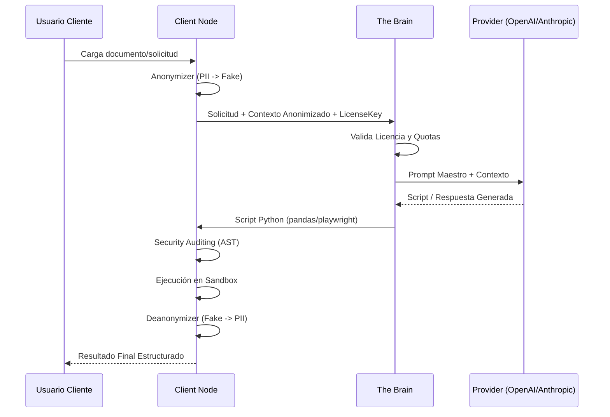

# Arquitectura Detallada de AutomatIA

## Introducción
AutomatIA es un ecosistema de hiperautomatización diseñado para operar en entornos híbridos (Cloud/On-Premise), priorizando la soberanía de los datos y el cumplimiento normativo (RGPD).

## Componentes del Sistema

### 1. The Brain (Cloud SaaS)
El "Cerebro" centraliza la inteligencia artificial y la gestión de negocio.
- **AIBrainService**: Actúa como proxy hacia proveedores de LLM, inyectando prompts de sistema y validando el uso de tokens.
- **Licensing & Billing**: Controla el acceso basado en licencias activas y factura por consumo real de tokens.
- **Central Registry**: Almacena scripts de confianza y políticas de seguridad globales.

### 2. The Client Node (On-Premise)
El "Nodo Cliente" es donde ocurre la ejecución real de los datos.
- **Anonymizer**: Módulo crítico que sustituye Datos de Carácter Personal (DPI) por datos sintéticos antes de cualquier interacción con el Brain.
- **Runtime Engine**: Orquestador de tareas que gestiona el ciclo de vida de los automatismos.
- **Watchers**: Centinelas que monitorean fuentes de datos (Email, Sistemas de archivos, APIs).

## Diagrama de Comunicación

## Flujos de Datos y Soberanía

### Principio de "Data Sovereignty"
Los datos brutos del cliente nunca salen de su infraestructura. Solo se envían al Brain:
1.  **Metadatos**: Estructura de archivos, esquemas JSON.
2.  **Texto Anonimizado**: Contenido donde los nombres, DNI, emails y teléfonos han sido sustituidos por valores sintéticos coherentes genera-dos por `Faker`.

### Comunicación Brain-Client
Toda la comunicación se realiza vía HTTPS (TLS 1.3) con autenticación mutua basada en `license_key`. El cliente actúa como el iniciador de las peticiones para facilitar el paso a través de firewalls corporativos.
