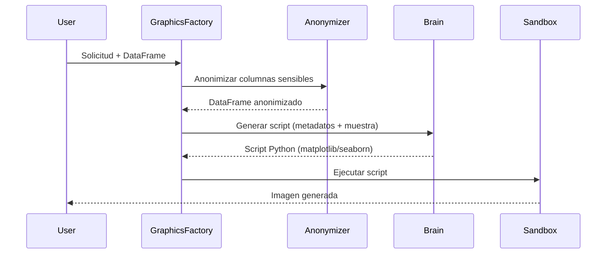
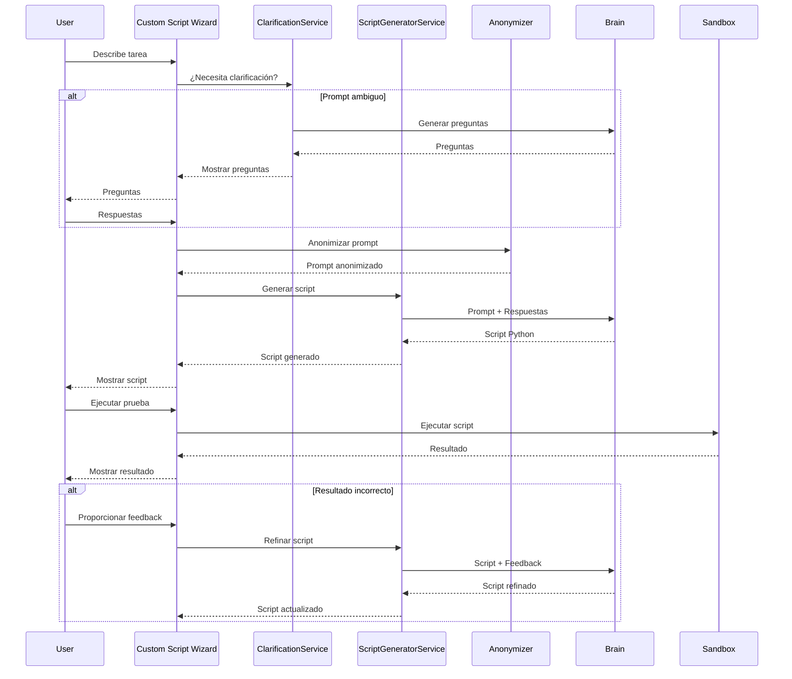
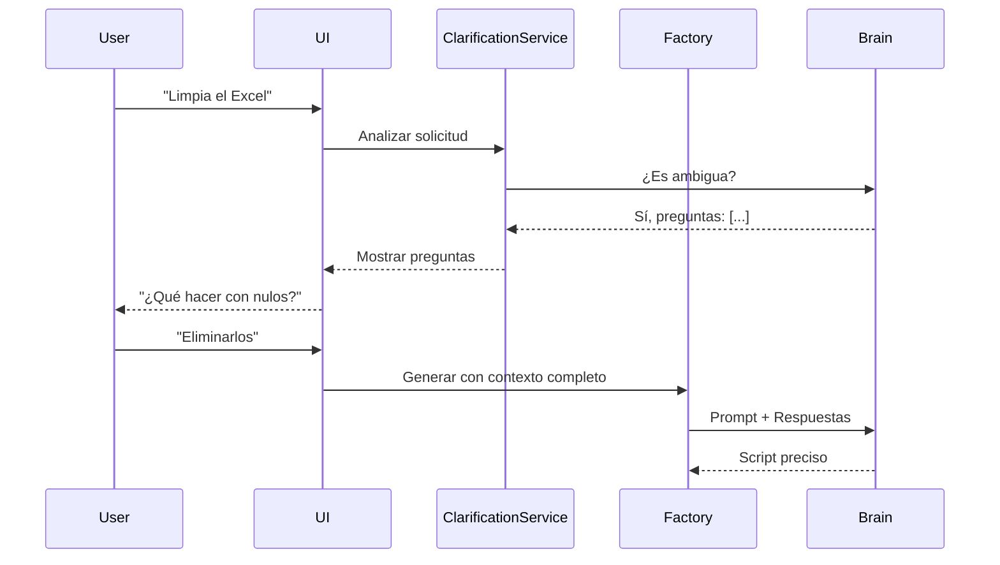
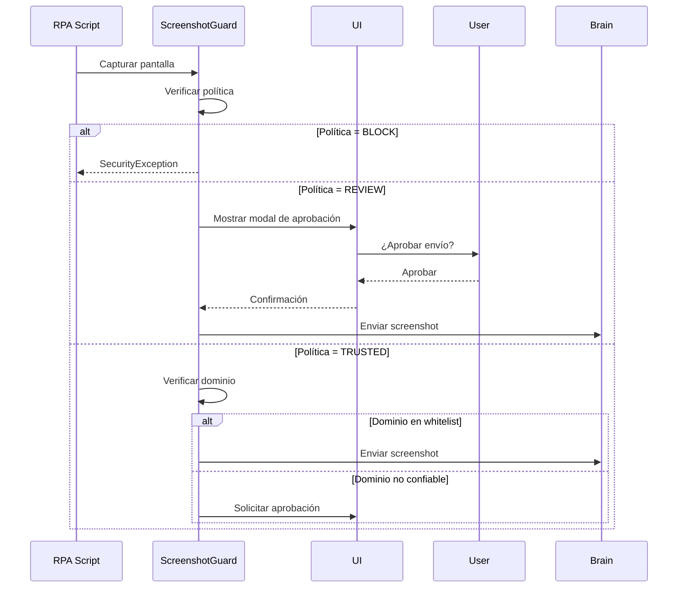
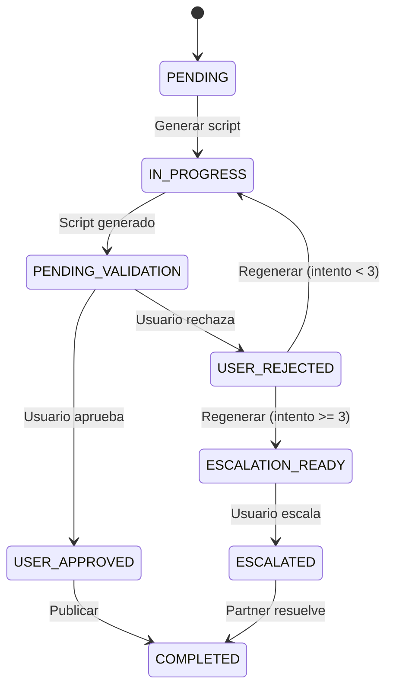

# Nuevas Características de AutomatIA V4.0

Este documento describe las nuevas características y mejoras introducidas en la versión 4.0 de AutomatIA.

## 📊 GraphicsFactory - Generación Automática de Gráficos

### Descripción

El módulo **GraphicsFactory** permite generar visualizaciones de datos automáticamente usando lenguaje natural. La IA analiza tus datos y crea gráficos profesionales con matplotlib o seaborn.

### Ubicación

`client_app/app/modules/factory/graphics_factory.py`

### Características

- **Generación con Lenguaje Natural**: Describe el gráfico que quieres y la IA lo crea
- **Múltiples Tipos**: Líneas, barras, dispersión, histogramas, heatmaps, etc.
- **Anonimización Automática**: Las etiquetas sensibles se anonimizan antes de generar
- **Personalización**: Colores, estilos, títulos y leyendas configurables
- **Exportación**: PNG, SVG, PDF

### Ejemplo de Uso

```python
from client_app.app.modules.factory.graphics_factory import GraphicsFactory

# Crear instancia
factory = GraphicsFactory()

# Generar gráfico desde DataFrame
request = "Crea un gráfico de barras mostrando las ventas por mes"
script = await factory.generate(
    data=df_ventas,
    user_request=request,
    license_key="tu_license_key"
)

# Ejecutar script para generar el gráfico
output_path = await sandbox.execute(script, data=df_ventas)
```

### Flujo de Trabajo



### Whitelist de Librerías

Para soportar GraphicsFactory, se han añadido a la whitelist del Sandbox:

```python
ALLOWED_IMPORTS = {
    "matplotlib",
    "matplotlib.pyplot",
    "seaborn",
    "io",
    "base64"
}
```

### Limitaciones

- No se permiten gráficos interactivos (solo estáticos)
- Tamaño máximo de imagen: 10MB
- No se permite acceso a GUI (backend 'Agg' obligatorio)

---

## 🛠️ CustomScriptFactory - Generador de Scripts Personalizados

### Descripción

El **CustomScriptFactory** (implementado como `script_generator_service`) permite a los usuarios generar scripts Python personalizados para tareas arbitrarias usando lenguaje natural.

### Ubicación

`client_app/app/services/script_generator_service.py`

### Características

- **Generación con Lenguaje Natural**: Describe cualquier tarea y la IA genera el script
- **Integración con ClarificationService**: Solicita automáticamente preguntas si el prompt es ambiguo
- **Refinamiento Iterativo**: Hasta 5 iteraciones con feedback del usuario
- **Anonimización Automática**: El prompt se anonimiza antes de enviar al Brain
- **Validación de Seguridad**: AST audit antes de ejecutar
- **Escalación al Partner**: Si no se logra un script correcto tras 5 intentos

### Wizard de Usuario

El wizard de Custom Scripts tiene 5 fases:

1. **Descripción**: Usuario describe la tarea en lenguaje natural
2. **Clarificación** (opcional): Responde preguntas de la IA si el prompt es ambiguo
3. **Generación**: La IA genera el script Python
4. **Prueba**: Usuario ejecuta el script con datos de prueba
5. **Refinamiento**: Si el resultado no es correcto, proporciona feedback para regenerar

### Ejemplo de Uso

```python
from client_app.app.services.script_generator_service import script_generator_service

# Generar script personalizado
result = await script_generator_service.generate_script(
    user_prompt="Lee un archivo CSV, filtra las filas donde la edad sea mayor a 18, y guarda el resultado en un nuevo archivo",
    output_type="file",
    clarifications={"q1": "eliminar_nulos", "q2": "si"}
)

print(result['code'])
print(result['description'])
print(result['required_libraries'])
```

**Salida esperada**:
```python
# result['code']
import pandas as pd

def process_file(input_path: str) -> str:
    # Leer CSV
    df = pd.read_csv(input_path)
    
    # Eliminar nulos
    df = df.dropna()
    
    # Filtrar edad > 18
    df_filtered = df[df['edad'] > 18]
    
    # Guardar resultado
    output_path = 'resultado_filtrado.csv'
    df_filtered.to_csv(output_path, index=False)
    
    return output_path
```

### Refinamiento con Feedback

Si el script generado no es correcto, el usuario puede proporcionar feedback:

```python
# Usuario ejecuta y encuentra un error
refined = await script_generator_service.refine_script(
    original_code=result['code'],
    user_feedback="El filtro debe ser edad >= 18, no solo >",
    error_message=None,
    execution_result=None
)

# El servicio regenera con el feedback incluido
print(refined['code'])  # Script corregido
```

### Flujo de Trabajo



### Tipos de Salida Soportados

1. **file**: El script genera un archivo (CSV, Excel, JSON, etc.)
2. **text**: El script retorna texto plano
3. **dataframe**: El script retorna un DataFrame de pandas

### Integración con ClarificationService

El CustomScriptFactory es el **principal consumidor** del ClarificationService:

```python
# En custom_script_page.py
async def start_analysis():
    # Analizar si necesita clarificación
    result = await clarification_service.analyze_for_clarification(
        module_type="custom_script",
        user_input={"prompt": wizard.user_prompt},
        context={}
    )
    
    if result.needs_clarification:
        # Mostrar diálogo de preguntas
        wizard.phase = 'clarification'
    else:
        # Generar directamente
        wizard.phase = 'generation'
```

### Seguridad

- ✅ **Anonimización obligatoria** del prompt antes de enviar al Brain
- ✅ **Validación AST** del script generado (SecurityAuditor)
- ✅ **Ejecución en sandbox** con whitelist de librerías
- ✅ **Máximo 5 iteraciones** antes de escalar al Partner
- ✅ **Indicador de privacidad** visible en la UI

### Limitaciones

- Máximo 5 iteraciones de refinamiento
- Solo librerías en whitelist permitidas
- No se permite acceso a red (excepto httpx controlado)
- No se permite acceso al sistema de archivos fuera del jail

---

## 📄 ReportFactory - Generación de Informes Profesionales

### Descripción

El módulo **ReportFactory** genera informes PDF o HTML profesionales combinando datos estructurados, gráficos y texto narrativo.

### Ubicación

`client_app/app/modules/factory/report_factory.py`

### Backends Soportados

#### 1. ReportLab (Nativo)
- **Ventajas**: Rápido, sin dependencias externas, control total del layout
- **Uso**: Informes de producción, generación masiva

#### 2. HTML + Playwright (Opcional)
- **Ventajas**: Editable, previsualización en navegador, diseño flexible
- **Uso**: Informes personalizables, prototipos

### Características

- **Plantillas Reutilizables**: Define plantillas de informes y reutilízalas
- **Integración con GraphicsFactory**: Incluye gráficos generados automáticamente
- **Secciones Dinámicas**: Tablas, texto, imágenes, gráficos
- **Estilos Profesionales**: Encabezados, pies de página, numeración
- **Exportación Dual**: PDF nativo o HTML editable

### Ejemplo de Uso

```python
from client_app.app.modules.factory.report_factory import ReportFactory

factory = ReportFactory()

# Definir estructura del informe
report_spec = {
    "title": "Informe Mensual de Ventas",
    "sections": [
        {
            "type": "text",
            "content": "Resumen ejecutivo del mes de enero 2026"
        },
        {
            "type": "table",
            "data": df_ventas,
            "caption": "Ventas por producto"
        },
        {
            "type": "chart",
            "chart_path": "ventas_grafico.png",
            "caption": "Evolución de ventas"
        }
    ]
}

# Generar informe
pdf_path = await factory.generate_pdf(
    spec=report_spec,
    backend="reportlab"  # o "html"
)
```

### Migración de WeasyPrint a ReportLab

> [!IMPORTANT]
> La versión 4.0 migra de WeasyPrint a ReportLab como backend principal para eliminar dependencias de GTK+3 y mejorar el rendimiento.

**Beneficios de la migración:**
- ✅ Sin dependencias de sistema (GTK+3)
- ✅ Mejor rendimiento (3-5x más rápido)
- ✅ Menor consumo de memoria
- ✅ Compatibilidad multiplataforma mejorada

---

## 💬 ClarificationService - Preguntas de Clarificación

### Descripción

El **ClarificationService** es un sistema de "Pre-Generation Questions" que analiza solicitudes ambiguas y formula preguntas al usuario antes de generar código.

### Ubicación

`client_app/app/services/clarification_service.py`

### Problema que Resuelve

Cuando un usuario hace una solicitud vaga como "Limpia el Excel", la IA podría generar código incorrecto. El ClarificationService detecta ambigüedades y pregunta antes de generar.

### Flujo de Trabajo



### Ejemplo de Preguntas

Para la solicitud "Limpia el Excel", el servicio podría preguntar:

1. ¿Qué hacer con valores nulos? (eliminar filas / rellenar con 0 / rellenar con media)
2. ¿Eliminar filas duplicadas? (sí / no)
3. ¿Normalizar nombres de columnas? (snake_case / camelCase / mantener)
4. ¿Formato de fechas? (ISO 8601 / DD/MM/YYYY / mantener original)

### Configuración

```python
class ClarificationConfig:
    max_questions: int = 5  # Máximo de preguntas a formular
    threshold_ambiguity: float = 0.7  # Umbral para considerar ambigua
    auto_skip_simple: bool = True  # Saltar para solicitudes simples
```

### Integración en UI

El servicio se integra en los wizards de Extracción, ETL y Custom Scripts:

```python
# En el wizard, antes de generar
if await clarification_service.needs_clarification(user_prompt):
    questions = await clarification_service.get_questions(user_prompt, data_sample)
    
    # Mostrar diálogo interactivo
    answers = await ui.show_clarification_dialog(questions)
    
    # Generar con contexto completo
    script = await factory.generate(
        prompt=user_prompt,
        clarifications=answers
    )
```

---

## 🔒 ScreenshotGuard - Privacidad Visual

### Descripción

El **ScreenshotGuard** es un middleware de seguridad que intercepta cualquier intento de enviar capturas de pantalla al Brain durante automatizaciones RPA.

### Ubicación

`client_app/app/services/screenshot_guard.py`

### Problema que Resuelve

Durante la navegación web automatizada, la IA podría necesitar "ver" la pantalla para auto-corregirse. Esto plantea riesgos de privacidad si la pantalla contiene datos sensibles.

### Políticas de Privacidad

#### 1. BLOCK (Estricta)
- **Comportamiento**: Bloquea cualquier intento de enviar screenshots
- **Uso**: Entornos con datos altamente sensibles (banca, salud)
- **Excepción**: Lanza `SecurityException`

#### 2. REVIEW (Moderada)
- **Comportamiento**: Pausa la ejecución y solicita aprobación del usuario
- **Uso**: Entornos corporativos con supervisión
- **UI**: Modal con preview de la imagen y botones Aprobar/Rechazar

#### 3. TRUSTED (Permisiva)
- **Comportamiento**: Permite envío si el dominio está en whitelist
- **Uso**: Sitios web públicos conocidos
- **Configuración**: Lista de dominios confiables

### Configuración

```python
# En la base de datos local
screenshot_policy = ScreenshotPolicy(
    mode="REVIEW",  # BLOCK | REVIEW | TRUSTED
    trusted_domains=["sede.example.com", "portal.gov.es"],
    blur_sensitive_areas=True  # Difuminar áreas detectadas como sensibles
)
```

### Flujo de Aprobación



### Integración con RPA

```python
# En navigation_factory.py
from client_app.app.services.screenshot_guard import ScreenshotGuard

guard = ScreenshotGuard()

async def capture_and_analyze(page):
    screenshot = await page.screenshot()
    
    # El guard intercepta y valida
    approved_screenshot = await guard.verify_and_approve(
        screenshot=screenshot,
        url=page.url,
        context="Auto-healing selector"
    )
    
    # Solo se envía si está aprobado
    return await brain.analyze_screenshot(approved_screenshot)
```

---

## 🔄 ValidationLoopManager - Ciclo de Validación con Feedback

### Descripción

El **ValidationLoopManager** gestiona el ciclo de validación usuario-IA, permitiendo hasta 3 regeneraciones con feedback antes de escalar al Partner.

### Ubicación

`client_app/app/services/validation_loop.py`

### Estados de Tarea Extendidos

```python
class TaskStatus(str, Enum):
    PENDING = "pending"
    IN_PROGRESS = "in_progress"
    PENDING_USER_VALIDATION = "pending_validation"
    USER_APPROVED = "user_approved"
    USER_REJECTED = "user_rejected"
    READY_FOR_ESCALATION = "escalation_ready"
    ESCALATED = "escalated"
    COMPLETED = "completed"
    FAILED = "failed"
```

### Flujo de Validación



### Ejemplo de Uso

```python
from client_app.app.services.validation_loop import ValidationLoopManager

manager = ValidationLoopManager()

# Usuario rechaza el script
await manager.handle_user_feedback(
    task_id="task_123",
    action="reject",
    feedback="La fecha está en formato incorrecto, debe ser DD/MM/YYYY"
)

# El manager verifica intentos
if manager.can_retry(task_id):
    # Regenerar con feedback incluido en el prompt
    new_script = await factory.regenerate(
        task_id=task_id,
        feedback=feedback
    )
else:
    # Ofrecer escalación al Partner
    await manager.offer_escalation(task_id)
```

### Configuración

```python
class ValidationLoopConfig:
    max_retries: int = 3  # Máximo de regeneraciones
    auto_escalate: bool = False  # Escalar automáticamente tras max_retries
    feedback_required: bool = True  # Exigir feedback en rechazo
```

### Historial de Validación

Cada intento se registra en la tabla `ValidationHistory`:

```python
class ValidationHistory(Base):
    id: int
    task_id: str
    attempt: int  # 1, 2, 3
    status: str  # approved / rejected
    feedback: str  # Comentarios del usuario
    script_version: str  # Hash del script generado
    timestamp: datetime
```

---

## 🌐 APIWatcher - Consumo de APIs REST

### Descripción

El **APIWatcher** permite consumir datos de APIs REST externas como fuente de entrada para flujos automatizados.

### Ubicación

`client_app/app/modules/watchers/api_watcher.py`

### Características

- **Métodos HTTP**: GET, POST, PUT, DELETE
- **Autenticación**: Bearer Token, API Key, Basic Auth, OAuth2
- **Paginación**: Offset/Limit, Cursor-based, Next URL
- **Reintentos**: Backoff exponencial con Tenacity
- **Rate Limiting**: Respeta límites de la API externa
- **Transformación**: Convierte respuesta JSON a formato procesable

### Configuración

```python
class APIEndpointConfig(Base):
    id: int
    name: str
    url: str
    method: str  # GET | POST | PUT | DELETE
    auth_type: str  # bearer | api_key | basic | oauth2
    credential_id: int  # FK a LocalCredentials
    headers: str  # JSON
    pagination_type: str  # offset | cursor | next_url
    rate_limit: int  # Requests por minuto
```

### Ejemplo de Uso en Flujo

```python
# Configurar endpoint
api_config = APIEndpointConfig(
    name="CRM Clientes",
    url="https://api.crm.com/v1/customers",
    method="GET",
    auth_type="bearer",
    credential_id=cred_id,
    pagination_type="offset"
)

# Crear flujo
flow = FlowRegistry(
    name="Sincronizar CRM → Excel",
    trigger_type="schedule",
    trigger_config={"cron": "0 9 * * *"},  # Diario a las 9:00
    steps=[
        {
            "type": "api_fetch",
            "config": {"endpoint_id": api_config.id}
        },
        {
            "type": "etl",
            "script_id": "transform_to_excel"
        },
        {
            "type": "email",
            "config": {"to": "admin@empresa.com", "subject": "Reporte CRM"}
        }
    ]
)
```

### Manejo de Paginación

```python
class APIWatcher:
    async def fetch_all_pages(self, config: APIEndpointConfig) -> List[dict]:
        all_data = []
        page = 0
        
        while True:
            response = await self._fetch_page(config, page)
            all_data.extend(response["data"])
            
            # Detectar fin de paginación
            if not response.get("has_next"):
                break
            
            page += 1
        
        return all_data
```

### Reintentos y Manejo de Errores

```python
from tenacity import retry, stop_after_attempt, wait_exponential

class APIWatcher:
    @retry(
        stop=stop_after_attempt(3),
        wait=wait_exponential(multiplier=1, min=2, max=10)
    )
    async def fetch_data(self, config: APIEndpointConfig) -> Path:
        async with httpx.AsyncClient(timeout=60.0) as client:
            response = await client.request(
                method=config.method,
                url=config.url,
                headers=self._build_headers(config)
            )
            response.raise_for_status()
            
            # Guardar respuesta como archivo
            output_path = self._save_response(response.json())
            return output_path
```

---

## 📊 Resumen de Mejoras V4.0

| Característica | Beneficio Principal | Módulo |
|----------------|---------------------|--------|
| **GraphicsFactory** | Visualizaciones automáticas con lenguaje natural | `factory/graphics_factory.py` |
| **CustomScriptFactory** | Scripts Python personalizados para cualquier tarea | `services/script_generator_service.py` |
| **ReportFactory** | Informes PDF profesionales sin código | `factory/report_factory.py` |
| **ClarificationService** | Reduce errores mediante preguntas previas | `services/clarification_service.py` |
| **ScreenshotGuard** | Protege privacidad visual en RPA | `services/screenshot_guard.py` |
| **ValidationLoopManager** | Mejora calidad con feedback iterativo | `services/validation_loop.py` |
| **APIWatcher** | Integración con APIs REST externas | `watchers/api_watcher.py` |

## 🔄 Compatibilidad con Versiones Anteriores

Todas las características de V4.0 son **retrocompatibles** con V3.x. Los scripts y flujos existentes seguirán funcionando sin modificaciones.

## 📚 Documentación Relacionada

- [Factory Modules](factory_modules.md) - Documentación técnica de factories
- [Security Model](security_model.md) - Modelo de seguridad completo
- [Runtime Engine](runtime_engine.md) - Motor de ejecución
- [Flows Configuration](../functional/flows_configuration.md) - Configuración de flujos

---

Para más información sobre la migración a V4.0, consulta el documento `migracion_reportlab.md` en la raíz del proyecto.
