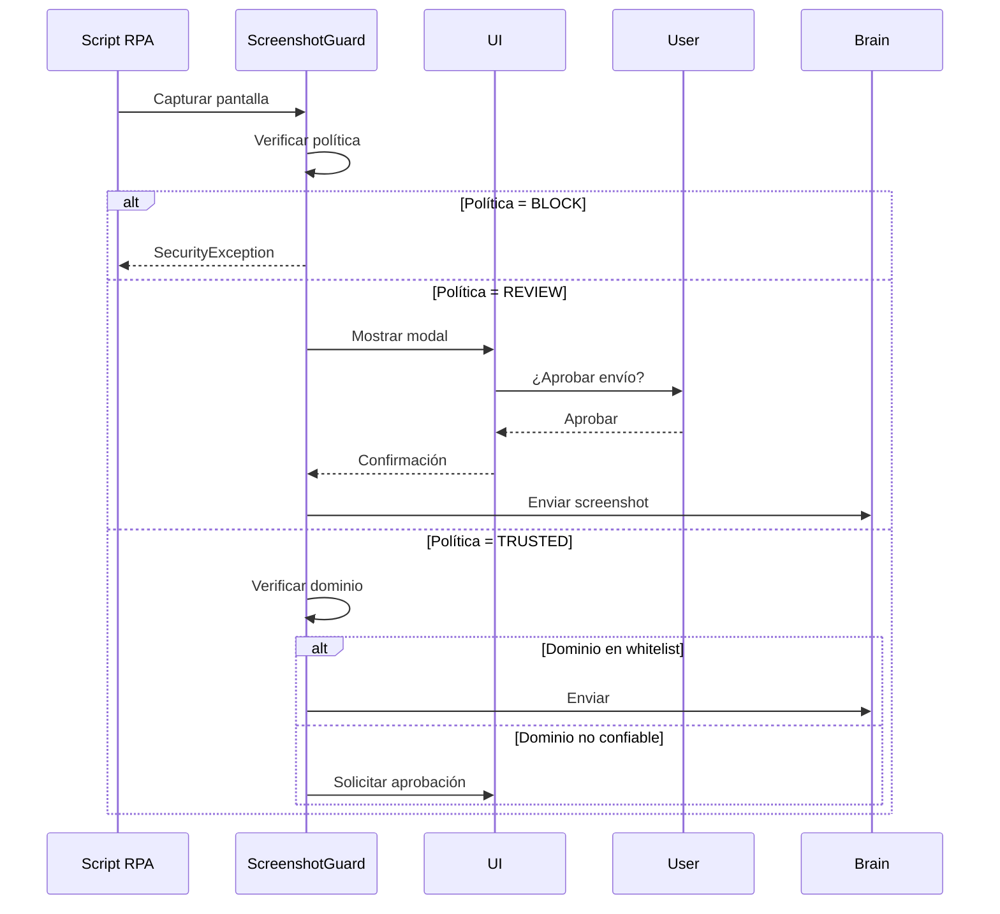

# Modelo de Seguridad y Privacidad

AutomatIA implementa una estrategia de "Seguridad por Diseño" y "Privacidad por Defecto", esencial para el procesamiento de documentos en sectores regulados.

## 1. Módulo Anonymizer (Privacidad RGPD)

El Anonymizer es el componente más crítico para la seguridad de los datos. Su función es garantizar que ningún Dato de Carácter Personal (PII) sea enviado al Brain (Cloud).

### Funcionamiento
1.  **Detección Híbrida**: Combina expresiones regulares (Regex) para patrones conocidos (DNI, IBAN) con Reconocimiento de Entidades Nombradas (NER) mediante `spaCy` para nombres de personas y organizaciones.
2.  **Mapeo Bidireccional**: Crea un `AnonymizationContext` temporal que mapea valores reales a valores sintéticos.
3.  **Sustitución Coherente**: Utiliza `Faker` para generar datos falsos que mantienen la semántica (un nombre real se sustituye por un nombre falso, no por una cadena aleatoria), permitiendo que la IA comprenda el contexto.
4.  **De-anonimización Local**: Tras la ejecución del script generado, los valores sintéticos en el resultado se vuelven a mapear a los valores reales originales dentro de la infraestructura del cliente.

## 2. Sandbox de Ejecución (Seguridad del Runtime)

Cualquier código generado por la IA es tratado como "no confiable" y se ejecuta bajo estrictas medidas de seguridad.

### Auditoría AST (Abstract Syntax Tree)
Antes de la ejecución, el `SecurityAuditor` analiza el código fuente sin ejecutarlo:
- **Whitelist de Imports**: Solo se permiten librerías aprobadas (`pandas`, `numpy`, `re`, etc.).
- **Bloqueo de Funciones Peligrosas**: Se prohíbe el uso de `exec()`, `eval()`, `open()` (para rutas fuera del jail), `os.system()`, etc.
- **Detección de Patrones de Red**: Se bloquea cualquier intento de comunicación de red no declarada.

### Aislamiento de Proceso
Los scripts se ejecutan en un proceso separado (`ProcessPoolExecutor`) con:
- **Timeouts**: Máximo de 300 segundos por tarea.
- **Límites de Memoria**: Restricción de consumo RAM (512MB por defecto).
- **Filesystem Jail**: El script solo tiene acceso de lectura/escritura a un directorio temporal específico para la tarea.

## 3. ScreenshotGuard (Privacidad Visual) - V4.0

**Ubicación:** `client_app/app/services/screenshot_guard.py`

**Propósito**: Middleware de seguridad que intercepta cualquier intento de enviar capturas de pantalla al Brain durante automatizaciones RPA, protegiendo datos sensibles que puedan aparecer en pantalla.

### Estrategias de Privacidad

#### 1. STRICT (Máxima Seguridad)
- **Comportamiento**: Bloquea cualquier envío de screenshots
- **Excepciones**: Lanza `SecurityException` si se intenta capturar
- **Uso recomendado**: Entornos con datos altamente sensibles (banca, salud, legal)
- **Configuración**: `SCREENSHOT_POLICY=BLOCK` en `.env`

#### 2. REVIEW (Moderada - Recomendada)
- **Comportamiento**: Pausa la ejecución y solicita aprobación del usuario
- **UI**: Modal con preview de la imagen y botones Aprobar/Rechazar
- **Uso recomendado**: Entornos corporativos con supervisión
- **Configuración**: `SCREENSHOT_POLICY=REVIEW` en `.env`

#### 3. TRUSTED (Permisiva)
- **Comportamiento**: Permite envío automático si el dominio está en whitelist
- **Validación**: Verifica dominio contra lista de sitios confiables
- **Uso recomendado**: Sitios web públicos conocidos
- **Configuración**: Lista de dominios en UI de Configuración

### Flujo de Aprobación



### Configuración Avanzada

```python
class ScreenshotPolicy(Base):
    mode: str  # BLOCK | REVIEW | TRUSTED
    trusted_domains: List[str]  # Dominios confiables
    blur_sensitive_areas: bool  # Difuminar áreas detectadas
    auto_approve_after_first: bool  # Aprobar automáticamente tras primera aprobación
```

### Integración con RPA

```python
from client_app.app.services.screenshot_guard import ScreenshotGuard

guard = ScreenshotGuard()

async def capture_and_analyze(page):
    screenshot = await page.screenshot()
    
    # El guard intercepta y valida
    approved_screenshot = await guard.verify_and_approve(
        screenshot=screenshot,
        url=page.url,
        context="Auto-healing selector"
    )
    
    # Solo se envía si está aprobado
    return await brain.analyze_screenshot(approved_screenshot)
```

## 4. Gestión de Credenciales (Cifrado)
Las credenciales del cliente (IMAP, APIs conectadas) nunca se envían al Brain. Se almacenan cifradas localmente mediante `cryptography.fernet` utilizando una clave única generada durante la instalación del Client Node.
